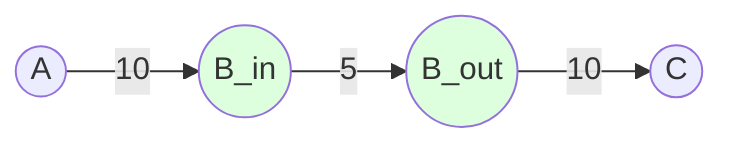

# AGR-002: Max Flow With Vertex Capacities

## 📋 Problem Summary

Compute the maximum flow in a network where not only edges but also **vertices** have capacity limits. A vertex capacity limits the total flow passing *through* that vertex.

## 🌍 Real-World Scenario

**Scenario Title:** The College Fest Crowd Control 🎫

### The Problem
It's the annual college fest, and a famous DJ is performing at the Main Auditorium (Sink). Thousands of students are rushing from the Main Gate (Source).
-   **Edges (Pathways):** Corridors and roads connect different checkpoints. A wide road can handle 100 students/minute.
-   **Vertices (Checkpoints):** These are spots like the Registration Desk, Bag Check, or Ticket Scanning counters.
-   **The Bottleneck:** Even if a 10-lane highway leads to the Registration Desk, if there are only 2 volunteers scanning QR codes, the throughput is limited by the **Desk's capacity** (e.g., 20 students/min), not the road's capacity.

### Why This Matters
-   **Safety**: Preventing stampedes by identifying which checkpoints will get overwhelmed.
-   **Event Management**: Optimizing the flow by adding more volunteers (increasing vertex capacity) at critical bottlenecks.

### Constraints in Real World
-   **Scale**: Thousands of people, dozens of checkpoints.
-   **Dynamic**: Capacities might change (volunteer goes for lunch).


### From Real World to Algorithm
We model the venue as a graph. We need to find the "Max Flow" of students, but standard Max Flow only handles edge capacities. We must transform the graph to enforce vertex limits.

## Detailed Explanation

### Concept Visualization: Vertex Splitting

Node **B** has a capacity of **5**. Even though 10 units enter from A and 10 could leave to C, B acts as a throttle.

**Original Graph:**
```mermaid
graph LR
    A((A)) --10--> B((B))
    B --10--> C((C))
    style B fill:#f96,stroke:#333,stroke-width:2px,label:"Cap: 5"
```

**Transformed Graph:**
We split Node B into `B_in` and `B_out`.
-   All incoming edges now point to `B_in`.
-   All outgoing edges now start from `B_out`.
-   **Crucial Step**: Add a directed edge from `B_in` to `B_out` with capacity equal to B's vertex capacity (5).


Now, standard Max Flow algorithms will naturally respect the limit because flow must pass through the internal `B_in -> B_out` edge.

### Algorithm Flow Diagram

```mermaid
graph TD
    Start[Start: Graph G with N nodes] --> CreateNodes[For each node u, create u_in and u_out]
    CreateNodes --> AddVertexEdges[Add edge u_in -> u_out with capacity cap[u]]
    AddVertexEdges --> ProcessEdges[Iterate Original Edges u -> v]
    ProcessEdges --> TransformEdge[Add edge u_out -> v_in with capacity cap(u->v)]
    TransformEdge --> NewGraph[Constructed New Graph G']
    NewGraph --> RunDinic[Run Dinic's MaxFlow on G' from s_in to t_out]
    RunDinic --> Result[Return Max Flow]
```

## 🎯 Edge Cases to Test

1.  **Infinite Vertex Capacity**
    -   Input: Vertex capacity `-1` or huge number.
    -   Expected: Effectively no restriction; only edge capacities matter.
2.  **Source/Sink Capacity**
    -   Input: Source or Sink has limited capacity.
    -   Expected: Usually ignored (infinite) unless problem specifies otherwise. Our code treats them as infinite (`10^18`).
3.  **Zero Capacity Vertex**
    -   Input: A node (not S/T) with capacity 0.
    -   Expected: No flow can pass through it using that node.
4.  **Disjoint Path**
    -   Input: Multiple paths, some sharing a vertex.
    -   Expected: The shared vertex capacity throttles the *sum* of flows.

## ✅ Input/Output Clarifications
-   **Infinite Capacity Input**: Represented as `-1`.
-   **Nodes**: $0$ to $N-1$.
-   **Output**: Maximum flow value (integer).

## Naive Approach

### Intuition
Modify BFS/DFS in the Max Flow algorithm to check vertex capacities explicitly during pathfinding. "If I push flow through node $u$, decrease `vertex_cap[u]`".

### Why This Fails
-   **Complexity**: Tracking vertex residuals is messy. Standard algorithms (Dinic/Edmonds-Karp) are optimized for edge residuals.
-   **Correctness**: Undo operations (reverse flow) in Dinic become very complicated if you have to manage vertex capacities separately from reverse edges.

## Optimal Approach (Vertex Splitting)

### Key Insight
Standard Max Flow is a "solved" problem. Instead of complicating the algorithm, **simplify the graph**. By converting vertex constraints into edge constraints (Vertex Splitting), we can use a standard, optimized library implementation of Dinic's Algorithm.

### Time Complexity
-   **O(V² E)**: Using Dinic’s Algorithm.
    -   New Vertices $V' = 2N$.
    -   New Edges $E' = M + N$ (original edges + internal vertex edges).
    -   Complexity $\approx O((2N)^2 (M+N)) \approx O(N^2 M)$.
    -   For $N=200, M=5000$, this is roughly $4 \times 10^4 \times 5000 = 2 \times 10^8$ ops, which is acceptable (Dinic is usually much faster on average).

### Space Complexity
-   **O(N + M)**: To store the transformed graph.

## Implementations

### Java
```java
import java.util.*;

class Solution {
    // Standard Edge structure for Flow Networks
    static class Edge {
        int to;
        long capacity;
        long flow;
        int rev; // index of reverse edge

        Edge(int to, long capacity, int rev) {
            this.to = to;
            this.capacity = capacity;
            this.rev = rev;
            this.flow = 0;
        }
    }

    private List<List<Edge>> adj;
    private int[] level; // BFS levels
    private int[] ptr;   // DFS pointers to avoid re-scanning edges

    public long maxFlowVertexCap(int n, int s, int t, long[] cap, int[][] edges) {
        // Total nodes in split graph = 2*N
        // i -> i_in (2*i), i_out (2*i+1)
        int numNodes = 2 * n;
        int sNode = 2 * s;      // Start at Source IN (or OUT, doesn't matter if S cap is INF)
        int tNode = 2 * t + 1;  // End at Sink OUT

        adj = new ArrayList<>();
        for (int i = 0; i < numNodes; i++) adj.add(new ArrayList<>());

        long INF = 1_000_000_000_000_000L;

        // 1. Internal Edges: u_in -> u_out
        for (int i = 0; i < n; i++) {
            // If capacity is -1 (infinite) or it's source/sink, use INF
            long c = (cap[i] == -1 || i == s || i == t) ? INF : cap[i];
            addEdge(2 * i, 2 * i + 1, c);
        }

        // 2. External Edges: u -> v becomes u_out -> v_in
        for (int[] e : edges) {
            int u = e[0];
            int v = e[1];
            int c = e[2];
            addEdge(2 * u + 1, 2 * v, c);
        }

        // 3. Run Dinic's Algorithm
        long maxFlow = 0;
        while (bfs(sNode, tNode, numNodes)) {
            ptr = new int[numNodes];
            while (true) {
                long pushed = dfs(sNode, tNode, INF);
                if (pushed == 0) break;
                maxFlow += pushed;
            }
        }

        return maxFlow;
    }

    private void addEdge(int from, int to, long cap) {
        Edge a = new Edge(to, cap, adj.get(to).size());
        Edge b = new Edge(from, 0, adj.get(from).size()); // Residual edge with 0 capacity
        adj.get(from).add(a);
        adj.get(to).add(b);
    }

    private boolean bfs(int s, int t, int n) {
        level = new int[n];
        Arrays.fill(level, -1);
        level[s] = 0;
        Queue<Integer> q = new LinkedList<>();
        q.add(s);
        while (!q.isEmpty()) {
            int u = q.poll();
            for (Edge e : adj.get(u)) {
                if (e.capacity - e.flow > 0 && level[e.to] == -1) {
                    level[e.to] = level[u] + 1;
                    q.add(e.to);
                }
            }
        }
        return level[t] != -1;
    }

    private long dfs(int u, int t, long pushed) {
        if (pushed == 0) return 0;
        if (u == t) return pushed;
        for (; ptr[u] < adj.get(u).size(); ptr[u]++) {
            Edge e = adj.get(u).get(ptr[u]);
            if (level[u] + 1 != level[e.to] || e.capacity - e.flow == 0) continue;
            long tr = dfs(e.to, t, Math.min(pushed, e.capacity - e.flow));
            if (tr == 0) continue;
            e.flow += tr;
            adj.get(e.to).get(e.rev).flow -= tr;
            return tr;
        }
        return 0;
    }
}
```

### Python
```python
import sys

# Increase recursion depth for deep graphs
sys.setrecursionlimit(200000)

class Dinic:
    def __init__(self, n):
        self.n = n
        self.graph = [[] for _ in range(n)]
        self.level = []

    def add_edge(self, u, v, capacity):
        # Forward edge: [v, capacity, flow, reverse_index]
        # Reverse edge: [u, 0, 0, forward_index]
        self.graph[u].append([v, capacity, 0, len(self.graph[v])])
        self.graph[v].append([u, 0, 0, len(self.graph[u]) - 1])

    def bfs(self, s, t):
        self.level = [-1] * self.n
        self.level[s] = 0
        queue = [s]
        while queue:
            u = queue.pop(0)
            for v, cap, flow, rev in self.graph[u]:
                if cap - flow > 0 and self.level[v] < 0:
                    self.level[v] = self.level[u] + 1
                    queue.append(v)
        return self.level[t] >= 0

    def dfs(self, u, t, pushed, ptr):
        if pushed == 0 or u == t:
            return pushed
        for i in range(ptr[u], len(self.graph[u])):
            ptr[u] = i
            v, cap, flow, rev = self.graph[u][i]
            if self.level[v] != self.level[u] + 1 or cap - flow == 0:
                continue
            tr = self.dfs(v, t, min(pushed, cap - flow), ptr)
            if tr == 0:
                continue
            self.graph[u][i][2] += tr
            self.graph[v][rev][2] -= tr
            return tr
        return 0

    def max_flow(self, s, t):
        flow = 0
        while self.bfs(s, t):
            ptr = [0] * self.n
            while True:
                pushed = self.dfs(s, t, float('inf'), ptr)
                if pushed == 0:
                    break
                flow += pushed
        return flow

def max_flow_vertex_cap(n: int, s: int, t: int, cap: list[int], edges: list[tuple[int, int, int]]) -> int:
    dinic = Dinic(2 * n)
    INF = 10**15
    
    # 1. Internal Edges (Vertex Capacities)
    for i in range(n):
        # -1 indicates infinite capacity
        c = INF if (cap[i] == -1 or i == s or i == t) else cap[i]
        dinic.add_edge(2 * i, 2 * i + 1, c)
        
    # 2. External Edges (Connections)
    for u, v, c in edges:
        dinic.add_edge(2 * u + 1, 2 * v, c)
        
    return dinic.max_flow(2 * s, 2 * t + 1)
```

### C++
```cpp
class Solution {
    struct Edge {
        int to;
        long long capacity;
        long long flow;
        int rev;
    };

    vector<vector<Edge>> adj;
    vector<int> level;
    vector<int> ptr;

    void addEdge(int from, int to, long long cap) {
        Edge a = {to, cap, 0, (int)adj[to].size()};
        Edge b = {from, 0, 0, (int)adj[from].size()};
        adj[from].push_back(a);
        adj[to].push_back(b);
    }

    bool bfs(int s, int t) {
        fill(level.begin(), level.end(), -1);
        level[s] = 0;
        queue<int> q;
        q.push(s);
        while (!q.empty()) {
            int u = q.front();
            q.pop();
            for (const auto& e : adj[u]) {
                if (e.capacity - e.flow > 0 && level[e.to] == -1) {
                    level[e.to] = level[u] + 1;
                    q.push(e.to);
                }
            }
        }
        return level[t] != -1;
    }

    long long dfs(int u, int t, long long pushed) {
        if (pushed == 0) return 0;
        if (u == t) return pushed;
        for (int& cid = ptr[u]; cid < adj[u].size(); ++cid) {
            auto& e = adj[u][cid];
            if (level[u] + 1 != level[e.to] || e.capacity - e.flow == 0) continue;
            long long tr = dfs(e.to, t, min(pushed, e.capacity - e.flow));
            if (tr == 0) continue;
            e.flow += tr;
            adj[e.to][e.rev].flow -= tr;
            return tr;
        }
        return 0;
    }

public:
    long long maxFlowVertexCap(int n, int s, int t, const vector<long long>& cap,
                               const vector<array<int, 3>>& edges) {
        int numNodes = 2 * n;
        adj.assign(numNodes, vector<Edge>());
        level.resize(numNodes);
        ptr.resize(numNodes);

        long long INF = 1e15;

        // Vertex Splitting logic
        for (int i = 0; i < n; i++) {
            long long c = (cap[i] == -1 || i == s || i == t) ? INF : cap[i];
            addEdge(2 * i, 2 * i + 1, c);
        }

        // Connect OUT of u to IN of v
        for (const auto& e : edges) {
            addEdge(2 * e[0] + 1, 2 * e[1], e[2]);
        }

        int sNode = 2 * s;
        int tNode = 2 * t + 1;
        long long maxFlow = 0;

        while (bfs(sNode, tNode)) {
            fill(ptr.begin(), ptr.end(), 0);
            while (long long pushed = dfs(sNode, tNode, INF)) {
                maxFlow += pushed;
            }
        }

        return maxFlow;
    }
};
```

### JavaScript
```javascript
class Solution {
  maxFlowVertexCap(n, s, t, cap, edges) {
    const numNodes = 2 * n;
    const adj = Array.from({ length: numNodes }, () => []);
    
    // Add directed edge with capacity
    const addEdge = (from, to, cap) => {
      adj[from].push([to, cap, 0, adj[to].length]);
      adj[to].push([from, 0, 0, adj[from].length - 1]);
    };

    const INF = 1e15;

    // 1. Vertex Capacities: u_in -> u_out
    for (let i = 0; i < n; i++) {
      let c = (cap[i] === -1 || i === s || i === t) ? INF : cap[i];
      addEdge(2 * i, 2 * i + 1, c);
    }

    // 2. Original Edges: u -> v becomes u_out -> v_in
    for (const [u, v, c] of edges) {
      addEdge(2 * u + 1, 2 * v, c);
    }

    const sNode = 2 * s;
    const tNode = 2 * t + 1;
    let level = new Int32Array(numNodes);
    let ptr = new Int32Array(numNodes);

    const bfs = () => {
      level.fill(-1);
      level[sNode] = 0;
      const q = [sNode];
      let head = 0;
      while (head < q.length) {
        const u = q[head++];
        for (const [v, cap, flow, rev] of adj[u]) {
          if (cap - flow > 0 && level[v] === -1) {
            level[v] = level[u] + 1;
            q.push(v);
          }
        }
      }
      return level[tNode] !== -1;
    };

    const dfs = (u, pushed) => {
      if (pushed === 0 || u === tNode) return pushed;
      for (let i = ptr[u]; i < adj[u].length; i++) {
        ptr[u] = i;
        const [v, cap, flow, rev] = adj[u][i];
        if (level[u] + 1 !== level[v] || cap - flow === 0) continue;
        const tr = dfs(v, Math.min(pushed, cap - flow));
        if (tr === 0) continue;
        adj[u][i][2] += tr;
        adj[v][rev][2] -= tr;
        return tr;
      }
      return 0;
    };

    let maxFlow = 0;
    while (bfs()) {
      ptr.fill(0);
      while (true) {
        const pushed = dfs(sNode, INF);
        if (pushed === 0) break;
        maxFlow += pushed;
      }
    }

    return maxFlow;
  }
}
```

## 🧪 Test Case Walkthrough (Dry Run)

### Input
```
4 3 0 3
-1 3 2 -1
0 1 3
1 2 2
2 3 3
```
-   $N=4, M=3, Start=0, End=3$
-   Capacities: $0 \to \infty, 1 \to 3, 2 \to 2, 3 \to \infty$.

### Execution Steps

| Step | Node Transformation | Connection Type | Capacity Check | Result |
|-----:|:-------------------:|:---------------:|:--------------:|:-------|
| 1 | `0` becomes `0_in -> 0_out` | Vertex Cap | Node 0 is source | Cap: $\infty$ |
| 2 | `1` becomes `1_in -> 1_out` | Vertex Cap | Node 1 cap is 3 | Cap: `3` |
| 3 | `2` becomes `2_in -> 2_out` | Vertex Cap | Node 2 cap is 2 | Cap: `2` (BOTTLENECK) |
| 4 | `Edge 1->2` | Edge | `1_out -> 2_in` | Cap: `2` |

**Flow Path:**
$S \to 0_{in} \to 0_{out} \to 1_{in} \xrightarrow{\text{limited by 3}} 1_{out} \to 2_{in} \xrightarrow{\textbf{limited by 2}} 2_{out} \to 3_{in} \to 3_{out} \to T$

The flow is restricted by the minimum capacity along the path.
-   Edges: 3, 2, 3
-   Vertices: $\infty, 3, 2, \infty$
-   $\min(3, 2, 3, \infty, 3, 2, \infty) = 2$

**Final Result:** 2


## ✅ Proof of Correctness

### Conservation of Flow
By splitting node $u$ into $u_{in} \to u_{out}$, we force all flow entering $u$ (via $u_{in}$) to pass through the single edge $(u_{in}, u_{out})$ before leaving (via $u_{out}$).
Since standard Max Flow algorithms respect edge capacities, the flow through this internal edge—and thus through vertex $u$—cannot exceed `cap[u]`.

## ⚠️ Common Mistakes to Avoid

1.  **Wrong Edge Direction**
    -   ❌ Connecting `u_in -> v_in` or `u_out -> v_out`.
    -   ✅ Correct: `u_out` (exit of u) $\to$ `v_in` (entry of v).
2.  **Source/Sink Limits**
    -   ❌ Applying vertex capacity to $S$ or $T$.
    -   ✅ Usually $S$ produces infinite flow and $T$ consumes infinite flow. Cap them only if explicitly asked.
3.  **Indexing Errors**
    -   ❌ Using `2*i` for Out and `2*i+1` for In.
    -   ✅ Stick to a convention (e.g., In=`2*i`, Out=`2*i+1`) and use it consistently.

## 💡 Interview Extensions

1.  **Multiple Sources/Sinks?**
    -   Create a Super-Source $SS$ connected to all sources, and Super-Sink $TT$ connected to all sinks.
2.  **Min-Cost Max-Flow with Node Costs?**
    -   Assign the cost to the internal edge $(u_{in}, u_{out})$.
3.  **Dynamic Graph?**
    -   If an edge capacity changes, Dinic can update the residual graph partially, but it's complex. Usually re-running is standard for interview scale.

## Related Concepts
-   **Graph Transformation**: Reducing a new problem to a known solved problem.
-   **Dinic's Algorithm**: The standard efficient solution for Max Flow.
-   **Bipartite Matching**: Often solved using Max Flow; node capacities can model constraints like "each person does max 1 job".
