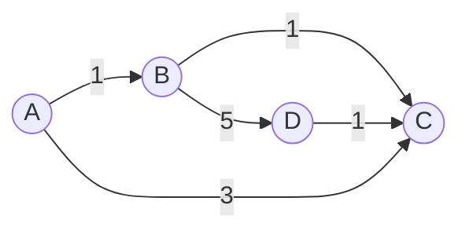

# AGR-003: K Shortest Paths (Loopless)

## 📋 Problem Summary

Find the `K` shortest **simple** paths (paths without repeated vertices) from a source `s` to a target `t`. Output their lengths in ascending order.

## 🌍 Real-World Scenario

**Scenario Title:** The Campus Shuttle Routes 🚌

### The Problem
You are building the "Campus Go" app for your university. A student at the **Hostel (Source)** needs to reach the **Exam Hall (Target)** ASAP.
-   **Primary Route:** The main road (shortest, 10 mins).
-   **The Twist:** What if there's a VIP convoy blocking the main road? Or a protest? Or construction?
-   **Requirement:** The app must suggest the **Top 3 distinct routes**.
-   **Constraint:** Routes must not be "loopy" (e.g., going Hostel $\to$ Canteen $\to$ Hostel $\to$ Exam Hall is invalid).

### Why This Matters
-   **Resilience:** In critical logistics (like finding backup routes for ambulances), having just one path isn't enough.
-   **Network Routing:** In IP routing, if the primary link flaps, routers switch to the pre-calculated secondary best path.

### Constraints in Real World
-   **Latency:** Users want suggested routes instantly ($< 2$ seconds).
-   **Options:** Users usually only care about the top 2-3 alternatives, not 100.


### From Real World to Algorithm
This is the classic "K Shortest Loopless Paths" problem. We need an algorithm (Yen's) that systematically finds the 1st, 2nd, ..., $K$-th best path ensuring no nodes are repeated.

## Detailed Explanation

### Concept Visualization: Yen's Deviation

We find alternatives by "deviating" from the known best path.

**Graph:**


1.  **1st Shortest ($P_1$):** `A -> B -> C` (Cost: 2)
2.  **Finding 2nd Shortest:**
    -   **Deviate at A:** Block edge `A->B`. Path: `A -> C` (Cost: 3).
    -   **Deviate at B:** Block edge `B->C`. From `A->B`, find path `B -> D -> C`. Total: `A -> B -> D -> C` (Cost: $1+5+1 = 7$).

**Result:** $P_2$ is `A -> C` (Cost 3), $P_3$ is `A -> B -> D -> C` (Cost 7).

### Algorithm Flow Diagram

```mermaid
graph TD
    Start[Start] --> Init[Find Shortest Path P1 using Dijkstra]
    Init --> AddRes[Add P1 to Results]
    AddRes --> LoopK{Found K paths?}
    LoopK -- Yes --> Done[Return Results]
    LoopK -- No --> IterateNodes[Iterate nodes in P_prev]
    IterateNodes --> Spur[Select Spur Node u]
    Spur --> Block[Block edges used in previous paths from u]
    Block --> BlockNodes[Block nodes in Root Path (to ensure simple path)]
    BlockNodes --> RunDijkstra[Run Dijkstra from u to Target]
    RunDijkstra --> FoundPath{Path Found?}
    FoundPath -- Yes --> AddHeap[Add Total Path to Heap]
    FoundPath -- No --> NextNode[Next Spur Node]
    AddHeap --> NextNode
    NextNode --> CheckIter[Finished all nodes in P_prev?]
    CheckIter -- Yes --> ExtractBest[Pop Best Path from Heap]
    ExtractBest --> AddRes
```

## 🎯 Edge Cases to Test

1.  **Unreachable Target**
    -   Input: Disconnected distinct components.
    -   Expected: Output empty list or fewer than K paths.
2.  **Fewer than K Paths**
    -   Input: Only 1 valid path exists, K=5.
    -   Expected: Output `[Cost1]`.
3.  **Overlapping Costs**
    -   Input: Multiple paths with exact same cost.
    -   Expected: All should be listed (order doesn't matter for same values).
4.  **Single Node Loop**
    -   Input: $S \to S$.
    -   Expected: Cost 0 (if valid), or strictly positive if $S \ne T$ required.

## ✅ Input/Output Clarifications
-   **K**: Up to 50.
-   **Loopless**: Essential. Standard algorithms like Eppstein’s find paths with loops, which is faster but incorrect here.
-   **Complexity**: $O(K \cdot N \cdot (M + N \log N))$ is acceptable for $N=500$.

## Naive Approach

### Intuition
Use DFS to find **all** simple paths from Source to Target. Store them, sort by length, and pick top K.

### Complexity Visualization
| Approach | Time Complexity | Feasibility ($N=50$) |
|:---------|:---------------:|:--------------------:|
| Naive DFS (All Paths) | $O(N!)$ | ❌ Impossible (Universe heat death) |
| Optimal (Yen's) | $O(K \cdot N \cdot E \log N)$ | ✅ Fast ($50 \times 10^5 \approx 10^7$ ops) |

## Optimal Approach (Yen's Algorithm)

### Key Insight
The $k$-th shortest path must share a "prefix" (Root Path) with one of the previous $(k-1)$ shortest paths, and then deviate at some "Spur Node" to a new edge not used by previously found paths sharing that same prefix.

### Steps
1.  **Initialize**: Find $P_1$ (Dijkstra).
2.  **Iterate $k=1 \dots K-1$**:
    -   Take $P_{prev} = A[k-1]$.
    -   Try deviating from every node $u$ in $P_{prev}$.
    -   **Root Path**: $S \to \dots \to u$.
    -   **Constraints**:
        -   Remove edges leaving $u$ that were part of any previous path in $A$ that shares the same Root Path.
        -   Remove nodes in Root Path from the graph (to prevent loops).
    -   **Spur Path**: Shortest path from $u \to T$ in this restricted graph.
    -   **Candidate**: Root Path + Spur Path. Add to min-heap.
    -   Select best candidate as $P_{new}$.

### Time Complexity
-   **O(K * N * (M + N log N))**: Roughly $K$ iterations. In each, we iterate through path length ($\le N$), running Dijkstra ($M + N \log N$).

### Space Complexity
-   **O(N^2 + KN)**: Storing the graph and the K paths.

## Implementations

### Java
```java
import java.util.*;

class Solution {
    // Edge helper for cleaner code
    static class Edge {
        int to;
        int weight;
        Edge(int to, int weight) { this.to = to; this.weight = weight; }
    }

    // Path helper
    static class Path implements Comparable<Path> {
        List<Integer> nodes;
        long cost;

        Path(List<Integer> nodes, long cost) {
            this.nodes = new ArrayList<>(nodes);
            this.cost = cost;
        }

        // Compare by cost for PriorityQueue
        @Override
        public int compareTo(Path other) {
            return Long.compare(this.cost, other.cost);
        }
    }

    public long[] kShortestPaths(int n, List<List<int[]>> adjList, int s, int t, int k) {
        // Convert adjacency list
        List<List<Edge>> adj = new ArrayList<>();
        for (int i = 0; i < n; i++) adj.add(new ArrayList<>());
        for (int u = 0; u < n; u++) {
            for (int[] e : adjList.get(u)) {
                adj.get(u).add(new Edge(e[0], e[1]));
            }
        }

        List<Path> A = new ArrayList<>(); // Confirmed shortest paths
        PriorityQueue<Path> B = new PriorityQueue<>(); // Candidates

        // 1. Initial Shortest Path
        Path p0 = getShortestPath(n, adj, s, t, new HashSet<>(), new HashSet<>());
        if (p0 == null) return new long[0];
        A.add(p0);

        // 2. Yen's Iterations
        for (int i = 1; i < k; i++) {
            Path prevPath = A.get(i - 1);
            
            // Try deviating from each node in the previous path (except the last)
            for (int j = 0; j < prevPath.nodes.size() - 1; j++) {
                int spurNode = prevPath.nodes.get(j);
                List<Integer> rootPathNodes = prevPath.nodes.subList(0, j + 1);
                
                // Constraints:
                // 1. Forbidden Nodes: All nodes in root path (except spurNode itself) to prevent loops
                Set<Integer> forbiddenNodes = new HashSet<>(rootPathNodes);
                forbiddenNodes.remove(spurNode); 
                
                // 2. Forbidden Edges: Edges used by existing paths sharing this root path
                Set<String> forbiddenEdges = new HashSet<>();
                for (Path p : A) {
                    if (p.nodes.size() > j && p.nodes.subList(0, j + 1).equals(rootPathNodes)) {
                        int u = p.nodes.get(j);
                        int v = p.nodes.get(j + 1);
                        forbiddenEdges.add(u + "," + v);
                    }
                }

                Path spurPath = getShortestPath(n, adj, spurNode, t, forbiddenNodes, forbiddenEdges);
                
                if (spurPath != null) {
                    List<Integer> totalNodes = new ArrayList<>(rootPathNodes);
                    totalNodes.remove(totalNodes.size() - 1); // Avoid duplicating spurNode
                    totalNodes.addAll(spurPath.nodes);
                    
                    // Recompute precise cost
                    long currentCost = 0;
                    for(int x=0; x<totalNodes.size()-1; x++) {
                         int u = totalNodes.get(x);
                         int v = totalNodes.get(x+1);
                         for(Edge e : adj.get(u)) if(e.to == v) { currentCost += e.weight; break; }
                    }
                    
                    Path totalPath = new Path(totalNodes, currentCost);
                    
                    // Simple check to avoid duplicates in Heap B (could use a Set)
                    boolean exists = false;
                    for(Path p : B) {
                        if (p.nodes.equals(totalPath.nodes)) { exists = true; break; }
                    }
                    if (!exists) B.add(totalPath);
                }
            }

            if (B.isEmpty()) break;
            A.add(B.poll());
        }

        long[] result = new long[A.size()];
        for (int i = 0; i < A.size(); i++) result[i] = A.get(i).cost;
        return result;
    }

    // Standard Dijkstra with Constraints
    private Path getShortestPath(int n, List<List<Edge>> adj, int s, int t, 
                                 Set<Integer> forbiddenNodes, Set<String> forbiddenEdges) {
        long[] dist = new long[n];
        Arrays.fill(dist, Long.MAX_VALUE);
        int[] parent = new int[n];
        Arrays.fill(parent, -1);
        dist[s] = 0;

        PriorityQueue<long[]> pq = new PriorityQueue<>(Comparator.comparingLong(a -> a[0]));
        pq.add(new long[]{0, s});

        while (!pq.isEmpty()) {
            long[] top = pq.poll();
            long d = top[0];
            int u = (int) top[1];

            if (d > dist[u]) continue;
            if (u == t) break;

            for (Edge e : adj.get(u)) {
                if (forbiddenNodes.contains(e.to)) continue;
                if (forbiddenEdges.contains(u + "," + e.to)) continue;

                if (dist[u] + e.weight < dist[e.to]) {
                    dist[e.to] = dist[u] + e.weight;
                    parent[e.to] = u;
                    pq.add(new long[]{dist[e.to], e.to});
                }
            }
        }

        if (dist[t] == Long.MAX_VALUE) return null;

        List<Integer> nodes = new ArrayList<>();
        int curr = t;
        while (curr != -1) {
            nodes.add(curr);
            curr = parent[curr];
        }
        Collections.reverse(nodes);
        return new Path(nodes, dist[t]);
    }
}
```

### Python
```python
import sys
import heapq

def k_shortest_paths(n: int, adj: list[list[tuple[int, int]]], s: int, t: int, k: int) -> list[int]:
    
    # Internal Dijkstra Helper
    def get_shortest_path(start_node, end_node, forbidden_nodes, forbidden_edges):
        dist = {i: float('inf') for i in range(n)}
        parent = {i: -1 for i in range(n)}
        dist[start_node] = 0
        pq = [(0, start_node)]
        
        while pq:
            d, u = heapq.heappop(pq)
            if d > dist[u]: continue
            if u == end_node: break
            
            for v, w in adj[u]:
                if v in forbidden_nodes: continue
                if (u, v) in forbidden_edges: continue
                
                if dist[u] + w < dist[v]:
                    dist[v] = dist[u] + w
                    parent[v] = u
                    heapq.heappush(pq, (dist[v], v))
                    
        if dist[end_node] == float('inf'):
            return None, float('inf')
            
        path = []
        curr = end_node
        while curr != -1:
            path.append(curr)
            curr = parent[curr]
        return path[::-1], dist[end_node]

    A = [] # List of confirmed paths: (cost, path)
    B = [] # Heap of candidate paths: (cost, path)
    
    # 1. First shortest path
    path0, cost0 = get_shortest_path(s, t, set(), set())
    if not path0: return []
    A.append((cost0, path0))
    
    # 2. Yen's Loop
    for k_idx in range(1, k):
        prev_path = A[-1][1]
        
        # Iterate over every node in the last found path
        for i in range(len(prev_path) - 1):
            spur_node = prev_path[i]
            root_path = prev_path[:i+1]
            
            # Recalculate cost of root path carefully
            root_cost = 0
            for j in range(i):
                u, v = root_path[j], root_path[j+1]
                for neighbor, weight in adj[u]:
                    if neighbor == v:
                        root_cost += weight
                        break
            
            # Constraints
            forbidden_nodes = set(root_path)
            forbidden_nodes.remove(spur_node)
            
            forbidden_edges = set()
            for cost, path in A:
                if len(path) > i and path[:i+1] == root_path:
                    forbidden_edges.add((path[i], path[i+1]))
            
            # Find deviation
            spur_path, spur_cost = get_shortest_path(spur_node, t, forbidden_nodes, forbidden_edges)
            
            if spur_path:
                total_path = root_path[:-1] + spur_path
                total_cost = root_cost + spur_cost
                
                # Check for uniqueness in B
                is_duplicate = False
                for cost, path in B:
                    if path == total_path:
                        is_duplicate = True
                        break
                if not is_duplicate:
                    heapq.heappush(B, (total_cost, total_path))
                    
        if not B: break
            
        # Add best candidate to A
        while B:
            cost, path = heapq.heappop(B)
            # Verify uniqueness in A (Standard Yen's logic guarantees, but double-checking)
            in_A = False
            for ac, ap in A:
                if ap == path:
                    in_A = True
                    break
            if not in_A:
                A.append((cost, path))
                break
        
        if len(A) <= k_idx: break
            
    return [cost for cost, path in A]
```

### C++
```cpp
#include <iostream>
#include <vector>
#include <queue>
#include <set>
#include <algorithm>
#include <map>

using namespace std;

const long long INF = 1e18;

struct Edge {
    int to;
    int weight;
};

struct Path {
    vector<int> nodes;
    long long cost;

    bool operator<(const Path& other) const {
        if (cost != other.cost) return cost < other.cost;
        return nodes < other.nodes;
    }
    bool operator>(const Path& other) const {
        return other < *this;
    }
    bool operator==(const Path& other) const {
        return cost == other.cost && nodes == other.nodes;
    }
};

class Solution {
    vector<vector<Edge>> adj;
    int N;

    Path getShortestPath(int s, int t, const set<int>& forbiddenNodes, const set<pair<int, int>>& forbiddenEdges) {
        vector<long long> dist(N, INF);
        vector<int> parent(N, -1);
        dist[s] = 0;

        priority_queue<pair<long long, int>, vector<pair<long long, int>>, greater<pair<long long, int>>> pq;
        pq.push({0, s});

        while (!pq.empty()) {
            long long d = pq.top().first;
            int u = pq.top().second;
            pq.pop();

            if (d > dist[u]) continue;
            if (u == t) break;

            for (const auto& e : adj[u]) {
                if (forbiddenNodes.count(e.to)) continue;
                if (forbiddenEdges.count({u, e.to})) continue;

                if (dist[u] + e.weight < dist[e.to]) {
                    dist[e.to] = dist[u] + e.weight;
                    parent[e.to] = u;
                    pq.push({dist[e.to], e.to});
                }
            }
        }

        if (dist[t] == INF) return {{}, -1};

        vector<int> nodes;
        int curr = t;
        while (curr != -1) {
            nodes.push_back(curr);
            curr = parent[curr];
        }
        reverse(nodes.begin(), nodes.end());
        return {nodes, dist[t]};
    }

public:
    vector<long long> kShortestPaths(int n, const vector<vector<pair<int, int>>>& adjList, int s, int t, int k) {
        N = n;
        adj.assign(n, vector<Edge>());
        for (int u = 0; u < n; u++) {
            for (auto& p : adjList[u]) {
                adj[u].push_back({p.first, p.second});
            }
        }

        vector<Path> A;
        set<Path> B; // Use set to keep sorted and unique candidates

        Path p0 = getShortestPath(s, t, {}, {});
        if (p0.cost == -1) return {};
        A.push_back(p0);

        for (int i = 1; i < k; i++) {
            Path prevPath = A.back();

            for (size_t j = 0; j < prevPath.nodes.size() - 1; j++) {
                int spurNode = prevPath.nodes[j];
                vector<int> rootPathNodes(prevPath.nodes.begin(), prevPath.nodes.begin() + j + 1);
                
                long long rootCost = 0;
                for (size_t x = 0; x < j; x++) {
                    int u = prevPath.nodes[x];
                    int v = prevPath.nodes[x+1];
                    for (auto& e : adj[u]) if (e.to == v) { rootCost += e.weight; break; }
                }

                set<int> forbiddenNodes(rootPathNodes.begin(), rootPathNodes.end());
                forbiddenNodes.erase(spurNode);

                set<pair<int, int>> forbiddenEdges;
                for (const auto& p : A) {
                    if (p.nodes.size() > j && 
                        vector<int>(p.nodes.begin(), p.nodes.begin() + j + 1) == rootPathNodes) {
                        forbiddenEdges.insert({p.nodes[j], p.nodes[j+1]});
                    }
                }

                Path spurPath = getShortestPath(spurNode, t, forbiddenNodes, forbiddenEdges);

                if (spurPath.cost != -1) {
                    vector<int> totalNodes = rootPathNodes;
                    totalNodes.pop_back();
                    totalNodes.insert(totalNodes.end(), spurPath.nodes.begin(), spurPath.nodes.end());
                    
                    Path totalPath = {totalNodes, rootCost + spurPath.cost};
                    B.insert(totalPath);
                }
            }

            if (B.empty()) break;
            
            // Move best from B to A
            // Since B is a set, begin() is the smallest
            A.push_back(*B.begin());
            B.erase(B.begin());
        }

        vector<long long> result;
        for (const auto& p : A) result.push_back(p.cost);
        return result;
    }
};

int main() {
    ios::sync_with_stdio(false);
    cin.tie(nullptr);

    int n, m, s, t, k;
    if (!(cin >> n >> m >> s >> t >> k)) return 0;
    vector<vector<pair<int, int>>> adj(n);
    for (int i = 0; i < m; i++) {
        int u, v, w;
        cin >> u >> v >> w;
        adj[u].push_back({v, w});
    }

    Solution solution;
    vector<long long> paths = solution.kShortestPaths(n, adj, s, t, k);
    cout << paths.size() << "\n";
    for (int i = 0; i < (int)paths.size(); i++) {
        if (i) cout << ' ';
        cout << paths[i];
    }
    return 0;
}
```

### JavaScript
```javascript
const readline = require("readline");

class PriorityQueue {
  constructor(comparator = (a, b) => a - b) {
    this.heap = [];
    this.comparator = comparator;
  }
  push(val) {
    this.heap.push(val);
    this.bubbleUp(this.heap.length - 1);
  }
  pop() {
    if (this.heap.length === 0) return null;
    const top = this.heap[0];
    const bottom = this.heap.pop();
    if (this.heap.length > 0) {
      this.heap[0] = bottom;
      this.bubbleDown(0);
    }
    return top;
  }
  isEmpty() { return this.heap.length === 0; }
  bubbleUp(idx) {
    while (idx > 0) {
      const pIdx = Math.floor((idx - 1) / 2);
      if (this.comparator(this.heap[idx], this.heap[pIdx]) < 0) {
        [this.heap[idx], this.heap[pIdx]] = [this.heap[pIdx], this.heap[idx]];
        idx = pIdx;
      } else break;
    }
  }
  bubbleDown(idx) {
    while (true) {
      const lIdx = 2 * idx + 1;
      const rIdx = 2 * idx + 2;
      let swapIdx = null;
      if (lIdx < this.heap.length && this.comparator(this.heap[lIdx], this.heap[idx]) < 0) swapIdx = lIdx;
      if (rIdx < this.heap.length && this.comparator(this.heap[rIdx], swapIdx === null ? this.heap[idx] : this.heap[swapIdx]) < 0) swapIdx = rIdx;
      if (swapIdx !== null) {
        [this.heap[idx], this.heap[swapIdx]] = [this.heap[swapIdx], this.heap[idx]];
        idx = swapIdx;
      } else break;
    }
  }
}

class Solution {
  kShortestPaths(n, adj, s, t, k) {
    const INF = 1e15;

    const getShortestPath = (start, end, forbiddenNodes, forbiddenEdges) => {
      const dist = new Array(n).fill(INF);
      const parent = new Array(n).fill(-1);
      dist[start] = 0;
      
      const pq = new PriorityQueue((a, b) => a.d - b.d);
      pq.push({ d: 0, u: start });

      while (!pq.isEmpty()) {
        const { d, u } = pq.pop();
        if (d > dist[u]) continue;
        if (u === end) break;

        for (const [v, w] of adj[u]) {
          if (forbiddenNodes.has(v)) continue;
          if (forbiddenEdges.has(`${u},${v}`)) continue;

          if (dist[u] + w < dist[v]) {
            dist[v] = dist[u] + w;
            parent[v] = u;
            pq.push({ d: dist[v], u: v });
          }
        }
      }

      if (dist[end] === INF) return null;

      const path = [];
      let curr = end;
      while (curr !== -1) {
        path.push(curr);
        curr = parent[curr];
      }
      path.reverse();
      return { nodes: path, cost: dist[end] };
    };

    const A = [];
    const B = new PriorityQueue((a, b) => a.cost - b.cost);
    const B_set = new Set(); // To avoid duplicates in B

    const p0 = getShortestPath(s, t, new Set(), new Set());
    if (!p0) return [];
    A.push(p0);

    for (let i = 1; i < k; i++) {
      const prevPath = A[A.length - 1];

      for (let j = 0; j < prevPath.nodes.length - 1; j++) {
        const spurNode = prevPath.nodes[j];
        const rootPathNodes = prevPath.nodes.slice(0, j + 1);
        
        let rootCost = 0;
        for (let x = 0; x < j; x++) {
          const u = prevPath.nodes[x];
          const v = prevPath.nodes[x + 1];
          for (const [neighbor, w] of adj[u]) {
            if (neighbor === v) { rootCost += w; break; }
          }
        }

        const forbiddenNodes = new Set(rootPathNodes);
        forbiddenNodes.delete(spurNode);

        const forbiddenEdges = new Set();
        for (const p of A) {
          if (p.nodes.length > j && 
              p.nodes.slice(0, j + 1).every((val, idx) => val === rootPathNodes[idx])) {
forbiddenEdges.add(`${p.nodes[j]},${p.nodes[j+1]}`);
          }
        }

        const spurPath = getShortestPath(spurNode, t, forbiddenNodes, forbiddenEdges);

        if (spurPath) {
          const totalNodes = rootPathNodes.slice(0, -1).concat(spurPath.nodes);
          const totalCost = rootCost + spurPath.cost;
          const totalPathStr = JSON.stringify(totalNodes);

          if (!B_set.has(totalPathStr)) {
            B.push({ nodes: totalNodes, cost: totalCost, str: totalPathStr });
            B_set.add(totalPathStr);
          }
        }
      }

      if (B.isEmpty()) break;
      
      // Extract best unique path
      // B can contain paths already in A.
      // No, because we forbid edges used in A.
      // But we should check just in case logic is loose.
      // Standard Yen guarantees new paths.
      
      const best = B.pop();
      A.push(best);
    }

    return A.map(p => p.cost);
  }
}

const rl = readline.createInterface({
  input: process.stdin,
  output: process.stdout,
});

let data = [];
rl.on("line", (line) => { const parts = line.trim().split(/\s+/); for (const p of parts) if (p) data.push(p); });
rl.on("close", () => {
  if (data.length === 0) return;
  
  let idx = 0;
  const n = parseInt(data[idx++], 10);
  const m = parseInt(data[idx++], 10);
  const s = parseInt(data[idx++], 10);
  const t = parseInt(data[idx++], 10);
  const k = parseInt(data[idx++], 10);
  const adj = Array.from({ length: n }, () => []);
  for (let i = 0; i < m; i++) {
    const u = parseInt(data[idx++], 10);
    const v = parseInt(data[idx++], 10);
    const w = parseInt(data[idx++], 10);
    if (u >= n || u < 0) { console.error(`Error: u=${u} n=${n} idx=${idx-3} len=${data.length}`); }
    if (!adj[u]) { console.error(`Error: adj[${u}] undefined. n=${n}`); }
    adj[u].push([v, w]);
  }

  const solution = new Solution();
  const paths = solution.kShortestPaths(n, adj, s, t, k);
  console.log(paths.length.toString());
  console.log(paths.join(" "));
});
```

## 🧪 Test Case Walkthrough (Dry Run)

### Input
```
3 3 0 2 2
0 1 1
1 2 1
0 2 3
```

### Execution Table

| Iteration | Spur Node | Root Path | Blocked Edge | New Spur Path | Total Path Candidate | Cost | Result |
|-----:|:---------:|:----------|:-------------|:--------------|:---------------------|-----:|:-------|
| Init | - | - | - | `0->1->2` | `0->1->2` | 2 | $P_1$ |
| $k=1$ | `0` | `[0]` | `(0, 1)` | `0->2` | `0->2` | 3 | Add to $B$ |
| $k=1$ | `1` | `[0, 1]` | `(1, 2)` | None | - | - | - |
| Select | - | - | - | - | `0->2` | 3 | $P_2 \leftarrow P_{best}$ |

**Final Output:** `2 3`


## ✅ Proof of Correctness

### Correctness of Deviation
Yen's algorithm is based on the recursive structure of shortest paths.
*Lemma:* The $K$-th shortest path $P_K$ must effectively diverge from one of the previous $K-1$ shortest paths $P_i$ at some node $u$. Before $u$, $P_K$ follows $P_i$. After $u$, $P_K$ takes a different edge and then follows the shortest optimal path to $T$.
By checking all possible divergence points ("Spur Nodes") on all previous paths, we exhaustively cover the search space for the next best path.

## ⚠️ Common Mistakes to Avoid

1.  **Forgetting Loopless Constraint**
    -   ❌ Removing only forbidden edges allows the path to loop back to nodes in `RootPath`.
    -   ✅ Must also mark all nodes in `RootPath` (except `SpurNode`) as forbidden.
2.  **Duplicate Candidates**
    -   ❌ Different existing paths can generate the *same* new candidate path.
    -   ✅ Use a Set/Hash to store candidates in Heap $B$.
3.  **Inefficient Dijkstra**
    -   ❌ Creating a full copy of the graph for every spur node.
    -   ✅ Just pass a list of forbidden edges/nodes to the Dijkstra function.

## 💡 Interview Extensions

1.  **Paths with loops allowed?**
    -   Use **Eppstein’s Algorithm**. It builds a graph of deviations efficiently in $O(M + N \log N + K)$.
2.  **Weighted Nodes?**
    -   Convert node weights to incoming edge weights.
3.  **Parallelization?**
    -   The spur node searches in one iteration are independent! You can run the $N$ Dijkstras in parallel.

## Related Concepts
-   **Dijkstra's Algorithm**: The foundation.
-   **A* Search**: Can optimise Yen's by using heuristics (distance to target) during spur path finding.
-   **Bellman-Ford**: If negative weights exist (but no negative cycles).
