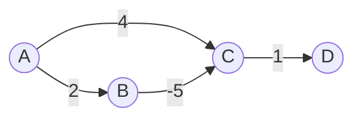

# AGR-004: All-Pairs Shortest Path With Negative Edges

## 📋 Problem Summary

Compute the shortest path distance between **every pair of nodes** in a graph that may contain **negative edge weights** (but no negative cycles).

## 🌍 Real-World Scenario

**Scenario Title:** The Crypto Currency Exchange Study 💸

### The Problem
You are analyzing a crypto exchange market where you can trade between currencies (BTC, ETH, USDT).
-   **Positive Edge (Cost):** Transaction fees or conversion loss.
-   **Negative Edge (Gain):** Promotional rebates or negative spreads (e.g., getting *paid* 0.1% to provide liquidity).
-   **Goal:** Find the most profitable (lowest cost) path to convert any currency A to any currency B.
-   **Why Johnson's?** Since we have 2000+ crypto pairs (vertices), $O(N^3)$ Floyd-Warshall is too slow. But negative rebates exist, so standard Dijkstra fails.

### Constraints in Real World
-   **Scale**: Thousands of tokens.
-   **Speed**: Arbitrage opportunities vanish in milliseconds.


### From Real World to Algorithm
We need APSP on a sparse graph with negative weights. Johnson's Algorithm re-weights the graph to use Dijkstra efficiently.

## Detailed Explanation

### ASCII Diagram: Concept Visualization

**Graph with Negative Edge:**

-   Path `A -> B -> C`: Cost $2 + (-5) = -3$.
-   Path `A -> C`: Cost $4$.
-   Real shortest path `A -> C` is via B. Standard Dijkstra might greedily finalize C as 4 if it visited C before B.

**Reweighting (Johnson's Idea):**
We want to transform edge weights to be non-negative so we can use Dijkstra.
-   Assign a "potential" $h[u]$ to each node using Bellman-Ford.
-   New weight $w'(u, v) = w(u, v) + h[u] - h[v]$.
-   **Telescoping Property**: Any path cost $A \to \dots \to Z$ becomes $OriginalCost + h[A] - h[Z]$. Since $h[A]$ and $h[Z]$ are constants for a fixed pair, the *relative* order of path costs remains unchanged.

### Algorithm Flow Diagram

```mermaid
graph TD
    Start[Start] --> AddVirt[Add Virtual Source S connected to all nodes with wt 0]
    AddVirt --> RunBF[Run Bellman-Ford from S]
    RunBF --> NegCycle{Negative Cycle?}
    NegCycle -- Yes --> Fail[Error: Negative Cycle Detected]
    NegCycle -- No --> Reweight[Update all weights: w'(u,v) = w(u,v) + h[u] - h[v]]
    Reweight --> RunDijkstra[Run Dijkstra from EVERY node u using w']
    RunDijkstra --> Adjust[TrueDist(u,v) = Dist'(u,v) - h[u] + h[v]]
    Adjust --> Result[Return Distance Matrix]
```

## 🎯 Edge Cases to Test

1.  **Negative Paths (No Cycle)**
    -   Input: `A -> B -> C` with weights `3, -10`.
    -   Expected: Correct sum `-7`.
2.  **Disconnected Components**
    -   Input: Graph with islands.
    -   Expected: `INF` between islands.
3.  **All Negative Weights**
    -   Input: Chain with all `-1`.
    -   Expected: Correct large negative sum.
4.  **Dense Graph**
    -   Input: $K_{500}$.
    -   Expected: Time limit performance check.

## ✅ Input/Output Clarifications
-   **INF**: Use a large number (e.g., `1e18`) for unreachable nodes.
-   **Output**: Print "INF" string for infinity.
-   **Constraints**: N=2000. Floyd-Warshall ($O(N^3)$) is too slow ($8 \times 10^9$ ops). Johnson's ($O(NM \log N)$) is required.

## Naive Approach

### Intuition
Run Bellman-Ford from *every* node to handle negative edges.

### Complexity Visualization
| Approach | Time Complexity | Operations ($N=2000$) |
|:---------|:---------------:|:---------------------:|
| Floyd-Warshall | $O(N^3)$ | $\approx 8 \times 10^9$ (TLE ❌) |
| Iterated Bellman-Ford | $O(N^2 M)$ | $\approx 2000 \times 10^7 \approx 2 \times 10^{10}$ (TLE ❌) |
| Johnson's (Optimal) | $O(NM \log N)$ | $\approx 10^7 \times 11 \approx 10^8$ (Pass ✅) |

## Optimal Approach (Johnson's Algorithm)

### Key Insight
If we can "fix" the negative edges, we can use Dijkstra ($N$ times). We fix them by finding a potential function $h$ such that $w(u,v) + h[u] - h[v] \ge 0$. Bellman-Ford finds exactly this $h$ in one pass ($O(NM)$).

### Time Complexity
-   **O(N * M log N)**:
    1.  Bellman-Ford: $O(NM)$.
    2.  Reweighting: $O(M)$.
    3.  $N$ Dijkstras: $O(N \cdot M \log N)$ (or $O(N(M+N \log N))$ depending on Heap).
    -   Total dominates BF step.

### Space Complexity
-   **O(N + M)**: Adjacency list and distance arrays.

## Implementations

### Java
```java
import java.util.*;

class Solution {
    static class Edge {
        int to;
        long weight;
        Edge(int to, long weight) { this.to = to; this.weight = weight; }
    }

    public long[][] allPairsShortestPaths(int n, int[][] edges) {
        List<List<Edge>> adj = new ArrayList<>();
        for (int i = 0; i < n; i++) adj.add(new ArrayList<>());
        for (int[] e : edges) {
            adj.get(e[0]).add(new Edge(e[1], e[2]));
        }

        long INF = 1_000_000_000_000_000_000L; // 1e18

        // 1. Bellman-Ford to find potentials h[]
        // Virtual source connected to all nodes with 0 weight
        long[] h = new long[n + 1];
        Arrays.fill(h, INF);
        h[n] = 0; // Virtual source index n
        
        // Run Bellman-Ford (N iterations)
        boolean changed = true;
        for (int i = 0; i < n; i++) { 
            changed = false;
            // Edges from virtual source (n -> u with wt 0)
            for (int u = 0; u < n; u++) {
                if (h[n] + 0 < h[u]) {
                    h[u] = h[n] + 0;
                    changed = true;
                }
            }
            // Original edges
            for (int u = 0; u < n; u++) {
                if (h[u] == INF) continue;
                for (Edge e : adj.get(u)) {
                    if (h[u] + e.weight < h[e.to]) {
                        h[e.to] = h[u] + e.weight;
                        changed = true;
                    }
                }
            }
            if (!changed) break;
        }

        // 2 & 3. Reweight and Run Dijkstra
        long[][] result = new long[n][n];
        for (int i = 0; i < n; i++) Arrays.fill(result[i], INF);

        for (int s = 0; s < n; s++) {
            PriorityQueue<long[]> pq = new PriorityQueue<>(Comparator.comparingLong(a -> a[0]));
            long[] d = new long[n];
            Arrays.fill(d, INF);
            
            d[s] = 0;
            pq.add(new long[]{0, s});

            while (!pq.isEmpty()) {
                long[] top = pq.poll();
                long distU = top[0];
                int u = (int) top[1];

                if (distU > d[u]) continue;

                for (Edge e : adj.get(u)) {
                    // Implicit Reweighting: w' = w + h[u] - h[v]
                    long newWeight = e.weight + h[u] - h[e.to];
                    if (d[u] + newWeight < d[e.to]) {
                        d[e.to] = d[u] + newWeight;
                        pq.add(new long[]{d[e.to], e.to});
                    }
                }
            }

            // 4. Adjust distances back to original
            for (int v = 0; v < n; v++) {
                if (d[v] != INF) {
                    result[s][v] = d[v] - h[s] + h[v];
                }
            }
        }

        return result;
    }
}
```

### Python
```python
import sys
import heapq

def all_pairs_shortest_paths(n: int, edges: list[tuple[int, int, int]]) -> list[list[int]]:
    INF = 10**18
    adj = [[] for _ in range(n)]
    for u, v, w in edges:
        adj[u].append((v, w))
        
    # 1. Bellman-Ford for potentials h
    # Virtual source n connected to 0..n-1 with weight 0
    # Optimization: Initially h[0..n-1] = 0.
    h = [0] * (n + 1)
    
    # Run Bellman-Ford
    for _ in range(n):
        changed = False
        for u, v, w in edges:
            if h[u] + w < h[v]:
                h[v] = h[u] + w
                changed = True
        if not changed:
            break
            
    # 2. Dijkstra from each node
    result = [[INF] * n for _ in range(n)]
    
    for s in range(n):
        d = [INF] * n
        d[s] = 0
        pq = [(0, s)]
        
        while pq:
            dist_u, u = heapq.heappop(pq)
            if dist_u > d[u]: continue
            
            for v, w in adj[u]:
                new_w = w + h[u] - h[v]
                if d[u] + new_w < d[v]:
                    d[v] = d[u] + new_w
                    heapq.heappush(pq, (d[v], v))
        
        # Restore original distances
        for v in range(n):
            if d[v] != INF:
                result[s][v] = d[v] - h[s] + h[v]
                
    return result
```

### C++
```cpp
#include <array>
#include <iostream>
#include <vector>
#include <queue>
#include <algorithm>

using namespace std;

const long long INF = 1e18;

class Solution {
public:
    vector<vector<long long>> allPairsShortestPaths(int n, const vector<array<int, 3>>& edges) {
        vector<vector<pair<int, int>>> adj(n);
        for (const auto& e : edges) {
            adj[e[0]].push_back({e[1], e[2]});
        }

        // Bellman-Ford
        vector<long long> h(n + 1, 0); // Virtual source n, connected to all with 0
        // Init h[0..n-1] = 0 is equivalent to 1st iteration of BF from virtual source
        
        for (int i = 0; i < n; i++) {
            bool changed = false;
            for (const auto& e : edges) {
                if (h[e[0]] + e[2] < h[e[1]]) {
                    h[e[1]] = h[e[0]] + e[2];
                    changed = true;
                }
            }
            if (!changed) break;
        }

        vector<vector<long long>> result(n, vector<long long>(n, INF));

        for (int s = 0; s < n; s++) {
            priority_queue<pair<long long, int>, vector<pair<long long, int>>, greater<pair<long long, int>>> pq;
            vector<long long> d(n, INF);

            d[s] = 0;
            pq.push({0, s});

            while (!pq.empty()) {
                long long distU = pq.top().first;
                int u = pq.top().second;
                pq.pop();

                if (distU > d[u]) continue;

                for (const auto& e : adj[u]) {
                    int v = e.first;
                    int w = e.second;
                    long long newWeight = w + h[u] - h[v];
                    if (d[u] + newWeight < d[v]) {
                        d[v] = d[u] + newWeight;
                        pq.push({d[v], v});
                    }
                }
            }

            for (int v = 0; v < n; v++) {
                if (d[v] != INF) {
                    result[s][v] = d[v] - h[s] + h[v];
                }
            }
        }

        return result;
    }
};

int main() {
    ios::sync_with_stdio(false);
    cin.tie(nullptr);

    int n, m;
    if (!(cin >> n >> m)) return 0;
    vector<array<int, 3>> edges(m);
    for (int i = 0; i < m; i++) {
        cin >> edges[i][0] >> edges[i][1] >> edges[i][2];
    }

    Solution solution;
    vector<vector<long long>> dist = solution.allPairsShortestPaths(n, edges);
    for (int i = 0; i < n; i++) {
        for (int j = 0; j < n; j++) {
            if (j) cout << ' ';
            if (dist[i][j] >= INF / 2) cout << "INF";
            else cout << dist[i][j];
        }
        if (i + 1 < n) cout << "\n";
    }
    return 0;
}
```

### JavaScript
```javascript
const readline = require("readline");

class PriorityQueue {
  constructor(comparator = (a, b) => a - b) {
    this.heap = [];
    this.comparator = comparator;
  }
  push(val) {
    this.heap.push(val);
    this.bubbleUp(this.heap.length - 1);
  }
  pop() {
    if (this.heap.length === 0) return null;
    const top = this.heap[0];
    const bottom = this.heap.pop();
    if (this.heap.length > 0) {
      this.heap[0] = bottom;
      this.bubbleDown(0);
    }
    return top;
  }
  isEmpty() { return this.heap.length === 0; }
  bubbleUp(idx) {
    while (idx > 0) {
      const pIdx = Math.floor((idx - 1) / 2);
      if (this.comparator(this.heap[idx], this.heap[pIdx]) < 0) {
        [this.heap[idx], this.heap[pIdx]] = [this.heap[pIdx], this.heap[idx]];
        idx = pIdx;
      } else break;
    }
  }
  bubbleDown(idx) {
    while (true) {
      const lIdx = 2 * idx + 1;
      const rIdx = 2 * idx + 2;
      let swapIdx = null;
      if (lIdx < this.heap.length && this.comparator(this.heap[lIdx], this.heap[idx]) < 0) swapIdx = lIdx;
      if (rIdx < this.heap.length && this.comparator(this.heap[rIdx], swapIdx === null ? this.heap[idx] : this.heap[swapIdx]) < 0) swapIdx = rIdx;
      if (swapIdx !== null) {
        [this.heap[idx], this.heap[swapIdx]] = [this.heap[swapIdx], this.heap[idx]];
        idx = swapIdx;
      } else break;
    }
  }
}

class Solution {
  allPairsShortestPaths(n, edges) {
    const INF = 1e15;
    const adj = Array.from({ length: n }, () => []);
    for (const [u, v, w] of edges) {
      adj[u].push({ to: v, w });
    }

    // 1. Bellman-Ford
    const h = new Array(n).fill(0);
    for (let i = 0; i < n; i++) {
      let changed = false;
      for (const [u, v, w] of edges) {
        if (h[u] + w < h[v]) {
          h[v] = h[u] + w;
          changed = true;
        }
      }
      if (!changed) break;
    }

    const result = Array.from({ length: n }, () => new Array(n).fill(INF));

    // 2. Dijkstra
    for (let s = 0; s < n; s++) {
      const d = new Array(n).fill(INF);
      d[s] = 0;
      const pq = new PriorityQueue((a, b) => a.dist - b.dist);
      pq.push({ dist: 0, u: s });

      while (!pq.isEmpty()) {
        const { dist: distU, u } = pq.pop();
        if (distU > d[u]) continue;

        for (const { to: v, w } of adj[u]) {
          const newW = w + h[u] - h[v];
          if (d[u] + newW < d[v]) {
            d[v] = d[u] + newW;
            pq.push({ dist: d[v], u: v });
          }
        }
      }

      for (let v = 0; v < n; v++) {
        if (d[v] !== INF) {
          result[s][v] = d[v] - h[s] + h[v];
        }
      }
    }

    return result;
  }
}

const rl = readline.createInterface({
  input: process.stdin,
  output: process.stdout,
});

let data = [];
rl.on("line", (line) => { const parts = line.trim().split(/\s+/); for (const p of parts) if (p) data.push(p); });
rl.on("close", () => {
  if (data.length === 0) return;
  
  let idx = 0;
  const n = parseInt(data[idx++], 10);
  const m = parseInt(data[idx++], 10);
  const edges = [];
  for (let i = 0; i < m; i++) {
    const u = parseInt(data[idx++], 10);
    const v = parseInt(data[idx++], 10);
    const w = parseInt(data[idx++], 10);
    edges.push([u, v, w]);
  }

  const solution = new Solution();
  const dist = solution.allPairsShortestPaths(n, edges);
  const INF = 1e15;
  const out = dist.map((row) => row.map(x => x >= INF / 2 ? "INF" : x).join(" "));
  console.log(out.join("\n"));
});
```

## 🧪 Test Case Walkthrough (Dry Run)

### Input
```
3 3
0 1 2
1 2 -1
0 2 4
```

### Execution

| Step | Operation | State | Explanation |
|-----:|:----------|:------|:------------|
| 1 | BF Init | `h=[0, 0, 0]` | Virtual source init |
| 2 | BF Iter 1 | `h=[0, 0, -1]` | `1->2` relaxes `h[2]` to `-1` |
| 3 | Reweight `0->1` | $2 + 0 - 0 = 2$ | Unchanged |
| 3 | Reweight `1->2` | $-1 + 0 - (-1) = 0$ | Became non-negative! |
| 3 | Reweight `0->2` | $4 + 0 - (-1) = 5$ | Increased |
| 4 | Dijkstra (0) | `d=[0, 2, 2]` | Path `0->1->2` cost $2+0=2$ |
| 5 | Adjust (0,2) | $2 - h[0] + h[2]$ | $2 - 0 + (-1) = 1$ |
| Result | Matrix[0] | `0 2 1` | Correct |

## ✅ Proof of Correctness

### Why Reweighting Works
Let path $P$ be $v_0 \to v_1 \to \dots \to v_k$.
Cost in reweighted graph:
$$ \sum_{i=0}^{k-1} (w(v_i, v_{i+1}) + h[v_i] - h[v_{i+1}]) $$
$$ = \sum w(v_i, v_{i+1}) + (h[v_0] - h[v_1]) + (h[v_1] - h[v_2]) + \dots $$
$$ = OriginalCost(P) + h[v_0] - h[v_k] $$
For fixed $S, T$, $(h[S] - h[T])$ is constant. Thus, the path that minimizes reweighted cost also minimizes original cost.

## ⚠️ Common Mistakes to Avoid

1.  **Using Floyd-Warshall**:
    -   ❌ Good for small N (<500), but TLEs for N=2000.
    -   ✅ Johnson's is built specifically for sparse graphs (low M).
2.  **Incorrect INF comparison**:
    -   ❌ `if (val == INF)` might fail if `val` was increased by reweighting.
    -   ✅ Check `if (val >= INF / 2)` or maintain boolean visited.
3.  **Forgetting to restore**:
    -   ❌ Returning Dijkstra output directly.
    -   ✅ Must subtract potentials back: `Dijkstra - h[s] + h[t]`.

## 💡 Interview Extensions

1.  **What if there's a negative cycle?**
    -   Bellman-Ford step will detect it. Dijkstra step won't run.
2.  **Dense Graphs ($M \approx N^2$)?**
    -   Johnson's becomes $O(N^3 \log N)$, which is *worse* than Floyd-Warshall. Use FW for dense graphs.
3.  **SPFA Algorithm**:
    -   Often faster in practice than Bellman-Ford, but worst case exponential. Good heuristic.

## Related Concepts
-   **Bellman-Ford**: Handling negative edges single source.
-   **Telescoping Series**: Mathematical basis for reweighting.
-   **Potential Functions**: Used in Physics and Amortized Analysis (splay trees).
