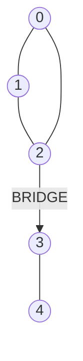

# AGR-005: Bridges and 2-Edge-Connected Components

## 📋 Problem Summary

Identify all **bridges** in a graph and partition the vertices into **2-Edge-Connected Components (2ECCs)**. A 2ECC is a subgraph where removing any single edge does not disconnect the subgraph.

## 🌍 Real-World Scenario

**Scenario Title:** The Critical Server Link Interruption ⚠️

### The Problem
You are a Network Reliability Engineer at a massive data center.
-   **Nodes:** Server racks or data halls.
-   **Edges:** Fiber optic cables.
-   **Bridge:** A specific cable that, if cut by a backhoe, splits the data center into two isolated islands.
-   **2ECC:** A "Cluster" of racks that has redundancy. If one cable fails inside a 2ECC, traffic can reroute through another path.

### Why This Matters
-   **Single Point of Failure (SPOF):** Bridges are SPOFs. You need to identify them immediately to double-lay cables there.
-   **Fault Isolation:** Understanding which parts of the network will stay alive together (the 2-Edge-Connected Components) helps in disaster planning.

### Constraints in Real World
-   **Scale:** Hundreds of thousands of servers. $O(N^2)$ algorithm is too slow.
-   **Topology:** Networks often have loops for redundancy, but some legacy connections might be bridges.


### From Real World to Algorithm
We need to find all bridges efficiently. Tarjan's Bridge-Finding Algorithm (or DFS Low-Link) does this in linear time $O(V+E)$.

## Detailed Explanation

### ASCII Diagram: Concept Visualization

**Graph Topology:**

-   **Cycle {0, 1, 2}**: If `0-1` breaks, path `0-2-1` exists. This set is a **2ECC**.
-   **Edge (2, 3)**: If this breaks, Node 3 (and 4) are completely cut off from {0, 1, 2}. This is a **Bridge**.
-   **Edge (3, 4)**: Is a **Bridge** (leaf edge).

### Algorithm Flow Diagram: finding Bridges

```mermaid
graph TD
    Start[Start DFS at Root] --> Visit[Visit Node u]
    Visit --> SetTime[Set tin equals low equals timer]
    SetTime --> Iterate[Iterate Neighbors v]
    Iterate --> CheckParent{Is v parent?}
    CheckParent -- Yes --> Continue[Ignore]
    CheckParent -- No --> CheckVisited{Is v visited?}
    CheckVisited -- Yes --> UpdateLow[low_u = min(low_u, tin_v)]
    CheckVisited -- No --> Recurse[DFS(v)]
    Recurse --> UpdateLow2[low_u = min(low_u, low_v)]
    UpdateLow2 --> IsBridge{low_v > tin_u?}
    IsBridge -- Yes --> FoundBridge[Mark Edge u-v as Bridge]
    FoundBridge --> Continue
    IsBridge -- No --> Continue
```

## 🎯 Edge Cases to Test

1.  **Tree Graph (All Bridges)**
    -   Input: A simple tree/line.
    -   Expected: *Every* edge is a bridge. Each node is its own 2ECC.
2.  **Simple Cycle (No Bridges)**
    -   Input: Ring graph.
    -   Expected: 0 bridges. All nodes in one 2ECC.
3.  **Disconnected Components**
    -   Input: Two separate islands.
    -   Expected: Algorithm handles multiple DFS trees.
4.  **Parallel Edges**
    -   Input: `0-1` via two edges.
    -   Expected: `0-1` is *not* a bridge (redundancy exists).

## ✅ Input/Output Clarifications
-   **Parallel Edges**: Handled by passing `edge_index` to DFS, preventing immediate backtracking through the exact same wire but allowing creating a cycle via the parallel wire.
-   **Output Order**: Bridges printed in input order (flags).

## Naive Approach

### Intuition
For every edge $e$:
1.  Remove $e$.
2.  Run BFS/DFS to count connected components.
3.  If count increases, $e$ is a bridge.
4.  Add $e$ back.

### Complexity Visualization
| Approach | Time Complexity | Operations ($N=10^5, M=2\cdot10^5$) |
|:---------|:---------------:|:---------------------:|
| Naive ($M \times BFS$) | $O(M(N+M))$ | $\approx 2\cdot10^5 \times 3\cdot10^5 = 6\cdot10^{10}$ (TLE ❌) |
| Tarjan's (DFS) | $O(N+M)$ | $\approx 3\cdot10^5$ (Pass ✅) |

## Optimal Approach (Tarjan's Bridge-Finding)

### Key Insight
In a DFS tree, a back-edge connects a node to its ancestor, creating a cycle.
-   `tin[u]`: Entry time.
-   `low[u]`: Lowest `tin` reachable from `u` using tree edges and at most one back-edge.
-   Condition: If `low[v] > tin[u]`, it means there is **no** back-edge from `v` (or its subtree) to `u` or `u`'s ancestors. The only way back is the edge `(u, v)`. Thus, `(u, v)` is a bridge.

### Time Complexity
-   **O(N + M)**: Single DFS traversal.

### Space Complexity
-   **O(N + M)**: Recursion stack and graph storage.

## Implementations

### Java
```java
import java.util.*;

class Solution {
    private int timer;
    private int[] tin, low;
    private boolean[] visited;
    private int[] bridgeFlags; // 1 if edge i is bridge
    private List<List<int[]>> adj; // {neighbor, edgeIndex}

    public int[][] bridgesAndComponents(int n, int[][] edges) {
        int m = edges.length;
        // Build Graph with Edge Indices
        adj = new ArrayList<>();
        for (int i = 0; i < n; i++) adj.add(new ArrayList<>());
        for (int i = 0; i < m; i++) {
            adj.get(edges[i][0]).add(new int[]{edges[i][1], i});
            adj.get(edges[i][1]).add(new int[]{edges[i][0], i});
        }

        tin = new int[n];
        low = new int[n];
        visited = new boolean[n];
        bridgeFlags = new int[m];
        timer = 0;

        // 1. Find Bridges
        for (int i = 0; i < n; i++) {
            if (!visited[i]) {
                dfsBridges(i, -1);
            }
        }

        // 2. Find Components (DFS ignoring bridges)
        int[] comp = new int[n];
        int compCount = 0;
        Arrays.fill(visited, false); // Reuse visited array

        for (int i = 0; i < n; i++) {
            if (!visited[i]) {
                compCount++;
                dfsComponents(i, compCount, comp);
            }
        }

        return new int[][]{bridgeFlags, comp};
    }

    private void dfsBridges(int u, int pEdgeIndex) {
        visited[u] = true;
        tin[u] = low[u] = timer++;
        for (int[] edge : adj.get(u)) {
            int v = edge[0];
            int idx = edge[1];
            if (idx == pEdgeIndex) continue; // Don't go back through same edge

            if (visited[v]) {
                // Back-edge found
                low[u] = Math.min(low[u], tin[v]);
            } else {
                // Tree-edge
                dfsBridges(v, idx);
                low[u] = Math.min(low[u], low[v]);
                // Check bridge condition
                if (low[v] > tin[u]) {
                    bridgeFlags[idx] = 1;
                }
            }
        }
    }

    private void dfsComponents(int u, int c, int[] comp) {
        visited[u] = true;
        comp[u] = c;
        for (int[] edge : adj.get(u)) {
            int v = edge[0];
            int idx = edge[1];
            if (bridgeFlags[idx] == 1) continue; // Don't cross bridges
            if (!visited[v]) {
                dfsComponents(v, c, comp);
            }
        }
    }
}
```

### Python
```python
import sys

# Increase recursion depth for deep DFS trees
sys.setrecursionlimit(300000)

def bridges_and_components(n: int, edges: list[tuple[int, int]]):
    m = len(edges)
    adj = [[] for _ in range(n)]
    for i, (u, v) in enumerate(edges):
        adj[u].append((v, i))
        adj[v].append((u, i))
        
    tin = [-1] * n
    low = [-1] * n
    bridge_flags = [0] * m
    timer = 0
    
    # DFS to find bridges
    def dfs_bridges(u, p_edge_idx):
        nonlocal timer
        tin[u] = low[u] = timer
        timer += 1
        
        for v, idx in adj[u]:
            if idx == p_edge_idx:
                continue
            if tin[v] != -1:
                # Back-edge
                low[u] = min(low[u], tin[v])
            else:
                # Tree-edge
                dfs_bridges(v, idx)
                low[u] = min(low[u], low[v])
                if low[v] > tin[u]:
                    bridge_flags[idx] = 1
                    
    for i in range(n):
        if tin[i] == -1:
            dfs_bridges(i, -1)
            
    # DFS to label components (ignoring bridges)
    comp = [0] * n
    comp_count = 0
    visited = [False] * n
    
    def dfs_comp(u, c):
        visited[u] = True
        comp[u] = c
        for v, idx in adj[u]:
            if bridge_flags[idx]:
                continue
            if not visited[v]:
                dfs_comp(v, c)
                
    for i in range(n):
        if not visited[i]:
            comp_count += 1
            dfs_comp(i, comp_count)
            
    return bridge_flags, comp
```

### C++
```cpp
#include <iostream>
#include <vector>
#include <algorithm>

using namespace std;

class Solution {
    int timer;
    vector<int> tin, low;
    vector<int> bridgeFlags;
    vector<vector<pair<int, int>>> adj; // {neighbor, edgeIndex}
    vector<int> comp;
    vector<bool> visited;

    void dfsBridges(int u, int pEdgeIndex) {
        visited[u] = true;
        tin[u] = low[u] = timer++;
        for (auto& edge : adj[u]) {
            int v = edge.first;
            int idx = edge.second;
            if (idx == pEdgeIndex) continue;
            if (visited[v]) {
                low[u] = min(low[u], tin[v]);
            } else {
                dfsBridges(v, idx);
                low[u] = min(low[u], low[v]);
                if (low[v] > tin[u]) {
                    bridgeFlags[idx] = 1;
                }
            }
        }
    }

    void dfsComponents(int u, int c) {
        comp[u] = c;
        for (auto& edge : adj[u]) {
            int v = edge.first;
            int idx = edge.second;
            if (bridgeFlags[idx]) continue;
            if (comp[v] == 0) {
                dfsComponents(v, c);
            }
        }
    }

public:
    pair<vector<int>, vector<int>> bridgesAndComponents(int n, const vector<pair<int, int>>& edges) {
        int m = edges.size();
        adj.assign(n, vector<pair<int, int>>());
        for (int i = 0; i < m; i++) {
            adj[edges[i].first].push_back({edges[i].second, i});
            adj[edges[i].second].push_back({edges[i].first, i});
        }

        tin.assign(n, -1);
        low.assign(n, -1);
        visited.assign(n, false);
        bridgeFlags.assign(m, 0);
        timer = 0;

        for (int i = 0; i < n; i++) {
            if (!visited[i]) {
                dfsBridges(i, -1);
            }
        }

        comp.assign(n, 0);
        int compCount = 0;
        for (int i = 0; i < n; i++) {
            if (comp[i] == 0) {
                compCount++;
                dfsComponents(i, compCount);
            }
        }

        return {bridgeFlags, comp};
    }
};

int main() {
    ios::sync_with_stdio(false);
    cin.tie(nullptr);

    int n, m;
    if (!(cin >> n >> m)) return 0;
    vector<pair<int, int>> edges(m);
    for (int i = 0; i < m; i++) {
        cin >> edges[i].first >> edges[i].second;
    }

    Solution solution;
    auto res = solution.bridgesAndComponents(n, edges);
    const vector<int>& bridgeFlags = res.first;
    const vector<int>& comp = res.second;

    int bridgeCount = 0;
    for (int f : bridgeFlags) bridgeCount += f;

    cout << bridgeCount << "\n";
    for (int i = 0; i < m; i++) {
        if (bridgeFlags[i]) {
            cout << edges[i].first << ' ' << edges[i].second << "\n";
        }
    }
    for (int i = 0; i < n; i++) {
        if (i) cout << ' ';
        cout << comp[i];
    }
    return 0;
}
```

### JavaScript
```javascript
const readline = require("readline");

class Solution {
  bridgesAndComponents(n, edges) {
    const m = edges.length;
    const adj = Array.from({ length: n }, () => []);
    for (let i = 0; i < m; i++) {
      const [u, v] = edges[i];
      adj[u].push({ to: v, idx: i });
      adj[v].push({ to: u, idx: i });
    }

    const tin = new Int32Array(n).fill(-1);
    const low = new Int32Array(n).fill(-1);
    const bridgeFlags = new Int8Array(m).fill(0);
    let timer = 0;

    // Use iterative DFS to avoid stack overflow
    const parentEdge = new Int32Array(n).fill(-1);
    const stack = [];
    
    // Recursive is cleaner for logic, but JS stack is small.
    // N=200,000 requires iterative.
    
    // Iterative DFS for Bridges
    // We need to process node in post-order to update low-link.
    // Stack stores {u, iter_index}
    
    const visited = new Int8Array(n).fill(0);
    
    const runDFS = (startNode) => {
        const stack = [startNode];
        const iterIndex = new Int32Array(n).fill(0);
        visited[startNode] = 1;
        tin[startNode] = low[startNode] = timer++;
        
        while (stack.length > 0) {
            const u = stack[stack.length - 1];
            const children = adj[u];
            
            if (iterIndex[u] < children.length) {
                const { to: v, idx } = children[iterIndex[u]];
                iterIndex[u]++;
                
                if (idx === parentEdge[u]) continue;
                
                if (visited[v]) {
                    low[u] = Math.min(low[u], tin[v]);
                } else {
                    visited[v] = 1;
                    tin[v] = low[v] = timer++;
                    parentEdge[v] = idx;
                    stack.push(v);
                }
            } else {
                // Post-order processing
                stack.pop();
                if (parentEdge[u] !== -1) {
                    // We came from some parent via parentEdge[u]
                    // We need to find who is the parent node.
                    // But simpler: we need to update parent's low.
                    // In iterative DFS, parent is now at top of stack (if stack not empty)
                    if (stack.length > 0) {
                        const p = stack[stack.length - 1];
                        low[p] = Math.min(low[p], low[u]);
                        if (low[u] > tin[p]) {
                            bridgeFlags[parentEdge[u]] = 1;
                        }
                    }
                }
            }
        }
    };

    for (let i = 0; i < n; i++) {
        if (!visited[i]) runDFS(i);
    }

    // Components
    const comp = new Int32Array(n).fill(0);
    let compCount = 0;
    
    const runCompDFS = (startNode, c) => {
        const stack = [startNode];
        comp[startNode] = c;
        while(stack.length > 0) {
            const u = stack.pop();
            for(const {to: v, idx} of adj[u]) {
                if(bridgeFlags[idx]) continue;
                if(comp[v] === 0) {
                    comp[v] = c;
                    stack.push(v);
                }
            }
        }
    };

    for (let i = 0; i < n; i++) {
        if (comp[i] === 0) {
            compCount++;
            runCompDFS(i, compCount);
        }
    }

    return [bridgeFlags, comp];
  }
}

const rl = readline.createInterface({
  input: process.stdin,
  output: process.stdout,
});

let data = [];
rl.on("line", (line) => { const parts = line.trim().split(/\s+/); for (const p of parts) if (p) data.push(p); });
rl.on("close", () => {
  if (data.length === 0) return;
  
  let idx = 0;
  const n = parseInt(data[idx++], 10);
  const m = parseInt(data[idx++], 10);
  const edges = [];
  for (let i = 0; i < m; i++) {
    const u = parseInt(data[idx++], 10);
    const v = parseInt(data[idx++], 10);
    edges.push([u, v]);
  }

  const solution = new Solution();
  const [bridgeFlags, comp] = solution.bridgesAndComponents(n, edges);
  
  let bridgeCount = 0;
  for (let i = 0; i < m; i++) bridgeCount += bridgeFlags[i];
  
  const out = [bridgeCount.toString()];
  for (let i = 0; i < m; i++) {
    if (bridgeFlags[i]) out.push(`${edges[i][0]} ${edges[i][1]}`);
  }
  out.push(comp.join(" "));
  console.log(out.join("\n"));
});
```

## 🧪 Test Case Walkthrough (Dry Run)

### Input
```
4 4
0 1
1 2
2 0
2 3
```

### Execution (DFS Bridges)

| Step | Node | Action | `tin` | `low` | Note |
|-----:|:----:|:-------|:-----:|:-----:|:-----|
| 1 | 0 | Visit | 0 | 0 | Start |
| 2 | 1 | Visit | 1 | 1 | Tree Edge 0-1 |
| 3 | 2 | Visit | 2 | 2 | Tree Edge 1-2 |
| 4 | 0 | Back-edge | - | - | From 2 saw 0 (tin 0). `low[2]=0`. |
| 5 | 3 | Visit | 3 | 3 | Tree Edge 2-3 |
| 6 | 3 | Return | - | - | `low[3]=3` |
| 7 | 2 | Check(3) | - | - | `low[3]=3 > tin[2]=2`? **YES**. (2,3) Bridge. |
| 8 | 2 | Return | - | - | `low[2]=0` |
| 9 | 1 | Check(2) | - | - | `low[2]=0 <= tin[1]=1`. No bridge. `low[1]=0`. |
| 10 | 0 | Check(1) | - | - | `low[1]=0 <= tin[0]=0`. No bridge. |

**Components:**
Remove (2,3).
-   BFS(0): Reaches 1, 2. (Component 1)
-   BFS(3): Isolated. (Component 2)

## ✅ Proof of Correctness

### Bridges
$Low[v]$ represents the highest node in the DFS tree that $v$ can reach by going down the tree and taking *one* back-edge up. If $Low[v] > Tin[u]$, it means $v$ cannot reach $u$ or anything above $u$ without using the edge $(u, v)$. Thus, removing $(u, v)$ disconnects $v$'s subtree, making it a bridge.

## ⚠️ Common Mistakes to Avoid

1.  **Ignoring Parallel Edges**: Using simple `DFS(u, p)` fails for parallel edges `u=p`. Use `p_edge_index` to uniquely identify the incoming edge.
2.  **Disconnected Input**: Graph might not be connected. Loop `0..N-1` to ensure all components are visited.
3.  **Recursion Depth**: In Python/JS, deep recursion for lines ($N=10^5$) causes stack overflow. Use `sys.setrecursionlimit` or iterative DFS.

## 💡 Interview Extensions

1.  **Online Bridge Finding?**
    -   Dynamic Connectivity problem. Harder ($O(\log^2 N)$ or typically Disjoint Set Union with backtracking).
2.  **Articulation Points vs Bridges**
    -   Similar algorithm. AP condition: `low[v] >= tin[u]`. Bridges are "weaker" constraints than APs.
3.  **Cactus Graph?**
    -   Graphs where each edge belongs to at most one cycle. Bridges/2ECC logic simplifies cycle detection.

## Related Concepts
-   **Tarjan's SCC**: For directed graphs (Strongly Connected Components).
-   **Disjoint Set Union (DSU)**: Can be used for incremental cycle detection (offline bridges).
-   **Minimum Spanning Tree**: Non-bridge edges are the only ones that can be removed while MST weight might change? (Actually, bridges are present in *every* spanning tree).
