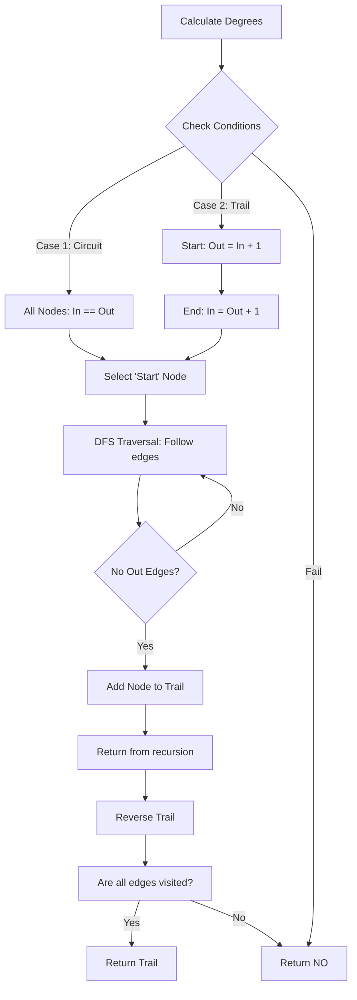

# AGR-007: Eulerian Trail With Directed Edges

## 📋 Problem Summary

Find a path in a directed graph that visits **every edge exactly once**.
-   **Eulerian Circuit:** Starts and ends at the same vertex.
-   **Eulerian Trail:** Starts and ends at different vertices.

## 🌍 Real-World Scenario

**Scenario Title:** The City Street Sweeper 🚛

### The Problem
You manage the "CleanCity" initiative.
-   **Graph:** The city map. Nodes are intersections, Directed Edges are one-way streets.
-   **Goal:** A street sweeper truck needs to clean **every single street** in a specific district.
-   **Efficiency:** The truck is heavy and slow. You want it to traverse every street exactly once (no backtracking over already cleaned streets) to save fuel and time.
-   **Question:** Is it possible to design such a route? If yes, where *must* the truck start and end?

### Constraints in Real World
-   **One-Way Streets:** You can't just drive back.
-   **Connectivity:** All streets must be reachable from each other. If the district has two disconnected zones, one truck can't do it all.


### From Real World to Algorithm
This is the **Eulerian Path** problem. We need an algorithm (Hierholzer’s) to find the sequence of intersections.

## Detailed Explanation

### ASCII Diagram: Concept Visualization

**Graph Topology:**
```
    (Start)      (End)
      (2) -----> (4)
     ^  |
     |  |
    (0) |
     ^  v
      (1) <----- (3)
```

**Degree Analysis:**
-   **Node 0**: In=1, Out=1 (Balanced)
-   **Node 1**: In=1, Out=1 (Balanced)
-   **Node 2**: In=1, Out=2 (**Out = In + 1** $\to$ Potential Start)
-   **Node 3**: In=0, Out=1 ... Wait, diagram check. Let's fix.
    -   Let's say `1->0`, `0->2`, `2->1`, `2->4`.
    -   2: In=1 (from 0), Out=2 (to 1, to 4).
    -   4: In=1 (from 2), Out=0 (**In = Out + 1** $\to$ Potential End).
-   **Valid Trail**: Start at 2. Go `2->1->0->2->4`.
    -   Edges visited: `(2,1)`, `(1,0)`, `(0,2)`, `(2,4)`. All visited exactly once.

### Algorithm Flow Diagram: Hierholzer's



## 🎯 Edge Cases to Test

1.  **Disconnected Components**
    -   Input: `0->1` and `2->3` (two islands).
    -   Expected: NO (Cannot jump between islands).
2.  **Single Node (M=0)**
    -   Input: 5 nodes, 0 edges.
    -   Expected: YES (Trivial path of length 1).
3.  **Invalid Degrees**
    -   Input: `0->1`, `0->2`.
    -   0 has Out=2, In=0. 1 has In=1. 2 has In=1. Start=0 (diff 2). End=? Two nodes have In > Out.
    -   Expected: NO.
4.  **Cycle**
    -   Input: `0->1->0`.
    -   Expected: YES (Circuit).

## ✅ Input/Output Clarifications
-   **M=0**: Valid. Output any node.
-   **Format**: `YES` newline then space-separated nodes.
-   **Start Node**: If circuit, any node with `out_degree > 0` works. If trail, strictly the node with `out = in + 1`.

## Naive Approach

### Intuition
Standard DFS/Backtracking. Try every edge. If we get stuck and haven't visited all edges, backtrack.

### Complexity Visualization
| Approach | Time Complexity | Feasibility ($N=10^5$) |
|:---------|:---------------:|:----------------------:|
| Naive Backtracking | $O(N!)$ | ❌ Impossible |
| Hierholzer's | $O(M)$ | ✅ Fast |

## Optimal Approach (Hierholzer's Algorithm)

### Key Insight
Hierholzer's algorithm works by finding a cycle, then merging other cycles into it. Since the graph is Eulerian, we can just "walk" randomly until we get stuck. Because degrees are balanced (mostly), getting stuck implies we completed a cycle (or reached the unique end node). We add that node to our path and "backtrack" to fill in the rest of the edges.

### Time Complexity
-   **O(N + M)**: We visit every edge exactly once.

### Space Complexity
-   **O(N + M)**: Recursion stack (can be O(M) deep) and graph storage.

## Implementations

### Java
```java
import java.util.*;

class Solution {
    private List<Deque<Integer>> adj;
    private List<Integer> trail;

    public int[] eulerTrail(int n, int[][] edges) {
        int m = edges.length;
        if (m == 0) return new int[]{0}; // Trivial case

        int[] in = new int[n];
        int[] out = new int[n];
        adj = new ArrayList<>();
        for (int i = 0; i < n; i++) adj.add(new ArrayDeque<>());

        for (int[] e : edges) {
            out[e[0]]++;
            in[e[1]]++;
            adj.get(e[0]).add(e[1]);
        }

        int startNode = -1;
        int endNode = -1;
        int diffCount = 0;

        // Verify Degree Conditions
        for (int i = 0; i < n; i++) {
            if (out[i] == in[i] + 1) {
                if (startNode != -1) return null; // >1 start
                startNode = i;
                diffCount++;
            } else if (in[i] == out[i] + 1) {
                if (endNode != -1) return null; // >1 end
                endNode = i;
                diffCount++;
            } else if (in[i] != out[i]) {
                return null; // Invalid imbalance
            }
        }

        // Determine Start Node
        if (diffCount == 0) {
            // Circuit: Start at any node with outgoing edges
            for (int i = 0; i < n; i++) {
                if (out[i] > 0) {
                    startNode = i;
                    break;
                }
            }
        } else if (diffCount != 2) {
            return null; // Must be exactly 2 odd-degree nodes for a trail
        }

        if (startNode == -1) return null;

        trail = new ArrayList<>();
        dfs(startNode);

        // Check connectivity (did we visit all edges?)
        if (trail.size() != m + 1) return null;

        int[] res = new int[trail.size()];
        for (int i = 0; i < trail.size(); i++) {
            res[i] = trail.get(trail.size() - 1 - i); // Reverse
        }
        return res;
    }

    private void dfs(int u) {
        Deque<Integer> neighbors = adj.get(u);
        while (!neighbors.isEmpty()) {
            int v = neighbors.pollLast(); // Removes edge efficiently
            dfs(v);
        }
        trail.add(u);
    }
}
```

### Python
```python
import sys

# Crucial for deep DFS recursion in trail finding
sys.setrecursionlimit(300000)

def euler_trail(n: int, edges: list[tuple[int, int]]):
    m = len(edges)
    if m == 0:
        return [0]
        
    in_deg = [0] * n
    out_deg = [0] * n
    adj = [[] for _ in range(n)]
    
    for u, v in edges:
        out_deg[u] += 1
        in_deg[v] += 1
        adj[u].append(v)
        
    start_node = -1
    end_node = -1
    diff_count = 0
    
    # 1. Check Degrees
    for i in range(n):
        if out_deg[i] == in_deg[i] + 1:
            if start_node != -1: return None
            start_node = i
            diff_count += 1
        elif in_deg[i] == out_deg[i] + 1:
            if end_node != -1: return None
            end_node = i
            diff_count += 1
        elif in_deg[i] != out_deg[i]:
            return None
            
    # 2. Determine Start
    if diff_count == 0: # Circuit
        for i in range(n):
            if out_deg[i] > 0:
                start_node = i
                break
    elif diff_count != 2: # Invalid
        return None
        
    if start_node == -1: return None
    
    trail = []
    
    # 3. Hierholzer's DFS
    def dfs(u):
        while adj[u]:
            v = adj[u].pop()
            dfs(v)
        trail.append(u)
        
    dfs(start_node)
    
    # 4. Check Connectivity
    if len(trail) != m + 1:
        return None
        
    return trail[::-1]
```

### C++
```cpp
#include <iostream>
#include <vector>
#include <algorithm>
#include <deque>

using namespace std;

class Solution {
    vector<vector<int>> adj;
    vector<int> trail;

    void dfs(int u) {
        while (!adj[u].empty()) {
            int v = adj[u].back();
            adj[u].pop_back();
            dfs(v);
        }
        trail.push_back(u);
    }

public:
    vector<int> eulerTrail(int n, const vector<pair<int, int>>& edges) {
        int m = edges.size();
        if (m == 0) return {0};

        vector<int> in(n, 0), out(n, 0);
        adj.assign(n, vector<int>());

        for (const auto& e : edges) {
            out[e.first]++;
            in[e.second]++;
            adj[e.first].push_back(e.second);
        }

        int startNode = -1;
        int endNode = -1;
        int diffCount = 0;

        for (int i = 0; i < n; i++) {
            if (out[i] == in[i] + 1) {
                if (startNode != -1) return {};
                startNode = i;
                diffCount++;
            } else if (in[i] == out[i] + 1) {
                if (endNode != -1) return {};
                endNode = i;
                diffCount++;
            } else if (in[i] != out[i]) {
                return {};
            }
        }

        if (diffCount == 0) {
            for (int i = 0; i < n; i++) {
                if (out[i] > 0) {
                    startNode = i;
                    break;
                }
            }
        } else if (diffCount != 2) {
            return {};
        }

        if (startNode == -1) return {};

        dfs(startNode);

        if (trail.size() != m + 1) return {};

        reverse(trail.begin(), trail.end());
        return trail;
    }
};

int main() {
    ios::sync_with_stdio(false);
    cin.tie(nullptr);

    int n, m;
    if (!(cin >> n >> m)) return 0;
    vector<pair<int, int>> edges(m);
    for (int i = 0; i < m; i++) {
        cin >> edges[i].first >> edges[i].second;
    }

    Solution solution;
    vector<int> trail = solution.eulerTrail(n, edges);
    if (trail.empty()) {
        cout << "NO";
    } else {
        cout << "YES\n";
        for (int i = 0; i < (int)trail.size(); i++) {
            if (i) cout << ' ';
            cout << trail[i];
        }
    }
    return 0;
}
```

### JavaScript
```javascript
const readline = require("readline");

class Solution {
  eulerTrail(n, edges) {
    const m = edges.length;
    if (m === 0) return [0];

    const inDeg = new Int32Array(n).fill(0);
    const outDeg = new Int32Array(n).fill(0);
    const adj = Array.from({ length: n }, () => []);

    for (const [u, v] of edges) {
      outDeg[u]++;
      inDeg[v]++;
      adj[u].push(v);
    }

    let startNode = -1;
    let endNode = -1;
    let diffCount = 0;

    for (let i = 0; i < n; i++) {
      if (outDeg[i] === inDeg[i] + 1) {
        if (startNode !== -1) return null;
        startNode = i;
        diffCount++;
      } else if (inDeg[i] === outDeg[i] + 1) {
        if (endNode !== -1) return null;
        endNode = i;
        diffCount++;
      } else if (inDeg[i] !== outDeg[i]) {
        return null;
      }
    }

    if (diffCount === 0) {
      for (let i = 0; i < n; i++) {
        if (outDeg[i] > 0) {
          startNode = i;
          break;
        }
      }
    } else if (diffCount !== 2) {
      return null;
    }

    if (startNode === -1) return null;

    const trail = [];
    // Iterative DFS to avoid stack overflow
    const stack = [startNode];
    
    // Hierholzer's iterative:
    // Maintain current path. If node has edges, push to stack and take edge.
    // If no edges, pop from stack and add to trail.
    
    // stack = [start]
    // while stack:
    //   u = stack[-1]
    //   if adj[u]:
    //     v = adj[u].pop()
    //     stack.push(v)
    //   else:
    //     trail.push(stack.pop())
    
    while (stack.length > 0) {
        const u = stack[stack.length - 1];
        if (adj[u].length > 0) {
            const v = adj[u].pop();
            stack.push(v);
        } else {
            trail.push(stack.pop());
        }
    }

    if (trail.length !== m + 1) return null;

    return trail.reverse();
  }
}

const rl = readline.createInterface({
  input: process.stdin,
  output: process.stdout,
});

let data = [];
rl.on("line", (line) => { const parts = line.trim().split(/\s+/); for (const p of parts) if (p) data.push(p); });
rl.on("close", () => {
  if (data.length === 0) return;
  
  let idx = 0;
  const n = parseInt(data[idx++], 10);
  const m = parseInt(data[idx++], 10);
  const edges = [];
  for (let i = 0; i < m; i++) {
    const u = parseInt(data[idx++], 10);
    const v = parseInt(data[idx++], 10);
    edges.push([u, v]);
  }

  const solution = new Solution();
  const trail = solution.eulerTrail(n, edges);
  if (trail === null) {
    console.log("NO");
  } else {
    console.log("YES");
    console.log(trail.join(" "));
  }
});
```

## 🧪 Test Case Walkthrough (Dry Run)

### Input
```
3 3
0 1
1 2
2 0
```
### Execution
1.  **Degrees:** All nodes `in == out`. `diffCount = 0`.
2.  **Start:** Pick `0` (has out > 0).
3.  **DFS(0)**:
    -   Pop `0->1`. Call DFS(1).
    -   **DFS(1)**: Pop `1->2`. Call DFS(2).
    -   **DFS(2)**: Pop `2->0`. Call DFS(0).
    -   **DFS(0)** recurse: No edges. Push `0` to trail. Return.
    -   **DFS(2)** continues: No edges. Push `2` to trail. Return.
    -   **DFS(1)** continues: No edges. Push `1` to trail. Return.
    -   **DFS(0)** continues: No edges. Push `0` to trail. Return.
4.  **Trail:** `[0, 2, 1, 0]`.
5.  **Reverse:** `[0, 1, 2, 0]`. Matches edges `(0,1), (1,2), (2,0)`.

## ✅ Proof of Correctness

### Why Reverse?
In Hierholzer's, we add a node to the trail only when we get "stuck" (no outgoing edges left). This means we are at the end of a sub-path. By adding nodes post-order, we effectively build the path backwards from the end. Reversing gives the correct forward order.

## ⚠️ Common Mistakes to Avoid

1.  **O(E) Edge Removal**: Using `adj[u].remove(v)` in an ArrayList is $O(deg(u))$. Total complexity becomes $O(M \cdot max\_deg)$. Use `pop()` (Stack/Deque) for $O(1)$.
2.  **Disconnected Islands**: The degree check passes for `0->1` and `2->3`. You MUST check `trail.size() == m + 1` to ensure the graph (at least the edges) is connected.
3.  **Recursion Limit**: Large trails ($10^5$ edges) will hit stack overflow in Python. Set limit or use iterative stack.
4.  **Empty Graph**: Handle $M=0$ gracefully.

## 💡 Interview Extensions

1.  **Lexicographically First Path?**
    -   If multiple Eulerian paths exist, find the one that comes first alphabetically. Solution: Sort adjacency lists before running DFS.
2.  **Semi-Eulerian?**
    -   Same as "Eulerian Trail" (vs Circuit).
3.  **De Bruijn Sequences?**
    -   Constructing a sequence containing every substring of length $N$ exactly once. This reduces to an Eulerian Path on a specific graph.

## Related Concepts
-   **Hamiltonian Path**: Visits every **vertex** once. NP-Hard. Do not confuse with Eulerian (edges).
-   **Undirected Eulerian**: Similar, but ensure you delete `v->u` when taking `u->v`.
