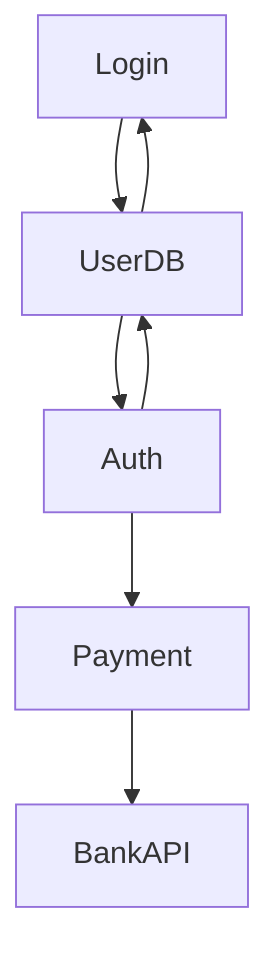
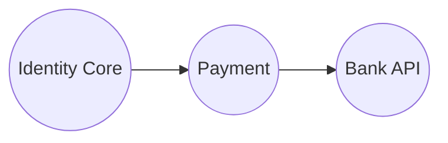

# AGR-008: Strongly Connected Components Compression

## 📋 Problem Summary

Decompose a directed graph into its **Strongly Connected Components (SCCs)**. Then, contract each SCC into a single node to form a **Condensation Graph**, which is always a Directed Acyclic Graph (DAG).

## 🌍 Real-World Scenario

**Scenario Title:** The Circular Dependency Nightmare 🔄

### The Problem
You are a Lead Software Architect refactoring a massive legacy codebase.
-   **Nodes:** Microservices or code modules.
-   **Edges:** API calls or import statements ("Service A calls Service B").
-   **Cyclic Dependency:** If `Checkout` depends on `Inventory`, and `Inventory` depends on `Checkout`, they are tightly coupled. You can't deploy one without the other. They form a **Cluster** (SCC).
-   **Goal:** identify these clusters and treat them as single "Super Components".
-   **Result:** A clean, acyclic architecture diagram showing how data flows between these super-components (The Condensation Graph).

### Why This Matters
-   **Build Systems:** Tools like Maven/Gradle need a DAG to determine build order. Cycles break the build.
-   **Deployment:** You must deploy an entire SCC together.


### From Real World to Algorithm
We need to find SCCs efficiently (Tarjan's) and then build a new graph where each node represents an entire SCC.

## Detailed Explanation

### ASCII Diagram: Concept Visualization

**Original Call Graph:**

-   **Cycle 1:** `Login -> UserDB -> Login`.
-   **Cycle 2:** `UserDB -> Auth -> UserDB`.
-   **Combined Cycle:** `Login, UserDB, Auth` all reach each other.
-   **SCC 1:** `{Login, UserDB, Auth}`.
-   **SCC 2:** `{Payment}`.
-   **SCC 3:** `{BankAPI}`.

**Condensation Graph (Architecture View):**

-   Edges inside SCC1 (`A->B`, `B->C`) are "absorbed".
-   Edge `C->D` becomes `SCC1 -> SCC2`.

### Algorithm Flow Diagram: Tarjan's SCC

```mermaid
graph TD
    Start[Start DFS] --> Visit[Visit u]
    Visit --> Push[Push u to Stack]
    Push --> CheckNeighbors[Iterate v in adj_u]
    CheckNeighbors -- Unvisited --> Recurse[DFS v]
    Recurse --> UpdateLow[low_u = min(low_u, low_v)]
    CheckNeighbors -- OnStack --> UpdateLowStack[low_u = min(low_u, tin_v)]
    UpdateLow --> CheckRoot{low_u == tin_u?}
    UpdateLowStack --> CheckRoot
    CheckRoot -- Yes --> Pop[Pop Stack until u]
    Pop --> NewSCC[Form new SCC]
    CheckRoot -- No --> Return
```

## 🎯 Edge Cases to Test

1.  **DAG Input (No Cycles)**
    -   Input: `1->2->3`.
    -   Expected: Each node is its own SCC. Output identical graph structure.
2.  **Single Huge Cycle**
    -   Input: Ring `1->2->3->1`.
    -   Expected: 1 SCC containing all nodes. Condensation graph is 1 node, 0 edges.
3.  **Disconnected Components**
    -   Input: `1->2` and `3->4`.
    -   Expected: Correct SCCs and disconnected condensation graph.
4.  **Self Loops**
    -   Input: `1->1`.
    -   Expected: Singleton SCC. Self-loop edge removed in condensation.

## ✅ Input/Output Clarifications
-   **Component IDs**: 0-indexed. Order doesn't matter (though Tarjan outputs reverse topological order naturally).
-   **Edges**: Output *unique* edges between components. If `u1->v1` and `u2->v2` both imply `CompA->CompB`, output `CompA CompB` only once.
-   **No Self-Edges**: Do not output `CompA -> CompA`.

## Naive Approach

### Intuition
For every pair `(u, v)`, run BFS to check if `u->v` AND `v->u`. Group them.

### Complexity Visualization
| Approach | Time Complexity | Feasibility ($N=10^5$) |
|:---------|:---------------:|:----------------------:|
| Naive All-Pairs Reachability | $O(N \cdot (N+M))$ | $\approx 2 \cdot 10^{10}$ ops (TLE ❌) |
| Tarjan's (DFS) | $O(N+M)$ | $\approx 5 \cdot 10^5$ ops (Pass ✅) |

## Optimal Approach (Tarjan's Algorithm)

### Key Insight
-   **DFS Stack**: We keep nodes on a stack while exploring.
-   **Low-Link**: `low[u]` tracks the "highest" node in the DFS tree reachable from `u`.
-   **Root of SCC**: If `low[u] == tin[u]`, then `u` cannot reach any node visited *before* it in the current DFS branch. Thus, `u` is the "root" of an SCC. All nodes currently on the stack above `u` form the SCC.

### Time Complexity
-   **O(N + M)**: Single DFS pass.

### Space Complexity
-   **O(N + M)**: Stack and recursion.

## Implementations

### Java
```java
import java.util.*;

class Solution {
    private int timer;
    private int[] tin, low;
    private boolean[] onStack;
    private Stack<Integer> stack;
    private List<List<Integer>> sccs;
    private List<List<Integer>> adj;

    public Object[] sccCompress(int n, List<List<Integer>> adjList) {
        this.adj = adjList;
        tin = new int[n];
        low = new int[n];
        Arrays.fill(tin, -1);
        onStack = new boolean[n];
        stack = new Stack<>();
        sccs = new ArrayList<>();
        timer = 0;

        for (int i = 0; i < n; i++) {
            if (tin[i] == -1) {
                dfs(i);
            }
        }

        int k = sccs.size();
        int[] comp = new int[n];
        // Assign component IDs (0 to k-1)
        for (int i = 0; i < k; i++) {
            for (int node : sccs.get(i)) {
                comp[node] = i;
            }
        }

        // Build Condensation Graph
        // Use Set to avoid duplicate edges
        Set<String> seenEdges = new HashSet<>();
        List<int[]> dagEdges = new ArrayList<>();

        for (int u = 0; u < n; u++) {
            for (int v : adj.get(u)) {
                if (comp[u] != comp[v]) {
                    String key = comp[u] + "," + comp[v];
                    if (!seenEdges.contains(key)) {
                        seenEdges.add(key);
                        dagEdges.add(new int[]{comp[u], comp[v]});
                    }
                }
            }
        }

        // Sort edges for consistent output (optional but good for testing)
        dagEdges.sort((a, b) -> a[0] != b[0] ? Integer.compare(a[0], b[0]) : Integer.compare(a[1], b[1]));

        return new Object[]{k, comp, dagEdges};
    }

    private void dfs(int u) {
        tin[u] = low[u] = timer++;
        stack.push(u);
        onStack[u] = true;

        for (int v : adj.get(u)) {
            if (tin[v] == -1) {
                dfs(v);
                low[u] = Math.min(low[u], low[v]);
            } else if (onStack[v]) {
                // v is in stack -> back-edge to ancestor -> part of current SCC
                low[u] = Math.min(low[u], tin[v]);
            }
            // If visited but NOT on stack (cross-edge to already completed SCC), ignore.
        }

        // If u is a root of an SCC
        if (low[u] == tin[u]) {
            List<Integer> component = new ArrayList<>();
            while (true) {
                int v = stack.pop();
                onStack[v] = false;
                component.add(v);
                if (u == v) break;
            }
            sccs.add(component);
        }
    }
}
```

### Python
```python
import sys

# Necessary for deep recursion chains
sys.setrecursionlimit(300000)

def scc_compress(n: int, adj: list[list[int]]):
    tin = [-1] * n
    low = [-1] * n
    on_stack = [False] * n
    stack = []
    timer = 0
    sccs = []

    def dfs(u):
        nonlocal timer
        tin[u] = low[u] = timer
        timer += 1
        stack.append(u)
        on_stack[u] = True

        for v in adj[u]:
            if tin[v] == -1:
                dfs(v)
                low[u] = min(low[u], low[v])
            elif on_stack[v]:
                low[u] = min(low[u], tin[v])

        if low[u] == tin[u]:
            component = []
            while True:
                v = stack.pop()
                on_stack[v] = False
                component.append(v)
                if u == v:
                    break
            sccs.append(component)

    for i in range(n):
        if tin[i] == -1:
            dfs(i)

    k = len(sccs)
    comp = [0] * n
    # Assign IDs
    for i, component in enumerate(sccs):
        for node in component:
            comp[node] = i

    # Condensation Edges
    dag_edges = set()
    for u in range(n):
        for v in adj[u]:
            if comp[u] != comp[v]:
                dag_edges.add((comp[u], comp[v]))

    return k, comp, sorted(list(dag_edges))
```

### C++
```cpp
#include <iostream>
#include <vector>
#include <stack>
#include <algorithm>
#include <set>
#include <tuple>

using namespace std;

class Solution {
    int timer;
    vector<int> tin, low;
    vector<bool> onStack;
    stack<int> st;
    vector<vector<int>> sccs;

    void dfs(int u, const vector<vector<int>>& adj) {
        tin[u] = low[u] = timer++;
        st.push(u);
        onStack[u] = true;

        for (int v : adj[u]) {
            if (tin[v] == -1) {
                dfs(v, adj);
                low[u] = min(low[u], low[v]);
            } else if (onStack[v]) {
                low[u] = min(low[u], tin[v]);
            }
        }

        if (low[u] == tin[u]) {
            vector<int> component;
            while (true) {
                int v = st.top();
                st.pop();
                onStack[v] = false;
                component.push_back(v);
                if (u == v) break;
            }
            sccs.push_back(component);
        }
    }

public:
    tuple<int, vector<int>, vector<pair<int, int>>> sccCompress(int n, const vector<vector<int>>& adj) {
        tin.assign(n, -1);
        low.assign(n, -1);
        onStack.assign(n, false);
        while (!st.empty()) st.pop();
        sccs.clear();
        timer = 0;

        for (int i = 0; i < n; i++) {
            if (tin[i] == -1) {
                dfs(i, adj);
            }
        }

        int k = sccs.size();
        vector<int> comp(n);
        for (int i = 0; i < k; i++) {
            for (int node : sccs[i]) {
                comp[node] = i;
            }
        }

        set<pair<int, int>> dagEdges;
        for (int u = 0; u < n; u++) {
            for (int v : adj[u]) {
                if (comp[u] != comp[v]) {
                    dagEdges.insert({comp[u], comp[v]});
                }
            }
        }

        return {k, comp, vector<pair<int, int>>(dagEdges.begin(), dagEdges.end())};
    }
};

int main() {
    ios::sync_with_stdio(false);
    cin.tie(nullptr);

    int n, m;
    if (!(cin >> n >> m)) return 0;
    vector<vector<int>> adj(n);
    for (int i = 0; i < m; i++) {
        int u, v;
        cin >> u >> v;
        adj[u].push_back(v);
    }

    Solution solution;
    auto [k, comp, edges] = solution.sccCompress(n, adj);

    cout << k << "\n";
    for (int i = 0; i < n; i++) {
        if (i) cout << ' ';
        cout << comp[i];
    }
    cout << "\n" << edges.size() << "\n";
    for (auto& e : edges) {
        cout << e.first << ' ' << e.second << "\n";
    }
    return 0;
}
```

### JavaScript
```javascript
const readline = require("readline");

class Solution {
  sccCompress(n, adj) {
    const tin = new Int32Array(n).fill(-1);
    const low = new Int32Array(n).fill(-1);
    const onStack = new Int8Array(n).fill(0);
    const stack = [];
    const sccs = [];
    let timer = 0;

    // Iterative Tarjan using explicit stack
    // Frame: { u, iterIndex }

    const runDFS = (startNode) => {
        const callStack = [{ u: startNode, idx: 0 }];
        tin[startNode] = low[startNode] = timer++;
        stack.push(startNode);
        onStack[startNode] = 1;

        while (callStack.length > 0) {
            const frame = callStack[callStack.length - 1];
            const u = frame.u;

            if (frame.idx < adj[u].length) {
                const v = adj[u][frame.idx];
                frame.idx++;

                if (tin[v] === -1) {
                    tin[v] = low[v] = timer++;
                    stack.push(v);
                    onStack[v] = 1;
                    callStack.push({ u: v, idx: 0 });
                } else if (onStack[v]) {
                    low[u] = Math.min(low[u], tin[v]);
                }
            } else {
                // Post-order
                callStack.pop();
                if (callStack.length > 0) {
                    const p = callStack[callStack.length - 1].u;
                    low[p] = Math.min(low[p], low[u]);
                }

                if (low[u] === tin[u]) {
                    const component = [];
                    while (true) {
                        const v = stack.pop();
                        onStack[v] = 0;
                        component.push(v);
                        if (u === v) break;
                    }
                    sccs.push(component);
                }
            }
        }
    };

    for (let i = 0; i < n; i++) {
        if (tin[i] === -1) runDFS(i);
    }

    const k = sccs.length;
    const comp = new Int32Array(n);
    // Assign IDs
    // sccs are found in reverse topological order
    // Reverse sccs to get topological order (Source -> Sink)
    // Though problem doesn't require specific order.
    // Use index.

    // Note: Tarjan's naturally produces reverse topological order of SCCs.
    // sccs[0] is a sink SCC.
    // If we want comp[u] to be somewhat topological, we can assign k-1-i.
    // But simple 0..k-1 is fine.

    for (let i = 0; i < k; i++) {
        for (const node of sccs[i]) {
            comp[node] = i;
        }
    }

    const dagEdges = new Set();
    const edgesList = [];

    for (let u = 0; u < n; u++) {
        for (const v of adj[u]) {
            if (comp[u] !== comp[v]) {
                const key = `${comp[u]},${comp[v]}`;
                if (!dagEdges.has(key)) {
                    dagEdges.add(key);
                    edgesList.push([comp[u], comp[v]]);
                }
            }
        }
    }

    return [k, comp, edgesList];
  }
}

const rl = readline.createInterface({
  input: process.stdin,
  output: process.stdout,
});

let data = [];
rl.on("line", (line) => { const parts = line.trim().split(/\s+/); for (const p of parts) if (p) data.push(p); });
rl.on("close", () => {
  if (data.length === 0) return;

  let idx = 0;
  const n = parseInt(data[idx++], 10);
  const m = parseInt(data[idx++], 10);
  const adj = Array.from({ length: n }, () => []);
  for (let i = 0; i < m; i++) {
    const u = parseInt(data[idx++], 10);
    const v = parseInt(data[idx++], 10);
    adj[u].push(v);
  }

  const solution = new Solution();
  const [k, comp, edges] = solution.sccCompress(n, adj);

  const out = [k.toString(), comp.join(" "), edges.length.toString()];
  edges.sort((p, q) => p[0] - q[0] || p[1] - q[1]);
  for (const [a, b] of edges) out.push(`${a} ${b}`);
  console.log(out.join("\n").trim());
});
```

## 🧪 Test Case Walkthrough (Dry Run)

### Input
```
3 3
0 1
1 2
2 0
```
### Trace
1.  **DFS(0)**: `tin[0]=0`, stack `[0]`.
2.  **DFS(1)**: `tin[1]=1`, stack `[0,1]`.
3.  **DFS(2)**: `tin[2]=2`, stack `[0,1,2]`.
4.  **Edge 2->0**: Back-edge to 0 (on stack). `low[2] = min(2, tin[0]=0) = 0`.
5.  **Return 2**: `low[1] = min(1, low[2]=0) = 0`.
6.  **Return 1**: `low[0] = min(0, low[1]=0) = 0`.
7.  **Root Check 0**: `low[0] (0) == tin[0] (0)`. Pop stack:
    -   Pop 2, Pop 1, Pop 0.
    -   **SCC**: `{2, 1, 0}`.
8.  **Output**: `k=1`. `comp=[0,0,0]`. Edges: `[]` (since `0,1,2` all in comp 0, no inter-SCC edges).

## ✅ Proof of Correctness

### Correctness of SCCs
Tarjan's algorithm relies on the fact that an SCC forms a subtree in the DFS tree (ignoring the cross edges). The "root" `u` of an SCC is the first node of that SCC visited by DFS. All other nodes in the SCC are descendants. By traversing, we encompass all reachable nodes. When we return to `u`, if `low[u] == tin[u]` (no back-edges escaping `u`'s subtree to `u`'s ancestors), then `u` and its descendants on the stack form an SCC.

## ⚠️ Common Mistakes to Avoid

1.  **Updating Low with Completed SCCs**:
    -   ❌ `if visited[v]: low[u] = min(low[u], tin[v])`. This is wrong if `v` is in a *different, already finished* SCC (cross-edge).
    -   ✅ `if on_stack[v]: low[u] = min(low[u], tin[v])`. Only back-edges to current recursion stack matter.
2.  **Duplicate DAG Edges**:
    -   ❌ Checking `if comp[u] != comp[v]` and immediately printing.
    -   ✅ Must check for uniqueness (Set/Map) before adding to list.
3.  **Recursion Depth**: As always, check stack limits for N=200,000.

## 💡 Interview Extensions

1.  **Kosaraju's Algorithm?**
    -   Alternative to Tarjan. Requires 2 DFS passes (one on normal graph, one on transpose graph). Easier to implement iteratively, but slower (2x constant factor).
2.  **What if the graph is huge?**
    -   Iterative Tarjan avoids stack overflow.
3.  **2-SAT Solver**:
    -   Construct graph where nodes are literals. Edge `!x -> y` means clause `(x OR y)`.
    -   Satisfiable if `x` and `!x` are NOT in same SCC. Solution from topological order of SCCs.

## Related Concepts
-   **Topological Sort**: Defined on the Condensation DAG.
-   **Weakly Connected Components**: Ignoring edge direction.
-   **Biconnected Components**: Undirected equivalent.
