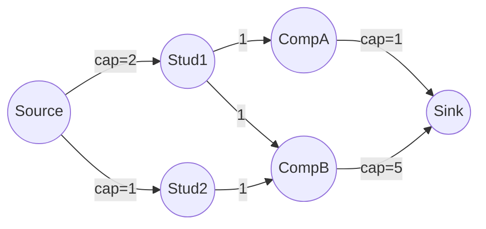
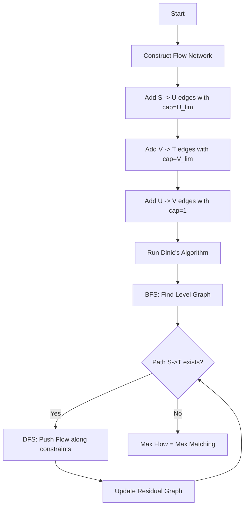

# AGR-009: Maximum Matching with Node Capacities

## 📋 Problem Summary

Find the **maximum number of edges** we can select in a bipartite graph such that each node `u` in the left set is incident to at most `capU[u]` selected edges, and each node `v` in the right set is incident to at most `capV[v]` selected edges.

## 🌍 Real-World Scenario

**Scenario Title:** The Campus Placement Drive 🎓

### The Problem
It's placement season. You have:
-   **Students (Left Set):** Each student `S_i` can accept up to `capU[i]` offers. (Usually 1, but maybe 2 for internship + full-time).
-   **Companies (Right Set):** Each company `C_j` has `capV[j]` open positions to fill.
-   **Interviews (Edges):** Valid matches where a student passed the interview for a company.
-   **Goal:** Maximize the total number of students placed.

### Why This Matters
-   **Resource Allocation:** Matching supply (students) with demand (jobs) while respecting individual limits is a classic operation research problem.
-   **Ad Auctions:** Advertisers bid on slots. Each ad can be shown X times, each slot can show Y ads.


### From Real World to Algorithm
This is **Bipartite Matching with Demands** (or Capacities). We model it as a **Max Flow** problem.

## Detailed Explanation

### ASCII Diagram: Concept Visualization

**Flow Network Construction:**


-   **Source (S):** Represents the supply of student labor. Edge `S -> U_i` capacity is the max offers student `i` can take.
-   **Sink (T):** Represents the demand of job market. Edge `V_j -> T` capacity is the max hires company `j` can make.
-   **Middle Edges:** `U_i -> V_j` capacity is **1**. A student can only take 1 position at a specific company (cannot be hired twice by the same company).

### Algorithm Flow Diagram: Max Flow



## 🎯 Edge Cases to Test

1.  **Zero Capacity**
    -   Input: A student with cap=0.
    -   Expected: Cannot be matched.
2.  **Abundant Capacity**
    -   Input: Caps > Neighbors.
    -   Expected: All possible edges can be taken.
3.  **Disconnected Graph**
    -   Input: No edges between sets.
    -   Expected: 0 matching.
4.  **No Candidates/Companies**
    -   Input: N=0 or M=0.
    -   Expected: 0.

## ✅ Input/Output Clarifications
-   **Indexing**: Input `u` is 0-indexed in Left Set. Input `v` is 0-indexed in Right Set. In the flow graph, map `u` to `1..N_U` and `v` to `N_U+1..N_U+N_V`.
-   **Max Flow Value**: The integer result of Max Flow is the answer.
-   **Capacities**: Use `long`/`long long` to prevent overflow, although typically bounded by $M \le 10^5$.

## Naive Approach

### Intuition
Greedy match. Pick any valid edge, decrease capacities, repeat.

### Failure Case
-   `S (cap 1) -> A, B`. `T (cap 1) -> B`.
-   `Company X (cap 1)` wants A.
-   `Company Y (cap 1)` wants B.
-   Constraints: `A` wants `X`. `B` wants `X, Y`. `S -> A -> X` and `S -> B -> Y`.
-   Greedy might pick `B -> X`. Now `X` is full. `A` has nowhere to go. Total matches: 1.
-   Optimal: `A -> X`, `B -> Y`. Total matches: 2.
-   **Conclusion**: Greedy fails.

## Optimal Approach (Dinic's Algorithm)

### Key Insight
Max Flow algorithms (like Dinic's) allow "undoing" a choice via residual edges (back-flow). If we greedily took `B->X`, the algorithm can later push flow back from `X` to `B` and route `B` to `Y` instead, freeing `X` for `A`.

### Time Complexity
-   **O(E * sqrt(V))**: For bipartite matching (unit networks), Dinic runs in this time. With general capacities on source/sink edges but unit internal edges, it is still very fast (often closer to $O(E\sqrt{V})$ than general $O(V^2 E)$).

### Space Complexity
-   **O(V + E)**: Flow graph.

## Implementations

### Java
```java
import java.util.*;

class Solution {
    static class Edge {
        int to;
        int rev;
        long cap;
        long flow;
        Edge(int to, int rev, long cap) {
            this.to = to;
            this.rev = rev;
            this.cap = cap;
            this.flow = 0;
        }
    }

    private List<List<Edge>> adj;
    private int[] level;
    private int[] ptr;
    private int N;

    public long maxMatching(int nU, int nV, int[] capU, int[] capV, int[][] edges) {
        int S = 0;
        int T = nU + nV + 1;
        N = T + 1;
        adj = new ArrayList<>();
        for (int i = 0; i < N; i++) adj.add(new ArrayList<>());

        // S -> U edges
        for (int i = 0; i < nU; i++) {
            addEdge(S, i + 1, capU[i]);
        }

        // V -> T edges
        for (int i = 0; i < nV; i++) {
            addEdge(nU + 1 + i, T, capV[i]);
        }

        // U -> V edges
        for (int[] e : edges) {
            int u = e[0] + 1;
            int v = nU + 1 + e[1];
            addEdge(u, v, 1); // Capacity 1 for specific u-v pair
        }

        return dinic(S, T);
    }

    private void addEdge(int from, int to, long cap) {
        Edge a = new Edge(to, adj.get(to).size(), cap);
        Edge b = new Edge(from, adj.get(from).size(), 0); // Back edge
        adj.get(from).add(a);
        adj.get(to).add(b);
    }

    private boolean bfs(int s, int t) {
        level = new int[N];
        Arrays.fill(level, -1);
        level[s] = 0;
        Queue<Integer> q = new ArrayDeque<>();
        q.add(s);
        while (!q.isEmpty()) {
            int u = q.poll();
            for (Edge e : adj.get(u)) {
                if (e.cap - e.flow > 0 && level[e.to] == -1) {
                    level[e.to] = level[u] + 1;
                    q.add(e.to);
                }
            }
        }
        return level[t] != -1;
    }

    private long dfs(int u, int t, long pushed) {
        if (pushed == 0) return 0;
        if (u == t) return pushed;
        for (; ptr[u] < adj.get(u).size(); ptr[u]++) {
            Edge e = adj.get(u).get(ptr[u]);
            if (level[u] + 1 != level[e.to] || e.cap - e.flow == 0) continue;
            long tr = dfs(e.to, t, Math.min(pushed, e.cap - e.flow));
            if (tr == 0) continue;
            e.flow += tr;
            adj.get(e.to).get(e.rev).flow -= tr;
            return tr;
        }
        return 0;
    }

    private long dinic(int s, int t) {
        long flow = 0;
        while (bfs(s, t)) {
            ptr = new int[N];
            while (true) {
                long pushed = dfs(s, t, Long.MAX_VALUE);
                if (pushed == 0) break;
                flow += pushed;
            }
        }
        return flow;
    }
}
```

### Python
```python
import sys

# Standard recursion limit increase
sys.setrecursionlimit(300000)

class Dinic:
    def __init__(self, n):
        self.n = n
        self.graph = [[] for _ in range(n)]
        self.level = []

    def add_edge(self, u, v, capacity):
        # Forward edge: [to, capacity, rev_index]
        self.graph[u].append([v, capacity, len(self.graph[v])])
        # Backward edge
        self.graph[v].append([u, 0, len(self.graph[u]) - 1])

    def bfs(self, s, t):
        self.level = [-1] * self.n
        self.level[s] = 0
        queue = [s]
        while queue:
            u = queue.pop(0)
            for v, cap, rev in self.graph[u]:
                if cap > 0 and self.level[v] < 0:
                    self.level[v] = self.level[u] + 1
                    queue.append(v)
        return self.level[t] >= 0

    def dfs(self, u, t, flow, ptr):
        if u == t or flow == 0:
            return flow
        for i in range(ptr[u], len(self.graph[u])):
            ptr[u] = i
            v, cap, rev = self.graph[u][i]
            if self.level[v] == self.level[u] + 1 and cap > 0:
                pushed = self.dfs(v, t, min(flow, cap), ptr)
                if pushed > 0:
                    self.graph[u][i][1] -= pushed
                    self.graph[v][rev][1] += pushed
                    return pushed
        return 0

    def max_flow(self, s, t):
        max_f = 0
        while self.bfs(s, t):
            ptr = [0] * self.n
            while True:
                pushed = self.dfs(s, t, float('inf'), ptr)
                if pushed == 0:
                    break
                max_f += pushed
        return max_f

def max_matching(nU: int, nV: int, capU: list[int], capV: list[int], edges: list[tuple[int, int]]) -> int:
    S = 0
    T = nU + nV + 1
    dinic = Dinic(T + 1)
    
    # 0 maps to S
    # 1..nU map to U-nodes
    # nU+1..nU+nV map to V-nodes
    # T maps to Sink
    
    for i, cap in enumerate(capU):
        dinic.add_edge(S, i + 1, cap)
        
    for i, cap in enumerate(capV):
        dinic.add_edge(nU + 1 + i, T, cap)
        
    for u, v in edges:
        dinic.add_edge(u + 1, nU + 1 + v, 1)
        
    return dinic.max_flow(S, T)
```

### C++
```cpp
#include <iostream>
#include <vector>
#include <queue>
#include <algorithm>

using namespace std;

const long long INF = 1e18;

struct Edge {
    int to;
    long long cap;
    long long flow;
    int rev;
};

class Dinic {
    int n;
    vector<vector<Edge>> adj;
    vector<int> level;
    vector<int> ptr;

public:
    Dinic(int n) : n(n), adj(n), level(n), ptr(n) {}

    void addEdge(int from, int to, long long cap) {
        Edge a = {to, cap, 0, (int)adj[to].size()};
        Edge b = {from, 0, 0, (int)adj[from].size()};
        adj[from].push_back(a);
        adj[to].push_back(b);
    }

    bool bfs(int s, int t) {
        fill(level.begin(), level.end(), -1);
        level[s] = 0;
        queue<int> q;
        q.push(s);
        while (!q.empty()) {
            int u = q.front();
            q.pop();
            for (const auto& e : adj[u]) {
                if (e.cap - e.flow > 0 && level[e.to] == -1) {
                    level[e.to] = level[u] + 1;
                    q.push(e.to);
                }
            }
        }
        return level[t] != -1;
    }

    long long dfs(int u, int t, long long pushed) {
        if (pushed == 0) return 0;
        if (u == t) return pushed;
        for (int& cid = ptr[u]; cid < adj[u].size(); ++cid) {
            auto& e = adj[u][cid];
            int tr = e.to;
            if (level[u] + 1 != level[tr] || e.cap - e.flow == 0) continue;
            long long push = dfs(tr, t, min(pushed, e.cap - e.flow));
            if (push == 0) continue;
            e.flow += push;
            adj[tr][e.rev].flow -= push;
            return push;
        }
        return 0;
    }

    long long maxFlow(int s, int t) {
        long long flow = 0;
        while (bfs(s, t)) {
            fill(ptr.begin(), ptr.end(), 0);
            while (long long pushed = dfs(s, t, INF)) {
                flow += pushed;
            }
        }
        return flow;
    }
};

class Solution {
public:
    long long maxMatching(int nU, int nV, const vector<int>& capU,
                          const vector<int>& capV, const vector<pair<int, int>>& edges) {
        int S = 0;
        int T = nU + nV + 1;
        Dinic dinic(T + 1);

        for (int i = 0; i < nU; i++) {
            dinic.addEdge(S, i + 1, capU[i]);
        }
        for (int i = 0; i < nV; i++) {
            dinic.addEdge(nU + 1 + i, T, capV[i]);
        }
        for (const auto& e : edges) {
            dinic.addEdge(e.first + 1, nU + 1 + e.second, 1);
        }

        return dinic.maxFlow(S, T);
    }
};

int main() {
    ios::sync_with_stdio(false);
    cin.tie(nullptr);

    int nU, nV, m;
    if (!(cin >> nU >> nV >> m)) return 0;
    vector<int> capU(nU), capV(nV);
    for (int i = 0; i < nU; i++) cin >> capU[i];
    for (int i = 0; i < nV; i++) cin >> capV[i];
    vector<pair<int, int>> edges(m);
    for (int i = 0; i < m; i++) {
        cin >> edges[i].first >> edges[i].second;
    }

    Solution solution;
    cout << solution.maxMatching(nU, nV, capU, capV, edges) << "\n";
    return 0;
}
```

### JavaScript
```javascript
const readline = require("readline");

class Dinic {
  constructor(n) {
    this.n = n;
    this.graph = Array.from({ length: n }, () => []);
    this.level = new Int32Array(n);
  }

  addEdge(u, v, cap) {
    // Forward edge: [to, cap, flow, rev_index]
    // We store flow directly in the object or array
    // Using object for clarity, but array is faster.
    // [to, cap, flow, rev]
    this.graph[u].push({ to: v, cap: BigInt(cap), flow: 0n, rev: this.graph[v].length });
    this.graph[v].push({ to: u, cap: 0n, flow: 0n, rev: this.graph[u].length - 1 });
  }

  bfs(s, t) {
    this.level.fill(-1);
    this.level[s] = 0;
    const queue = [s];
    let head = 0;
    while (head < queue.length) {
      const u = queue[head++];
      for (const edge of this.graph[u]) {
        if (edge.cap - edge.flow > 0n && this.level[edge.to] === -1) {
          this.level[edge.to] = this.level[u] + 1;
          queue.push(edge.to);
        }
      }
    }
    return this.level[t] !== -1;
  }

  dfs(u, t, pushed, ptr) {
    if (pushed === 0n || u === t) return pushed;
    for (let i = ptr[u]; i < this.graph[u].length; i++) {
      ptr[u] = i;
      const edge = this.graph[u][i];
      if (this.level[u] + 1 !== this.level[edge.to] || edge.cap - edge.flow === 0n) continue;
      
      let tr = pushed < (edge.cap - edge.flow) ? pushed : (edge.cap - edge.flow);
      const push = this.dfs(edge.to, t, tr, ptr);
      
      if (push === 0n) continue;
      
      edge.flow += push;
      this.graph[edge.to][edge.rev].flow -= push;
      return push;
    }
    return 0n;
  }

  maxFlow(s, t) {
    let flow = 0n;
    while (this.bfs(s, t)) {
      const ptr = new Int32Array(this.n).fill(0);
      while (true) {
        const pushed = this.dfs(s, t, 1000000000000000000n, ptr); // Large BigInt
        if (pushed === 0n) break;
        flow += pushed;
      }
    }
    return flow;
  }
}

class Solution {
  maxMatching(nU, nV, capU, capV, edges) {
    const S = 0;
    const T = nU + nV + 1;
    const dinic = new Dinic(T + 1);

    for (let i = 0; i < nU; i++) {
      dinic.addEdge(S, i + 1, capU[i]);
    }
    for (let i = 0; i < nV; i++) {
      dinic.addEdge(nU + 1 + i, T, capV[i]);
    }
    for (const [u, v] of edges) {
      dinic.addEdge(u + 1, nU + 1 + v, 1);
    }

    return dinic.maxFlow(S, T);
  }
}

const rl = readline.createInterface({
  input: process.stdin,
  output: process.stdout,
});

let data = [];
rl.on("line", (line) => { const parts = line.trim().split(/\s+/); for (const p of parts) if (p) data.push(p); });
rl.on("close", () => {
  if (data.length === 0) return;
  
  let idx = 0;
  const nU = parseInt(data[idx++], 10);
  const nV = parseInt(data[idx++], 10);
  const m = parseInt(data[idx++], 10);
  const capU = [];
  const capV = [];
  for (let i = 0; i < nU; i++) capU.push(parseInt(data[idx++], 10));
  for (let i = 0; i < nV; i++) capV.push(parseInt(data[idx++], 10));
  const edges = [];
  for (let i = 0; i < m; i++) {
    const u = parseInt(data[idx++], 10);
    const v = parseInt(data[idx++], 10);
    edges.push([u, v]);
  }

  const solution = new Solution();
  console.log(solution.maxMatching(nU, nV, capU, capV, edges).toString());
});
```

## 🧪 Test Case Walkthrough (Dry Run)

### Input
```
2 2 3
1 2
1 1
0 0
1 0
1 1
```
### Trace
1.  **Nodes**: U0(1), U1(2). V0(1), V1(1).
2.  **Middle**: U0->V0, U1->V0, U1->V1.
3.  **Path 1**: `S -> U1 -> V0 -> T`. (Flow 1).
    -   `S->U1` cap becomes 1. `U1->V0` becomes 0. `V0->T` becomes 0.
4.  **Path 2**: `S -> U0 -> V0` (Blocked).
5.  **Path 2**: `S -> U0 -> ?`. (Blocked anywhere else?) No edges from U0.
6.  Wait, did I pick optimally?
    -   Dinic's finds augmenting paths.
    -   Let's check `S -> U0 -> V0 -> T`.
    -   Wait, input edges are: `0->0` (U0->V0), `1->0` (U1->V0), `1->1` (U1->V1).
    -   Ah, if I pick `U1->V0` first, `V0` is consumed. `U0` cannot match. Result 1?
    -   **Correction**: Max Flow finds optimal. It won't stop at greedy suboptimal.
    -   It will push flow: `S -> U0 -> V0 -> U1 -> V1 -> T`.
    -   Net effect: `S->U0->V0->T` and `S->U1->V1->T`. Total 2.
    -   Max Flow = 2.

## ✅ Proof of Correctness

### Unimodularity
The constraint matrix of a bipartite matching problem (and max flow on integer capacities) is **Totally Unimodular**. This mathematical property guarantees that even though we allow continuous flow, the vertices of the polytope (the optimal solutions) are always integers. Thus, simplex or max-flow algorithms will naturally find integer solutions without needing Integer Linear Programming (ILP).

## ⚠️ Common Mistakes to Avoid

1.  **Offset Errors**: Forgetting to shift `V` indices by `nU` leads to overlapping nodes in the flow graph.
2.  **Infinite Capacity**: Don't use `INT_MAX` for capacities if `capU` sums to more. Use `long`.
3.  **Middle Capacity**: Setting middle capacity to `infinity` or `capU[u]` is wrong. It must be `1` because a single `u` cannot fill multiple slots at the *same* `v`. (Unless problem statement says multiple positions per specific pair).

## 💡 Interview Extensions

1.  **Weighted Matching**: What if `U` prefers `V` with a score? Use **Min-Cost Max-Flow**.
2.  **Online Matching**: `V` nodes arrive one by one. Greedy is 0.5-competitive. Ranking algorithm is $1 - 1/e$ competitive.
3.  **Hall's Marriage Theorem**: Condition for when a perfect matching exists.

## Related Concepts
-   **Hopcroft-Karp**: Specialized Max Flow for unit capacity bipartite matching.
-   **Ford-Fulkerson**: Basic max flow (DFS based), might be slow if capacities are huge (not an issue here since path length is 3).
