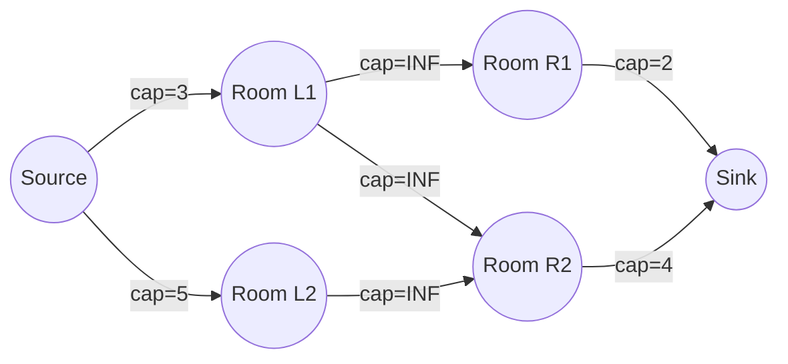
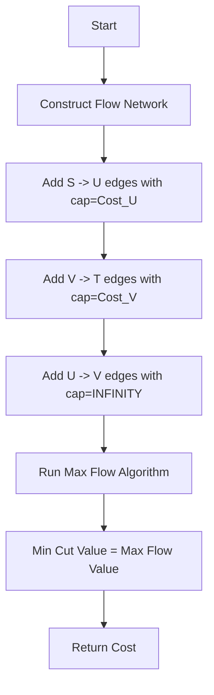

# AGR-010: Minimum Cost Vertex Cover in Bipartite Graph

## 📋 Problem Summary

Given a bipartite graph where each node has a **cost**, find a subset of vertices with the **minimum total cost** such that **every edge** in the graph is connected to at least one selected vertex.

## 🌍 Real-World Scenario

**Scenario Title:** The Museum Security Dilemma 🏛️

### The Problem
You are the Head of Security for a new art gallery.
-   **Layout:** Two wings of rooms (Left Wing and Right Wing).
-   **Corridors (Edges):** Connect a room in the Left Wing to a room in the Right Wing.
-   **Goal:** Secure every corridor using CCTV cameras.
-   **Constraint:** A camera placed in a room can monitor *all* corridors connected to that room.
-   **Cost:** Installing a camera in Room $i$ costs $W_i$ (depending on room size/wiring).
-   **Objective:** Select the cheapest set of rooms to install cameras such that every single corridor is watched by at least one camera.

### Why This Matters
-   **Facility Management:** optimize coverage with minimal equipment.
-   **Network Security:** Place firewalls on specific nodes to filter traffic on all links.


### From Real World to Algorithm
This is the **Minimum Weighted Vertex Cover** problem. For general graphs, it is NP-Hard. But for **Bipartite Graphs**, we can solve it efficiently using **Min-Cut Max-Flow**.

## Detailed Explanation

### ASCII Diagram: Concept Visualization

**Flow Network Construction:**

-   **Source Edges:** Cost of selecting a Left Room. Breaking `S->L` means we "pay" for L (Select L).
-   **Sink Edges:** Cost of selecting a Right Room. Breaking `R->T` means we "pay" for R (Select R).
-   **Middle Edges:** `L->R` capacity is **Infinity**. You *cannot* break this link.
-   **The Min Cut Logic:** To stop flow from S to T on path `S -> L -> R -> T`, you MUST cut either `S->L` (Select L) or `R->T` (Select R). You cannot cut `L->R`. This enforces the Vertex Cover property: for every edge `(u, v)`, either `u` or `v` (or both) must be selected.

### Algorithm Flow Diagram: Min-Cut



## 🎯 Edge Cases to Test

1.  **Zero Cost**
    -   Input: A node with cost 0.
    -   Expected: It should definitely be picked if it covers any edges (free coverage).
2.  **Star Graph centered at L0**
    -   Input: `L0` connected to `R0..R99`. `Cost(L0) < Sum(Cost(R))`.
    -   Expected: Pick `L0`.
3.  **Disconnected Graph**
    -   Input: Multiple independent edges.
    -   Expected: Sum of min(Cost U, Cost V) for each edge.
4.  **No Edges**
    -   Expected: 0 cost.

## ✅ Input/Output Clarifications
-   **Weights**: Can be huge ($10^{15}$), use 64-bit integers (`long long`, `BigInt`).
-   **Infinity**: Must be strictly larger than the sum of all weights to ensure an `INF` edge is never part of the Min-Cut. Use `1e18` or `sum(all weights) + 1`.
-   **Output**: Just the single integer representing total cost.

## Naive Approach

### Intuition
Try every subset of vertices. Check if it's a cover. Take min cost.

### Complexity Visualization
| Approach | Time Complexity | Feasibility ($N=50$) |
|:---------|:---------------:|:----------------------:|
| Brute Force ($2^N$) | $O(2^N \cdot M)$ | $10^{15}$ ops (TLE ❌) |
| Min-Cut (Dinic) | $O(E\sqrt{V})$ | $\approx 10^5$ ops (Pass ✅) |

## Optimal Approach (Min-Cut / Max-Flow)

### Key Insight
The Minimum Cut in this constructed graph partitions the vertices into two sets ($S$-side and $T$-side).
-   If `S->U` is cut, `U` is on $T$-side. We pay `cap(S->U)`.
-   If `V->T` is cut, `V` is on $S$-side. We pay `cap(V->T)`.
-   Since `U->V` is infinite, it's never cut. So we can't have `U` on $S$-side and `V` on $T$-side simultaneously (path `S->U->V->T` would exist).
-   This forces the Vertex Cover constraint.

### Time Complexity
-   **O(E * sqrt(V))**: Standard for Dinic on bipartite matching-like graphs.

### Space Complexity
-   **O(V + E)**: Flow network.

## Implementations

### Java
```java
import java.util.*;

class Solution {
    static class Edge {
        int to;
        int rev;
        long cap;
        long flow;
        Edge(int to, int rev, long cap) {
            this.to = to;
            this.rev = rev;
            this.cap = cap;
            this.flow = 0;
        }
    }

    private List<List<Edge>> adj;
    private int[] level;
    private int[] ptr;
    private int N;
    private final long INF_CAP = 1_000_000_000_000_000_000L; // 1e18

    public long minVertexCoverCost(int nU, int nV, long[] wU, long[] wV, int[][] edges) {
        int S = 0;
        int T = nU + nV + 1;
        N = T + 1;
        adj = new ArrayList<>();
        for (int i = 0; i < N; i++) adj.add(new ArrayList<>());

        // S -> U with capacity = cost of U
        for (int i = 0; i < nU; i++) {
            addEdge(S, i + 1, wU[i]);
        }

        // V -> T with capacity = cost of V
        for (int i = 0; i < nV; i++) {
            addEdge(nU + 1 + i, T, wV[i]);
        }

        // U -> V with capacity = Infinity
        for (int[] e : edges) {
            int u = e[0] + 1;
            int v = nU + 1 + e[1];
            addEdge(u, v, INF_CAP);
        }

        return dinic(S, T);
    }

    private void addEdge(int from, int to, long cap) {
        Edge a = new Edge(to, adj.get(to).size(), cap);
        Edge b = new Edge(from, adj.get(from).size(), 0);
        adj.get(from).add(a);
        adj.get(to).add(b);
    }

    private boolean bfs(int s, int t) {
        level = new int[N];
        Arrays.fill(level, -1);
        level[s] = 0;
        Queue<Integer> q = new ArrayDeque<>();
        q.add(s);
        while (!q.isEmpty()) {
            int u = q.poll();
            for (Edge e : adj.get(u)) {
                if (e.cap - e.flow > 0 && level[e.to] == -1) {
                    level[e.to] = level[u] + 1;
                    q.add(e.to);
                }
            }
        }
        return level[t] != -1;
    }

    private long dfs(int u, int t, long pushed) {
        if (pushed == 0) return 0;
        if (u == t) return pushed;
        for (; ptr[u] < adj.get(u).size(); ptr[u]++) {
            Edge e = adj.get(u).get(ptr[u]);
            if (level[u] + 1 != level[e.to] || e.cap - e.flow == 0) continue;
            long tr = dfs(e.to, t, Math.min(pushed, e.cap - e.flow));
            if (tr == 0) continue;
            e.flow += tr;
            adj.get(e.to).get(e.rev).flow -= tr;
            return tr;
        }
        return 0;
    }

    private long dinic(int s, int t) {
        long flow = 0;
        while (bfs(s, t)) {
            ptr = new int[N];
            while (true) {
                long pushed = dfs(s, t, Long.MAX_VALUE);
                if (pushed == 0) break;
                flow += pushed;
            }
        }
        return flow;
    }
}
```

### Python
```python
import sys

# Standard recursion limit for deep DFS in flow
sys.setrecursionlimit(300000)

class Dinic:
    def __init__(self, n):
        self.n = n
        self.graph = [[] for _ in range(n)]
        self.level = []

    def add_edge(self, u, v, capacity):
        self.graph[u].append([v, capacity, len(self.graph[v])])
        self.graph[v].append([u, 0, len(self.graph[u]) - 1])

    def bfs(self, s, t):
        self.level = [-1] * self.n
        self.level[s] = 0
        queue = [s]
        while queue:
            u = queue.pop(0)
            for v, cap, rev in self.graph[u]:
                if cap > 0 and self.level[v] < 0:
                    self.level[v] = self.level[u] + 1
                    queue.append(v)
        return self.level[t] >= 0

    def dfs(self, u, t, flow, ptr):
        if u == t or flow == 0:
            return flow
        for i in range(ptr[u], len(self.graph[u])):
            ptr[u] = i
            v, cap, rev = self.graph[u][i]
            if self.level[v] == self.level[u] + 1 and cap > 0:
                pushed = self.dfs(v, t, min(flow, cap), ptr)
                if pushed > 0:
                    self.graph[u][i][1] -= pushed
                    self.graph[v][rev][1] += pushed
                    return pushed
        return 0

    def max_flow(self, s, t):
        max_f = 0
        while self.bfs(s, t):
            ptr = [0] * self.n
            while True:
                pushed = self.dfs(s, t, float('inf'), ptr)
                if pushed == 0:
                    break
                max_f += pushed
        return max_f

def min_vertex_cover_cost(nU: int, nV: int, wU: list[int], wV: list[int], edges: list[tuple[int, int]]) -> int:
    S = 0
    T = nU + nV + 1
    dinic = Dinic(T + 1)
    INF = 10**18
    
    for i, w in enumerate(wU):
        dinic.add_edge(S, i + 1, w)
        
    for i, w in enumerate(wV):
        dinic.add_edge(nU + 1 + i, T, w)
        
    for u, v in edges:
        dinic.add_edge(u + 1, nU + 1 + v, INF)
        
    return dinic.max_flow(S, T)
```

### C++
```cpp
#include <iostream>
#include <vector>
#include <queue>
#include <algorithm>

using namespace std;

const long long INF = 1e18;

struct Edge {
    int to;
    long long cap;
    long long flow;
    int rev;
};

class Dinic {
    int n;
    vector<vector<Edge>> adj;
    vector<int> level;
    vector<int> ptr;

public:
    Dinic(int n) : n(n), adj(n), level(n), ptr(n) {}

    void addEdge(int from, int to, long long cap) {
        Edge a = {to, cap, 0, (int)adj[to].size()};
        Edge b = {from, 0, 0, (int)adj[from].size()};
        adj[from].push_back(a);
        adj[to].push_back(b);
    }

    bool bfs(int s, int t) {
        fill(level.begin(), level.end(), -1);
        level[s] = 0;
        queue<int> q;
        q.push(s);
        while (!q.empty()) {
            int u = q.front();
            q.pop();
            for (const auto& e : adj[u]) {
                if (e.cap - e.flow > 0 && level[e.to] == -1) {
                    level[e.to] = level[u] + 1;
                    q.push(e.to);
                }
            }
        }
        return level[t] != -1;
    }

    long long dfs(int u, int t, long long pushed) {
        if (pushed == 0) return 0;
        if (u == t) return pushed;
        for (int& cid = ptr[u]; cid < adj[u].size(); ++cid) {
            auto& e = adj[u][cid];
            int tr = e.to;
            if (level[u] + 1 != level[tr] || e.cap - e.flow == 0) continue;
            long long push = dfs(tr, t, min(pushed, e.cap - e.flow));
            if (push == 0) continue;
            e.flow += push;
            adj[tr][e.rev].flow -= push;
            return push;
        }
        return 0;
    }

    long long maxFlow(int s, int t) {
        long long flow = 0;
        while (bfs(s, t)) {
            fill(ptr.begin(), ptr.end(), 0);
            while (long long pushed = dfs(s, t, INF)) {
                flow += pushed;
            }
        }
        return flow;
    }
};

class Solution {
public:
    long long minVertexCoverCost(int nU, int nV, const vector<long long>& wU,
                                 const vector<long long>& wV, const vector<pair<int, int>>& edges) {
        int S = 0;
        int T = nU + nV + 1;
        Dinic dinic(T + 1);

        for (int i = 0; i < nU; i++) {
            dinic.addEdge(S, i + 1, wU[i]);
        }
        for (int i = 0; i < nV; i++) {
            dinic.addEdge(nU + 1 + i, T, wV[i]);
        }
        for (const auto& e : edges) {
            dinic.addEdge(e.first + 1, nU + 1 + e.second, INF);
        }

        return dinic.maxFlow(S, T);
    }
};

int main() {
    ios::sync_with_stdio(false);
    cin.tie(nullptr);

    int nU, nV, m;
    if (!(cin >> nU >> nV >> m)) return 0;
    vector<long long> wU(nU), wV(nV);
    for (int i = 0; i < nU; i++) cin >> wU[i];
    for (int i = 0; i < nV; i++) cin >> wV[i];
    vector<pair<int, int>> edges(m);
    for (int i = 0; i < m; i++) {
        cin >> edges[i].first >> edges[i].second;
    }

    Solution solution;
    cout << solution.minVertexCoverCost(nU, nV, wU, wV, edges) << "\n";
    return 0;
}
```

### JavaScript
```javascript
const readline = require("readline");

class Dinic {
  constructor(n) {
    this.n = n;
    this.graph = Array.from({ length: n }, () => []);
    this.level = new Int32Array(n);
  }

  addEdge(u, v, cap) {
    this.graph[u].push({ to: v, cap: BigInt(cap), flow: 0n, rev: this.graph[v].length });
    this.graph[v].push({ to: u, cap: 0n, flow: 0n, rev: this.graph[u].length - 1 });
  }

  bfs(s, t) {
    this.level.fill(-1);
    this.level[s] = 0;
    const queue = [s];
    let head = 0;
    while (head < queue.length) {
      const u = queue[head++];
      for (const edge of this.graph[u]) {
        if (edge.cap - edge.flow > 0n && this.level[edge.to] === -1) {
          this.level[edge.to] = this.level[u] + 1;
          queue.push(edge.to);
        }
      }
    }
    return this.level[t] !== -1;
  }

  dfs(u, t, pushed, ptr) {
    if (pushed === 0n || u === t) return pushed;
    for (let i = ptr[u]; i < this.graph[u].length; i++) {
      ptr[u] = i;
      const edge = this.graph[u][i];
      if (this.level[u] + 1 !== this.level[edge.to] || edge.cap - edge.flow === 0n) continue;
      
      let tr = pushed < (edge.cap - edge.flow) ? pushed : (edge.cap - edge.flow);
      const push = this.dfs(edge.to, t, tr, ptr);
      
      if (push === 0n) continue;
      
      edge.flow += push;
      this.graph[edge.to][edge.rev].flow -= push;
      return push;
    }
    return 0n;
  }

  maxFlow(s, t) {
    let flow = 0n;
    while (this.bfs(s, t)) {
      const ptr = new Int32Array(this.n).fill(0);
      while (true) {
        const pushed = this.dfs(s, t, 1000000000000000000n, ptr);
        if (pushed === 0n) break;
        flow += pushed;
      }
    }
    return flow;
  }
}

class Solution {
  minVertexCoverCost(nU, nV, wU, wV, edges) {
    const S = 0;
    const T = nU + nV + 1;
    const dinic = new Dinic(T + 1);
    const INF = 1000000000000000000n; // 1e18

    for (let i = 0; i < nU; i++) {
      dinic.addEdge(S, i + 1, wU[i]);
    }
    for (let i = 0; i < nV; i++) {
      dinic.addEdge(nU + 1 + i, T, wV[i]);
    }
    for (const [u, v] of edges) {
      dinic.addEdge(u + 1, nU + 1 + v, INF);
    }

    return dinic.maxFlow(S, T);
  }
}

const rl = readline.createInterface({
  input: process.stdin,
  output: process.stdout,
});

let data = [];
rl.on("line", (line) => { const parts = line.trim().split(/\s+/); for (const p of parts) if (p) data.push(p); });
rl.on("close", () => {
  if (data.length === 0) return;
  
  let idx = 0;
  const nU = parseInt(data[idx++], 10);
  const nV = parseInt(data[idx++], 10);
  const m = parseInt(data[idx++], 10);
  const wU = [];
  const wV = [];
  for (let i = 0; i < nU; i++) wU.push(parseInt(data[idx++], 10));
  for (let i = 0; i < nV; i++) wV.push(parseInt(data[idx++], 10));
  const edges = [];
  for (let i = 0; i < m; i++) {
    const u = parseInt(data[idx++], 10);
    const v = parseInt(data[idx++], 10);
    edges.push([u, v]);
  }

  const solution = new Solution();
  console.log(solution.minVertexCoverCost(nU, nV, wU, wV, edges).toString());
});
```

## 🧪 Test Case Walkthrough (Dry Run)

### Input
```
2 2 3
10 10
5 5
0 0
0 1
1 0
```
-   `U` costs: 10, 10. `V` costs: 5, 5.
-   Edges: `(0,0), (0,1), (1,0)`.
-   Edges form a connected component `{U0, U1, V0, V1}` (actually U1 connected to V0, etc).
-   Let's see: `U0` connected to `V0, V1`. `U1` connected to `V0`. `V1` connected to `U0`.
-   **Greedy?** Picking `V0` (cost 5) covers `(0,0)` and `(1,0)`. Left with `(0,1)`. Pick `V1` (cost 5). Total 10.
-   **Alternative:** Pick `U0` (10). Covers `(0,0), (0,1)`. Left `(1,0)`. Pick `U1` (10) or `V0` (5). Total 15.
-   **Min:** 10.

### Max Flow Trace
1.  **Nodes:** `S, U0, U1, V0, V1, T`.
2.  **Caps:** `S->U`=10. `V->T`=5. `U->V`=INF.
3.  **Path 1**: `S -> U0 -> V0 -> T`. Bottleneck `min(10, INF, 5) = 5`.
    -   Flow += 5. `V0->T` saturated (cut).
4.  **Path 2**: `S -> U0 -> V1 -> T`. Bottleneck `min(10-5, INF, 5) = 5`.
    -   Wait, `S->U0` had 5 remaining. `V1->T` has 5.
    -   Flow += 5. `V1->T` saturated (cut).
5.  **Path 3**: `S -> U1 -> V0 (full)`. No path.
6.  **Total Flow**: 10.
7.  **Cuts**: `V0->T` and `V1->T`. Corresponds to selecting sets `V0` and `V1`. Total Cost 10.
8.  **Correct.**

## ✅ Proof of Correctness

The Min-Cut Max-Flow Theorem states that the max flow value equals the capacity of the minimum cut.
In our graph:
-   Any cut with finite capacity MUST separate S from T without cutting any INF edges.
-   This corresponds to a valid Vertex Cover.
-   Since Min-Cut finds the minimum capacity among all valid cuts, it finds the Minimum Cost Vertex Cover.

## ⚠️ Common Mistakes to Avoid

1.  **Infinite Edges**: Do NOT make infinite edges bi-directional. It's strictly `L -> R`.
2.  **Weight Scale**: If costs are small integers, `int` is fine. If costs can sum to $>2^{31}-1$, use `long`.
3.  **Graph Construction**: Remember `Offset`. Left nodes `1..nU`. Right nodes `nU+1..nU+nV`.

## 💡 Interview Extensions

1.  **Weighted Independent Set**: Solve using `Total Weight - Min Vertex Cover`.
2.  **Unweighted Case**: Kőnig's theorem. Min Vertex Cover size = Max Matching size. This is a special case where all weights are 1.
3.  **General Graph Vertex Cover**: Discuss that it's NP-Complete and requires approximation algorithms (2-approximation is easy: take both endpoints of every edge in maximal matching).

## Related Concepts
-   **Project Selection Problem**: Max Flow Min Cut application with profits and dependencies.
-   **Closure Problem**: Maximum Weight Closure graph.
