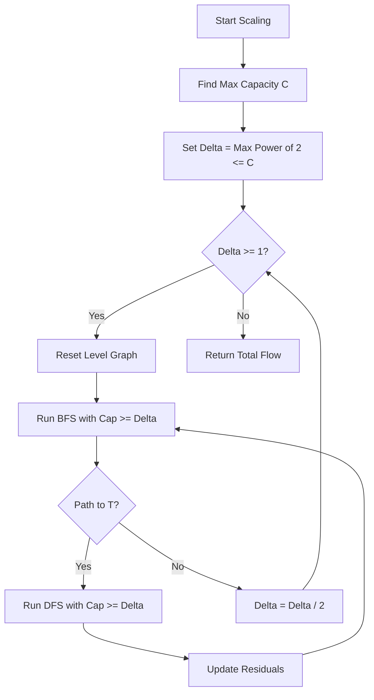

# AGR-011: Dinic With Scaling

## 📋 Problem Summary

Compute the **Maximum Flow** in a directed graph where edge capacities can be extremely large (`10^9` or more). Use **Capacity Scaling** to optimize Dinic's Algorithm.

## 🌍 Real-World Scenario

**Scenario Title:** The Campus 4K Streaming Crisis 📺

### The Problem
It's the World Cup Final. The entire campus wants to stream the match in 4K.
-   **Network:** A mesh of fiber optic cables (100 Gbps) and old copper wires (10 Mbps).
-   **Goal:** Route as much data as possible from the ISP Gateway (Source) to the Student Center (Sink).
-   **Issue:** Standard flow algorithms (like Edmonds-Karp or basic Dinic) might get "distracted" pushing 1 Mbps flows through small wires, constantly updating residuals, while the massive 100 Gbps trunk lines sit idle. This is inefficient.
-   **Solution:** Prioritize! First, fill the massive 100 Gbps "pipes". Once those are full, bother with the 10 Gbps lines, and finally the 10 Mbps trickles. This is **Capacity Scaling**.


### From Real World to Algorithm
We use **Dinic's Algorithm**, but with a twist: we only push flow through edges that have a residual capacity $\ge \Delta$. We start with a huge $\Delta$ and halve it repeatedly.

## Detailed Explanation

### ASCII Diagram: Concept Visualization

**Graph Setup:**
```
      (100)
  S ---------> A
  |            |
  | (1)        | (100)
  v            v
  B ---------> T
      (100)
```
-   **Delta = 64:**
    -   Edges with Cap $\ge$ 64: `S->A` (100), `A->T` (100), `B->T` (100).
    -   Edge `S->B` (1) is **hidden**.
    -   Path found: `S->A->T`. Push 100 units.
    -   `S->A` and `A->T` become saturated (0 residual).
-   **Delta = 32, 16, ..., 2:**
    -   No paths found (since `S->B` is still hidden).
-   **Delta = 1:**
    -   Edge `S->B` (1) becomes visible.
    -   Path: `S->B->T`? `B->T` has 100 remaining. Yes!
    -   Push 1 unit.
-   **Total Flow:** 101.
-   **Benefit:** We routed the bulk (100) in one go, without checking the tiny edge `S->B` initially. In complex graphs, this avoids fragmented "zig-zag" augmentations.

### Algorithm Flow Diagram: Scaling Dinic



## 🎯 Edge Cases to Test

1.  **Huge Disparity:** `S->A` (10^9), `A->T` (1), `S->B` (1), `B->T` (10^9). Scaling helps focus.
2.  **All Same Standard:** If all caps are 1, scaling just runs once with Delta=1. Should act like normal Dinic.
3.  **Disconnected:** Max flow 0.
4.  **Single Path:** `S->A->B->T`.

## ✅ Input/Output Clarifications
-   **Capacities**: Up to $10^9$, fitting in standard Integer, but intermediate flow requires `long` (64-bit).
-   **Nodes**: 0 to N-1.
-   **Delta Logic**: Iterate $\Delta$ via powers of 2. `1 << 30`, `1 << 29` ... down to `1`.

## Naive Approach

### Intuition
Standard Edmonds-Karp (BFS) or Dinic without scaling.

### Complexity Visualization
| Approach | Time Complexity | Note |
|:---------|:---------------:|:----------------------:|
| Edmonds-Karp | $O(V E^2)$ | Can be slow if E=1000, V=1000. |
| Standard Dinic | $O(V^2 E)$ | Worst case $O(V^2 E)$ is rarely hit but possible. |
| Scaling Dinic | $O(E^2 \log C)$ | **Robust**. Performance depends on log(Cap), not flow value. |

## Optimal Approach (Dinic + Scaling)

### Key Insight
By maintaining an invariant that we only use edges with large residual capacity, we limit the number of augmentations.
-   In the $\Delta$-phase, each augmentation carries at least $\Delta$ flow.
-   The number of augmentations per phase is bounded by $O(E)$.
-   Total phases: $\log_2(\text{MaxCap})$.

### Time Complexity
-   **O(E^2 log C)**: Where $C$ is max capacity. This makes it a "weakly polynomial" algorithm, but extremely fast for practical inputs with high capacities.

### Space Complexity
-   **O(V + E)**: Graph storage.

## Implementations

### Java
```java
import java.util.*;

class Solution {
    static class Edge {
        int to;
        int rev;
        long cap;
        long flow;
        Edge(int to, int rev, long cap) {
            this.to = to;
            this.rev = rev;
            this.cap = cap;
            this.flow = 0;
        }
    }

    private List<List<Edge>> adj;
    private int[] level;
    private int[] ptr;
    private int N;

    public long maxFlow(int n, int s, int t, int[][] edges) {
        N = n;
        adj = new ArrayList<>();
        for (int i = 0; i < n; i++) adj.add(new ArrayList<>());

        long maxCap = 0;
        for (int[] e : edges) {
            addEdge(e[0], e[1], e[2]);
            maxCap = Math.max(maxCap, e[2]);
        }

        long flow = 0;
        long delta = 1;
        while (delta * 2 <= maxCap) delta *= 2;

        for (; delta >= 1; delta /= 2) {
            while (bfs(s, t, delta)) {
                ptr = new int[N];
                while (true) {
                    long pushed = dfs(s, t, Long.MAX_VALUE, delta);
                    if (pushed == 0) break;
                    flow += pushed;
                }
            }
        }

        return flow;
    }

    private void addEdge(int from, int to, long cap) {
        Edge a = new Edge(to, adj.get(to).size(), cap);
        Edge b = new Edge(from, adj.get(from).size(), 0);
        adj.get(from).add(a);
        adj.get(to).add(b);
    }

    private boolean bfs(int s, int t, long delta) {
        level = new int[N];
        Arrays.fill(level, -1);
        level[s] = 0;
        Queue<Integer> q = new ArrayDeque<>();
        q.add(s);
        while (!q.isEmpty()) {
            int u = q.poll();
            for (Edge e : adj.get(u)) {
                // Scaling condition: check capacity >= delta
                if (e.cap - e.flow >= delta && level[e.to] == -1) {
                    level[e.to] = level[u] + 1;
                    q.add(e.to);
                }
            }
        }
        return level[t] != -1;
    }

    private long dfs(int u, int t, long pushed, long delta) {
        if (pushed == 0) return 0;
        if (u == t) return pushed;
        for (; ptr[u] < adj.get(u).size(); ptr[u]++) {
            Edge e = adj.get(u).get(ptr[u]);
            if (level[u] + 1 != level[e.to] || e.cap - e.flow < delta) continue;
            long tr = dfs(e.to, t, Math.min(pushed, e.cap - e.flow), delta);
            if (tr == 0) continue;
            e.flow += tr;
            adj.get(e.to).get(e.rev).flow -= tr;
            return tr;
        }
        return 0;
    }
}
```

### Python
```python
import sys

# Increase recursion depth for deep graphs
sys.setrecursionlimit(300000)

class Dinic:
    def __init__(self, n):
        self.n = n
        self.graph = [[] for _ in range(n)]
        self.level = []

    def add_edge(self, u, v, capacity):
        self.graph[u].append([v, capacity, len(self.graph[v])])
        self.graph[v].append([u, 0, len(self.graph[u]) - 1])

    def bfs(self, s, t, delta):
        self.level = [-1] * self.n
        self.level[s] = 0
        queue = [s]
        while queue:
            u = queue.pop(0)
            for v, cap, rev in self.graph[u]:
                # Scaling check
                if cap >= delta and self.level[v] < 0:
                    self.level[v] = self.level[u] + 1
                    queue.append(v)
        return self.level[t] >= 0

    def dfs(self, u, t, flow, ptr, delta):
        if u == t or flow == 0:
            return flow
        for i in range(ptr[u], len(self.graph[u])):
            ptr[u] = i
            v, cap, rev = self.graph[u][i]
            # Scaling check
            if self.level[v] == self.level[u] + 1 and cap >= delta:
                pushed = self.dfs(v, t, min(flow, cap), ptr, delta)
                if pushed > 0:
                    self.graph[u][i][1] -= pushed
                    self.graph[v][rev][1] += pushed
                    return pushed
        return 0

    def max_flow(self, s, t):
        max_cap = 0
        for u in range(self.n):
            for v, cap, rev in self.graph[u]:
                max_cap = max(max_cap, cap)
        
        delta = 1
        while delta * 2 <= max_cap:
            delta *= 2
            
        max_f = 0
        while delta >= 1:
            while self.bfs(s, t, delta):
                ptr = [0] * self.n
                while True:
                    pushed = self.dfs(s, t, float('inf'), ptr, delta)
                    if pushed == 0:
                        break
                    max_f += pushed
            delta //= 2
        return max_f

def max_flow(n: int, s: int, t: int, edges: list[tuple[int, int, int]]) -> int:
    dinic = Dinic(n)
    for u, v, c in edges:
        dinic.add_edge(u, v, c)
    return dinic.max_flow(s, t)
```

### C++
```cpp
#include <array>
#include <iostream>
#include <vector>
#include <queue>
#include <algorithm>

using namespace std;

const long long INF = 1e18;

struct Edge {
    int to;
    long long cap;
    long long flow;
    int rev;
};

class Dinic {
    int n;
    vector<vector<Edge>> adj;
    vector<int> level;
    vector<int> ptr;

public:
    Dinic(int n) : n(n), adj(n), level(n), ptr(n) {}

    void addEdge(int from, int to, long long cap) {
        Edge a = {to, cap, 0, (int)adj[to].size()};
        Edge b = {from, 0, 0, (int)adj[from].size()};
        adj[from].push_back(a);
        adj[to].push_back(b);
    }

    bool bfs(int s, int t, long long delta) {
        fill(level.begin(), level.end(), -1);
        level[s] = 0;
        queue<int> q;
        q.push(s);
        while (!q.empty()) {
            int u = q.front();
            q.pop();
            for (const auto& e : adj[u]) {
                if (e.cap - e.flow >= delta && level[e.to] == -1) {
                    level[e.to] = level[u] + 1;
                    q.push(e.to);
                }
            }
        }
        return level[t] != -1;
    }

    long long dfs(int u, int t, long long pushed, long long delta) {
        if (pushed == 0) return 0;
        if (u == t) return pushed;
        for (int& cid = ptr[u]; cid < adj[u].size(); ++cid) {
            auto& e = adj[u][cid];
            int tr = e.to;
            if (level[u] + 1 != level[tr] || e.cap - e.flow < delta) continue;
            long long push = dfs(tr, t, min(pushed, e.cap - e.flow), delta);
            if (push == 0) continue;
            e.flow += push;
            adj[tr][e.rev].flow -= push;
            return push;
        }
        return 0;
    }

    long long maxFlow(int s, int t) {
        long long maxCap = 0;
        for(const auto& list : adj) {
            for(const auto& e : list) maxCap = max(maxCap, e.cap);
        }
        
        long long delta = 1;
        while (delta * 2 <= maxCap) delta *= 2;

        long long flow = 0;
        for (; delta >= 1; delta /= 2) {
            while (bfs(s, t, delta)) {
                fill(ptr.begin(), ptr.end(), 0);
                while (long long pushed = dfs(s, t, INF, delta)) {
                    flow += pushed;
                }
            }
        }
        return flow;
    }
};

class Solution {
public:
    long long maxFlow(int n, int s, int t, const vector<array<int, 3>>& edges) {
        Dinic dinic(n);
        for (const auto& e : edges) {
            dinic.addEdge(e[0], e[1], e[2]);
        }
        return dinic.maxFlow(s, t);
    }
};

int main() {
    ios::sync_with_stdio(false);
    cin.tie(nullptr);

    int n, m, s, t;
    if (!(cin >> n >> m >> s >> t)) return 0;
    vector<array<int, 3>> edges(m);
    for (int i = 0; i < m; i++) {
        cin >> edges[i][0] >> edges[i][1] >> edges[i][2];
    }

    Solution solution;
    cout << solution.maxFlow(n, s, t, edges) << "\n";
    return 0;
}
```

### JavaScript
```javascript
const readline = require("readline");

class Dinic {
  constructor(n) {
    this.n = n;
    this.graph = Array.from({ length: n }, () => []);
    this.level = new Int32Array(n);
  }

  addEdge(u, v, cap) {
    this.graph[u].push({ to: v, cap: BigInt(cap), flow: 0n, rev: this.graph[v].length });
    this.graph[v].push({ to: u, cap: 0n, flow: 0n, rev: this.graph[u].length - 1 });
  }

  bfs(s, t, delta) {
    this.level.fill(-1);
    this.level[s] = 0;
    const queue = [s];
    let head = 0;
    while (head < queue.length) {
      const u = queue[head++];
      for (const edge of this.graph[u]) {
        if (edge.cap - edge.flow >= delta && this.level[edge.to] === -1) {
          this.level[edge.to] = this.level[u] + 1;
          queue.push(edge.to);
        }
      }
    }
    return this.level[t] !== -1;
  }

  dfs(u, t, pushed, ptr, delta) {
    if (pushed === 0n || u === t) return pushed;
    for (let i = ptr[u]; i < this.graph[u].length; i++) {
      ptr[u] = i;
      const edge = this.graph[u][i];
      if (this.level[u] + 1 !== this.level[edge.to] || edge.cap - edge.flow < delta) continue;
      
      let tr = pushed < (edge.cap - edge.flow) ? pushed : (edge.cap - edge.flow);
      const push = this.dfs(edge.to, t, tr, ptr, delta);
      
      if (push === 0n) continue;
      
      edge.flow += push;
      this.graph[edge.to][edge.rev].flow -= push;
      return push;
    }
    return 0n;
  }

  maxFlow(s, t) {
    let maxCap = 0n;
    for (const list of this.graph) {
        for (const e of list) {
            if (e.cap > maxCap) maxCap = e.cap;
        }
    }
      
    let delta = 1n;
    while (delta * 2n <= maxCap) delta *= 2n;
      
    let flow = 0n;
    while (delta >= 1n) {
        while (this.bfs(s, t, delta)) {
          const ptr = new Int32Array(this.n).fill(0);
          while (true) {
            const pushed = this.dfs(s, t, 1000000000000000000n, ptr, delta);
            if (pushed === 0n) break;
            flow += pushed;
          }
        }
        delta /= 2n;
    }
    return flow;
  }
}

class Solution {
  maxFlow(n, s, t, edges) {
    const dinic = new Dinic(n);
    for (const [u, v, c] of edges) {
      dinic.addEdge(u, v, c);
    }
    return dinic.maxFlow(s, t);
  }
}

const rl = readline.createInterface({
  input: process.stdin,
  output: process.stdout,
});

let data = [];
rl.on("line", (line) => { const parts = line.trim().split(/\s+/); for (const p of parts) if (p) data.push(p); });
rl.on("close", () => {
  if (data.length === 0) return;
  
  let idx = 0;
  const n = parseInt(data[idx++], 10);
  const m = parseInt(data[idx++], 10);
  const s = parseInt(data[idx++], 10);
  const t = parseInt(data[idx++], 10);
  const edges = [];
  for (let i = 0; i < m; i++) {
    const u = parseInt(data[idx++], 10);
    const v = parseInt(data[idx++], 10);
    const c = parseInt(data[idx++], 10);
    edges.push([u, v, c]);
  }

  const solution = new Solution();
  console.log(solution.maxFlow(n, s, t, edges).toString());
});
```

## 🧪 Test Case Walkthrough (Dry Run)

### Input
```
4 4 0 3
0 1 10
0 2 5
1 3 7
2 3 8
```
-   Max Cap = 10. `delta` starts at 8.

### Trace
1.  **Delta = 8**:
    -   Edges visible: `0->1` (10), `2->3` (8).
    -   BFS: `0->1` visited. `1->3` (cap 7 < 8) ignored. `0->2` (cap 5 < 8) ignored.
    -   T (3) not reached. Flow = 0.
2.  **Delta = 4**:
    -   Edges visible: All (5, 7, 8, 10 >= 4).
    -   BFS: `0->1->3`, `0->2->3`.
    -   DFS `0->1->3`: Bottleneck `min(10, 7) = 7`. Flow += 7. Residuals: `0->1`: 3, `1->3`: 0.
    -   DFS `0->2->3`: Bottleneck `min(5, 8) = 5`. Flow += 5. Residuals: `0->2`: 0, `2->3`: 3.
    -   Total Flow = 12.
3.  **Delta = 2**:
    -   Residuals: `0->1`(3), `1->3`(0), `0->2`(0), `2->3`(3).
    -   No path to T.
4.  **Delta = 1**:
    -   No path.

**Result:** 12. Correct.

## ✅ Proof of Correctness
The algorithm is essentially running Dinic's multiple times.
1.  **Correctness:** In the final phase ($\Delta=1$), we consider all edges with residual capacity $\ge 1$. Since all input capacities are integers, the flow found is the exact Maximum Flow.
2.  **Efficiency:** The early phases push "easy" large flows, reducing the complexity of the residual graph for later phases.

## ⚠️ Common Mistakes to Avoid

1.  **Skipping Delta=1:** Always ensure the loop runs down to `delta=1` to catch the final "dregs" of flow.
2.  **Updating Capacities:** Don't modify original capacities permanently if you are reusing the graph. Use `flow` variables.
3.  **Recursion Depth:** Python recursion limit applies.

## 💡 Interview Extensions

1.  **Blocking Flow:** What is it? A flow that saturates at least one edge in every path from S to T in the Level Graph. Dinic finds a blocking flow in each phase.
2.  **Unit Capacity Networks:** On simple bipartite matching (unit caps), Dinic is $O(E\sqrt{V})$ even without scaling.
3.  **Real-World Max Flow:** Min-Cut is used in Image Segmentation (Foreground/Background separation).
