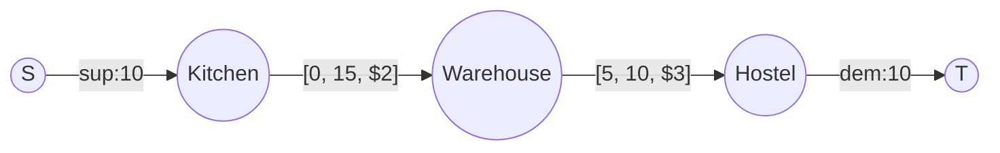
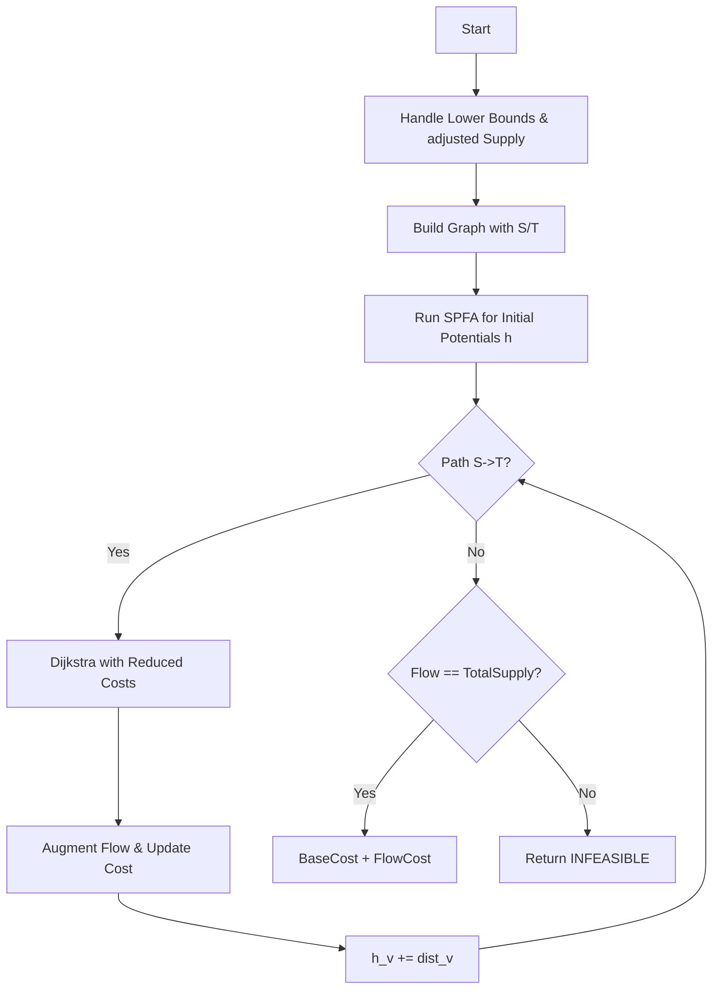

# AGR-012: Minimum-Cost Flow With Demands

## 📋 Problem Summary

Find a flow in a network that satisfies:
1.  **Node Demands:** Supply/Demand `b[i]` for each node.
2.  **Edge Constraints:** Each edge has `[lower, upper]` capacity.
3.  **Objective:** Minimize total cost of flow while satisfying all constraints.

## 🌍 Real-World Scenario

**Scenario Title:** The Hostel Food Supply Chain 🚚

### The Problem
You manage the food distribution for a university with multiple messes.
-   **Nodes:**
    -   **Central Kitchens:** High Supply (`b[i] > 0`).
    -   **Hostel Messes:** Demand (`b[i] < 0`).
    -   **Warehouses:** Intermediate (`b[i] = 0`).
-   **Edges:** Delivery routes.
-   **Constraints:**
    -   **Truck Limit (Upper):** A route can handle max `High` tons.
    -   **Contract (Lower):** A trucking company requires a minimum guarantee of `Low` tons to operate.
    -   **Cost:** Each ton costs `Cost` dollars to transport.
-   **Goal:** Feed every hostel (satisfy demand) from kitchens (using supply) at minimum shipping cost.


### From Real World to Algorithm
This is the **Minimum Cost Flow with Demands and Lower Bounds** problem. It requires transforming the graph to handle lower bounds and node imbalances, then solving using **Min-Cost Max-Flow (MCMF)**.

## Detailed Explanation

### ASCII Diagram: Concept Visualization

**1. Lower Bound Transformation:**
Edge `U -> V` with `[L, R, Cost]`:
-   Push `L` flow immediately. Cost += `L * Cost`.
-   **Residual Edge:** `U -> V` with Cap `R - L`, Cost `Cost`.
-   **Balance Adjustment:** `U` loses `L` (so `supply[U] -= L`), `V` gains `L` (so `supply[V] += L`).

**2. Supply/Demand Handling:**
After adjusting for lower bounds:
-   **Super Source (S):** Connect to every node `i` with `supply[i] > 0`. Cap = `supply[i]`, Cost = 0.
-   **Super Sink (T):** Connect every node `i` with `supply[i] < 0`. Cap = `-supply[i]`, Cost = 0.

**Graph Construction:**

*Transformation Logic:*
-   `W -> H` forces 5 flow. Cost `5*3 = 15`. `W` supply `-5`. `H` supply `+5`.
-   Solve MCMF on residual.

### Algorithm Flow Diagram: MCMF with Potentials



## 🎯 Edge Cases to Test

1.  **Infeasible Supply/Demand:** Total Supply != Total Demand.
2.  **Infeasible Lower Bounds:** `Low > High`.
3.  **Disconnected:** Kitchen cannot reach Hostel.
4.  **Negative Costs:** Valid, but requires SPFA/Bellman-Ford initial step.

## ✅ Input/Output Clarifications
-   **Supply Array `b`**: positive = supply, negative = demand.
-   **Feasibility**: Return "INFEASIBLE" if max flow < total positive supply.
-   **Reduced Cost**: `cost` + `h[u]` - `h[v]`. Ensures non-negative weights for Dijkstra.

## Naive Approach
A naive greedy approach (picking cheapest edges) fails because taking a cheap local edge might block a critical path needed to satisfy a demand later, or force usage of an extremely expensive edge elsewhere.

## Optimal Approach (Successive Shortest Path)

### Key Insight
MCMF algorithms iteratively push flow along the **shortest path (min cost path)** in the residual graph.
-   To handle negative edge costs (valid in Min Cost Flow), we use **Potentials** (Johnson's reweighting technique).
-   First run SPFA (fast Bellman-Ford) to get initial potentials. Then run Dijkstra repeatedly.

### Time Complexity
-   **O(F * E log V)** or **O(F * E + V log V)**: `F` augmentations. Each uses Dijkstra.

### Space Complexity
-   **O(V + E)**.

## Implementations

### Java
```java
import java.util.*;

class Solution {
    static class Edge {
        int to;
        int rev;
        long cap;
        long flow;
        long cost;
        Edge(int to, int rev, long cap, long cost) {
            this.to = to;
            this.rev = rev;
            this.cap = cap;
            this.cost = cost;
            this.flow = 0;
        }
    }

    private List<List<Edge>> adj;
    private long[] dist;
    private long[] h;
    private int[] parentNode;
    private int[] parentEdge;
    private int N;
    private final long INF = Long.MAX_VALUE / 2;

    public Long minCostFlow(int n, long[] b, int[][] edges) {
        long baseCost = 0;
        long[] supply = Arrays.copyOf(b, n);
        
        int S = n;
        int T = n + 1;
        N = n + 2;
        adj = new ArrayList<>();
        for (int i = 0; i < N; i++) adj.add(new ArrayList<>());

        for (int[] e : edges) {
            int u = e[0];
            int v = e[1];
            int low = e[2];
            int high = e[3];
            int cost = e[4];

            if (high < low) return null;

            // Handle lower bound by pre-pushing flow
            baseCost += (long) low * cost;
            supply[u] -= low;
            supply[v] += low;

            // Add residual capacity
            addEdge(u, v, high - low, cost);
        }

        long totalSupply = 0;
        for (int i = 0; i < n; i++) {
            if (supply[i] > 0) {
                addEdge(S, i, supply[i], 0);
                totalSupply += supply[i];
            } else if (supply[i] < 0) {
                addEdge(i, T, -supply[i], 0);
            }
        }

        long[] res = mcmf(S, T);
        
        if (res[0] != totalSupply) return null; // Flow didn't meet supply demands

        return baseCost + res[1];
    }

    private void addEdge(int u, int v, long cap, long cost) {
        Edge a = new Edge(v, adj.get(v).size(), cap, cost);
        Edge b = new Edge(u, adj.get(u).size(), 0, -cost);
        adj.get(u).add(a);
        adj.get(v).add(b);
    }

    private long[] mcmf(int s, int t) {
        long flow = 0;
        long cost = 0;
        h = new long[N];
        
        // Use SPFA once to handle potential negative costs
        spfa(s);

        while (dijkstra(s, t)) {
            // Update Potentials
            for (int i = 0; i < N; i++) {
                if (dist[i] != INF) h[i] += dist[i];
            }

            // Augment Flow
            long push = INF;
            int curr = t;
            while (curr != s) {
                int p = parentNode[curr];
                int idx = parentEdge[curr];
                push = Math.min(push, adj.get(p).get(idx).cap - adj.get(p).get(idx).flow);
                curr = p;
            }

            flow += push;
            curr = t;
            while (curr != s) {
                int p = parentNode[curr];
                int idx = parentEdge[curr];
                Edge e = adj.get(p).get(idx);
                e.flow += push;
                adj.get(curr).get(e.rev).flow -= push;
                cost += push * e.cost;
                curr = p;
            }
        }
        return new long[]{flow, cost};
    }

    private boolean spfa(int s) {
        Arrays.fill(h, INF);
        h[s] = 0;
        boolean[] inQueue = new boolean[N];
        Queue<Integer> q = new ArrayDeque<>();
        q.add(s);
        inQueue[s] = true;
        
        while (!q.isEmpty()) {
            int u = q.poll();
            inQueue[u] = false;
            for (Edge e : adj.get(u)) {
                if (e.cap - e.flow > 0 && h[e.to] > h[u] + e.cost) {
                    h[e.to] = h[u] + e.cost;
                    if (!inQueue[e.to]) {
                        q.add(e.to);
                        inQueue[e.to] = true;
                    }
                }
            }
        }
        return h[s] != INF;
    }

    private boolean dijkstra(int s, int t) {
        dist = new long[N];
        Arrays.fill(dist, INF);
        parentNode = new int[N];
        parentEdge = new int[N];
        dist[s] = 0;
        
        PriorityQueue<long[]> pq = new PriorityQueue<>(Comparator.comparingLong(a -> a[0]));
        pq.add(new long[]{0, s});

        while (!pq.isEmpty()) {
            long[] top = pq.poll();
            long d = top[0];
            int u = (int) top[1];

            if (d > dist[u]) continue;

            for (int i = 0; i < adj.get(u).size(); i++) {
                Edge e = adj.get(u).get(i);
                // Reduced cost = cost + h[u] - h[v]
                long reducedCost = e.cost + h[u] - h[e.to];
                if (e.cap - e.flow > 0 && dist[e.to] > dist[u] + reducedCost) {
                    dist[e.to] = dist[u] + reducedCost;
                    parentNode[e.to] = u;
                    parentEdge[e.to] = i;
                    pq.add(new long[]{dist[e.to], e.to});
                }
            }
        }
        return dist[t] != INF;
    }
}
```

### Python
```python
import sys
import heapq

# Standard recursion check
sys.setrecursionlimit(300000)

class MinCostMaxFlow:
    def __init__(self, n):
        self.n = n
        self.graph = [[] for _ in range(n)]
        self.h = [0] * n
        self.INF = 10**18

    def add_edge(self, u, v, cap, cost):
        # Forward: [to, cap, cost, flow, rev_index]
        self.graph[u].append([v, cap, cost, 0, len(self.graph[v])])
        self.graph[v].append([u, 0, -cost, 0, len(self.graph[u]) - 1])

    def spfa(self, s):
        self.h = [self.INF] * self.n
        self.h[s] = 0
        in_queue = [False] * self.n
        queue = [s]
        in_queue[s] = True
        
        while queue:
            u = queue.pop(0)
            in_queue[u] = False
            for v, cap, cost, flow, rev in self.graph[u]:
                if cap - flow > 0 and self.h[v] > self.h[u] + cost:
                    self.h[v] = self.h[u] + cost
                    if not in_queue[v]:
                        queue.append(v)
                        in_queue[v] = True

    def dijkstra(self, s, t):
        dist = [self.INF] * self.n
        parent_node = [-1] * self.n
        parent_edge = [-1] * self.n
        dist[s] = 0
        pq = [(0, s)]
        
        while pq:
            d, u = heapq.heappop(pq)
            if d > dist[u]: continue
            
            for i, (v, cap, cost, flow, rev) in enumerate(self.graph[u]):
                reduced_cost = cost + self.h[u] - self.h[v]
                if cap - flow > 0 and dist[v] > dist[u] + reduced_cost:
                    dist[v] = dist[u] + reduced_cost
                    parent_node[v] = u
                    parent_edge[v] = i
                    heapq.heappush(pq, (dist[v], v))
                    
        return dist, parent_node, parent_edge

    def solve(self, s, t):
        flow = 0
        cost = 0
        self.spfa(s) # Initial potentials
        
        while True:
            dist, parent_node, parent_edge = self.dijkstra(s, t)
            if dist[t] == self.INF: break
                
            # Update potentials
            for i in range(self.n):
                if dist[i] != self.INF:
                    self.h[i] += dist[i]
                    
            # Augment
            push = self.INF
            curr = t
            while curr != s:
                p = parent_node[curr]
                idx = parent_edge[curr]
                edge = self.graph[p][idx]
                push = min(push, edge[1] - edge[3])
                curr = p
                
            flow += push
            curr = t
            while curr != s:
                p = parent_node[curr]
                idx = parent_edge[curr]
                self.graph[p][idx][3] += push
                rev_idx = self.graph[p][idx][4]
                self.graph[curr][rev_idx][3] -= push
                cost += push * self.graph[p][idx][2]
                curr = p
                
        return flow, cost

def min_cost_flow(n: int, b: list[int], edges: list[tuple[int, int, int, int, int]]):
    base_cost = 0
    supply = list(b)
    S = n
    T = n + 1
    mcmf = MinCostMaxFlow(n + 2)
    
    for u, v, low, high, cost in edges:
        if high < low: return None
        base_cost += low * cost
        supply[u] -= low
        supply[v] += low
        mcmf.add_edge(u, v, high - low, cost)
        
    total_supply = 0
    for i in range(n):
        if supply[i] > 0:
            mcmf.add_edge(S, i, supply[i], 0)
            total_supply += supply[i]
        elif supply[i] < 0:
            mcmf.add_edge(i, T, -supply[i], 0)
            
    flow, cost = mcmf.solve(S, T)
    if flow != total_supply: return None
        
    return base_cost + cost
```

### C++
```cpp
#include <iostream>
#include <vector>
#include <queue>
#include <tuple>
#include <array>

using namespace std;

const long long INF = 1e18;

struct Edge {
    int to;
    long long cap;
    long long flow;
    long long cost;
    int rev;
};

class MinCostMaxFlow {
    int n;
    vector<vector<Edge>> adj;
    vector<long long> dist;
    vector<long long> h;
    vector<int> parentNode;
    vector<int> parentEdge;

public:
    MinCostMaxFlow(int n) : n(n), adj(n), dist(n), h(n), parentNode(n), parentEdge(n) {}

    void addEdge(int u, int v, long long cap, long long cost) {
        Edge a = {v, cap, 0, cost, (int)adj[v].size()};
        Edge b = {u, 0, 0, -cost, (int)adj[u].size()};
        adj[u].push_back(a);
        adj[v].push_back(b);
    }

    bool spfa(int s) {
        fill(h.begin(), h.end(), INF);
        h[s] = 0;
        vector<bool> inQueue(n, false);
        queue<int> q;
        q.push(s);
        inQueue[s] = true;

        while (!q.empty()) {
            int u = q.front();
            q.pop();
            inQueue[u] = false;
            for (const auto& e : adj[u]) {
                if (e.cap - e.flow > 0 && h[e.to] > h[u] + e.cost) {
                    h[e.to] = h[u] + e.cost;
                    if (!inQueue[e.to]) {
                        q.push(e.to);
                        inQueue[e.to] = true;
                    }
                }
            }
        }
        return h[s] != INF; // Should check if any reachable
    }

    bool dijkstra(int s, int t) {
        fill(dist.begin(), dist.end(), INF);
        dist[s] = 0;
        priority_queue<pair<long long, int>, vector<pair<long long, int>>, greater<pair<long long, int>>> pq;
        pq.push({0, s});

        while (!pq.empty()) {
            long long d = pq.top().first;
            int u = pq.top().second;
            pq.pop();

            if (d > dist[u]) continue;

            for (int i = 0; i < adj[u].size(); ++i) {
                const auto& e = adj[u][i];
                long long reducedCost = e.cost + h[u] - h[e.to];
                if (e.cap - e.flow > 0 && dist[e.to] > dist[u] + reducedCost) {
                    dist[e.to] = dist[u] + reducedCost;
                    parentNode[e.to] = u;
                    parentEdge[e.to] = i;
                    pq.push({dist[e.to], e.to});
                }
            }
        }
        return dist[t] != INF;
    }

    pair<long long, long long> solve(int s, int t) {
        long long flow = 0;
        long long cost = 0;
        spfa(s); // Init potentials

        while (dijkstra(s, t)) {
            for (int i = 0; i < n; ++i) {
                if (dist[i] != INF) h[i] += dist[i];
            }

            long long push = INF;
            int curr = t;
            while (curr != s) {
                int p = parentNode[curr];
                int idx = parentEdge[curr];
                push = min(push, adj[p][idx].cap - adj[p][idx].flow);
                curr = p;
            }

            flow += push;
            curr = t;
            while (curr != s) {
                int p = parentNode[curr];
                int idx = parentEdge[curr];
                adj[p][idx].flow += push;
                int revIdx = adj[p][idx].rev;
                adj[curr][revIdx].flow -= push;
                cost += push * adj[p][idx].cost;
                curr = p;
            }
        }
        return {flow, cost};
    }
};

class Solution {
public:
    bool minCostFlow(int n, const vector<long long>& b, const vector<array<int, 5>>& edges, long long& costOut) {
        long long baseCost = 0;
        vector<long long> supply = b;
        int S = n;
        int T = n + 1;
        MinCostMaxFlow mcmf(n + 2);

        for (const auto& e : edges) {
            int u = e[0];
            int v = e[1];
            int low = e[2];
            int high = e[3];
            int cost = e[4];

            if (high < low) return false;

            baseCost += (long long)low * cost;
            supply[u] -= low;
            supply[v] += low;
            mcmf.addEdge(u, v, high - low, cost);
        }

        long long totalSupply = 0;
        for (int i = 0; i < n; i++) {
            if (supply[i] > 0) {
                mcmf.addEdge(S, i, supply[i], 0);
                totalSupply += supply[i];
            } else if (supply[i] < 0) {
                mcmf.addEdge(i, T, -supply[i], 0);
            }
        }

        pair<long long, long long> res = mcmf.solve(S, T);
        if (res.first != totalSupply) return false;

        costOut = baseCost + res.second;
        return true;
    }
};

int main() {
    ios::sync_with_stdio(false);
    cin.tie(nullptr);

    int n, m;
    if (!(cin >> n >> m)) return 0;
    vector<long long> b(n);
    for (int i = 0; i < n; i++) cin >> b[i];
    vector<array<int, 5>> edges(m);
    for (int i = 0; i < m; i++) {
        cin >> edges[i][0] >> edges[i][1] >> edges[i][2] >> edges[i][3] >> edges[i][4];
    }

    Solution solution;
    long long cost = 0;
    bool ok = solution.minCostFlow(n, b, edges, cost);
    if (!ok) {
        cout << "INFEASIBLE";
    } else {
        cout << "FEASIBLE\n" << cost;
    }
    return 0;
}
```

### JavaScript
```javascript
const readline = require("readline");

class MinCostMaxFlow {
  constructor(n) {
    this.n = n;
    this.graph = Array.from({ length: n }, () => []);
    this.dist = new Array(n);
    this.h = new Array(n).fill(0);
    this.parentNode = new Int32Array(n);
    this.parentEdge = new Int32Array(n);
    this.INF = 1000000000000000000; // Large number
  }

  addEdge(u, v, cap, cost) {
    this.graph[u].push({ to: v, cap: cap, flow: 0, cost: cost, rev: this.graph[v].length });
    this.graph[v].push({ to: u, cap: 0, flow: 0, cost: -cost, rev: this.graph[u].length - 1 });
  }

  spfa(s) {
    this.h.fill(this.INF);
    this.h[s] = 0;
    const inQueue = new Int8Array(this.n).fill(0);
    const queue = [s];
    inQueue[s] = 1;
    
    let head = 0;
    while (head < queue.length) {
        const u = queue[head++];
        inQueue[u] = 0;
        for (const edge of this.graph[u]) {
            if (edge.cap - edge.flow > 0 && this.h[edge.to] > this.h[u] + edge.cost) {
                this.h[edge.to] = this.h[u] + edge.cost;
                if (!inQueue[edge.to]) {
                    queue.push(edge.to);
                    inQueue[edge.to] = 1;
                }
            }
        }
    }
  }

  dijkstra(s, t) {
    this.dist.fill(this.INF);
    this.dist[s] = 0;
    // Simple priority queue implementation or array scan for O(V^2)
    // Since N=500, O(V^2) is fine.
    const visited = new Int8Array(this.n).fill(0);
    
    for (let i = 0; i < this.n; i++) {
        let u = -1;
        let bestDist = this.INF;
        for (let j = 0; j < this.n; j++) {
            if (!visited[j] && this.dist[j] < bestDist) {
                u = j;
                bestDist = this.dist[j];
            }
        }
        
        if (u === -1 || bestDist === this.INF) break;
        visited[u] = 1;
        
        for (let k = 0; k < this.graph[u].length; k++) {
            const edge = this.graph[u][k];
            const reducedCost = edge.cost + this.h[u] - this.h[edge.to];
            if (edge.cap - edge.flow > 0 && this.dist[edge.to] > this.dist[u] + reducedCost) {
                this.dist[edge.to] = this.dist[u] + reducedCost;
                this.parentNode[edge.to] = u;
                this.parentEdge[edge.to] = k;
            }
        }
    }
    return this.dist[t] !== this.INF;
  }

  solve(s, t) {
    let flow = 0;
    let cost = 0;
    this.spfa(s);

    while (this.dijkstra(s, t)) {
        for (let i = 0; i < this.n; i++) {
            if (this.dist[i] !== this.INF) this.h[i] += this.dist[i];
        }

        let push = this.INF;
        let curr = t;
        while (curr !== s) {
            const p = this.parentNode[curr];
            const idx = this.parentEdge[curr];
            const edge = this.graph[p][idx];
            push = Math.min(push, edge.cap - edge.flow);
            curr = p;
        }

        flow += push;
        curr = t;
        while (curr !== s) {
            const p = this.parentNode[curr];
            const idx = this.parentEdge[curr];
            const edge = this.graph[p][idx];
            edge.flow += push;
            const revIdx = edge.rev;
            this.graph[curr][revIdx].flow -= push;
            cost += push * edge.cost;
            curr = p;
        }
    }
    return [flow, cost];
  }
}

class Solution {
  minCostFlow(n, b, edges) {
    let baseCost = 0;
    const supply = [...b];
    const S = n;
    const T = n + 1;
    const mcmf = new MinCostMaxFlow(n + 2);

    for (const [u, v, low, high, cost] of edges) {
        if (high < low) return null;
        baseCost += low * cost;
        supply[u] -= low;
        supply[v] += low;
        mcmf.addEdge(u, v, high - low, cost);
    }

    let totalSupply = 0;
    for (let i = 0; i < n; i++) {
        if (supply[i] > 0) {
            mcmf.addEdge(S, i, supply[i], 0);
            totalSupply += supply[i];
        } else if (supply[i] < 0) {
            mcmf.addEdge(i, T, -supply[i], 0);
        }
    }

    const [flow, cost] = mcmf.solve(S, T);
    if (flow !== totalSupply) return null;
    return baseCost + cost;
  }
}

const rl = readline.createInterface({
  input: process.stdin,
  output: process.stdout,
});

let data = [];
rl.on("line", (line) => { const parts = line.trim().split(/\s+/); for (const p of parts) if (p) data.push(p); });
rl.on("close", () => {
  if (data.length === 0) return;
  
  let idx = 0;
  const n = parseInt(data[idx++], 10);
  const m = parseInt(data[idx++], 10);
  const b = [];
  for (let i = 0; i < n; i++) b.push(parseInt(data[idx++], 10));
  const edges = [];
  for (let i = 0; i < m; i++) {
    const u = parseInt(data[idx++], 10);
    const v = parseInt(data[idx++], 10);
    const low = parseInt(data[idx++], 10);
    const high = parseInt(data[idx++], 10);
    const cost = parseInt(data[idx++], 10);
    edges.push([u, v, low, high, cost]);
  }

  const solution = new Solution();
  const ans = solution.minCostFlow(n, b, edges);
  if (ans === null) {
    console.log("INFEASIBLE");
  } else {
    console.log("FEASIBLE");
    console.log(ans);
  }
});
```

## 🧪 Test Case Walkthrough (Dry Run)

### Input
```
2 1
5 -5
0 1 2 5 1
```
-   Node 0 supply +5, Node 1 demand -5.
-   Edge 0->1, [2, 5], cost 1.

### Trace
1.  **Lower Bound Handling**:
    -   Push 2 flow `0->1`.
    -   Cost += `2 * 1 = 2`.
    -   Supply 0: `5 - 2 = 3`.
    -   Supply 1: `-5 + 2 = -3`.
    -   Edge `0->1` cap `5-2=3`, cost 1.
2.  **MCMF Setup**:
    -   `S->0` cap 3, cost 0.
    -   `1->T` cap 3, cost 0.
3.  **MCMF Run**:
    -   Path `S->0->1->T` found.
    -   Cap 3, cost `0+1+0=1`.
    -   Push 3. Cost += `3 * 1 = 3`.
4.  **Result**:
    -   Base 2 + MCMF 3 = 5.
    -   Supply satisfied. Feasible.

## ✅ Proof of Correctness
-   **Lower Bounds**: By forcing flow and adjusting residual capacity/supplies, we transform the problem into a standard circulation problem (or MCMF with 0 lower bounds).
-   **MCMF**: The transformation ensures that finding a saturating flow from S to T in the modified network corresponds to a feasible flow in original network satisfying all demands.
-   **Optimality**: Since Dijkstra always finds shortest path in reweighted graph, we cumulatively find min cost flow.

## ⚠️ Common Mistakes to Avoid

1.  **Potentials**: Failing to initialize `h` with SPFA if edge costs can be negative (or if we adjusted bounds introducing negative effective costs).
2.  **Inf Cost**: Dijkstra on negative edges loops without reweighting.
3.  **Feasibility Check**: Must check `flow == total_positive_supply`.

## 💡 Interview Extensions

1.  **Cycle Cancelling**: Another algorithm. Start with *any* feasible flow (Max Flow). Then locate negative cost cycles in residual graph and push flow through them to reduce cost.
2.  **Simplex**: Network Simplex is very fast and industry standard.
3.  **Applications**: Bipartite Matching with Weights is a special case of this!
