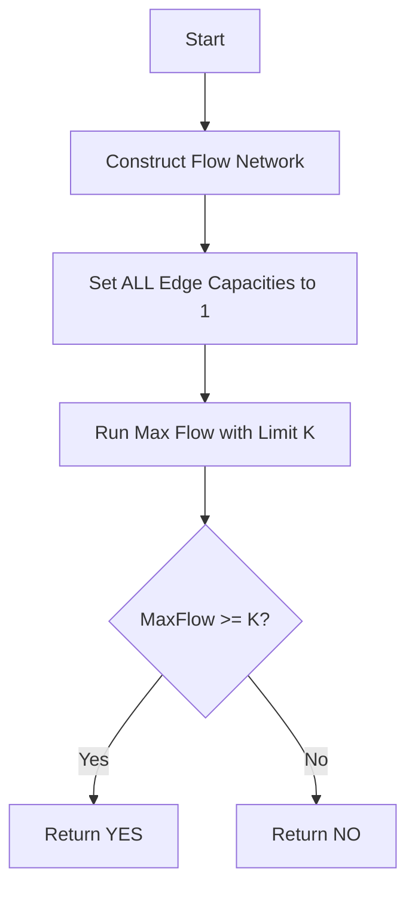

# AGR-013: K-Edge-Disjoint Paths

## 📋 Problem Summary

Determine if there are at least `k` edge-disjoint paths from a source `s` to a sink `t`. "Edge-disjoint" means no two paths share the same edge.

## 🌍 Real-World Scenario

**Scenario Title:** The Corporate "Air-Gapped" Network 💻

### The Problem
You are designing a secure network for a bank.
-   **Goal:** Transmit critical financial data from the HQ (Source `s`) to the Backup Server (Sink `t`).
-   **Threat:** Reliability and Security.
-   **Requirement (Redundancy):** You need `k=3` independent transmission routes. Why?
    -   If 1 cable is cut by construction work, 2 remain.
    -   If 2 cables are compromised by hackers, 1 secure line remains.
-   **Constraint:** The paths must not share any physical cable (edge). If they shared a cable, cutting that one cable would destroy multiple paths!


### From Real World to Algorithm
This is the **Edge Disjoint Paths** problem.
**Menger's Theorem** states: The maximum number of edge-disjoint paths from $s$ to $t$ is equal to the Max Flow where every edge capacity is 1.

## Detailed Explanation

### ASCII Diagram: Concept Visualization

**Graph Map:**
```
      (1)        (1)
  S --------> A --------> T
  |                       ^
  | (1)                   | (1)
  v                       |
  B ----------------------+
```
-   **Path 1:** `S -> A -> T`. Uses edges `(S,A), (A,T)`.
-   **Path 2:** `S -> B -> T`. Uses edges `(S,B), (B,T)`.
-   Are they disjoint? **Yes**. They share no edges. Max Flow = 2.
-   If we needed $K=3$, we would fail.

**Conflict Example (Bottleneck):**
```
  Top path:    S -> A -> M -> T
  Bottom path: S -> B -> M -> T
```
-   Both paths go through `M->T`. But `M->T` is a single edge with capacity 1.
-   So we can only pick **one** of these paths. Max Flow = 1.

### Algorithm Flow Diagram: Menger's Theorem



## 🎯 Edge Cases to Test

1.  **Multiple Edges:** Two direct edges `S->T`. Both provide a path. Flow = 2.
2.  **Bottleneck:** `S -> {A, B, C} -> M -> T`. 3 paths into M, 1 out. Flow = 1.
3.  **Cycles:** Should not affect flow (Dinic avoids them).
4.  **K=0:** Trivial YES.

## ✅ Input/Output Clarifications
-   **Directed**: Edges are directed.
-   **Output**: "YES" or "NO".
-   **Optimization**: Stop BFS/DFS as soon as `total_flow == k`.

## Naive Approach

### Intuition
Use DFS to find a path, mark edges as used, repeat $K$ times.

### Failure Case
DFS is greedy. It might pick a path `S->A->B->T` that blocks `S->A->T` and `S->B->T` (if A->B is a bridge between two potential flows). Max Flow algorithms have "back-edges" to "undo" bad choices.

## Optimal Approach (Unit Capacity Max Flow)

### Key Insight
Setting capacity to 1 ensures that any edge is used at most once. Max Flow algorithms naturally handle the "re-routing" logic required to maximize the number of paths.

### Time Complexity
-   **O(k * E)**: For unit networks, Dinic finds a blocking flow in $O(E)$. We might need $D$ phases (shortest path length). But since we stop at flow $K$, and each augmentation adds 1 to flow, typically very fast. More formally $O(\min(V^{2/3}, E^{1/2})E)$.

### Space Complexity
-   **O(V + E)**.

## Implementations

### Java
```java
import java.util.*;

class Solution {
    static class Edge {
        int to;
        int rev;
        int cap;
        int flow;
        Edge(int to, int rev, int cap) {
            this.to = to;
            this.rev = rev;
            this.cap = cap;
            this.flow = 0;
        }
    }

    private List<List<Edge>> adj;
    private int[] level;
    private int[] ptr;
    private int N;

    public boolean hasKEdgeDisjointPaths(int n, int s, int t, int k, int[][] edges) {
        N = n;
        adj = new ArrayList<>();
        for (int i = 0; i < n; i++) adj.add(new ArrayList<>());

        for (int[] e : edges) {
            // Capacity 1 for edge disjointness
            addEdge(e[0], e[1], 1);
        }

        // Check if max flow is at least k
        return dinic(s, t, k) >= k;
    }

    private void addEdge(int from, int to, int cap) {
        Edge a = new Edge(to, adj.get(to).size(), cap);
        Edge b = new Edge(from, adj.get(from).size(), 0);
        adj.get(from).add(a);
        adj.get(to).add(b);
    }

    private boolean bfs(int s, int t) {
        level = new int[N];
        Arrays.fill(level, -1);
        level[s] = 0;
        Queue<Integer> q = new ArrayDeque<>();
        q.add(s);
        while (!q.isEmpty()) {
            int u = q.poll();
            for (Edge e : adj.get(u)) {
                if (e.cap - e.flow > 0 && level[e.to] == -1) {
                    level[e.to] = level[u] + 1;
                    q.add(e.to);
                }
            }
        }
        return level[t] != -1;
    }

    private int dfs(int u, int t, int pushed) {
        if (pushed == 0) return 0;
        if (u == t) return pushed;
        for (; ptr[u] < adj.get(u).size(); ptr[u]++) {
            Edge e = adj.get(u).get(ptr[u]);
            if (level[u] + 1 != level[e.to] || e.cap - e.flow == 0) continue;
            int tr = dfs(e.to, t, Math.min(pushed, e.cap - e.flow));
            if (tr == 0) continue;
            e.flow += tr;
            adj.get(e.to).get(e.rev).flow -= tr;
            return tr;
        }
        return 0;
    }

    private int dinic(int s, int t, int limit) {
        int flow = 0;
        while (flow < limit && bfs(s, t)) {
            ptr = new int[N];
            while (flow < limit) {
                int pushed = dfs(s, t, limit - flow);
                if (pushed == 0) break;
                flow += pushed;
            }
        }
        return flow;
    }
}
```

### Python
```python
import sys

# Standard recursion limit
sys.setrecursionlimit(300000)

class Dinic:
    def __init__(self, n):
        self.n = n
        self.graph = [[] for _ in range(n)]
        self.level = []

    def add_edge(self, u, v, capacity):
        self.graph[u].append([v, capacity, len(self.graph[v])])
        self.graph[v].append([u, 0, len(self.graph[u]) - 1])

    def bfs(self, s, t):
        self.level = [-1] * self.n
        self.level[s] = 0
        queue = [s]
        while queue:
            u = queue.pop(0)
            for v, cap, rev in self.graph[u]:
                if cap > 0 and self.level[v] < 0:
                    self.level[v] = self.level[u] + 1
                    queue.append(v)
        return self.level[t] >= 0

    def dfs(self, u, t, flow, ptr):
        if u == t or flow == 0:
            return flow
        for i in range(ptr[u], len(self.graph[u])):
            ptr[u] = i
            v, cap, rev = self.graph[u][i]
            if self.level[v] == self.level[u] + 1 and cap > 0:
                pushed = self.dfs(v, t, min(flow, cap), ptr)
                if pushed > 0:
                    self.graph[u][i][1] -= pushed
                    self.graph[v][rev][1] += pushed
                    return pushed
        return 0

    def max_flow(self, s, t, limit):
        max_f = 0
        while max_f < limit and self.bfs(s, t):
            ptr = [0] * self.n
            while max_f < limit:
                pushed = self.dfs(s, t, limit - max_f, ptr)
                if pushed == 0:
                    break
                max_f += pushed
        return max_f

def has_k_edge_disjoint_paths(n: int, s: int, t: int, k: int, edges: list[tuple[int, int]]) -> bool:
    dinic = Dinic(n)
    for u, v in edges:
        dinic.add_edge(u, v, 1) # Unit capacity
    return dinic.max_flow(s, t, k) >= k
```

### C++
```cpp
#include <iostream>
#include <vector>
#include <queue>
#include <algorithm>

using namespace std;

struct Edge {
    int to;
    int cap;
    int flow;
    int rev;
};

class Dinic {
    int n;
    vector<vector<Edge>> adj;
    vector<int> level;
    vector<int> ptr;

public:
    Dinic(int n) : n(n), adj(n), level(n), ptr(n) {}

    void addEdge(int from, int to, int cap) {
        Edge a = {to, cap, 0, (int)adj[to].size()};
        Edge b = {from, 0, 0, (int)adj[from].size()};
        adj[from].push_back(a);
        adj[to].push_back(b);
    }

    bool bfs(int s, int t) {
        fill(level.begin(), level.end(), -1);
        level[s] = 0;
        queue<int> q;
        q.push(s);
        while (!q.empty()) {
            int u = q.front();
            q.pop();
            for (const auto& e : adj[u]) {
                if (e.cap - e.flow > 0 && level[e.to] == -1) {
                    level[e.to] = level[u] + 1;
                    q.push(e.to);
                }
            }
        }
        return level[t] != -1;
    }

    int dfs(int u, int t, int pushed) {
        if (pushed == 0) return 0;
        if (u == t) return pushed;
        for (int& cid = ptr[u]; cid < adj[u].size(); ++cid) {
            auto& e = adj[u][cid];
            int tr = e.to;
            if (level[u] + 1 != level[tr] || e.cap - e.flow == 0) continue;
            int push = dfs(tr, t, min(pushed, e.cap - e.flow));
            if (push == 0) continue;
            e.flow += push;
            adj[tr][e.rev].flow -= push;
            return push;
        }
        return 0;
    }

    int maxFlow(int s, int t, int limit) {
        int flow = 0;
        while (flow < limit && bfs(s, t)) {
            fill(ptr.begin(), ptr.end(), 0);
            while (flow < limit) {
                int pushed = dfs(s, t, limit - flow);
                if (pushed == 0) break;
                flow += pushed;
            }
        }
        return flow;
    }
};

class Solution {
public:
    bool hasKEdgeDisjointPaths(int n, int s, int t, int k, const vector<pair<int, int>>& edges) {
        Dinic dinic(n);
        for (const auto& e : edges) {
            dinic.addEdge(e.first, e.second, 1);
        }
        return dinic.maxFlow(s, t, k) >= k;
    }
};

int main() {
    ios::sync_with_stdio(false);
    cin.tie(nullptr);

    int n, m, s, t, k;
    if (!(cin >> n >> m >> s >> t >> k)) return 0;
    vector<pair<int, int>> edges(m);
    for (int i = 0; i < m; i++) {
        cin >> edges[i].first >> edges[i].second;
    }

    Solution solution;
    cout << (solution.hasKEdgeDisjointPaths(n, s, t, k, edges) ? "YES" : "NO");
    return 0;
}
```

### JavaScript
```javascript
const readline = require("readline");

class Dinic {
  constructor(n) {
    this.n = n;
    this.graph = Array.from({ length: n }, () => []);
    this.level = new Int32Array(n);
  }

  addEdge(u, v, cap) {
    this.graph[u].push({ to: v, cap: cap, flow: 0, rev: this.graph[v].length });
    this.graph[v].push({ to: u, cap: 0, flow: 0, rev: this.graph[u].length - 1 });
  }

  bfs(s, t) {
    this.level.fill(-1);
    this.level[s] = 0;
    const queue = [s];
    let head = 0;
    while (head < queue.length) {
      const u = queue[head++];
      for (const edge of this.graph[u]) {
        if (edge.cap - edge.flow > 0 && this.level[edge.to] === -1) {
          this.level[edge.to] = this.level[u] + 1;
          queue.push(edge.to);
        }
      }
    }
    return this.level[t] !== -1;
  }

  dfs(u, t, pushed, ptr) {
    if (pushed === 0 || u === t) return pushed;
    for (let i = ptr[u]; i < this.graph[u].length; i++) {
      ptr[u] = i;
      const edge = this.graph[u][i];
      if (this.level[u] + 1 !== this.level[edge.to] || edge.cap - edge.flow === 0) continue;
      
      let tr = pushed < (edge.cap - edge.flow) ? pushed : (edge.cap - edge.flow);
      const push = this.dfs(edge.to, t, tr, ptr);
      
      if (push === 0) continue;
      
      edge.flow += push;
      this.graph[edge.to][edge.rev].flow -= push;
      return push;
    }
    return 0;
  }

  maxFlow(s, t, limit) {
    let flow = 0;
    while (flow < limit && this.bfs(s, t)) {
      const ptr = new Int32Array(this.n).fill(0);
      while (flow < limit) {
        const pushed = this.dfs(s, t, limit - flow, ptr);
        if (pushed === 0) break;
        flow += pushed;
      }
    }
    return flow;
  }
}

class Solution {
  hasKEdgeDisjointPaths(n, s, t, k, edges) {
    const dinic = new Dinic(n);
    for (const [u, v] of edges) {
      dinic.addEdge(u, v, 1);
    }
    return dinic.maxFlow(s, t, k) >= k;
  }
}

const rl = readline.createInterface({
  input: process.stdin,
  output: process.stdout,
});

let data = [];
rl.on("line", (line) => { const parts = line.trim().split(/\s+/); for (const p of parts) if (p) data.push(p); });
rl.on("close", () => {
  if (data.length === 0) return;
  
  let idx = 0;
  const n = parseInt(data[idx++], 10);
  const m = parseInt(data[idx++], 10);
  const s = parseInt(data[idx++], 10);
  const t = parseInt(data[idx++], 10);
  const k = parseInt(data[idx++], 10);
  const edges = [];
  for (let i = 0; i < m; i++) {
    const u = parseInt(data[idx++], 10);
    const v = parseInt(data[idx++], 10);
    edges.push([u, v]);
  }

  const solution = new Solution();
  console.log(solution.hasKEdgeDisjointPaths(n, s, t, k, edges) ? "YES" : "NO");
});
```

## 🧪 Test Case Walkthrough (Dry Run)

### Input
```
4 4 0 3 2
0 1
1 3
0 2
2 3
```
-   `s=0, t=3, k=2`.
-   Path A: `0->1->3`. Cost 1 edge each.
-   Path B: `0->2->3`.
-   Edges disjoint? Yes. Max Flow = 2.
-   `2 >= 2`. Output: YES.

## ✅ Proof of Correctness
-   **Unit Capacities:** Ensure each edge carries at most 1 unit of flow, meaning it participates in at most 1 path.
-   **Flow Conservation:** Ensures paths are continuous from S to T.
-   **Max Flow:** Maximizes the number of units reaching T, which corresponds to the maximum count of edge-disjoint paths.

## ⚠️ Common Mistakes to Avoid

1.  **Undirected Graphs:** If the problem was undirected, we'd add `u->v` and `v->u` both with capacity 1. But strictly, this allows `u->v` and `v->u` to be used in separate paths (two cars passing each other). If the physical wire can only handle one direction total, we'd need to model differently. Usually "Edge Disjoint" implies directed.
2.  **Node Disjoint:** This problem is EDGE disjoint. Node disjoint is strictly harder (requires node constraints).

## 💡 Interview Extensions

1.  **Vertex Disjoint:** To solve Vertex Disjoint, split node `u` into `u_in -> u_out` with capacity 1. Then run Max Flow.
2.  **Menger's Theorem:** Know the statement. "Max local connectivity = Min cut".
