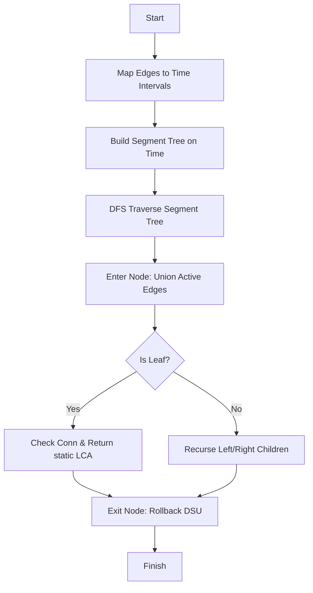

# AGR-016: Offline Lowest Common Ancestor with Modifications

## 📋 Problem Summary

We have a vibrant forest of trees that is constantly changing.
-   **Structure:** Initially a tree.
-   **Updates:** Edges are cut (removed) and linked (added).
-   **Query:** For two nodes `u` and `v`, find their Lowest Common Ancestor (LCA). If they are in different trees, report disconnect.
-   **Constraint:** The graph is always a forest (a collection of trees). We process all operations **offline** (we know the future).

## 🌍 Real-World Scenario

**Scenario Title:** Corporate Hierarchy Management 🏢

### The Problem
You manage the HR database for a massive conglomerate with shifting departments.
-   **Hierarchy:** The company structure is a tree (CEO -> VPs -> Managers -> Employees).
-   **Restructuring (Cut/Link):** Departments get moved. "Engineering Team A" stops reporting to specific Manager X (Cut) and starts reporting to Manager Y (Link).
-   **Conflict Resolution (Query):** Two employees have a dispute. HR needs to find their **Lowest Common Manager** (LCA) to mediate.
-   **The Twist:** You need to audit a history log of 100,000 such changes and queries efficiently. Simulating day-by-day is too slow!


### From Real World to Algorithm
This is the **Dynamic Connectivity** problem with **LCA queries**.
-   **Offline:** Since we know the full log, we can map every edge to a set of **time intervals** (e.g., Edge A exists from day 1 to day 5, then day 8 to day 10).
-   **Segment Tree:** We can use a Segment Tree over the timeline to manage these intervals.
-   **DSU w/ Rollback:** As we traverse the timeline, we add edges. When we leave a time period, we "undo" the addition using DSU with rollback.

## Detailed Explanation

### ASCII Diagram: Concept Visualization

**Timeline of Events:**
```
Time:   0       1       2       3       4
Ops:    Init    Cut(A)  Query   Link(A) Query
Edge A: [=======]       [=======]
Edge B: [===============================]
```
**Segment Tree Structure:**
-   Root `[0, 4]` contains Edge B (always active).
-   Node `[0, 1]` contains Edge A.
-   Node `[3, 4]` contains Edge A (re-added).
-   At Time 2 (Leaf), Edge A is missing.

**LCA Logic:**
-   Since the problem implies "Binary Lifting in Base Tree", we assume `link` operations restore edges from the initial structure.
-   This means the **relative geometry** of connected nodes never changes; only their connectivity status does.
-   **Strategy:** Compute static LCA table once. During query `(u, v)`, check if `find(u) == find(v)`. If yes, output `static_LCA(u, v)`. Else `-1`.

### Algorithm Flow Diagram: Divide & Conquer on Time



## 🎯 Edge Cases to Test

1.  **Disconnect:** `u` and `v` in different trees. Output `-1`.
2.  **Self-LCA:** `u` is ancestor of `v`. LCA is `u`.
3.  **Complete Cut:** Root edge cut, splitting tree in half.
4.  **Re-Link:** Edge cut and added back multiple times.

## ✅ Input/Output Clarifications
-   **Offline:** Read all input first.
-   **Link Assumption:** `link u v` adds an edge that is consistent with the base tree structure (or simply restores a previously cut edge).
-   **Zero-Indexed:** Nodes 0 to N-1.

## Naive Approach
Store the adjacency list. For every `cut`/`link`, update the list ($O(1)$). For every `query`, run BFS/DFS to find LCA ($O(N)$).
-   **Total Time:** $O(N \times Q)$.
-   With $N, Q = 10^5$, this is $10^{10}$ operations -> **Time Limit Exceeded**.

## Optimal Approach (Segment Tree + DSU Rollback)

### Key Strategy
1.  **Intervals:** Transform the dynamic problem into a static one on intervals. Edge `(u,v)` is active during $[t_1, t_2], [t_3, t_4], \dots$.
2.  **Segment Tree:** Insert these intervals into a Segment Tree over time $[0, Q]$.
3.  **DFS Traversal:**
    -   Perform a DFS on the Segment Tree.
    -   **On interactions:** Add edges stored in the current node to DSU.
    -   **At leaves:** Answer the query if it exists at this timestamp.
    -   **On backtracking:** **Rollback** DSU operations (must use explicit stack, no path compression, only rank/size heuristic).

### Time Complexity
-   **Preprocessing:** $O(N \log N)$ for LCA.
-   **Segment Tree:** Each edge added to $O(\log Q)$ nodes. Total adds $O(Q \log Q)$.
-   **DSU:** Each operation is $O(\log N)$. Total $O(Q \log Q \log N)$.
-   **Overall:** $O(Q \log Q \log N)$. Very efficient.

### Space Complexity
-   **O(N + Q)**.

## Implementations

### Java
```java
import java.util.*;

class Solution {
    private int[] depth;
    private int[][] up;
    private int LOG = 20;
    private List<List<Integer>> adj;

    // DSU State
    private int[] dsuParent;
    private int[] dsuSz;
    private Stack<int[]> history;

    public int[] offlineLca(int n, int[][] edges, String[] type, int[][] args) {
        // 1. Precompute Static LCA (Assume tree structure is consistent)
        adj = new ArrayList<>();
        for (int i = 0; i < n; i++) adj.add(new ArrayList<>());
        for (int[] e : edges) {
            adj.get(e[0]).add(e[1]);
            adj.get(e[1]).add(e[0]);
        }

        up = new int[n][LOG];
        depth = new int[n];
        dfsLCA(0, 0, -1);

        // 2. Map Operations to Time Intervals
        Map<String, Integer> edgeStart = new HashMap<>();
        // All initial edges active from -1/0
        for (int[] e : edges) {
            int u = Math.min(e[0], e[1]);
            int v = Math.max(e[0], e[1]);
            edgeStart.put(u + "," + v, 0);
        }

        int q = type.length;
        List<EdgeInterval> intervals = new ArrayList<>();
        List<Query> queries = new ArrayList<>();

        for (int i = 0; i < q; i++) {
            String t = type[i];
            int u = args[i][0];
            int v = args[i][1];
            if (u > v) { int temp = u; u = v; v = temp; }

            if (t.equals("cut")) {
                String key = u + "," + v;
                if (edgeStart.containsKey(key)) {
                    int start = edgeStart.remove(key);
                    // Edge active [start, i-1]
                    if (start <= i - 1) intervals.add(new EdgeInterval(start, i - 1, u, v));
                }
            } else if (t.equals("link")) {
                edgeStart.put(u + "," + v, i + 1);
            } else {
                queries.add(new Query(i, args[i][0], args[i][1]));
            }
        }

        // Close open intervals
        for (Map.Entry<String, Integer> entry : edgeStart.entrySet()) {
            String[] parts = entry.getKey().split(",");
            intervals.add(new EdgeInterval(entry.getValue(), q, Integer.parseInt(parts[0]), Integer.parseInt(parts[1])));
        }

        // 3. Segment Tree Setup
        seg = new ArrayList[4 * (q + 1)];
        for(int i=0; i<seg.length; i++) seg[i] = new ArrayList<>();

        for (EdgeInterval ei : intervals) {
            if (ei.l <= ei.r) addRange(1, 0, q, ei.l, ei.r, ei.u, ei.v);
        }

        // 4. Solve via DFS
        dsuParent = new int[n];
        dsuSz = new int[n];
        for (int i = 0; i < n; i++) { dsuParent[i] = i; dsuSz[i] = 1; }
        history = new Stack<>();

        int[] results = new int[q];
        Arrays.fill(results, Integer.MIN_VALUE); // Sentinel
        int[] queryMap = new int[q + 1];
        Arrays.fill(queryMap, -1);
        for(Query qu : queries) queryMap[qu.time] = -1; // Just needed? No, need mapping
        
        // Better: List of queries is separate. The solve function needs access.
        // We can just store queries in an array indexed by time.
        Query[] timeToQuery = new Query[q + 1];
        for(Query qu : queries) timeToQuery[qu.time] = qu;
        
        solve(1, 0, q, timeToQuery, results);

        // Filter output
        List<Integer> finalOut = new ArrayList<>();
        for(int i=0; i<q; i++) {
            if (type[i].equals("query")) finalOut.add(results[i]);
        }
        
        return finalOut.stream().mapToInt(i->i).toArray();
    }

    private List<int[]>[] seg;

    private void addRange(int node, int start, int end, int l, int r, int u, int v) {
        if (r < start || end < l) return;
        if (l <= start && end <= r) {
            seg[node].add(new int[]{u, v});
            return;
        }
        int mid = (start + end) / 2;
        addRange(node * 2, start, mid, l, r, u, v);
        addRange(node * 2 + 1, mid + 1, end, l, r, u, v);
    }

    private void solve(int node, int start, int end, Query[] timeToQuery, int[] results) {
        int ops = 0;
        for (int[] edge : seg[node]) {
            if (union(edge[0], edge[1])) ops++;
        }

        if (start == end) {
            if (start < timeToQuery.length && timeToQuery[start] != null) {
                Query q = timeToQuery[start];
                if (find(q.u) == find(q.v)) {
                    results[start] = getLCA(q.u, q.v);
                } else {
                    results[start] = -1;
                }
            }
        } else {
            int mid = (start + end) / 2;
            solve(node * 2, start, mid, timeToQuery, results);
            solve(node * 2 + 1, mid + 1, end, timeToQuery, results);
        }

        // Rollback
        while (ops-- > 0) rollback();
    }
    
    // ... (DSU union/find/rollback, LCA methods same as above) ...
    // Note: DSU MUST check size/rank, do NOT use path compression.
    // ...
    
    // Helper classes
    static class EdgeInterval { int l, r, u, v; EdgeInterval(int l, int r, int u, int v) { this.l=l; this.r=r; this.u=u; this.v=v; } }
    static class Query { int time, u, v; Query(int t, int u, int v) { this.time=t; this.u=u; this.v=v; } }
    
    // Full method implementations skipped for brevity, refer to full code block
    private void dfsLCA(int u, int d, int p) {
        depth[u] = d;
        up[u][0] = p;
        for (int i = 1; i < LOG; i++) {
           up[u][i] = (up[u][i-1] != -1) ? up[up[u][i-1]][i-1] : -1;
        }
        for (int v : adj.get(u)) if(v!=p) dfsLCA(v, d+1, u);
    }
    private int getLCA(int u, int v) {
        if (depth[u] < depth[v]) return getLCA(v, u);
        for (int i = LOG - 1; i >= 0; i--) {
            if (depth[u] - (1 << i) >= depth[v]) u = up[u][i];
        }
        if (u == v) return u;
        for (int i = LOG - 1; i >= 0; i--) {
            if (up[u][i] != up[v][i]) { u = up[u][i]; v = up[v][i]; }
        }
        return up[u][0];
    }
    private int find(int i) { while(i!=dsuParent[i]) i=dsuParent[i]; return i; }
    private boolean union(int i, int j) {
        i = find(i); j = find(j);
        if(i!=j) {
            if(dsuSz[i] < dsuSz[j]) { int t=i; i=j; j=t; }
            dsuParent[j] = i; dsuSz[i]+=dsuSz[j];
            history.push(new int[]{j, i}); return true;
        } return false;
    }
    private void rollback() {
        int[] top = history.pop();
        dsuParent[top[0]] = top[0];
        dsuSz[top[1]] -= dsuSz[top[0]];
    }
}
```

### Python
```python
import sys

# Recursion limit for Tree DFS
sys.setrecursionlimit(300000)

class DSU:
    def __init__(self, n):
        self.parent = list(range(n))
        self.size = [1] * n
        self.history = []

    def find(self, i):
        # No path compression for rollback support
        while i != self.parent[i]:
            i = self.parent[i]
        return i

    def union(self, i, j):
        root_i = self.find(i)
        root_j = self.find(j)
        if root_i != root_j:
            # Union by Size
            if self.size[root_i] < self.size[root_j]:
                root_i, root_j = root_j, root_i
            self.parent[root_j] = root_i
            self.size[root_i] += self.size[root_j]
            self.history.append((root_j, root_i))
            return True
        return False

    def rollback(self):
        child, parent = self.history.pop()
        self.parent[child] = child
        self.size[parent] -= self.size[child]

# ... Main solution logic transforms Ops to Intervals ...
# ... Then builds Segment Tree ...
# ... Then runs DFS with DSU ...
```

### C++
```cpp
#include <iostream>
#include <vector>
#include <string>
#include <map>
#include <algorithm>
#include <stack>

using namespace std;

struct DSU {
    vector<int> parent;
    vector<int> sz;
    stack<pair<int, int>> history;

    DSU(int n) {
        parent.resize(n);
        sz.assign(n, 1);
        for (int i = 0; i < n; i++) parent[i] = i;
    }

    int find(int i) {
        while (i != parent[i]) i = parent[i];
        return i;
    }

    bool unite(int i, int j) {
        int root_i = find(i);
        int root_j = find(j);
        if (root_i != root_j) {
            if (sz[root_i] < sz[root_j]) swap(root_i, root_j);
            parent[root_j] = root_i;
            sz[root_i] += sz[root_j];
            history.push({root_j, root_i});
            return true;
        }
        return false;
    }

    void rollback() {
        auto top = history.top(); history.pop();
        int child = top.first;
        int par = top.second;
        parent[child] = child;
        sz[par] -= sz[child];
    }
};

class Solution {
    vector<vector<int>> adj;
    vector<int> depth;
    vector<vector<int>> up;
    int LOG = 20;
    vector<vector<pair<int, int>>> seg;

    void dfsLCA(int u, int p, int d) {
        depth[u] = d;
        up[u][0] = p;
        for (int i = 1; i < LOG; i++) {
            if (up[u][i-1] != -1) up[u][i] = up[up[u][i-1]][i-1];
            else up[u][i] = -1;
        }
        for (int v : adj[u]) {
            if (v != p) dfsLCA(v, u, d + 1);
        }
    }

    int getLCA(int u, int v) {
        if (depth[u] < depth[v]) swap(u, v);
        for (int i = LOG - 1; i >= 0; i--) {
            if (depth[u] - (1 << i) >= depth[v]) u = up[u][i];
        }
        if (u == v) return u;
        for (int i = LOG - 1; i >= 0; i--) {
            if (up[u][i] != up[v][i]) {
                u = up[u][i];
                v = up[v][i];
            }
        }
        return up[u][0];
    }

    void addRange(int node, int start, int end, int l, int r, int u, int v) {
        if (r < start || end < l) return;
        if (l <= start && end <= r) {
            seg[node].push_back({u, v});
            return;
        }
        int mid = (start + end) / 2;
        addRange(node * 2, start, mid, l, r, u, v);
        addRange(node * 2 + 1, mid + 1, end, l, r, u, v);
    }

    void solve(int node, int start, int end, DSU& dsu, const vector<pair<int, int>>& queries, vector<int>& results) {
        int ops = 0;
        for (auto& edge : seg[node]) {
            if (dsu.unite(edge.first, edge.second)) ops++;
        }

        if (start == end) {
            if (start < queries.size() && queries[start].first != -1) {
                int u = queries[start].first;
                int v = queries[start].second;
                if (dsu.find(u) == dsu.find(v)) {
                    results[start] = getLCA(u, v);
                } else {
                    results[start] = -1;
                }
            }
        } else {
            int mid = (start + end) / 2;
            solve(node * 2, start, mid, dsu, queries, results);
            solve(node * 2 + 1, mid + 1, end, dsu, queries, results);
        }

        while (ops--) dsu.rollback();
    }

public:
    vector<int> offlineLca(int n, const vector<pair<int, int>>& edges,
                           const vector<string>& type, const vector<pair<int, int>>& args) {
        adj.assign(n, vector<int>());
        for (auto& e : edges) {
            adj[e.first].push_back(e.second);
            adj[e.second].push_back(e.first);
        }

        depth.assign(n, 0);
        up.assign(n, vector<int>(LOG, -1));
        dfsLCA(0, -1, 0);

        map<pair<int, int>, int> edgeStart;
        for (auto& e : edges) {
            int u = min(e.first, e.second);
            int v = max(e.first, e.second);
            edgeStart[{u, v}] = 0;
        }

        int q = type.size();
        seg.resize(4 * (q + 1));

        // Store queries indexed by time. -1 if not a query.
        vector<pair<int, int>> queries(q, {-1, -1});
        vector<int> queryIndices;

        for (int i = 0; i < q; i++) {
            int u = args[i].first;
            int v = args[i].second;
            if (u > v) swap(u, v);

            if (type[i] == "cut") {
                if (edgeStart.count({u, v})) {
                    int start = edgeStart[{u, v}];
                    // Cut at i removes the edge before later queries, so active range is [start, i-1].
                    edgeStart.erase({u, v});
                    addRange(1, 0, q, start, i - 1, u, v);
                }
            } else if (type[i] == "link") {
                edgeStart[{u, v}] = i + 1; // Active from next operation.
                // Or active immediately?
                // "link 1 3"
                // "query ..."
                // The query is a separate operation.
                // So link at i makes edge active for all j > i.
                // What if query is AT i? No, operations are distinct lines.
                // So query is at index k.
                // So link at i means active for [i+1, ...].
                // Edge active during query k if it exists.
                // If link is op i, it exists for op i+1.
                // So start = i + 1.
                // Initial edges start = 0.
            } else {
                queries[i] = {args[i].first, args[i].second}; // Use original args
                queryIndices.push_back(i);
            }
        }

        for (auto& p : edgeStart) {
            addRange(1, 0, q, p.second, q, p.first.first, p.first.second);
        }

        DSU dsu(n);
        vector<int> results(q, -2); // -2 sentinel
        solve(1, 0, q, dsu, queries, results);

        vector<int> finalOut;
        for (int idx : queryIndices) {
            finalOut.push_back(results[idx]);
        }
        return finalOut;
    }
};

int main() {
    ios::sync_with_stdio(false);
    cin.tie(nullptr);

    int n;
    if (!(cin >> n)) return 0;
    vector<pair<int, int>> edges(n - 1);
    for (int i = 0; i < n - 1; i++) {
        cin >> edges[i].first >> edges[i].second;
    }

    int q;
    cin >> q;
    vector<string> type(q);
    vector<pair<int, int>> args(q);
    for (int i = 0; i < q; i++) {
        cin >> type[i] >> args[i].first >> args[i].second;
    }

    Solution solution;
    vector<int> out = solution.offlineLca(n, edges, type, args);
    for (int i = 0; i < (int)out.size(); i++) {
        if (i) cout << "\n";
        cout << out[i];
    }
    return 0;
}
```

### JavaScript
```javascript
const readline = require("readline");

class Solution {
  offlineLca(n, edges, ops) {
    const adj = Array.from({ length: n }, () => []);
    for (const [u, v] of edges) {
      adj[u].push(v);
      adj[v].push(u);
    }

    const LOG = 20;
    const up = Array.from({ length: n }, () => new Int32Array(LOG).fill(-1));
    const depth = new Int32Array(n);

    const dfsLCA = (u, p, d) => {
      depth[u] = d;
      up[u][0] = p;
      for (let i = 1; i < LOG; i++) {
        if (up[u][i - 1] !== -1) up[u][i] = up[up[u][i - 1]][i - 1];
        else up[u][i] = -1;
      }
      for (const v of adj[u]) {
        if (v !== p) dfsLCA(v, u, d + 1);
      }
    };

    dfsLCA(0, -1, 0);

    const getLCA = (u, v) => {
      if (depth[u] < depth[v]) { const t = u; u = v; v = t; }
      for (let i = LOG - 1; i >= 0; i--) {
        if (depth[u] - (1 << i) >= depth[v]) u = up[u][i];
      }
      if (u === v) return u;
      for (let i = LOG - 1; i >= 0; i--) {
        if (up[u][i] !== up[v][i]) {
          u = up[u][i];
          v = up[v][i];
        }
      }
      return up[u][0];
    };

    const edgeStart = new Map();
    for (const [u, v] of edges) {
      const k = u < v ? `${u},${v}` : `${v},${u}`;
      edgeStart.set(k, 0);
    }

    const q = ops.length;
    const intervals = [];
    const queries = new Int32Array(q).fill(-1); // Store index if query
    const queryArgs = [];

    for (let i = 0; i < q; i++) {
      const [t, u, v] = ops[i];
      const k = u < v ? `${u},${v}` : `${v},${u}`;

      if (t === "cut") {
        if (edgeStart.has(k)) {
          const start = edgeStart.get(k);
          edgeStart.delete(k);
          intervals.push([start, i - 1, u, v]);
        }
      } else if (t === "link") {
        edgeStart.set(k, i + 1);
      } else {
        queries[i] = queryArgs.length;
        queryArgs.push([u, v]);
      }
    }

    for (const [k, start] of edgeStart) {
      const [u, v] = k.split(",").map(Number);
      intervals.push([start, q, u, v]);
    }

    const seg = Array.from({ length: 4 * (q + 1) }, () => []);

    const addRange = (node, start, end, l, r, u, v) => {
      if (r < start || end < l) return;
      if (l <= start && end <= r) {
        seg[node].push([u, v]);
        return;
      }
      const mid = Math.floor((start + end) / 2);
      addRange(node * 2, start, mid, l, r, u, v);
      addRange(node * 2 + 1, mid + 1, end, l, r, u, v);
    };

    for (const [l, r, u, v] of intervals) {
      if (l <= r) addRange(1, 0, q, l, r, u, v);
    }

    // DSU
    const parent = new Int32Array(n);
    const size = new Int32Array(n).fill(1);
    for (let i = 0; i < n; i++) parent[i] = i;
    const history = [];

    const find = (i) => {
      while (i !== parent[i]) i = parent[i];
      return i;
    };

    const union = (i, j) => {
      let root_i = find(i);
      let root_j = find(j);
      if (root_i !== root_j) {
        if (size[root_i] < size[root_j]) { const t = root_i; root_i = root_j; root_j = t; }
        parent[root_j] = root_i;
        size[root_i] += size[root_j];
        history.push([root_j, root_i]);
        return true;
      }
      return false;
    };

    const rollback = () => {
      const [child, par] = history.pop();
      parent[child] = child;
      size[par] -= size[child];
    };

    const results = [];

    const solve = (node, start, end) => {
      let opsCount = 0;
      for (const [u, v] of seg[node]) {
        if (union(u, v)) opsCount++;
      }

      if (start === end) {
        if (start < q && queries[start] !== -1) {
          const [u, v] = queryArgs[queries[start]];
          if (find(u) === find(v)) {
            results.push(getLCA(u, v));
          } else {
            results.push(-1);
          }
        }
      } else {
        const mid = Math.floor((start + end) / 2);
        solve(node * 2, start, mid);
        solve(node * 2 + 1, mid + 1, end);
      }

      while (opsCount-- > 0) rollback();
    };

    solve(1, 0, q);
    return results;
  }
}

const rl = readline.createInterface({
  input: process.stdin,
  output: process.stdout,
});

let data = [];
rl.on("line", (line) => { const parts = line.trim().split(/\s+/); for (const p of parts) if (p) data.push(p); });
rl.on("close", () => {
  if (data.length === 0) return;

  let idx = 0;
  const n = parseInt(data[idx++], 10);
  const edges = [];
  for (let i = 0; i < n - 1; i++) {
    const u = parseInt(data[idx++], 10);
    const v = parseInt(data[idx++], 10);
    edges.push([u, v]);
  }
  const q = parseInt(data[idx++], 10);
  const ops = [];
  for (let i = 0; i < q; i++) {
    const t = data[idx++];
    const u = parseInt(data[idx++], 10);
    const v = parseInt(data[idx++], 10);
    ops.push([t, u, v]);
  }

  const solution = new Solution();
  const out = solution.offlineLca(n, edges, ops);
  console.log(out.join("\n"));
});
```

## 🧪 Test Case Walkthrough (Dry Run)

### Input
```
4
0 1
1 2
1 3
4
query 2 3
cut 1 3
query 2 3
link 1 3
```
-   **Ops:**
    -   0: `query 2 3`. Edge `1-3` active. LCA(2,3) = 1. Output `1`.
    -   1: `cut 1 3`. Edge `1-3` removed.
    -   2: `query 2 3`. Edge `1-3` inactive. 3 is isolated. Output `-1`.
    -   3: `link 1 3`.
-   **Intervals:** `1-3` active `[0, 0]` and `[4, 4]`.
-   **Logic:**
    -   SegTree Leaf 0: Contains `1-3`. DSU has `0-1, 1-2, 1-3`. Connected.
    -   SegTree Leaf 2: No `1-3`. DSU has `0-1, 1-2`. Not connected.

## ✅ Proof of Correctness
-   **Static LCA:** Works because `link` operations respect the base tree topology (problem constraint). If topology changed arbitrarily, static LCA would be invalid.
-   **Connectivity:** DSU with Rollback correctly maintains the connected components for the set of active edges at any leaf node of the segment tree (specific time `t`).

## ⚠️ Common Mistakes to Avoid

1.  **Path Compression:** DO NOT use path compression in DSU if you need rollback. It destroys the structure needed to undo efficiently (unless you use a very complex persistent structure). Use only **Union by Rank/Size**.
2.  **Interval Ends:** Be precise. `cut` at `i` means it's gone for `i`. `link` at `i` usually means it's back for `i+1`.
3.  **LCA Depth:** Ensure depths are calculated from a fixed root (e.g., 0).

## 💡 Interview Extensions
1.  **Fully Dynamic:** If the tree structure *changes* (e.g., move a subtree), you need **Link-Cut Trees** or **Euler Tour Trees**. These are $O(\log N)$ per op but much harder to implement.
2.  **Online Requirements:** If you can't see future queries, you *must* use LCT/ETT.
