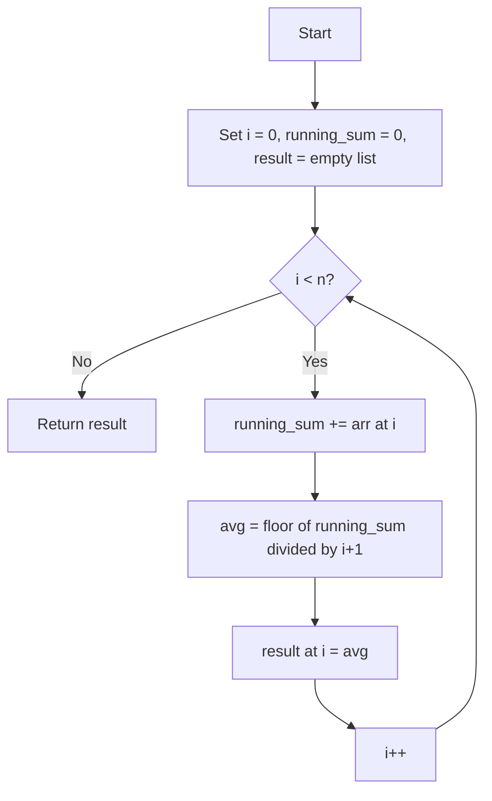

# ARR-001: Snack Restock Snapshot

## 📋 Problem Summary

Given an array representing daily inventory values, compute the prefix average (rounded down) for each position.

## 🌍 Real-World Scenario

**Scenario Title:** 📊 Your Class Test Score Tracker

### The Problem

Imagine you're tracking your test scores throughout the semester:

- **Week 1 Quiz**: 80 points
- **Week 2 Quiz**: 90 points
- **Week 3 Quiz**: 70 points (bad day!)
- **Week 4 Quiz**: 100 points (aced it!)

Your teacher asks: **"What's your average score from the beginning of the semester until each quiz?"**

This isn't just one final average - you need to know your **running average** after each test:

- After Quiz 1: 80 average
- After Quiz 2: (80+90)/2 = 85 average
- After Quiz 3: (80+90+70)/3 = 80 average
- After Quiz 4: (80+90+70+100)/4 = 85 average

### Why This Matters

**📱 Real Applications You Use Daily:**

1. **Social Media**: Your app calculates average likes/views "so far" to show trending content
2. **Food Delivery**: Restaurants show their average rating updated after each review
3. **Fitness Apps**: Your average daily steps updates every day (not recalculated from scratch!)
4. **Gaming**: Your K/D ratio updates after each match efficiently
5. **Stock Market**: Moving averages help predict trends

### Constraints in Real World

- **Scale**: Instagram processes millions of posts - can't recalculate averages from scratch
- **Performance**: Must update in real-time (under 100ms)
- **Reliability**: One calculation error affects all future averages

### From Real World to Algorithm

**The Challenge:** How do you calculate these running averages _efficiently_ without re-adding all previous scores every single time?

**The Insight:** Keep track of your total score so far. When a new quiz happens, just add that score to your running total and divide by the number of quizzes!


## Detailed Explanation

### 🎨 Concept Visualization: What Are Prefix Averages?

Think of prefix averages like calculating your **cumulative GPA** after each semester:

```
Semester Grades:    [3.8]  [4.0]  [3.5]  [3.9]
                      ↓      ↓      ↓      ↓
After Sem 1:         3.8/1 = 3.8
After Sem 2:    (3.8+4.0)/2 = 3.9
After Sem 3: (3.8+4.0+3.5)/3 = 3.76 → 3 (rounded down)
After Sem 4: (3.8+4.0+3.5+3.9)/4 = 3.8
```

### 🔄 Algorithm Flow Diagram

<!-- mermaid -->


> A running sum is like a running tab, keep it current and no surprises.

### Core Idea: Don't Recalculate, Just Add!

**Inefficient way** (like counting all your money every time you get paid):

```
Day 1: Count $100 → Total: $100
Day 2: Count $100 + $150 → Total: $250
Day 3: Count $100 + $150 + $200 → Total: $450
```

**Efficient way** (keep a running total):

```
Day 1: Have $0, get $100 → Total: $100
Day 2: Have $100, get $150 → Total: $250
Day 3: Have $250, get $200 → Total: $450
```

The second way is what we use for prefix averages!

## 🎯 Edge Cases to Test

Before we dive into approaches, let's identify tricky test cases:

1. **Single Element**

   - Input: `n=1, arr=[42]`
   - Expected: `[42]` (average of one number is itself)
   - Why tricky: Division by 1

2. **All Same Values**

   - Input: `arr=[5, 5, 5, 5]`
   - Expected: `[5, 5, 5, 5]` (average stays constant)
   - Why tricky: Tests if algorithm handles no variation

3. **Zeros in Array**

   - Input: `arr=[10, 0, 0, 10]`
   - Expected: `[10, 5, 3, 5]`
   - Why tricky: Zero affects average but shouldn't cause division by zero

4. **Large Numbers (Overflow Risk)**

   - Input: `n=100000, all values=10000`
   - Sum can reach: 100,000 × 10,000 = 1,000,000,000
   - Why tricky: Exceeds 32-bit int max (2,147,483,647) - need `long`

5. **Decreasing Trend**

   - Input: `arr=[100, 50, 25, 10]`
   - Expected: `[100, 75, 58, 46]`
   - Why tricky: Average decreases each step

6. **Maximum Constraints**
   - Input: `n=100,000` with random values
   - Expected: Should complete in < 1 second
   - Why tricky: Tests time complexity

## ✅ Input/Output Clarifications (Read This Before Coding)

**Critical Points:**

- **Rounding**: Use **floor division** (integer division)

  - Python: `//` operator
  - Java/C++: `/` with integers automatically floors
  - JavaScript: `Math.floor(sum / count)`
  - Example: `7 / 2 = 3` (not 3.5)

- **Data Types**:

  - ❌ **WRONG**: `int sum` in Java/C++
  - ✅ **RIGHT**: `long sum` or `long long sum`
  - Why: Sum of 100,000 elements can overflow 32-bit integers

- **Index vs Count**:
  - ❌ **WRONG**: Divide by `i`
  - ✅ **RIGHT**: Divide by `i+1` (arrays are 0-indexed)

**Common Misinterpretation:**

| ❌ WRONG                                    | ✅ RIGHT                               |
| :------------------------------------------ | :------------------------------------- |
| Average of last k elements (sliding window) | Average from start to current position |
| Return single overall average               | Return array of prefix averages        |
| Use floating point                          | Use integer division                   |

## Naive Approach

### Intuition

**Like manually checking your bank balance every time you make a purchase:**

For each position `i`, go back to the beginning and add up all elements from `0` to `i`, then divide by the count.

Example with `arr = [4, 6, 6, 0]`:

```
Position 0: Sum 4 → 4/1 = 4
Position 1: Sum 4+6 → 10/2 = 5
Position 2: Sum 4+6+6 → 16/3 = 5
Position 3: Sum 4+6+6+0 → 16/4 = 4
```

**Think of it like:** Every day you count all your money from scratch instead of remembering yesterday's total.

### Algorithm

```
For each position i from 0 to n-1:
    current_sum = 0
    For each position j from 0 to i:
        current_sum += arr[j]
    average = current_sum / (i + 1)
    result[i] = average
```

### 📊 Visual Execution

```
Array: [4, 6, 6, 0]

i=0: sum = 4                    → 4/1 = 4
     └─┘

i=1: sum = 4 + 6               → 10/2 = 5
     └─────┘

i=2: sum = 4 + 6 + 6           → 16/3 = 5
     └─────────┘

i=3: sum = 4 + 6 + 6 + 0       → 16/4 = 4
     └─────────────┘
```

### Time Complexity

- **O(n²)**: Nested loops
  - Outer loop: n iterations
  - Inner loop: 1 + 2 + 3 + ... + n = n(n+1)/2
  - For n=100,000: 100,000² = **10,000,000,000 operations** 🐌

### Space Complexity

- **O(1)**: No extra space besides input/output

### 📈 Complexity Visualization

```
Growth Rate Comparison

Input Size (n)  | Naive O(n²)      | Optimal O(n)     | Ratio
----------------|------------------|------------------|--------
100             | 10,000 ops       | 100 ops          | 100x
1,000           | 1,000,000 ops    | 1,000 ops        | 1000x
10,000          | 100,000,000 ops  | 10,000 ops       | 10,000x
100,000         | 10,000,000,000   | 100,000 ops      | 100,000x
                | 🔴 100 seconds!  | ✅ 0.001 seconds | TIMEOUT!
```

**At 10⁸ operations/second:**

- n=100,000 with O(n²): 10¹⁰ / 10⁸ = **100 seconds** ❌ Time Limit Exceeded
- n=100,000 with O(n): 10⁵ / 10⁸ = **0.001 seconds** ✅ Passes

### Why This Works

It correctly follows the mathematical definition of average: sum all elements and divide by count.

### Limitations

- **Time Limit Exceeded (TLE)** for n > 5,000
- Wastes time re-summing elements we've already processed
- Impractical for real-world applications with large datasets

### Intuition

For each day `i`, just loop from the start (day 0) to day `i`, sum up the numbers, and divide by `i + 1`.

### Algorithm

1. Loop `i` from 0 to `n-1`.
2. Inside, initialize `current_sum = 0`.
3. Loop `j` from 0 to `i`.
4. Add `arr[j]` to `current_sum`.
5. Calculate average and store it.

### Time Complexity

- **O(n²)**: The nested loops sum up to n(n+1)/2 operations.

### Space Complexity

- **O(1)**: No extra space used besides the input and output.

### Why This Works

It correctly implements the definition of prefix average by summing from scratch each time.

### Limitations

- **Too Slow**: Will Time Limit Exceed (TLE) for large inputs (n > 5000).

## Optimal Approach

### Key Insight

💡 **The Big Idea: Reuse Previous Work!**

Think about calculating your cumulative GPA:

- After Semester 1: You have 12 credits with 3.8 GPA
- After Semester 2: Instead of recalculating all grades, just add the new semester's points to your running total!

**Mathematical Insight:**

```
Sum(0 to i) = Sum(0 to i-1) + arr[i]
```

We don't need to sum from 0 again! Just add the new element to the sum we already have.

### 🎨 Data Structure State Diagram

Let's trace through `arr = [4, 6, 6, 0]`:

```
Step 0: Initial State
  running_sum: 0
  result: []

Step 1: Process arr[0] = 4
  running_sum: 0 + 4 = 4
  average: 4 / 1 = 4
  result: [4]

Step 2: Process arr[1] = 6
  running_sum: 4 + 6 = 10
  average: 10 / 2 = 5
  result: [4, 5]

Step 3: Process arr[2] = 6
  running_sum: 10 + 6 = 16
  average: 16 / 3 = 5
  result: [4, 5, 5]

Step 4: Process arr[3] = 0
  running_sum: 16 + 0 = 16
  average: 16 / 4 = 4
  result: [4, 5, 5, 4]
```

### Algorithm

1. Initialize `running_sum = 0`
2. Create an empty `result` array
3. Iterate `i` from 0 to `n-1`:
   - Update `running_sum += arr[i]`
   - Calculate `average = running_sum / (i + 1)` (integer division)
   - Append `average` to `result`
4. Return `result`

### Time Complexity

- **O(n)**: We perform constant time operations (addition, division) for each of the `n` elements
- Single pass through the array
- Each iteration does O(1) work

### Space Complexity

- **O(1)**: We only store `running_sum`, which takes constant extra space
- Note: Output array doesn't count toward space complexity

### Why This Is Optimal

✅ **Lower bound proof:** We must read every element at least once (O(n) minimum)
✅ **Our solution:** We read each element exactly once (O(n))
✅ **Conclusion:** Cannot do better than O(n)!


## Implementations

### Java

```java
import java.util.*;

class Solution {
    public int[] prefixAverages(int[] arr) {
        int n = arr.length;
        int[] result = new int[n];
        long sum = 0;  // Use long to prevent overflow

        for (int i = 0; i < n; i++) {
            sum += arr[i];                    // Add current element to running sum
            result[i] = (int)(sum / (i + 1)); // Integer division for floor
        }

        return result;
    }
}

public class Main {
    public static void main(String[] args) {
        Scanner sc = new Scanner(System.in);
        if (!sc.hasNextInt()) return;
        int n = sc.nextInt();
        int[] arr = new int[n];
        for (int i = 0; i < n; i++) {
            arr[i] = sc.nextInt();
        }

        Solution solution = new Solution();
        int[] result = solution.prefixAverages(arr);

        StringBuilder sb = new StringBuilder();
        for (int i = 0; i < n; i++) {
            sb.append(result[i]).append(i == n - 1 ? "" : " ");
        }
        System.out.println(sb);
        sc.close();
    }
}
```

**Key Points:**

- ✅ Use `long` for sum to prevent integer overflow
- ✅ Cast to `int` when storing result (integer division already done)
- ✅ Divide by `(i + 1)` not `i` (arrays are 0-indexed)

### Python

```python
import sys

def prefix_averages(arr: list[int]) -> list[int]:
    """
    Calculate prefix averages for each position.

    Args:
        arr: Input array of integers

    Returns:
        Array where result[i] = floor(sum(arr[0..i]) / (i+1))
    """
    n = len(arr)
    result = []
    running_sum = 0

    for i in range(n):
        running_sum += arr[i]          # Add current element
        result.append(running_sum // (i + 1))  # Floor division with //

    return result

def main():
    n = int(input())
    arr = list(map(int, input().split()))

    result = prefix_averages(arr)
    print(" ".join(map(str, result)))

if __name__ == "__main__":
    main()
```

**Key Points:**

- ✅ Use `//` for floor division (not `/` which gives float)
- ✅ Python handles big integers automatically (no overflow concern)
- ✅ Clear variable names for readability

### C++

```cpp
#include <iostream>
#include <vector>
using namespace std;

class Solution {
public:
    vector<int> prefixAverages(vector<int>& arr) {
        int n = arr.size();
        vector<int> result(n);
        long long sum = 0;  // Use long long to prevent overflow

        for (int i = 0; i < n; i++) {
            sum += arr[i];                  // Accumulate sum
            result[i] = sum / (i + 1);      // Integer division by default
        }

        return result;
    }
};

int main() {
    ios::sync_with_stdio(false);
    cin.tie(nullptr);

    int n;
    if (!(cin >> n)) return 0;

    vector<int> arr(n);
    for (int i = 0; i < n; i++) {
        cin >> arr[i];
    }

    Solution solution;
    vector<int> result = solution.prefixAverages(arr);

    for (int i = 0; i < n; i++) {
        cout << result[i] << (i == n - 1 ? "" : " ");
    }
    cout << "\n";
    return 0;
}
```

**Key Points:**

- ✅ Use `long long` for sum (64-bit to prevent overflow)
- ✅ Integer division automatic in C++ with integer types
- ✅ Fast I/O optimization for competitive programming

### JavaScript

```javascript
const readline = require("readline");

class Solution {
  prefixAverages(arr) {
    const n = arr.length;
    const result = new Array(n);
    let sum = 0;

    for (let i = 0; i < n; i++) {
      sum += arr[i]; // Add current element
      result[i] = Math.floor(sum / (i + 1)); // Explicit floor division
    }

    return result;
  }
}

const rl = readline.createInterface({
  input: process.stdin,
  output: process.stdout,
});

let data = [];
rl.on("line", (line) => data.push(line.trim()));
rl.on("close", () => {
  if (data.length === 0) return;

  const tokens = data.join(" ").split(/\s+/);
  if (tokens.length === 0 || tokens[0] === "") return;

  let ptr = 0;
  const n = Number(tokens[ptr++]);
  const arr = [];
  for (let i = 0; i < n; i++) {
    arr.push(Number(tokens[ptr++]));
  }

  const solution = new Solution();
  const result = solution.prefixAverages(arr);
  console.log(result.join(" "));
});
```

**Key Points:**

- ✅ Use `Math.floor()` explicitly (JS `/` gives float)
- ✅ JavaScript numbers are 64-bit floats (no overflow for practical cases)
- ✅ Handle multi-line input properly

## ✅ Proof of Correctness

### Loop Invariant

**Invariant Statement:**
At the end of iteration `i`, `running_sum` contains the exact sum of elements `arr[0] + arr[1] + ... + arr[i]`.

### Base Case (i = 0)

**Initial State:**

- `running_sum = 0`
- Process `arr[0]`
- `running_sum = 0 + arr[0] = arr[0]` ✅

**Result:** `result[0] = arr[0] / 1`, which is correct.

### Inductive Step

**Assumption (Inductive Hypothesis):**
Assume the invariant holds for iteration `i-1`:

- `running_sum = arr[0] + arr[1] + ... + arr[i-1]`

**Prove for iteration i:**

- In iteration `i`, we execute: `running_sum += arr[i]`
- New value: `running_sum = (arr[0] + ... + arr[i-1]) + arr[i]`
- This equals: `arr[0] + arr[1] + ... + arr[i]` ✅

**Average Calculation:**

- We compute: `result[i] = running_sum / (i + 1)`
- Since `running_sum = sum of first (i+1) elements`
- This correctly computes: `average of first (i+1) elements` ✅

### Termination

The loop runs from `i = 0` to `i = n-1`:

- **Guaranteed to terminate:** Loop counter increases by 1 each iteration
- **Final state:** All n elements processed, all n averages computed

### Why This Algorithm Works

**Mathematical Foundation:**

```
Prefix Average at position i = Sum(arr[0..i]) / (i + 1)
```

**Our Approach:**

1. Maintains running sum incrementally (avoids recomputation)
2. Divides by correct count at each step
3. Uses integer division for floor operation
4. Single pass ensures O(n) time complexity

**Correctness Guarantee:**
By maintaining the loop invariant, we ensure that every prefix average is computed correctly using the exact sum of elements from index 0 to current index.

## 🧪 Test Case Walkthrough (Dry Run)

Let's trace through the sample input step-by-step like debugging in slow motion:

**Input:** `arr = [4, 6, 6, 0]`, `n = 4`

**Variables:**

- `running_sum`: Accumulates sum of elements seen so far
- `result`: Stores prefix averages
- `i`: Current index

### 📊 Step-by-Step Execution Table

| Step |  i  | arr[i] | Action     | running_sum | Count | Division         | result[i] | result Array |
| :--: | :-: | :----: | :--------- | :---------: | :---: | :--------------- | :-------: | :----------- |
| Init |  -  |   -    | Initialize |      0      |   -   | -                |     -     | []           |
|  1   |  0  |   4    | sum += 4   |      4      |   1   | 4 ÷ 1            |     4     | [4]          |
|  2   |  1  |   6    | sum += 6   |     10      |   2   | 10 ÷ 2           |     5     | [4, 5]       |
|  3   |  2  |   6    | sum += 6   |     16      |   3   | 16 ÷ 3 = 5.33... |     5     | [4, 5, 5]    |
|  4   |  3  |   0    | sum += 0   |     16      |   4   | 16 ÷ 4           |     4     | [4, 5, 5, 4] |

### 🎬 Visual State Progression

```
Initial State:
  Array: [4, 6, 6, 0]
         ↑
  Index: 0
  running_sum = 0
  result = []

After i=0:
  Array: [4, 6, 6, 0]
         ✓
  running_sum = 4
  Average = 4/1 = 4
  result = [4]

After i=1:
  Array: [4, 6, 6, 0]
         ✓  ✓
  running_sum = 10
  Average = 10/2 = 5
  result = [4, 5]

After i=2:
  Array: [4, 6, 6, 0]
         ✓  ✓  ✓
  running_sum = 16
  Average = 16/3 = 5 (floor)
  result = [4, 5, 5]

After i=3 (Final):
  Array: [4, 6, 6, 0]
         ✓  ✓  ✓  ✓
  running_sum = 16
  Average = 16/4 = 4
  result = [4, 5, 5, 4] ✅
```

### 💡 Key Observations

1. **No Recalculation:** We never go back to previous elements
2. **Running Sum Pattern:** Sum only increases (or stays same with 0)
3. **Floor Division:** 16/3 = 5.333... becomes 5
4. **Zero Handling:** Adding 0 doesn't change sum but changes average


## ⚠️ Common Mistakes to Avoid

### 1. Integer Overflow 💥

**The Problem:**

```java
// ❌ WRONG - Will overflow for large inputs
int sum = 0;
for (int i = 0; i < n; i++) {
    sum += arr[i];  // If sum exceeds 2,147,483,647...
}
```

**Why It Fails:**

- Max `int` in Java/C++: 2³¹ - 1 = 2,147,483,647
- Example: n=100,000, each arr[i]=10,000
- Sum = 1,000,000,000 (barely fits)
- But if arr[i]=30,000: Sum = 3,000,000,000 > INT_MAX 💥

**✅ Correct Approach:**

```java
// ✅ RIGHT - Use long/long long
long sum = 0;  // Java/C++
// Python handles this automatically
```

**Real-World Impact:** Your restaurant rating app crashes when calculating average of 1M reviews!

---

### 2. Wrong Division Type 📉

**The Problem:**

```python
# ❌ WRONG - Floating point division
average = running_sum / (i + 1)  # Gives 5.333...
result.append(average)  # Should be 5, not 5.333
```

```javascript
// ❌ WRONG - Missing Math.floor()
result[i] = sum / (i + 1); // Gives 5.333...
```

**✅ Correct Approach:**

```python
# ✅ RIGHT - Floor division
average = running_sum // (i + 1)  # Python
```

```javascript
// ✅ RIGHT - Explicit floor
result[i] = Math.floor(sum / (i + 1)); // JavaScript
```

```java
// ✅ RIGHT - Integer division
int average = (int)(sum / (i + 1));  // Java
```

---

### 3. Off-by-One Error (Index vs Count) 🎯

**The Problem:**

```java
// ❌ WRONG - Dividing by index instead of count
for (int i = 0; i < n; i++) {
    sum += arr[i];
    result[i] = sum / i;  // Division by zero when i=0!
}
```

**Why It Fails:**

- Arrays are 0-indexed: arr[0], arr[1], arr[2]...
- But count is 1-indexed: 1st element, 2nd element...
- At i=0: We have 1 element, not 0!

**✅ Correct Approach:**

```java
// ✅ RIGHT - Divide by (i + 1)
result[i] = sum / (i + 1);
```

**Memory Trick:** "Count = Index + 1"

---

### 4. Recalculating Sum (O(n²) Trap) 🐌

**The Problem:**

```java
// ❌ WRONG - Nested loops = O(n²)
for (int i = 0; i < n; i++) {
    int sum = 0;
    for (int j = 0; j <= i; j++) {  // Recalculating every time!
        sum += arr[j];
    }
    result[i] = sum / (i + 1);
}
```

**Why It's Bad:**

- Recomputes sum from scratch for each position
- For n=100,000: 5 billion operations vs 100,000 operations
- **Time Limit Exceeded!**

**✅ Correct Approach:**

```java
// ✅ RIGHT - Maintain running sum
int sum = 0;
for (int i = 0; i < n; i++) {
    sum += arr[i];  // Just add new element!
    result[i] = sum / (i + 1);
}
```

---

### 5. Wrong Output Format 📝

**The Problem:**

```python
# ❌ WRONG - Printing floats
print(result)  # Output: [4, 5.0, 5.333, 4]
```

```java
// ❌ WRONG - Printing with extra spaces
System.out.println(Arrays.toString(result));  // Output: [4, 5, 5, 4]
```

**✅ Correct Approach:**

```python
# ✅ RIGHT - Space-separated integers
print(" ".join(map(str, result)))  # Output: 4 5 5 4
```

```java
// ✅ RIGHT - Space-separated, no brackets
StringBuilder sb = new StringBuilder();
for (int i = 0; i < n; i++) {
    sb.append(result[i]).append(i == n - 1 ? "" : " ");
}
System.out.println(sb);  // Output: 4 5 5 4
```

---

### 6. Not Handling Edge Case: n=1 🎯

**The Problem:**

```java
// ❌ WRONG - Assumes array has multiple elements
int avg = (sum + prevSum) / 2;  // What if only 1 element?
```

**✅ Correct Approach:**

- Algorithm naturally handles n=1
- First iteration: sum=arr[0], average=arr[0]/1=arr[0] ✅

---

### 7. Modifying Input Array 🚫

**The Problem:**

```java
// ❌ WRONG - Overwriting input
for (int i = 0; i < n; i++) {
    sum += arr[i];
    arr[i] = sum / (i + 1);  // Modifying original array!
}
return arr;
```

**Why It's Bad:**

- Destroys original data
- Caller may need original array later
- Side effects are bugs waiting to happen

**✅ Correct Approach:**

```java
// ✅ RIGHT - Create new result array
int[] result = new int[n];
for (int i = 0; i < n; i++) {
    sum += arr[i];
    result[i] = sum / (i + 1);
}
return result;
```

## 💡 Interview Extensions (High-Value Add-ons)

These are follow-up questions interviewers love to ask after you solve the main problem!

### Follow-up Questions

#### 1. **Space Optimization Challenge**

**Q:** "Can you reduce space complexity to O(1) if we're allowed to modify the input array?"

**A:** Yes! We can store results in-place:

```java
public void prefixAveragesInPlace(int[] arr) {
    long sum = 0;
    for (int i = 0; i < arr.length; i++) {
        sum += arr[i];
        arr[i] = (int)(sum / (i + 1));  // Overwrite original
    }
}
```

**Trade-off:** Destroys original data, but saves O(n) space.

---

#### 2. **Constraint Variation: Streaming Data**

**Q:** "What if numbers arrive one at a time (streaming) and you need to print the average immediately after each number?"

**A:** Same algorithm works perfectly! It's naturally online:

```java
long sum = 0;
int count = 0;
// As each number arrives:
public void processNext(int num) {
    count++;
    sum += num;
    int avg = (int)(sum / count);
    System.out.println(avg);  // Print immediately
}
```

**Use Case:** Real-time analytics, stock market tickers, IoT sensors.

---

#### 3. **Floating Point Precision**

**Q:** "What if we need precise decimal averages instead of integers?"

**A:** Use `double` and format output:

```java
public double[] prefixAveragesDouble(int[] arr) {
    double[] result = new double[arr.length];
    long sum = 0;
    for (int i = 0; i < arr.length; i++) {
        sum += arr[i];
        result[i] = sum / (double)(i + 1);  // Float division
    }
    return result;
}
```

**Watch out:** Floating point precision errors for very large sums!

---

#### 4. **Sliding Window Variant**

**Q:** "What if we need the average of the last K elements instead of all elements from the start?"

**A:** Use sliding window with queue/deque:

```python
def sliding_window_avg(arr, k):
    result = []
    window_sum = sum(arr[:k])
    result.append(window_sum // k)

    for i in range(k, len(arr)):
        window_sum += arr[i] - arr[i-k]  # Add new, remove old
        result.append(window_sum // k)

    return result
```

**Complexity:** Still O(n) time, O(k) space for window.

---

#### 5. **Multiple Queries**

**Q:** "What if we have Q queries asking for average from index L to R?"

**A:** Build prefix sum array once, answer queries in O(1):

```java
// Preprocessing: O(n)
long[] prefix = new long[n + 1];
for (int i = 0; i < n; i++) {
    prefix[i + 1] = prefix[i] + arr[i];
}

// Query average from L to R: O(1)
public int rangeAverage(int L, int R) {
    long sum = prefix[R + 1] - prefix[L];
    return (int)(sum / (R - L + 1));
}
```

---

#### 6. **Weighted Averages**

**Q:** "What if each element has a weight, and we need weighted prefix averages?"

**A:** Track both sum and weight sum:

```java
public double[] weightedPrefixAvg(int[] values, int[] weights) {
    double[] result = new double[values.length];
    long valueSum = 0, weightSum = 0;

    for (int i = 0; i < values.length; i++) {
        valueSum += (long)values[i] * weights[i];
        weightSum += weights[i];
        result[i] = (double)valueSum / weightSum;
    }
    return result;
}
```

### Production System Considerations

#### Error Handling

```java
public int[] prefixAverages(int[] arr) {
    if (arr == null) throw new IllegalArgumentException("Array cannot be null");
    if (arr.length == 0) return new int[0];  // Handle empty array

    // Main logic...
}
```

#### Performance Monitoring

```java
long startTime = System.nanoTime();
int[] result = prefixAverages(arr);
long duration = System.nanoTime() - startTime;
if (duration > THRESHOLD) {
    logger.warn("Slow prefix average calculation: " + duration + "ns");
}
```

#### Scalability

- **For small data (n < 1M):** In-memory solution works
- **For huge data (n > 1B):** Process in chunks, combine results
- **Distributed system:** Use MapReduce pattern

#### Input Validation

```java
// Check for overflow risk
if (n > 1_000_000 && maxValue > 1000) {
    // Potential overflow, use BigInteger or warn user
}
```

## Related Concepts

### 🔗 Fundamental Algorithms

**Prefix Sum**

- **What it is:** Running total of array elements
- **Connection:** Prefix average = prefix sum / count
- **Applications:** Range queries, subarray problems
- **Example:** Calculate sum of any subarray in O(1)

**Cumulative Statistics**

- **What it is:** Computing statistics incrementally
- **Connection:** Our running sum is cumulative aggregation
- **Applications:** Moving averages, online algorithms, streaming data
- **Real-world:** Stock market indicators (SMA, EMA)

**Amortized Analysis**

- **What it is:** Average cost per operation over sequence
- **Connection:** O(1) per element → O(n) total
- **Applications:** Dynamic arrays, hash tables
- **Key idea:** Spread cost over multiple operations

---

### 🗃️ Related Data Structures

**Running Sum Array (Prefix Sum Array)**

- Build once: O(n)
- Query range sum: O(1)
- Space: O(n)
- **Use when:** Multiple range sum queries needed

**Fenwick Tree (Binary Indexed Tree)**

- Build: O(n log n)
- Update element: O(log n)
- Query prefix sum: O(log n)
- **Use when:** Array elements can change

**Segment Tree**

- Build: O(n)
- Update: O(log n)
- Query range: O(log n)
- **Use when:** Need min/max/sum queries with updates

---

### 📚 Problem Patterns

**Array Transformation Patterns**

- Prefix operations (sum, product, max, min)
- Suffix operations (reverse prefix)
- Two-pointer techniques
- Sliding window

**Similar Problems Using This Pattern:**

1. **Running Maximum:** Track max so far

   ```
   [3, 1, 4, 1, 5] → [3, 3, 4, 4, 5]
   ```

2. **Running Product:** Track product so far

   ```
   [2, 3, 4] → [2, 6, 24]
   ```

3. **Cumulative Frequency:** Count occurrences
   ```
   [a, b, a, c, a] → [1, 1, 2, 1, 3]
   ```

---

### 🎓 Mathematical Concepts

**Arithmetic Mean (Average)**

- Formula: Sum of elements / Count
- Properties: Sensitive to outliers
- Alternative: Median (middle value)

**Online Algorithms**

- Process input piece-by-piece
- Don't need entire input upfront
- Our solution is "online" - can process streaming data

**Space-Time Tradeoff**

- Naive O(n²) time, O(1) space
- Optimal O(n) time, O(1) space (excluding output)
- Demonstrates how better algorithm improves both!

---

### 📖 Further Reading

**Classic Resources:**

- _Introduction to Algorithms_ (CLRS): Chapter on Array Algorithms
- _Programming Pearls_: Column on algorithm design techniques
- _Competitive Programming 4_: Section on Prefix Sum

**Advanced Topics:**

- Weighted moving averages (exponential smoothing)
- Online variance calculation (Welford's algorithm)
- Parallel prefix computation (scan operation)

**Industry Applications:**

- Time series analysis in finance
- Performance metrics in monitoring systems
- Real-time analytics dashboards
- Moving averages in signal processing

---

### 🔍 Keywords for Further Exploration

- **Prefix Sum / Cumulative Sum**: Core technique
- **Online Algorithms**: Process data incrementally
- **Scan Operation**: Parallel computing primitive
- **Aggregation Queries**: Database optimization
- **Running Statistics**: Incremental computation
- **Amortization**: Average-case analysis
