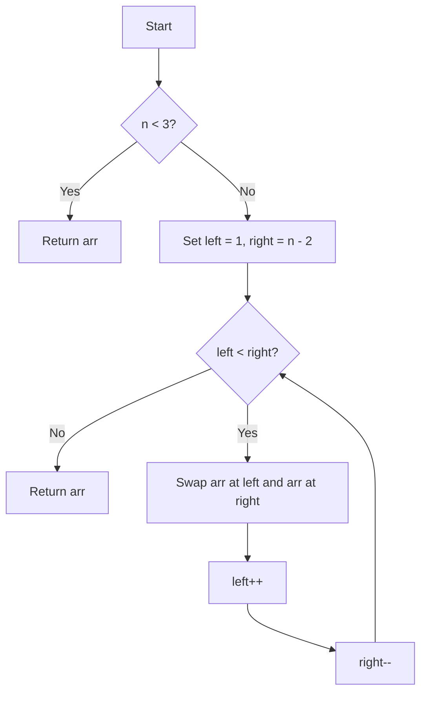

# ARR-002: Bench Flip With Locked Ends

## 📋 Problem Summary

Reverse the elements of an array _in-place_, but keep the first and last elements fixed. Only the subarray from index `1` to `n-2` is reversed.

## 🌍 Real-World Scenario

**Scenario Title:** 🎭 The Theater Row Seat Shuffle

### The Problem

You're organizing a school play, and students are seated in a row:

```
[Teacher] [Alice] [Bob] [Carol] [Dave] [Principal]
```

The drama teacher says: **"Let's reverse the student seating for Act 2, but keep the Teacher and Principal at the ends!"**

After the shuffle:

```
[Teacher] [Dave] [Carol] [Bob] [Alice] [Principal]
```

The students in the middle switched positions (reversed order), but the VIPs stayed put!

### Why This Matters

**📱 Real Applications You Use Daily:**

1. **Undo/Redo Buffer**: Text editors reverse recent operations while keeping bookmarks
2. **Playlist Shuffling**: Shuffle middle songs but keep intro/outro tracks fixed
3. **Photo Gallery**: Reverse album order but keep cover and last photo in place
4. **Game Leaderboards**: Reverse middle ranks while keeping #1 and last place highlighted
5. **Browser History**: Reverse recent tabs but keep homepage and current page

### Constraints in Real World

- **Memory**: Can't create copies (millions of items)
- **Performance**: Must happen instantly (< 50ms)
- **Safety**: Can't lose data during reversal

### From Real World to Algorithm

**The Challenge:** How do you reverse elements in the middle without:

1. Using extra memory (no copies)
2. Touching the first and last elements
3. Taking more than one pass through the data

**The Insight:** Use two pointers moving from outside-in, swapping as they go!


## Detailed Explanation

### ASCII Diagram: The Swap Process

```
Index:    0     1     2     3     4
Value:   [9]   [3]   [8]   [1]   [5]
          ^     ^           ^     ^
        Locked  |           |   Locked
                L           R
               (Swap 3 & 1)

Result:  [9]   [1]   [8]   [3]   [5]
          ^           ^           ^
        Locked      Done        Locked
```

### 🎨 Concept Visualization: Two-Pointer Reversal

Think of it like **two people walking towards each other**, swapping items as they meet:

```
Round 1: Swap elements at positions 1 and 4
[9] [3] [8] [1] [5]
     ↓         ↓
    Left      Right
     └─ swap ─┘

[9] [1] [8] [3] [5]

Round 2: Pointers move closer
[9] [1] [8] [3] [5]
         ↓
      They meet - DONE!
```

### 🔄 Algorithm Flow Diagram

<!-- mermaid -->


> Flipping the middle is like turning a sandwich without touching the crust.

```
┌─────────────────────────────────┐
│  Start: Check if n < 3          │
└────────────┬────────────────────┘
             │
      ┌──────▼───────┐
      │ n < 3?       │
      └──────┬───────┘
         YES │  NO
             │  │
     ┌───────┘  └──────────┐
     │                     │
     ▼                     ▼
┌─────────┐      ┌──────────────────┐
│ Return  │      │ left = 1         │
│ (no op) │      │ right = n - 2    │
└─────────┘      └────────┬─────────┘
                          │
                          ▼
                  ┌───────────────┐
                  │ left < right? │←─────┐
                  └───────┬───────┘      │
                      YES │  NO          │
                          │  │           │
                  ┌───────┘  └─────┐    │
                  │                │    │
                  ▼                ▼    │
         ┌─────────────────┐  ┌────────┴────┐
         │ Swap arr[left]  │  │   Return    │
         │ and arr[right]  │  │  (finished) │
         └────────┬────────┘  └─────────────┘
                  │
                  ▼
         ┌─────────────────┐
         │ left++          │
         │ right--         │
         └────────┬────────┘
                  │
                  └──────────────────┘
```
### Core Idea: In-Place Swapping

**Why create a copy when you can just swap?**

Imagine having two books you want to exchange:

- **Bad way**: Get a third person to hold one book temporarily (extra space)
- **Good way**: Hand both books simultaneously (in-place swap)

```
Before:  left → [A]    [B] ← right

Swap:    left → [B]    [A] ← right

Move:    left →  [B][A]  ← right
```

This is exactly what we do with array elements!

## 🎯 Edge Cases to Test

Before coding, identify tricky test cases:

1. **Array Too Small (n < 3)**

   - Input: `n=0, arr=[]`
   - Expected: `[]` (no elements to reverse)
   - Input: `n=1, arr=[5]`
   - Expected: `[5]` (no middle)
   - Input: `n=2, arr=[3, 7]`
   - Expected: `[3, 7]` (no middle, both are ends)

2. **Exactly 3 Elements (Minimum Valid)**

   - Input: `arr=[1, 2, 3]`
   - Expected: `[1, 2, 3]` (only one middle element, stays same)
   - Why tricky: left=1, right=1, so while loop doesn't execute

3. **Four Elements**

   - Input: `arr=[1, 2, 3, 4]`
   - Expected: `[1, 3, 2, 4]` (swap indices 1 and 2)
   - Why tricky: Single swap then pointers cross

4. **Five Elements (Odd Middle)**

   - Input: `arr=[9, 3, 8, 1, 5]`
   - Expected: `[9, 1, 8, 3, 5]`
   - Why tricky: Middle element stays in place

5. **Six Elements (Even Middle)**

   - Input: `arr=[1, 2, 3, 4, 5, 6]`
   - Expected: `[1, 5, 4, 3, 2, 6]`
   - Why tricky: All middle elements change positions

6. **Duplicate Values**

   - Input: `arr=[7, 2, 2, 2, 7]`
   - Expected: `[7, 2, 2, 2, 7]` (looks same but swaps happened)
   - Why tricky: Visual confirmation harder

7. **Negative Numbers**
   - Input: `arr=[-5, -3, 0, 2, 10]`
   - Expected: `[-5, 2, 0, -3, 10]`
   - Why tricky: Tests if swap logic handles negatives

## ✅ Input/Output Clarifications (Read This Before Coding)

**Critical Points:**

- **Affected Range**: Only indices `1` to `n-2` are reversed

  - Index 0 stays put (first element)
  - Index n-1 stays put (last element)
  - If `n < 3`, there's no middle → no operation

- **In-Place Modification**:

  - ✅ **Correct**: Modify the array directly
  - ❌ **Wrong**: Create a new array (wastes O(n) space)

- **Return Value**:
  - Most implementations are `void` (modify in-place)
  - Some return the modified array for chaining

**Common Misinterpretation:**

| ❌ WRONG                                | ✅ RIGHT                             |
| :-------------------------------------- | :----------------------------------- |
| Reverse entire array (including ends)   | Keep ends fixed, reverse middle only |
| Create new array with reversed elements | Modify original array in-place       |
| Use recursion (unnecessary overhead)    | Use iterative two-pointer approach   |

### Core Concept: Two Pointers

We use two pointers, `left` starting at 1 and `right` starting at `n-2`. We swap elements at these pointers and move them towards each other until they meet.

### Why Naive Approach is Less Efficient

A "Naive" approach might copy the middle elements to a temporary array, reverse that temporary array, and copy them back. While this works, it uses **O(N)** extra space, which is unnecessary.

## Naive Approach (Extra Space)

### Intuition

Extract the middle part, reverse it in a separate list, and put it back.

### Algorithm

1. If `n < 3`, return.
2. Create a temporary list containing elements `arr[1...n-2]`.
3. Reverse the temporary list.
4. Overwrite `arr[1...n-2]` with values from the reversed list.

### Time Complexity

- **O(N)**: We iterate through the middle elements twice (copy out, copy in).

### Space Complexity

- **O(N)**: We store the middle segment, taking memory proportional to the input size.

### Why This Works

It correctly reverses the values conceptually.

### Limitations

- **Memory Usage**: For very large arrays (e.g., restricted embedded systems), allocating O(N) memory might be disallowed.

## Optimal Approach (In-Place Two Pointers)

### Key Insight

We can reverse the segment by swapping elements pairs from the outside in.
`arr[1]` swaps with `arr[n-2]`
`arr[2]` swaps with `arr[n-3]`
...and so on.

### Algorithm

1. Handle edge case: if `n < 3`, return immediately.
2. Initialize `left = 1`.
3. Initialize `right = n - 2`.
4. While `left < right`:
   a. Swap `arr[left]` and `arr[right]`.
   b. Increment `left`.
   c. Decrement `right`.

### Time Complexity

- **O(N)**: We touch each element in the middle segment once. Specifically, we perform `(N-2)/2` swaps.

### Space Complexity

- **O(1)**: We only use two integer variables (`left`, `right`) regardless of array size.

### Why This Is Optimal

You must visit at least half the elements to swap them, so O(N) time is lower-bound. O(1) space is the theoretical minimum.


## Implementations

### Java
```java
import java.util.*;

class Solution {
    public void benchFlipLockedEnds(int[] arr) {
        if (arr == null || arr.length < 3) {
            return;
        }
        
        int left = 1;
        int right = arr.length - 2;
        
        while (left < right) {
            // Swap
            int temp = arr[left];
            arr[left] = arr[right];
            arr[right] = temp;
            
            // Move pointers
            left++;
            right--;
        }
    }
}

public class Main {
    public static void main(String[] args) {
        Scanner sc = new Scanner(System.in);
        if (!sc.hasNextInt()) return;
        int n = sc.nextInt();
        int[] arr = new int[n];
        for (int i = 0; i < n; i++) {
            arr[i] = sc.nextInt();
        }

        Solution solution = new Solution();
        solution.benchFlipLockedEnds(arr);
        
        StringBuilder sb = new StringBuilder();
        for (int i = 0; i < n; i++) {
            sb.append(arr[i]).append(i == n - 1 ? "" : " ");
        }
        System.out.println(sb);
        sc.close();
    }
}
```

### Python
```python
import sys

def bench_flip_locked_ends(arr: list[int]) -> None:
    """
    Reverse array in-place, locking first and last elements.
    """
    n = len(arr)
    if n < 3:
        return
        
    left = 1
    right = n - 2
    
    while left < right:
        # Swap
        arr[left], arr[right] = arr[right], arr[left]
        left += 1
        right -= 1

def main():
    n = int(input())
    arr = list(map(int, input().split()))

    bench_flip_locked_ends(arr)
    print(" ".join(map(str, arr)))

if __name__ == "__main__":
    main()
```

### C++
```cpp
#include <iostream>
#include <vector>
#include <algorithm>
using namespace std;

class Solution {
public:
    void benchFlipLockedEnds(vector<int>& arr) {
        int n = arr.size();
        if (n < 3) return;
        
        int left = 1;
        int right = n - 2;
        
        while (left < right) {
            swap(arr[left], arr[right]);
            left++;
            right--;
        }
    }
};

int main() {
    ios::sync_with_stdio(false);
    cin.tie(nullptr);

    int n;
    if (!(cin >> n)) return 0;
    
    vector<int> arr(n);
    for (int i = 0; i < n; i++) {
        cin >> arr[i];
    }

    Solution solution;
    solution.benchFlipLockedEnds(arr);
    
    for (int i = 0; i < n; i++) {
        cout << arr[i] << (i == n - 1 ? "" : " ");
    }
    cout << "\n";
    return 0;
}
```

### JavaScript
```javascript
const readline = require("readline");

class Solution {
  benchFlipLockedEnds(arr) {
    const n = arr.length;
    if (n < 3) return;
    
    let left = 1;
    let right = n - 2;
    
    while (left < right) {
      // Swap elements
      let temp = arr[left];
      arr[left] = arr[right];
      arr[right] = temp;
      
      left++;
      right--;
    }
  }
}

const rl = readline.createInterface({
  input: process.stdin,
  output: process.stdout,
});

let data = [];
rl.on("line", (line) => data.push(line.trim()));
rl.on("close", () => {
    if (data.length === 0) return;
    
    const tokens = data.join(" ").split(/\s+/);
    if (tokens.length === 0 || tokens[0] === "") return;
    
    let ptr = 0;
    const n = Number(tokens[ptr++]);
    const arr = [];
    for (let i = 0; i < n; i++) {
        arr.push(Number(tokens[ptr++]));
    }
    
    const solution = new Solution();
    solution.benchFlipLockedEnds(arr);
    console.log(arr.join(" "));
});
```

## 🧪 Test Case Walkthrough (Dry Run)

**Input**: `[9, 3, 8, 1, 5]` (`n=5`)

**Setup**:

- `left` starts at 1 (value 3)
- `right` starts at 3 (value 1)

**Iteration 1**:

- Condition `left < right` (1 < 3) is true.
- **Swap** `arr[1]` and `arr[3]`.
  - Array becomes: `[9, 1, 8, 3, 5]`
- `left` becomes 2.
- `right` becomes 2.

**Iteration 2**:

- Condition `left < right` (2 < 2) is **false**.
- Loop terminates.

**Final Result**: `[9, 1, 8, 3, 5]`


## ✅ Proof of Correctness

### Invariant

At any step, the subarray `arr[1...left-1]` has been swapped with `arr[right+1...n-2]`, and the middle section `arr[left...right]` is yet to be reversed.

### Why the approach is correct

The algorithm symmetrically swaps elements from the ends of the target range inward.

- First swap exchanges the outermost elements of the inner segment.
- Subsequent swaps handle the inner layers.
- When `left >= right`, all necessary pairs have been swapped, and the center element (if any) remains in place correctly.

## 💡 Interview Extensions (High-Value Add-ons)

- **Generalization**: "Write a function to reverse a subarray from index `i` to `j`." (A: Pass `i` and `j` as initial pointer values).
- **Linked List**: "How would you do this for a Doubly Linked List?" (A: Similar logic). "Singly Linked List?" (A: Much harder, need to reverse links).

## Common Mistakes to Avoid

1. **Incorrect Bounds**

   - ❌ Starting pointers at `0` and `n-1`.
   - ✅ Read requirements carefully: FIRST and LAST are locked. Start at `1` and `n-2`.

2. **Pointer Crossing**

   - ❌ Using `while left != right`.
   - ✅ Use `while left < right`. If length is even, they will cross but never look equal.

3. **Empty/Small Array**
   - ❌ Forgetting `n=0` or `n=1` cases, leading to IndexOutOfBoundException.
   - ✅ Add check `if n < 3: return`.

## Related Concepts

- **Rotation**: Rotating an array often involves three reversals.
- **Palindrome Check**: Inspecting from ends inward.
