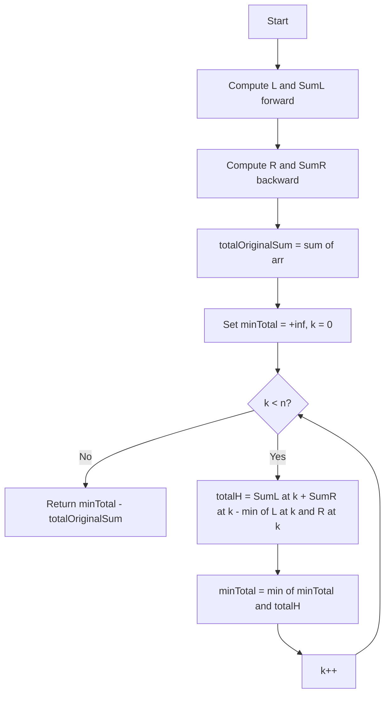

# ARR-011: Leaky Roof Reinforcement

## 📋 Problem Summary

Modify the array heights by increasing them such that the array becomes "pyramid-shaped" (non-decreasing up to a peak, then non-increasing). Minimize the total height added.

## 🌍 Real-World Scenario

**Scenario Title:** The Warehouse Roof Repair

You are reinforcing the flat, leaky roof of a large warehouse. To ensure proper drainage, the roof must slope downwards from a single ridge (the peak) to both sides.

- Current state: An irregular chaotic profile.
- Requirement: You can add insulation layers (increase height) but cannot cut the roof (decrease height).
- Goal: Create a perfect pyramid shape `... <= h[i] <= h[i+1] ... Peak ... h[j] >= h[j+1] >= ...` using the minimum amount of material.

**Why This Problem Matters:**

- **Unimodal Sequences**: Optimizing data to fit a specific geometric profile.
- **Prefix/Suffix Arrays**: Using precomputed auxiliary arrays to solve "best split point" problems in linear time.
- **Constraints**: "Only increase" is a key greedy constraint often found in resource allocation.


## Detailed Explanation

### ASCII Diagram: Forming the Pyramid

```
Original: [4] [1] [3] [1] [5]

Candidate 1: Peak at index 4 (Value 5)
Left side must be non-decreasing ending at 5.
[4] -> 4
[1] -> max(4, 1) = 4
[3] -> max(4, 3) = 4
[1] -> max(4, 1) = 4
[5] -> 5 (Peak)
Result: [4, 4, 4, 4, 5]. Total = 21.

Candidate 2: Peak at index 1 (Value 1)
- Natural height forced to 4 due to left neighbor's value of 4
- Left side: [4, 4]
- Right side (non-increasing): starts at 4, must handle remaining values
- Result: [4, 4, 4, 4, 5] (right side value 5 forces the peak to be 5)
```

### 🔄 Algorithm Flow Diagram

<!-- mermaid -->


> A pyramid stands tallest when the base is steady.

## ✅ Input/Output Clarifications (Read This Before Coding)

- **Non-decreasing**: `x <= y`. Equal values are allowed (flat spots).
- **Peak choice**: You iterate through all possible indices `i` to be the peak.
- **Height Calculation**: Total height of the modified array minus sum of original array.

Common interpretation mistake:

- ❌ Trying to simulate "water flow" or Trapping Rain Water logic. This is about _shape constraints_, not volume filling.
- ✅ Understanding that if index `i` is the peak, `new_arr[i] = max(L[i], R[i])` where `L` and `R` are "natural" non-decreasing/non-increasing limits.

### Core Concept: Natural Floors

For any index `i`, if it belongs to the "left slope", its height must be at least `max(arr[0...i])`.

**Reasoning**: Because `new[i] >= new[i-1] >= ... >= arr[0]` and `new[i] >= arr[i]`, therefore `new[i] >= max(original prefix)`.

Formally: `L[i] = max(arr[i], L[i-1])`.

Similarly for the right slope: `R[i] = max(arr[i], R[i+1])`.

### Why Naive Approach is too slow

Iterating every possible peak `k`, then scanning left and right to compute sums is O(N) per peak -> Total O(N²).
With N=200,000, we need O(N).

## Naive Approach

### Intuition

Try every index as peak. Build the array. Sum it. Minimize.

### Algorithm

1. `min_total = infinity`.
2. Loop `k` from 0 to `n-1`.
   - `peak_val = arr[k]`.
   - Scan left `j=k-1...0`: `h[j] = max(arr[j], h[j+1])`? No, left is non-dec. `h[j] = min(h[j+1], ...)`? Wait.
   - The greedy construction for a fixed peak is tricky in loop.
   - Correct logic: Peak `k` forces `h[k] >= arr[k]`. Also neighbors force `h[k]` potentially higher.
   - This suggests O(N²) is not even trivial to write correctly without precomputation.

### Time Complexity

- **O(N²)**.

### Space Complexity

- **O(N)**.

## Optimal Approach (Prefix/Suffix Scan)

### Key Insight

Let `L[i]` be the lowest possible height of `i` if `0...i` is non-decreasing.
`L[i] = max(arr[i], L[i-1])`.
Let `SumL[i]` be the sum of heights `0...i` configured as minimal non-decreasing sequence ending at `L[i]`.
`SumL[i] = SumL[i-1] + L[i]`.

Similarly for `R[i]` (suffix non-increasing) and `SumR[i]`.
`R[i] = max(arr[i], R[i+1])`.
`SumR[i] = SumR[i+1] + R[i]`.

For a generic peak at `k`, the sequence is `0...k` (left slope) and `k...n-1` (right slope).
The value at `k` must satisfy both sides. Effectively `FinalPeak = max(L[k], R[k])`.
The total sum = `(SumL[k] adjusted for FinalPeak) + (SumR[k] adjusted for FinalPeak) - FinalPeak`.
Since `L[k]` and `R[k]` are the "floors" for index `k`, raising `k` to `FinalPeak` simply adds `(FinalPeak - L[k])` cost to the left sum, and `(FinalPeak - R[k])` to the right sum.
Why? Because raising the end of a non-decreasing sequence doesn't force previous elements to raise further (they were bounded by `L[k]`, now bounded by `FinalPeak` which is looser).

Final Formula for Peak `k`:
`Cost = SumL[k] + SumR[k] - min(L[k], R[k])`.

### Algorithm

1. Compute `L` and `SumL` arrays (Forward).
2. Compute `R` and `SumR` arrays (Backward).
3. `TotalOriginalSum = sum(arr)`.
4. Iterate `k` from 0 to `n-1`:
   - `TotalH = SumL[k] + SumR[k] - min(L[k], R[k])`
   - `MinH = min(MinH, TotalH)`
5. Return `MinH - TotalOriginalSum`.

### Time Complexity

- **O(N)**: 3 linear passes.

### Space Complexity

- **O(N)**: Auxiliary arrays.

### Why This Is Optimal

Linear processing of the array is required.


## Implementations

### Java
```java
import java.util.*;

class Solution {
    public long minPlanksForRoof(int[] height) {
        int n = height.length;
        if (n == 0) return 0;

        long[] L = new long[n];
        long[] SumL = new long[n];

        L[0] = height[0];
        SumL[0] = height[0];
        for (int i = 1; i < n; i++) {
            L[i] = Math.max(height[i], L[i - 1]);
            SumL[i] = SumL[i - 1] + L[i];
        }

        long[] R = new long[n];
        long[] SumR = new long[n];

        R[n - 1] = height[n - 1];
        SumR[n - 1] = height[n - 1];
        for (int i = n - 2; i >= 0; i--) {
            R[i] = Math.max(height[i], R[i + 1]);
            SumR[i] = SumR[i + 1] + R[i];
        }

        long minTotalHeight = Long.MAX_VALUE;
        for (int i = 0; i < n; i++) {
            long currentTotal = SumL[i] + SumR[i] - Math.min(L[i], R[i]);
            minTotalHeight = Math.min(minTotalHeight, currentTotal);
        }

        long originalSum = 0;
        for (int h : height) originalSum += h;

        return minTotalHeight - originalSum;
    }
}

public class Main {
    public static void main(String[] args) {
        Scanner sc = new Scanner(System.in);
        if (!sc.hasNextInt()) return;
        int n = sc.nextInt();
        int[] height = new int[n];
        for (int i = 0; i < n; i++) height[i] = sc.nextInt();

        Solution solution = new Solution();
        long result = solution.minPlanksForRoof(height);
        System.out.println(result);
        sc.close();
    }
}
```

### Python
```python
import sys

def min_planks_for_roof(height: list[int]) -> int:
    n = len(height)
    if n == 0: return 0

    L = [0] * n
    SumL = [0] * n

    L[0] = height[0]
    SumL[0] = height[0]
    for i in range(1, n):
        L[i] = max(height[i], L[i-1])
        SumL[i] = SumL[i-1] + L[i]

    R = [0] * n
    SumR = [0] * n

    R[n-1] = height[n-1]
    SumR[n-1] = height[n-1]
    for i in range(n-2, -1, -1):
        R[i] = max(height[i], R[i+1])
        SumR[i] = SumR[i+1] + R[i]

    min_total_height = float('inf')

    for i in range(n):
        # min(L[i], R[i]) is subtracted because it is double counted in SumL and SumR
        # And peak must be max(L[i], R[i]).
        # Formula derivation: SumL (ends at L[i]) + SumR (starts at R[i]).
        # If we align at Peak = H, we add (H-L[i]) to LeftSum and (H-R[i]) to RightSum
        # Total = SumL + (H-L) + SumR + (H-R) - H (overlap)
        # = SumL + SumR + H - L - R
        # With H = max(L, R), this simplifies to SumL + SumR - min(L, R).

        current_total = SumL[i] + SumR[i] - min(L[i], R[i])
        min_total_height = min(min_total_height, current_total)

    return min_total_height - sum(height)

def main():
    n = int(input())
    height = list(map(int, input().split()))

    result = min_planks_for_roof(height)
    print(result)

if __name__ == "__main__":
    main()
```

### C++
```cpp
#include <iostream>
#include <vector>
#include <algorithm>
#include <numeric>
#include <cmath>
#include <climits>
using namespace std;

class Solution {
public:
    long long minPlanksForRoof(vector<int>& height) {
        int n = height.size();
        if (n == 0) return 0;

        vector<long long> L(n), SumL(n);
        L[0] = height[0];
        SumL[0] = height[0];
        for (int i = 1; i < n; i++) {
            L[i] = max((long long)height[i], L[i - 1]);
            SumL[i] = SumL[i - 1] + L[i];
        }

        vector<long long> R(n), SumR(n);
        R[n - 1] = height[n - 1];
        SumR[n - 1] = height[n - 1];
        for (int i = n - 2; i >= 0; i--) {
            R[i] = max((long long)height[i], R[i + 1]);
            SumR[i] = SumR[i + 1] + R[i];
        }

        long long minTotalHeight = LLONG_MAX;
        for (int i = 0; i < n; i++) {
            long long currentTotal = SumL[i] + SumR[i] - min(L[i], R[i]);
            minTotalHeight = min(minTotalHeight, currentTotal);
        }

        long long originalSum = 0;
        for (int h : height) originalSum += h;

        return minTotalHeight - originalSum;
    }
};

int main() {
    ios::sync_with_stdio(false);
    cin.tie(nullptr);

    int n;
    if (!(cin >> n)) return 0;

    vector<int> height(n);
    for (int i = 0; i < n; i++) cin >> height[i];

    Solution solution;
    cout << solution.minPlanksForRoof(height) << "\n";
    return 0;
}
```

### JavaScript
```javascript
const readline = require("readline");

class Solution {
  minPlanksForRoof(height) {
    const n = height.length;
    if (n === 0) return 0;

    const L = new BigInt64Array(n);
    const SumL = new BigInt64Array(n);

    L[0] = BigInt(height[0]);
    SumL[0] = BigInt(height[0]);
    for (let i = 1; i < n; i++) {
      const h = BigInt(height[i]);
      L[i] = h > L[i - 1] ? h : L[i - 1];
      SumL[i] = SumL[i - 1] + L[i];
    }

    const R = new BigInt64Array(n);
    const SumR = new BigInt64Array(n);

    R[n - 1] = BigInt(height[n - 1]);
    SumR[n - 1] = BigInt(height[n - 1]);
    for (let i = n - 2; i >= 0; i--) {
      const h = BigInt(height[i]);
      R[i] = h > R[i + 1] ? h : R[i + 1];
      SumR[i] = SumR[i + 1] + R[i];
    }

    let minTotalHeight = -1n;

    for (let i = 0; i < n; i++) {
      let minLR = L[i] < R[i] ? L[i] : R[i];
      let currentTotal = SumL[i] + SumR[i] - minLR;

      if (minTotalHeight === -1n || currentTotal < minTotalHeight) {
        minTotalHeight = currentTotal;
      }
    }

    let originalSum = 0n;
    for (const h of height) originalSum += BigInt(h);

    const result = minTotalHeight - originalSum;
    return result.toString();
  }
}

const rl = readline.createInterface({
  input: process.stdin,
  output: process.stdout,
});

let data = [];
rl.on("line", (line) => data.push(line.trim()));
rl.on("close", () => {
  if (data.length === 0) return;
  const tokens = data.join(" ").split(/\s+/);
  if (tokens.length === 0 || tokens[0] === "") return;

  let ptr = 0;
  const n = Number(tokens[ptr++]);
  const height = [];
  for (let i = 0; i < n; i++) height.push(Number(tokens[ptr++]));

  const solution = new Solution();
  console.log(solution.minPlanksForRoof(height));
});
```

## 🧪 Test Case Walkthrough (Dry Run)

**Input**: `[4, 1, 3, 1, 5]`
**Arrays**:

- `L`: `[4, 4, 4, 4, 5]`
- `SumL`: `[4, 8, 12, 16, 21]`
- `R`: `[5, 5, 5, 5, 5]`
- `SumR`: `[25, 20, 15, 10, 5]`

**Scan**:

- i=0: `4 + 25 - 4 = 25`.
- i=1: `8 + 20 - min(4,5) = 24`.
- i=2: `12 + 15 - 4 = 23`.
- i=3: `16 + 10 - 4 = 22`.
- i=4: `21 + 5 - 5 = 21`.

**Min**: 21.
**Original Sum**: `4+1+3+1+5 = 14`.
**Result**: `21 - 14 = 7`. Matches Example.


## ✅ Proof of Correctness

### Invariant

`SumL[i]` is the minimal cost to make the prefix `0...i` non-decreasing. Any other non-decreasing prefix ending at index `i` must have height `H >= L[i]` and thus would cost `SumL[i] + (H - L[i]) * (something)`. The greedy choice of `L[i]` is optimal for fixed index constraints.

### Why the approach is correct

The global optimum must have _some_ peak index. Our linear scan exhaustively checks every possible peak loction efficiently, ensuring the global minimum is found.

## 💡 Interview Extensions (High-Value Add-ons)

- **Bitonic Subsequence**: Longest Bitonic Subsequence (DP, O(N log N) or O(N^2)). This is related but about _subsequences_, not modification.
- **Two Peaks**: What if "M" shape? (Scan for best valley).

## Common Mistakes to Avoid

1. **Double Counting Peak**:

   - ❌ `SumL[i] + SumR[i]` adds the peak column twice.
   - ✅ Correct formula: `SumL + SumR - min(L, R)`

   **Derivation**:

   - `SumL` uses peak height `L[i]`
   - `SumR` uses peak height `R[i]`
   - Actual peak `P = max(L[i], R[i])`
   - Left contributions: `SumL + (P - L[i])`
   - Right contributions: `SumR + (P - R[i])`
   - Total = `SumL + SumR + P - L[i] - R[i]`
   - Since `P = max(L, R)`, we have `P - L - R = -min(L, R)`
   - Therefore: Total = `SumL + SumR - min(L, R)`
   - So YES, `SumL + SumR - min(L, R)` is correct.

2. **Overflow**:
   - ❌ Using int for sums.
   - ✅ Use long.

## Related Concepts

- **Trapping Rain Water**: But inverted (filling valleys vs building peaks).
- **Product of Array Except Self**: Prefix/Suffix pattern.
