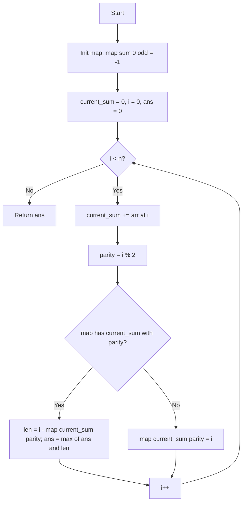

# ARR-012: Longest Zero-Sum Even Length

## 📋 Problem Summary

Find the length of the longest subarray that has a sum of exactly `0` AND has an **even length**.

## 🌍 Real-World Scenario

**Scenario Title:** The Balanced Shift Paired Review

A team works in pairs. You log the performance rating of shifts sequentially. Some shifts are positive (productive), some negative (setbacks).
Management wants to find the longest period of time where the total performance net change is zero (stability), but only considers periods where full pairs of shifts were completed (even number of shifts).
Finding this helps identify stable "epochs" in the project history that were fully staffed by pairs.

**Why This Problem Matters:**

- **Parity Constraints**: Adding "Modulo" constraints to standard subarray problems is a common variation.
- **Hash Maps for State**: Tracking `(Sum, Attribute)` pairs.
- **Zero-Sum logic**: Fundamental to many "equilibrium" problems.


## Detailed Explanation

### ASCII Diagram: Parity Check

```
Idx:    0   1   2   3   4
Arr:   [1] [-1] [2] [-2] [5]
Sum:    1    0   2    0   5

Candidate 1: Subarray [0..1] Sum=0.
Length = 1 - (-1) = 2. Even? Yes. Max=2.

Candidate 2: Subarray [0..3] Sum=0.
Length = 3 - (-1) = 4. Even? Yes. Max=4.

Candidate 3: Subarray [2..3] Sum=0.
Length = 3 - 1 = 2. Even? Yes.

If we had found a Zero Sum of length 3, we would ignore it.
```

### 🔄 Algorithm Flow Diagram

<!-- mermaid -->


> Even lengths keep the books balanced, no odd fees.

## ✅ Input/Output Clarifications (Read This Before Coding)

- **Zero Sum**: `sum(arr[i...j]) == 0`.
- **Even Length**: `j - i + 1` must be divisible by 2.
- **Result**: Return length (integer). 0 if none found.

Common interpretation mistake:

- ❌ Ignoring the even constraint and just returning the longest zero-sum subarray.
- ✅ Tracking occurrences of sums separately for Odd and Even indices.

### Core Concept: Prefix Sum Parity

Length of subarray `arr[i...j]` is `j - i + 1`.
We iterate `j` (current index). We want to find an `i` (start index) such that:

1. `PrefixSum[j] - PrefixSum[i-1] == 0` => `PrefixSum[j] == PrefixSum[i-1]`.
2. `j - (i-1)` is Even.
   This implies `j` and `(i-1)` must have the **same parity** (both even or both odd).

So, for every unique Prefix Sum, we track:

- Earliest occurrence at an EVEN index.
- Earliest occurrence at an ODD index.

### Why Naive Approach is too slow

Checking every subarray is O(N²). N=200,000 requiring O(N).

## Naive Approach

### Intuition

Check all subarrays.

### Algorithm

1. `max_len = 0`
2. Loop `i` from 0 to n:
   - Loop `j` from `i` to n:
     - If `(j-i+1) % 2 == 0` and `sum(i...j) == 0`:
       - `max_len = max(max_len, j-i+1)`
3. Return `max_len`.

### Time Complexity

- **O(N²)**.

### Space Complexity

- **O(1)**.

## Optimal Approach (Hash Map with Parity)

### Key Insight

Use a Hash Map where the key is the `Prefix Sum` and the value is an array/object storing the first index saw for parity 0 and parity 1.
`Map[sum] = { even: index1, odd: index2 }`.

### Algorithm

1. Initialize `map`.
2. Base case: `Sum=0` seen at index `-1`.
   - `-1` is odd. So `map[0][1] = -1`. `map[0][0]` remains null.
3. `current_sum = 0`.
4. Loop `i` from 0 to `n-1`:
   - `current_sum += arr[i]`
   - `parity = i % 2` (or `i & 1`)
   - Check if `map[current_sum]` has an entry for `parity`.
     - If yes: `len = i - map[current_sum][parity]`. `ans = max(ans, len)`.
     - Else: `map[current_sum][parity] = i` (Store first occurrence).
   - **Crucial**: Do NOT overwrite the index if it exists. We want the _longest_ subarray, so we want the _earliest_ start index.

### Time Complexity

- **O(N)**: Single pass. Map operations O(1).

### Space Complexity

- **O(N)**: In worst case, all prefix sums are distinct.

### Why This Is Optimal

We visit every element once.


## Implementations

### Java
```java
import java.util.*;

class Solution {
    public int longestZeroSumEvenLength(int[] arr) {
        // Map: Sum -> int array of size 2. [0] for even index, [1] for odd index.
        // Initialize with Integer.MIN_VALUE or similar to indicate "not seen"
        Map<Long, int[]> map = new HashMap<>();

        long currentSum = 0;
        int maxLen = 0;

        // Base case: Sum 0 at index -1. -1 is odd.
        map.put(0L, new int[]{Integer.MIN_VALUE, -1});

        for (int i = 0; i < arr.length; i++) {
            currentSum += arr[i];
            int parity = i & 1; // 0 for even, 1 for odd

            map.putIfAbsent(currentSum, new int[]{Integer.MIN_VALUE, Integer.MIN_VALUE});
            int[] firstSeen = map.get(currentSum);

            if (firstSeen[parity] != Integer.MIN_VALUE) {
                // Found a previous occurrence with same parity -> length is even
                int len = i - firstSeen[parity];
                if (len > maxLen) {
                    maxLen = len;
                }
            } else {
                // First time seeing this sum with this parity
                firstSeen[parity] = i;
            }
        }

        return maxLen;
    }
}

public class Main {
    public static void main(String[] args) {
        Scanner sc = new Scanner(System.in);
        if (!sc.hasNextInt()) return;
        int n = sc.nextInt();
        int[] arr = new int[n];
        for (int i = 0; i < n; i++) arr[i] = sc.nextInt();

        Solution solution = new Solution();
        int result = solution.longestZeroSumEvenLength(arr);
        System.out.println(result);
        sc.close();
    }
}
```

### Python
```python
import sys

def longest_zero_sum_even_length(arr: list[int]) -> int:
    # Map stores {sum: {0: first_even_idx, 1: first_odd_idx}}
    # Initialize with None
    idx_map = {}

    # Base case: Sum 0 at index -1 (Odd)
    if 0 not in idx_map:
        idx_map[0] = {0: None, 1: -1}

    current_sum = 0
    max_len = 0

    for i, val in enumerate(arr):
        current_sum += val
        parity = i % 2

        if current_sum not in idx_map:
            idx_map[current_sum] = {0: None, 1: None}

        first_indices = idx_map[current_sum]

        if first_indices[parity] is not None:
            length = i - first_indices[parity]
            if length > max_len:
                max_len = length
        else:
            first_indices[parity] = i

    return max_len

def main():
    n = int(input())
    arr = list(map(int, input().split()))

    result = longest_zero_sum_even_length(arr)
    print(result)

if __name__ == "__main__":
    main()
```

### C++
```cpp
#include <iostream>
#include <vector>
#include <unordered_map>
#include <algorithm>
using namespace std;

class Solution {
public:
    int longestZeroSumEvenLength(vector<int>& arr) {
        // sum -> pair<first_even_idx, first_odd_idx>
        // Use -2 to signify "not seen" (since -1 is used for base case)
        unordered_map<long long, pair<int, int>> map;

        // Base case: Sum 0 at index -1 (odd)
        map[0] = {-2, -1};

        long long currentSum = 0;
        int maxLen = 0;

        for (int i = 0; i < arr.size(); i++) {
            currentSum += arr[i];
            int parity = i & 1;

            if (map.find(currentSum) == map.end()) {
                map[currentSum] = {-2, -2};
            }

            pair<int, int>& firstSeen = map[currentSum];
            int prevIdx = (parity == 0) ? firstSeen.first : firstSeen.second;

            if (prevIdx != -2) {
                maxLen = max(maxLen, i - prevIdx);
            } else {
                if (parity == 0) firstSeen.first = i;
                else firstSeen.second = i;
            }
        }

        return maxLen;
    }
};

int main() {
    ios::sync_with_stdio(false);
    cin.tie(nullptr);

    int n;
    if (!(cin >> n)) return 0;

    vector<int> arr(n);
    for (int i = 0; i < n; i++) cin >> arr[i];

    Solution solution;
    cout << solution.longestZeroSumEvenLength(arr) << "\n";
    return 0;
}
```

### JavaScript
```javascript
const readline = require("readline");

class Solution {
  longestZeroSumEvenLength(arr) {
    // Map sum -> [evenIdx, oddIdx]
    const map = new Map();
    // Use null for not seen
    map.set(0n, [null, -1]); // Sum 0 at index -1 (odd)

    let currentSum = 0n;
    let maxLen = 0;

    for (let i = 0; i < arr.length; i++) {
      currentSum += BigInt(arr[i]);
      const parity = i & 1;

      if (!map.has(currentSum)) {
        map.set(currentSum, [null, null]);
      }

      const indices = map.get(currentSum);
      const prevIdx = indices[parity];

      if (prevIdx !== null) {
        const length = i - prevIdx;
        if (length > maxLen) {
          maxLen = length;
        }
      } else {
        indices[parity] = i;
      }
    }

    return maxLen;
  }
}

const rl = readline.createInterface({
  input: process.stdin,
  output: process.stdout,
});

let data = [];
rl.on("line", (line) => data.push(line.trim()));
rl.on("close", () => {
  if (data.length === 0) return;
  const tokens = data.join(" ").split(/\s+/);
  if (tokens.length === 0 || tokens[0] === "") return;

  let ptr = 0;
  const n = Number(tokens[ptr++]);
  const arr = [];
  for (let i = 0; i < n; i++) arr.push(Number(tokens[ptr++]));

  const solution = new Solution();
  console.log(solution.longestZeroSumEvenLength(arr));
});
```

## 🧪 Test Case Walkthrough (Dry Run)

**Input**: `[1, -1, 3, -3, 2]`
Parity Map:

- Init: `0 -> {E: null, O: -1}`

1. `i=0` (Even), Val 1. `Sum=1`. Map: `1 -> {E: 0, O: null}`.
2. `i=1` (Odd), Val -1. `Sum=0`. Map `0` has ODD entry `-1`. Length: `1 - (-1) = 2`. Max=2.
   Map `0` ODD entry exists, don't update.
3. `i=2` (Even), Val 3. `Sum=3`. Map: `3 -> {E: 2, O: null}`.
4. `i=3` (Odd), Val -3. `Sum=0`. Map `0` has ODD entry `-1`. Length: `3 - (-1) = 4`. Max=4.
5. `i=4` (Even), Val 2. `Sum=2`. Map: `2 -> {E: 4, O: null}`.

**Result**: 4. Matches Example.


## ✅ Proof of Correctness

### Invariant

`map[S][parity]` always stores the _first_ index `k` where prefix sum was `S` and `k % 2 == parity`.
If we find current `i` with sum `S` and same parity, then `sum(arr[k+1...i]) = S - S = 0` and length `i - k` is even (difference of same parity nums is even). Since we stored first `k`, `i-k` is max possible for this terminate point.

### Why the approach is correct

Exhaustively checks all valid sub-arrays ending at current position.

## 💡 Interview Extensions (High-Value Add-ons)

- **Divisible by K**: What if length must be divisible by K? (A: Track modulo K indices).
- **Binary Array**: Convert 0s to -1s. Same problem.

## Common Mistakes to Avoid

1. **Parity logic**:
   - ❌ Checking `(i - k) % 2 == 0` explicitly after retrieval.
   - ✅ Storing buckets is cleaner and ensures we pick the right one. Though iterating `[0, 1]` and checking match works, separating them is optimal.
2. **Base Case**:
   - ❌ Forgetting `-1`.
   - ✅ Crucial for subarrays starting at index 0.
