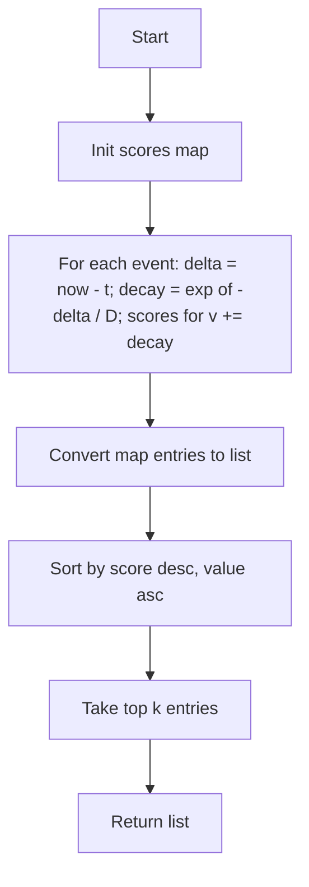

# ARR-013: Tool Frequency Top K with Recency Decay

## 📋 Problem Summary

Calculate a "decayed score" for each unique item based on its occurrence timestamps. The score is the sum of `exp(-(now - t) / D)` for each occurrence `t`. Return the top `k` items with the highest scores.

## 🌍 Real-World Scenario

**Scenario Title:** The Trending Hashtag Algorithm

You are building a "Trending Now" sidebar for a social media platform.
Hashtags appear in a stream. A hashtag mentioned 1 minute ago is more relevant than one mentioned 1 hour ago.
You use an exponential decay model:
- `D` (Half-life constant): Controls how fast relevance drops.
- `now`: Current time.
- `t`: Tweet time.
Values accumulate score. You need to periodically query the top `k` trending tags.

**Why This Problem Matters:**

- **Ranking Algorithms**: Almost all feed ranking involves recency weighting (Hacker News, Reddit).
- **Aggregation**: Grouping large streams of data by key.
- **Top-K**: Efficiently extracting the "best" elements from a large set.


## Detailed Explanation

### ASCII Diagram: Score Accumulation
```
Item 'A': Occurrences at t=0, t=10.
Item 'B': Occurrence at t=12.
Now=15. D=5.

Score(A):
  t=0:  exp(-(15-0)/5) = exp(-3)   ≈ 0.049
  t=10: exp(-(15-10)/5) = exp(-1)  ≈ 0.367
  Total ≈ 0.416

Score(B):
  t=12: exp(-(15-12)/5) = exp(-0.6) ≈ 0.548

Winner: B (0.548 > 0.416) even though A appeared twice. Recency wins.
```

### 🔄 Algorithm Flow Diagram

<!-- mermaid -->


> In trends, fresh beats steady, even if the old song played twice.

## ✅ Input/Output Clarifications (Read This Before Coding)

- **Precision**: Use double-precision floating point.
- **Ties**: If scores are identical (rare with floats, but possible), break ties by **smaller value ID**.
- **Input Order**: Timestamps are non-decreasing, but values are mixed.

Common interpretation mistake:

- ❌ Averaging the timestamps.
- ✅ Summing the exponential decay of *each* timestamp independently. Nonlinearity means `exp(a) + exp(b) != exp(a+b)`.

### Core Concept: Hash Aggregation

We cannot process the stream in O(1) space if we need exact scores for everyone. We must aggregate all occurrences.
Key approach:
1. `Map<Value, Score>`
2. For each event `(v, t)`, `Score[v] += exp(-(now - t) / D)`.
3. Sort keys by Score.

### Why Naive Approach is too slow

Sorting the entire raw event list by score is wrong (we need score *per value*).
Iterating the unique values and doing a linear scan of events for each value would be O(Unique * N) ~ O(N²). We must aggregate in one pass.

## Naive Approach (Nested)

### Intuition

For each unique value, scan array to find its timestamps.

### Algorithm

1. Find unique values.
2. For each unique `u`:
   - Scan event array.
   - If `v == u`: `score += exp(...)`
3. Check max.

### Time Complexity

- **O(N²)**.

### Space Complexity

- **O(N)**.

## Optimal Approach (Hashing + Sort/Heap)

### Key Insight

Use a Hash Map to accumulate scores in a single pass.
Then extract entries and sort them (or use a Min-Heap of size `k` to find top `k`). Since `k` can be up to `N`, sorting is simpler and O(N log N).

### Algorithm

1. Initialize `scores = new HashMap<Integer, Double>()`.
2. Iterate through `events`:
   - `decay = exp(-(now - t) / D)`
   - `scores.put(v, scores.getOrDefault(v, 0.0) + decay)`
3. Convert map entries to a list.
4. Sort list:
   - Primary Key: Score (Descending).
   - Secondary Key: Value (Ascending).
5. Extract top `k`.

### Time Complexity

- **O(N log N)**:
  - Aggregation: O(N).
  - Sorting Unique Items: O(U log U) where U <= N.
  - Overall O(N log N).

### Space Complexity

- **O(N)**: To store map of unique elements.

### Why This Is Optimal

We must look at every event timestamps (O(N)). Sorting the results is dominated by N log N.


## Implementations

### Java
```java
import java.util.*;

class Solution {
    static class Item {
        int value;
        double score;
        Item(int v, double s) { this.value = v; this.score = s; }
    }

    public List<Integer> topKWithDecay(int[][] events, int now, int D, int k) {
        Map<Integer, Double> map = new HashMap<>();
        
        for (int[] event : events) {
            int v = event[0];
            int t = event[1];
            double term = Math.exp(-(double)(now - t) / D);
            map.put(v, map.getOrDefault(v, 0.0) + term);
        }

        List<Item> items = new ArrayList<>();
        for (Map.Entry<Integer, Double> entry : map.entrySet()) {
            items.add(new Item(entry.getKey(), entry.getValue()));
        }

        // Sort: Descending Score, Ascending Value
        items.sort((a, b) -> {
            if (Double.compare(b.score, a.score) != 0) {
                return Double.compare(b.score, a.score);
            }
            return Integer.compare(a.value, b.value);
        });

        List<Integer> result = new ArrayList<>();
        for (int i = 0; i < k && i < items.size(); i++) {
            result.add(items.get(i).value);
        }
        return result;
    }
}

public class Main {
    public static void main(String[] args) {
        Scanner sc = new Scanner(System.in);
        if (!sc.hasNextInt()) return;
        int n = sc.nextInt();
        int[][] events = new int[n][2];
        for (int i = 0; i < n; i++) {
            events[i][0] = sc.nextInt();
            events[i][1] = sc.nextInt();
        }
        int now = sc.nextInt();
        int D = sc.nextInt();
        int k = sc.nextInt();

        Solution solution = new Solution();
        List<Integer> result = solution.topKWithDecay(events, now, D, k);
        StringBuilder sb = new StringBuilder();
        for (int i = 0; i < result.size(); i++) {
            sb.append(result.get(i)).append(i == result.size() - 1 ? "" : " ");
        }
        System.out.println(sb);
        sc.close();
    }
}
```

### Python
```python
import sys
import math

def top_k_with_decay(events: list[tuple[int, int]], now: int, D: int, k: int) -> list[int]:
    scores = {}
    
    for val, t in events:
        term = math.exp(-(now - t) / D)
        scores[val] = scores.get(val, 0.0) + term
        
    # Convert to list of (score, val)
    # Sort key: (-score, val) -> Descending score, Ascending val
    items = []
    for val, score in scores.items():
        items.append((-score, val))
        
    items.sort()
    
    result = []
    for i in range(min(k, len(items))):
        result.append(items[i][1]) # Append val
        
    return result

def main():
    n = int(input())
    events = []
    for _ in range(n):
        value, timestamp = map(int, input().split())
        events.append((value, timestamp))
    now, D, k = map(int, input().split())

    result = top_k_with_decay(events, now, D, k)
    print(" ".join(map(str, result)))

if __name__ == "__main__":
    main()
```

### C++
```cpp
#include <iostream>
#include <vector>
#include <unordered_map>
#include <cmath>
#include <algorithm>
using namespace std;

struct Item {
    int value;
    double score;
};

class Solution {
public:
    vector<int> topKWithDecay(vector<pair<int,int>>& events, int now, int D, int k) {
        unordered_map<int, double> scores;
        
        for (auto& p : events) {
            int v = p.first;
            int t = p.second;
            double term = exp(-(double)(now - t) / D);
            scores[v] += term;
        }
        
        vector<Item> items;
        items.reserve(scores.size());
        for (auto& entry : scores) {
            items.push_back({entry.first, entry.second});
        }
        
        // Sort: Descending Score, Ascending Value
        sort(items.begin(), items.end(), [](const Item& a, const Item& b) {
            if (abs(a.score - b.score) > 1e-9) {
                return a.score > b.score;
            }
            return a.value < b.value;
        });
        
        vector<int> result;
        for (int i = 0; i < k && i < items.size(); i++) {
            result.push_back(items[i].value);
        }
        return result;
    }
};

int main() {
    ios::sync_with_stdio(false);
    cin.tie(nullptr);

    int n;
    if (!(cin >> n)) return 0;
    
    vector<pair<int,int>> events(n);
    for (int i = 0; i < n; i++) cin >> events[i].first >> events[i].second;
    
    int now, D, k;
    cin >> now >> D >> k;

    Solution solution;
    vector<int> result = solution.topKWithDecay(events, now, D, k);
    for (size_t i = 0; i < result.size(); i++) {
        cout << result[i] << (i == result.size() - 1 ? "" : " ");
    }
    cout << "\n";
    return 0;
}
```

### JavaScript
```javascript
const readline = require("readline");

class Solution {
  topKWithDecay(events, now, D, k) {
    const scores = new Map();
    
    for (const [v, t] of events) {
      const term = Math.exp(-(now - t) / D);
      scores.set(v, (scores.get(v) || 0) + term);
    }
    
    const items = [];
    for (const [v, s] of scores.entries()) {
      items.push({ value: v, score: s });
    }
    
    // Sort: Descending Score, Ascending Value
    items.sort((a, b) => {
      if (Math.abs(b.score - a.score) > 1e-9) {
        return b.score - a.score;
      }
      return a.value - b.value;
    });
    
    const result = [];
    for (let i = 0; i < k && i < items.length; i++) {
      result.push(items[i].value);
    }
    return result;
  }
}

const rl = readline.createInterface({
  input: process.stdin,
  output: process.stdout,
});

let data = [];
rl.on("line", (line) => data.push(line.trim()));
rl.on("close", () => {
    if (data.length === 0) return;
    const tokens = data.join(" ").split(/\s+/);
    if (tokens.length === 0 || tokens[0] === "") return;
    
    let ptr = 0;
    const n = Number(tokens[ptr++]);
    const events = [];
    for (let i = 0; i < n; i++) {
      const v = Number(tokens[ptr++]);
      const t = Number(tokens[ptr++]);
      events.push([v, t]);
    }
    
    const now = Number(tokens[ptr++]);
    const D = Number(tokens[ptr++]);
    const k = Number(tokens[ptr++]);
    
    const solution = new Solution();
    const result = solution.topKWithDecay(events, now, D, k);
    console.log(result.join(" "));
});
```

## 🧪 Test Case Walkthrough (Dry Run)

**Input**: `5 0`, `5 1`, `3 2`. `now=5`, `D=2`, `k=1`.

1. **Item 5**:
   - `t=0`: `exp(-2.5) ≈ 0.082`
   - `t=1`: `exp(-2.0) ≈ 0.135`
   - Total ≈ 0.217

2. **Item 3**:
   - `t=2`: `exp(-1.5) ≈ 0.223`
   - Total ≈ 0.223

**Compare**: 0.223 > 0.217. Item 3 wins.
**Result**: `3`. Matches Example.


## ✅ Proof of Correctness

### Invariant

The accumulated score for each value sums the decayed weights of all its occurrences. Sorting by these exact scores yields the correct ranking as per the mathematical definition.

### Why the approach is correct

Direct simulation with efficient aggregation.

## 💡 Interview Extensions (High-Value Add-ons)

- **Streaming**: What if events come infinitely? (A: Exponential Moving Average or HyperLogLog variants for approximation).
- **Large K**: If K is small, Heap is better O(N log K). If K ~ N, Sort is fine.

## Common Mistakes to Avoid

1. **Type errors**:
   - ❌ Using `int` for scores.
   - ✅ `double` is essential.

2. **Score Formula**:
   - ❌ `sum(exp(...))` vs `exp(sum(...))`.
   - ✅ Problem specifies sum of exps.

## Related Concepts

- **Hacker News Ranking**: Similar decay logic.
- **TF-IDF**: Another scoring metric.
