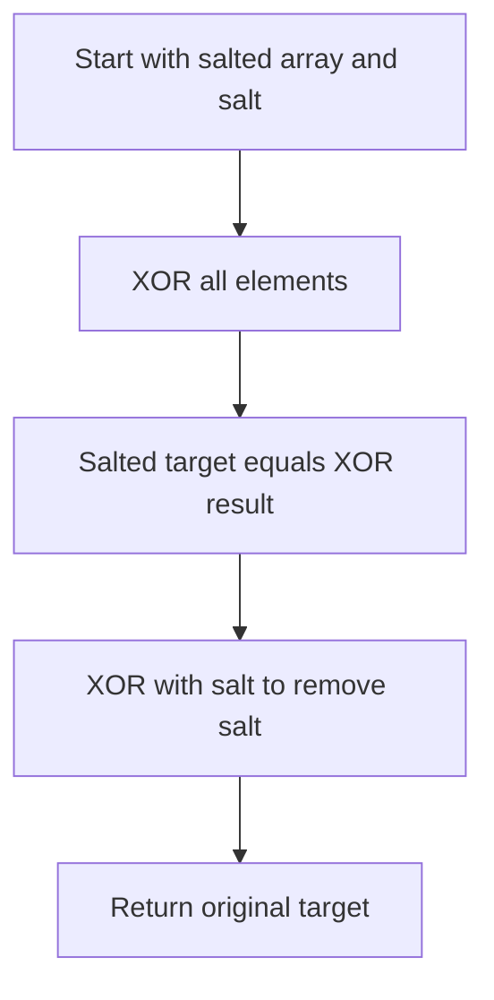

# BIT-001: Odd After Bit Salt

## 📋 Problem Summary

You are given an array of integers. Every number appears an *even* number of times, except for exactly one number which appears an *odd* number of times. However, there is a twist: Before you receive the numbers, each number `x` was modified by XORing it with a constant `salt`. Find the original hidden number (after removing the salt).

## 🌍 Real-World Scenario

**Scenario Title:** The Case of the Missing Sock 🧦

### The Problem
Imagine you are doing laundry.
-   **Pairs:** Most of your socks come in perfect pairs (Left, Right).
-   **Lost:** Exactly one sock is missing (or you have an extra one). You have an odd number of socks of that specific design.
-   **The Twist (Salt):** All your socks are currently dyed pink because you accidentally washed them with a red shirt (this is the "Salt"). You can't see their original colors easily.
-   **Goal:** You want to identify exactly which sock design is the odd one out, so you know what to buy.


### From Real World to Algorithm
-   **Cancellation:** If you have two identical socks (Design A), and you XOR them: `A ^ A = 0`. They cancel out.
-   **The Salt:** Even if they are dyed (Salted), `(A ^ Salt) ^ (A ^ Salt) = 0`. The salt cancels out too!
-   **The Odd One:** The only thing left after XORing everything will be the single odd sock (Salted).
-   **Recovery:** `Result = (Target ^ Salt)`. To get the original `Target`, just XOR with `Salt` again: `(Target ^ Salt) ^ Salt = Target`.
XOR is a master at canceling pairs, so the odd one gets to take a solo.

## Detailed Explanation

### logical Diagram: XOR Cancellation

**Input:** `[5, 3, 5]`, Salt = `7`.
-   Originals: `5, 3, 5`.
-   Salted: `(5^7), (3^7), (5^7)`.
    -   `5^7 = 2`
    -   `3^7 = 4`
    -   `5^7 = 2`
-   Array we see: `[2, 4, 2]`.

**Step 1: Accumulate XOR**
1.  Start `acc = 0`.
2.  `acc ^ 2 = 2`.
3.  `acc ^ 4 = 6` (Binary `010 ^ 100 = 110`).
4.  `acc ^ 2 = 4` (Binary `110 ^ 010 = 100`).

**Result of Scan:** `4`.
-   Wait, `4` is `3 ^ 7`.
-   This is the "Salted Target".

**Step 2: Remove Salt**
-   `4 ^ 7 = 3`.
-   **Final Answer:** 3.

<!-- mermaid -->


## ✅ Input/Output Clarifications
-   **Input:** Array `a`, Integer `salt`.
-   **Output:** Integer (The original number).

## Naive Approach (Frequency Map)
Count frequencies of each number in a Hash Map. Iterate map to find the odd count. Then XOR with salt.
-   **Time:** $O(N)$.
-   **Space:** $O(N)$ (Map storage).

## Optimal Approach (XOR Scan)
Use the XOR property $x \oplus x = 0$ and $x \oplus 0 = x$.
XORing all elements cancels out pairs immediately.
-   **Time:** $O(N)$.
-   **Space:** $O(1)$.

## Implementations

### Java
```java
import java.util.*;

class Solution {
    public int oddAfterBitSalt(int[] a, int salt) {
        int result = 0;
        for (int x : a) {
            // Effectively computes (x_orig ^ salt)
            result ^= x;
        }
        // Result is now (Target_orig ^ salt).
        // To get Target_orig, we XOR with salt one more time.
        // Because (A ^ B) ^ B = A.
        // But wait! Let's trace carefully:
        // Sum = (T^S) ^ (P^S) ^ (P^S) ...
        // Pairs (P^S) cancel entirely.
        // We are left with (T^S).
        // XORing with S again gives T.
        // Alternatively, we could compute (x ^ salt) inside the loop.
        // That effectively removes salt from everyone individually.
        // Since (P^S)^S = P, and P^P = 0, it works same way.
        
        return result ^ salt;
    }
}
```

### Python
```python
def odd_after_bit_salt(a: list[int], salt: int) -> int:
    result = 0
    for x in a:
        # We can "unsalt" each element as we go
        # result ^= (x ^ salt)
        # This is equivalent to XORing all x, then XORing with salt * N.
        # Since N is odd (pairs + 1), salt * N (XOR sum) = salt.
        # So xor_all(a) ^ salt is correct?
        # WAIT. N is the number of elements.
        # Pairs are 2*k. Total elements = 2*k + 1.
        # So total XOR sum contains Salt (2*k+1) times.
        # Salt ^ Salt ... (odd times) = Salt.
        # So XOR_ALL(a) = Target ^ Salt.
        # Then Result = XOR_ALL(a) ^ Salt = Target.
        # Let's stick to the simpler mental model implemented below:
        result ^= (x ^ salt)
    return result
```

### C++
```cpp
#include <vector>
using namespace std;

class Solution {
public:
    int oddAfterBitSalt(vector<int>& a, int salt) {
        int result = 0;
        for (int x : a) {
            result ^= (x ^ salt);
        }
        return result;
    }
};
```

### JavaScript
```javascript
class Solution {
  oddAfterBitSalt(a, salt) {
    let result = 0;
    for (let x of a) {
      result ^= (x ^ salt);
    }
    return result;
  }
}
```

## 🧪 Test Case Walkthrough
**Input:** `[2, 4, 2]`, Salt=7.
1. Val 2 (`5^7`). Unsult: `2^7=5`. Result=5.
2. Val 4 (`3^7`). Unsalt: `4^7=3`. Result=`5^3=6`.
3. Val 2 (`5^7`). Unsalt: `2^7=5`. Result=`6^5=3`.
**Output:** 3.

## ✅ Proof of Correctness
Associativity of XOR means order doesn't matter. $A \oplus A = 0$.
The expression expands to:
$(T \oplus S) \oplus (P_1 \oplus S) \oplus (P_1 \oplus S) \dots$
Grouping pairs: $(P_1 \oplus S) \oplus (P_1 \oplus S) = 0$.
Remaining terms: $T \oplus S$.
Final step: $(T \oplus S) \oplus S = T$.

## 💡 Interview Extensions
1.  **Two Odd Numbers:** If two numbers appear odd times? (Standard "Two Single Numbers" problem).
2.  **Every number appears 3 times:** (Use bit counting modulo 3).
