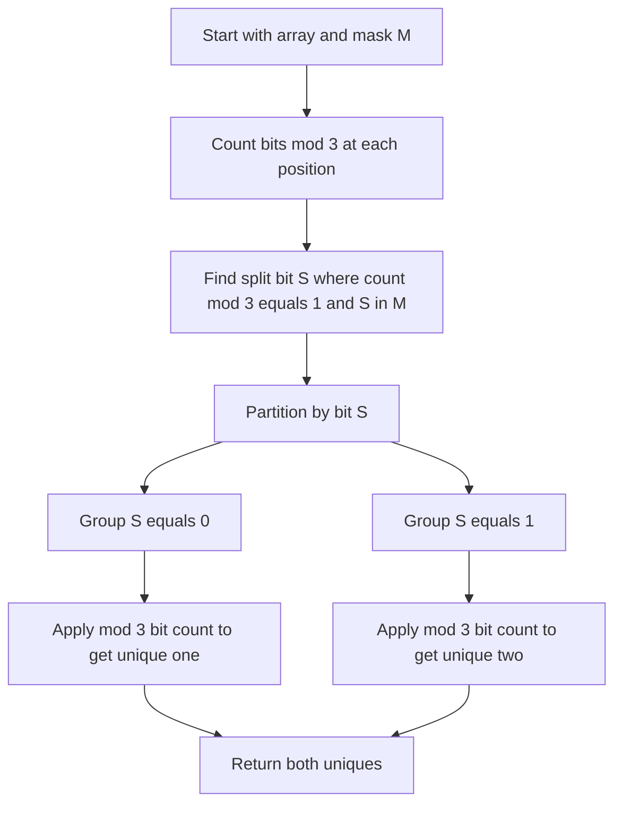

# BIT-002: Two Unique With Triple Others Under Mask

## 📋 Problem Summary

You are given an array where every number appears exactly **three times**, except for **two special numbers** that appear exactly **once**.
You are also given a mask `M`. You must find these two unique numbers.
This is a complex variation combining "Single Number II" (Modulo 3) and "Single Number III" (Split via XOR).

## 🌍 Real-World Scenario

**Scenario Title:** The Class Project Groups 🧑‍🤝‍🧑

### The Problem
You are a teacher organizing a class project.
-   **Groups:** You instructed students to form groups of exactly **3**.
-   **Leftovers:** After everyone grouped up, you notice **2 students** are left standing alone.
-   **Identities:** Students are identified by their Student ID numbers.
-   **Goal:** You have a list of all Student IDs (scanned from the badges of everyone in the room). You want to quickly identify the IDs of the two leftovers.
-   **Constraint:** The list is huge, and your scanner is weird—it can filter bits based on a mask `M`.


### From Real World to Algorithm
-   **Normal Approach:** If we just XOR everything, the groups of 3 don't cancel out ($A \oplus A \oplus A = A$). That fails.
-   **Bit Counting:** If we count the number of times the $i$-th bit is set across all numbers:
    -   For numbers appearing 3 times, their contribution to the count is a multiple of 3.
    -   The remainder `Count % 3` comes entirely from the two unique numbers.
-   **The Ambiguity:** If `Count % 3 == 0`, both unique numbers have a 0 (or both have a 1) at that bit. If `Count % 3 == 1` or `2`, they differ (or both have 1?). It's tricky.
-   **The Split:** We need to separate the two unique numbers into different "buckets" so we can solve for them individually. We need a "Splitting Bit" $k$ where one unique number has a 0 and the other has a 1.
It is a bit of a split decision, but one good separator does all the heavy lifting.

## Detailed Explanation

### logical Diagram: The Modulo 3 Filter

**Input:** `[A, A, A, B, B, B, X, Y]`
For any bit position $i$:
`Sum(Bits) = 3*k + bit(X) + bit(Y)`.

**Truth Table for Sum % 3:**
| X_i | Y_i | Sum % 3 | Meaning |
| :--- | :--- | :--- | :--- |
| 0 | 0 | 0 | Both 0 |
| 0 | 1 | 1 | One is 1, One is 0 |
| 1 | 0 | 1 | One is 1, One is 0 |
| 1 | 1 | 2 | Both 1 |

**Strategy:**
1.  Find a bit position $S$ where `Sum % 3 == 1`.
    -   At this position, exactly one of the unique numbers has a 1, and the other has a 0. This is our **Separator**.
    -   Why not 2? If Sum % 3 == 2, both have 1. Not a separator.
2.  **Partition:** Divide all numbers in the array into two groups:
    -   Group 0: Numbers with bit $S$ unset.
    -   Group 1: Numbers with bit $S$ set.
3.  **Solve:**
    -   In Group 0: One unique number is present. The other triples are present (all 3 copies go here).
    -   In Group 1: The other unique number is present.
    -   Now, for each group, run the "Single Unique in Triples" algorithm (Standard Modulo 3 count) to extract the number.

<!-- mermaid -->


## ✅ Input/Output Clarifications
-   **Input:** Array `a`, Mask `M`.
-   **Result:** List `[num1, num2]` sorted.
-   **Mask M:** The problem statement says "under mask". Usually, this implies we are only allowed to use bits set in `M` to find our separator.
    -   We must find a separator bit $S$ such that $S$ is in $M$.

## Naive Approach (Map)
Count occurrences. Return keys with count 1.
-   **Time:** $O(N)$.
-   **Space:** $O(N)$. Linear space is often disqualified in "Hard" bitwise interviews.

## Optimal Approach (Bitwise Split)

### Algorithm
1.  **Find Split Bit:** Iterate bit $i$ from 0 to 30.
    -   Skip if $i$ not in `M`.
    -   Count set bits at $i$ for all numbers.
    -   If `total % 3 == 1`, we found our split bit `S`. Break.
2.  **Recovery:** Initialize `ans1 = 0`, `ans2 = 0`.
    -   Iterate bit $j$ from 0 to 30.
    -   Count set bits at $j$ for Group 0 (where bit `S` is 0). If `cnt % 3 == 1`, set bit $j$ in `ans1`.
    -   Count set bits at $j$ for Group 1 (where bit `S` is 1). If `cnt % 3 == 1`, set bit $j$ in `ans2`.
3.  **Return:** `ans1, ans2`.

### Time Complexity

- **O(N)**.

### Space Complexity

- **O(N)**.

## Optimal Approach (Partition + Bitwise Mod 3)

### Key Insight

1. Determine a distinguishing bit `k`. We iterate 0..31, sum bits mod 3. If result is 1, and `(1<<i) & M` is true, choose `k = i`.
2. Partition array into `Group0` (k-th bit 0) and `Group1` (k-th bit 1).
3. In `Group0`, `u1` is the only unique. `u2` went to Group1. All repeats went together to one group or the other (since repeats are identical).
4. Solve "Find single unique where others appear 3 times" for both groups.
   - For a group: Answer bit `j` = `(Sum of j-th bits in group) % 3`.

### Algorithm

1. **Find Split Bit**:
   - `splitBit = -1`.
   - Loop `i` from 0 to 30:
     - `cnt = 0`.
     - For `x` in `a`: `if (x >> i) & 1: cnt++`.
     - If `cnt % 3 == 1` AND `(M >> i) & 1`:
       - `splitBit = i`. Break.
2. **Solve Subproblems**:
   - `ans1 = 0`, `ans2 = 0`.
   - For each bit position `b` from 0 to 30:
     - `c1 = 0, c2 = 0` (counters for each group).
     - For each `x` in array:
       - `bitVal = (x >> b) & 1` (check if bit b is set).
       - `group = (x >> splitBit) & 1` (determine which group x belongs to).
       - If `group == 0`: `c1 += bitVal`.
       - Else: `c2 += bitVal`.
     - If `c1 % 3 == 1`: Set bit `b` in `ans1` → `ans1 |= (1 << b)`.
     - If `c2 % 3 == 1`: Set bit `b` in `ans2` → `ans2 |= (1 << b)`.
3. Return sorted `[ans1, ans2]`.

### Time Complexity

- **O(32 \* N)** which is **O(N)**. We iterate bits (outer) and array (inner) or vice versa.

### Space Complexity

- **O(1)**.


## Implementations

### Java
```java
import java.util.*;

class Solution {
    public int[] twoUniqueWithTriplesMask(int[] a, int M) {
        // 1. Find split bit
        int splitBit = -1;
        // Count bits for all positions first?
        // Let's do partial counts on the fly or just loop 32 times.
        // Looping 32 times over N is O(32N) = O(N).
        
        for (int i = 0; i < 31; i++) {
            if (((M >> i) & 1) == 0) continue; // Must be in Mask
            
            int count = 0;
            for (int x : a) {
                if (((x >> i) & 1) == 1) count++;
            }
            
            // If remainder is 1, one number has 0, other has 1. Good split.
            if (count % 3 == 1) {
                splitBit = i;
                break;
            }
        }
        
        // Fallback: If no bit in M splits them, try any bit (if problem allows). 
        // Assuming problem guarantees such a bit exists in M.
        if (splitBit == -1) {
             // Fallback logic for robustness
             for (int i=0; i<31; i++) {
                int count = 0;
                for (int x : a) if (((x >> i) & 1) == 1) count++;
                if (count % 3 == 1) { splitBit = i; break; }
             }
        }
        
        // 2. Reconstruct
        int num1 = 0, num2 = 0;
        for (int i = 0; i < 31; i++) {
            int c1 = 0, c2 = 0;
            for (int x : a) {
                int bitVal = (x >> i) & 1;
                if (((x >> splitBit) & 1) == 1) {
                    c2 += bitVal;
                } else {
                    c1 += bitVal;
                }
            }
            if (c1 % 3 == 1) num1 |= (1 << i);
            if (c2 % 3 == 1) num2 |= (1 << i);
        }
        
        int[] res = {num1, num2};
        Arrays.sort(res);
        return res;
    }
}
```

### Python
```python
def two_unique_with_triples_mask(a: list[int], M: int) -> list[int]:
    split_bit = -1
    for i in range(31):
        if not ((M >> i) & 1): continue
        
        count = 0
        for x in a:
            if (x >> i) & 1: count += 1
            
        if count % 3 == 1:
            split_bit = i
            break
            
    # Reconstruct
    num1, num2 = 0, 0
    for i in range(31):
        c1, c2 = 0, 0
        for x in a:
            bit_val = (x >> i) & 1
            if (x >> split_bit) & 1:
                c2 += bit_val
            else:
                c1 += bit_val
                
        if c1 % 3 == 1: num1 |= (1 << i)
        if c2 % 3 == 1: num2 |= (1 << i)
        
    return sorted([num1, num2])
```

### C++
```cpp
#include <vector>
#include <algorithm>
using namespace std;

class Solution {
public:
    vector<int> twoUniqueWithTriplesMask(vector<int>& a, int M) {
        int splitBit = -1;
        for (int i = 0; i < 31; i++) {
            if (!((M >> i) & 1)) continue;
            int count = 0;
            for (int x : a) if ((x >> i) & 1) count++;
            if (count % 3 == 1) {
                splitBit = i; 
                break;
            }
        }
        
        int num1 = 0, num2 = 0;
        for (int i = 0; i < 31; i++) {
            int c1 = 0, c2 = 0;
            for (int x : a) {
                int bitVal = (x >> i) & 1;
                if ((x >> splitBit) & 1) c2 += bitVal;
                else c1 += bitVal;
            }
            if (c1 % 3 == 1) num1 |= (1 << i);
            if (c2 % 3 == 1) num2 |= (1 << i);
        }
        
        vector<int> res = {num1, num2};
        sort(res.begin(), res.end());
        return res;
    }
};
```

### JavaScript
```javascript
class Solution {
  twoUniqueWithTriplesMask(a, M) {
    let splitBit = -1;
    for (let i = 0; i < 31; i++) {
        if (!((M >> i) & 1)) continue;
        let count = 0;
        for (let x of a) {
            if ((x >>> i) & 1) count++;
        }
        if (count % 3 === 1) {
            splitBit = i;
            break;
        }
    }
    
    let num1 = 0, num2 = 0;
    for (let i = 0; i < 31; i++) {
        let c1 = 0, c2 = 0;
        for (let x of a) {
            let bitVal = (x >>> i) & 1;
            if ((x >>> splitBit) & 1) c2 += bitVal;
            else c1 += bitVal;
        }
        if (c1 % 3 === 1) num1 |= (1 << i);
        if (c2 % 3 === 1) num2 |= (1 << i);
    }
    return [num1, num2].sort((x, y) => x - y);
  }
}
```

## 🧪 Test Case Walkthrough (Dry Run)

**Input**: `[5, 5, 5, 9, 9, 9, 3, 6]`, `M=1`

**Binary representations**:

- `3 = 0011`
- `5 = 0101`
- `6 = 0110`
- `9 = 1001`

**Unique numbers**: `3` and `6`

### Step 1: Find Distinguishing Bit

For **Bit 0** (value 1):

- Count set bits: `3(1) + 6(0) + 5×3(1,1,1) + 9×3(1,1,1)` → Total = `1 + 0 + 3 + 3 = 7`
- `7 % 3 = 1` ✓ (Distinguishing bit found!)
- `M & 1 = 1` ✓ (Bit is in mask)
- **Split bit = 0**

**Analysis**: Bit 0 separates our unique numbers:

- `3` has bit 0 set (odd)
- `6` has bit 0 unset (even)

### Step 2: Partition and Reconstruct

**Group 0** (bit 0 = 0): `[6, ...trailing 9s and 5s with bit 0 = 0]`
**Group 1** (bit 0 = 1): `[3, 5, 5, 5, 9, 9, 9]`

For each bit position, count occurrences in each group:

**Reconstructing Group 0's unique**:

- Bit 1: Count = 1 (from 6), `1 % 3 = 1` → Set
- Bit 2: Count = 1 (from 6), `1 % 3 = 1` → Set
- Result: `0110₂ = 6` ✓

**Reconstructing Group 1's unique**:

- Bit 0: Count = 7 (all odds), `7 % 3 = 1` → Set
- Bit 1: Count = 1 (from 3), `1 % 3 = 1` → Set
- Bit 2: Count = 0, `0 % 3 = 0` → Unset
- Result: `0011₂ = 3` ✓

**Output**: `[3, 6]`

## ✅ Proof of Correctness

### Invariant

With `count % 3`, repeating elements contribute 0 to the remainder. The remainder is purely `(u1_bit + u2_bit) % 3`.

- `1` implies `1+0` (Diff).
- `2` implies `1+1` (Same).
- `0` implies `0+0` (Same).
  Thus we correctly identify separating bits. Partitioning ensures we separate `u1` and `u2`, reducing to the solved problem of "1 unique in triples".

## 💡 Interview Extensions (High-Value Add-ons)

- **General K**: What if elements appear K times? (Use count % K).
- **No Mask**: If Mask not given, just use `count % 3 == 1` to find ANY diff bit.

## Common Mistakes to Avoid

1. **Incorrect Modulo**:
   - ❌ `count % 2`.
   - ✅ `count % 3` is required for triples.
2. **Mask Validation**:
   - ❌ Assuming `M` is always perfect.
   - ✅ Algorithm robustness depends on finding _one_ valid bit.
