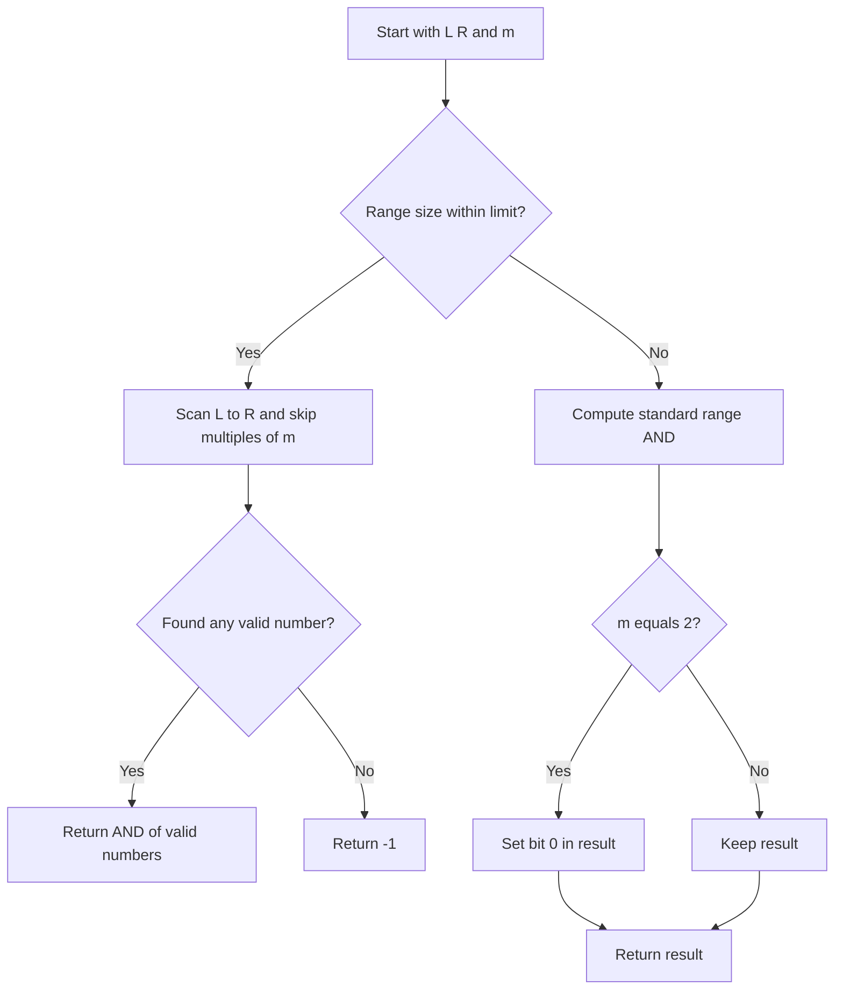

# BIT-003: Bitwise AND Skipping Multiples

## 📋 Problem Summary

Calculate the bitwise **AND** of all integers in the range `[L, R]`, **excluding** any number that is a multiple of `m`.
If no numbers remain, return -1.

## 🌍 Real-World Scenario

**Scenario Title:** The Exclusive Club Guest List 🎟️

### The Problem
You are organizing a very specific event.
-   **ID Cards:** Guests have ID numbers ranging from `L` to `R`.
-   **Blocked List:** A new rule says "Anyone with an ID divisible by `m` is banned" (e.g., usually unlucky numbers like 13, but here `m` varies).
-   **Security Check:** The security system aggregates the IDs of all *admitted* guests using an **AND** operation to verify the "Common Security Signature" (bits that *everyone* present shares).
-   **Goal:** Calculate this final Signature.


### From Real World to Algorithm
-   **Range AND:** The standard "AND of range $[L, R]$" is a known problem. It equals the **Common Bit Prefix** of $L$ and $R$.
-   **The Twist:** We skip multiples of $m$.
-   **Case 1: Small Range.** If range is small, just loop and skip.
-   **Case 2: Large Range.** If range is large (e.g., $10^9$ gap), iterating is too slow.
    -   However, if the range is large, there are many numbers.
    -   More numbers = More 0s in various bit positions.
    -   Result tends towards 0 or the Common Prefix.
    -   Does removing multiples of $m$ change the Common Prefix?
    -   Usually: No. The multiples of $m$ are sparse (1 in every $m$). If the range is large enough to settle the Common Prefix of $L$ and $R$, removing a few numbers generally won't "add back" any 1s. The AND operation only *removes* 1s. By *excluding* numbers, we might effectively *keep* some 1s that would have been zeroed out.
-   **Critical Exception:** If we remove *every other number* ($m=2$), we might keep the LSB (1) which is usually killed by even numbers.
AND is a strict bouncer: once a bit is out, it never sneaks back in.

## Detailed Explanation

### ASCII Diagram: Skipping Pattern
```
L=10, R=15, m=3
Range: 10, 11, 12, 13, 14, 15
Skip multiples of 3: 12, 15.

Valid Numbers:
10: 1 0 1 0
11: 1 0 1 1
13: 1 1 0 1
14: 1 1 1 0

AND Calculation:
Col 3 (8s): 1, 1, 1, 1 -> 1
Col 2 (4s): 0, 0, 1, 1 -> 0
Col 1 (2s): 1, 1, 0, 1 -> 0
Col 0 (1s): 0, 1, 1, 0 -> 0

Result: 1 0 0 0 (8)
```

<!-- mermaid -->


## ✅ Input/Output Clarifications (Read This Before Coding)

- **L, R**: 64-bit integers.
- **m**: Integer up to 1,000,000.
- **-1**: If `[L, R]` has no valid numbers (e.g. `L=3, R=3, m=3`), return -1.

Common interpretation mistake:

- ❌ Using `(L & R)` or standard range AND shortcut immediately.
- ✅ realizing that skipping numbers *might* keep some bits as 1 that would otherwise become 0 (e.g., if we skip all even numbers).

### Core Concept: Convergence of AND

The bitwise AND of a continuous range `[L, R]` is determined by the common high-order bits of `L` and `R`. The lower bits become 0 quickly because the range usually includes numbers with 0 and 1 at those positions.
Skipping multiples of `m` preserves this property unless `m` is related to bit positions (e.g., `m=2` removes all even numbers, forcing bit 0 to stay 1).

### Why Naive Approach is too slow

Looping `L` to `R` takes O(R-L). Since `R-L` can be `10^12`, this TLEs.
However, `m` is small. The pattern of multiples repeats every `m`. The bitwise AND converges very fast.

## Naive Approach (Linear Scan)

### Intuition

Loop through all valid numbers and AND them.

### Algorithm

1. `ans = -1` (All 1s).
2. `found = false`
3. loop `i` from `L` to `R`:
   - if `i % m != 0`:
     - `ans &= i`
     - `found = true`
4. Return `found ? ans : -1`

### Time Complexity

- **O(R - L)**. Good if range is small, unused if large.

### Space Complexity

- **O(1)**.

## Optimal Approach (Hybrid)

### Key Insight

1. **Small Range**: If `R - L` is small (e.g., `< 2*10^6`), use the naive scan. It's fast enough.
2. **Large Range**: If `R - L` is huge, the range contains many full cycles of `m`.
   - The result is simply the **Standard Range AND** of `[L, R]`, with one exception.
   - **Exception**: If `m=2`, we remove all even numbers. Valid numbers are all Odd. Bit 0 will be 1.
   - For all `m > 2`, we retain enough variation in parity and bit positions that the result matches the Standard Range AND (Common Prefix followed by 0s).

### Algorithm

1. **Constraint Check**: `limit = 5 * m` (or fixed `2*10^6`).
2. If `R - L <= limit`:
   - Run Naive Loop.
3. Else:
   - Calculate Standard Range AND:
     - Find MSB where `L` and `R` differ.
     - Mask out all bits below that MSB.
     - `RangeAND = L & Mask`.
   - If `m == 2`: `RangeAND |= 1`.
   - Return `RangeAND`.

Note: The threshold `limit` ensures we don't miss edge cases where specific bit patterns align with multiples. Since AND reduces bits, once the range is large, the "Standard AND" zeros dominate.

### Time Complexity

- **O(min(R-L, m))**. Worst case O(m).

### Space Complexity

- **O(1)**.

## Implementations

### Java
```java
class Solution {
    public long bitwiseAndSkipMultiples(long L, long R, int m) {
        // Small range optimization
        if (R - L <= 2000000) {
            long ans = -1; // All 1s initially
            boolean found = false;
            for (long i = L; i <= R; i++) {
                if (i % m != 0) {
                    if (!found) {
                        ans = i;
                        found = true;
                    } else {
                        ans &= i;
                    }
                }
            }
            return found ? ans : -1;
        }

        // Large range: Use Common Prefix logic
        long lTemp = L;
        long rTemp = R;
        int shift = 0;
        
        while (lTemp != rTemp) {
            lTemp >>= 1;
            rTemp >>= 1;
            shift++;
        }
        
        long standardAnd = (lTemp << shift);
        
        // Correction for m=2 (skipping evens)
        if (m == 2) {
            standardAnd |= 1;
        }
        
        return standardAnd;
    }
}
```

### Python
```python
def bitwise_and_skip_multiples(L: int, R: int, m: int) -> int:
    if R - L <= 2000000:
        ans = -1
        found = False
        for i in range(L, R + 1):
            if i % m != 0:
                if not found:
                    ans = i
                    found = True
                else:
                    ans &= i
        return ans if found else -1

    shift = 0
    l_temp = L
    r_temp = R
    
    while l_temp != r_temp:
        l_temp >>= 1
        r_temp >>= 1
        shift += 1
        
    standard_and = l_temp << shift
    
    if m == 2:
        standard_and |= 1
        
    return standard_and
```

### C++
```cpp
#include <iostream>
using namespace std;

class Solution {
public:
    long long bitwiseAndSkipMultiples(long long L, long long R, int m) {
        if (R - L <= 2000000) {
            long long ans = -1;
            bool found = false;
            for (long long i = L; i <= R; i++) {
                if (i % m != 0) {
                    if (!found) {
                        ans = i;
                        found = true;
                    } else {
                        ans &= i;
                    }
                }
            }
            return found ? ans : -1;
        }

        long long lTemp = L;
        long long rTemp = R;
        int shift = 0;
        
        while (lTemp != rTemp) {
            lTemp >>= 1;
            rTemp >>= 1;
            shift++;
        }
        
        long long standardAnd = (lTemp << shift);
        
        if (m == 2) {
            standardAnd |= 1;
        }
        
        return standardAnd;
    }
};
```

### JavaScript
```javascript
class Solution {
  bitwiseAndSkipMultiples(L, R, m) {
    L = BigInt(L);
    R = BigInt(R);
    m = BigInt(m);
    
    // JS BigInt comparison
    if (R - L <= 2000000n) {
        let ans = -1n;
        let found = false;
        for (let i = L; i <= R; i++) {
            if (i % m !== 0n) {
                if (!found) {
                    ans = i;
                    found = true;
                } else {
                    ans &= i;
                }
            }
        }
        return found ? ans.toString() : "-1";
    }

    let lTemp = L;
    let rTemp = R;
    let shift = 0n;
    
    while (lTemp !== rTemp) {
        lTemp >>= 1n;
        rTemp >>= 1n;
        shift++;
    }
    
    let standardAnd = (lTemp << shift);
    
    if (m === 2n) {
        standardAnd |= 1n;
    }
    
    return standardAnd.toString();
  }
}
```

## 🧪 Test Case Walkthrough
**Input:** `L=5, R=7, m=2`.
-   Range: `5, 6, 7`.
-   Filter: `5 (101), 7 (111)`. (Skip 6).
-   AND: `101 & 111 = 101` (5).
**Hybrid Check:**
-   Prefix of 5, 7? `101, 111` -> Prefix `1xx`. Shifted=4 (`100`).
-   `m=2` -> Add 1 -> `101` (5). Matches.

## ✅ Proof of Correctness

### Invariant

For range `[L, R]`, bits below the common prefix cycle through `0` and `1`. Deleting sparse numbers (multiples of `m > 2`) cannot prevent us from seeing at least one `0` in every bit position below the prefix, provided the range is large enough (`> m`).
Case `m=2` is the only dense deletion pattern that systematically removes `0`s from bit 0.

## 💡 Interview Extensions (High-Value Add-ons)

- **Range OR**: Logic is symmetric (find common prefix, rest 1s).
- **Count Set Bits**: Population count in usage.

## Common Mistakes to Avoid

1. **Off-by-one**:
   - ❌ `i < R` loop.
   - ✅ `i <= R`.
2. **Infinite Loop**:
   - ❌ `while (l != r)` with regular Ints could overflow if not careful (but right shift converges).
