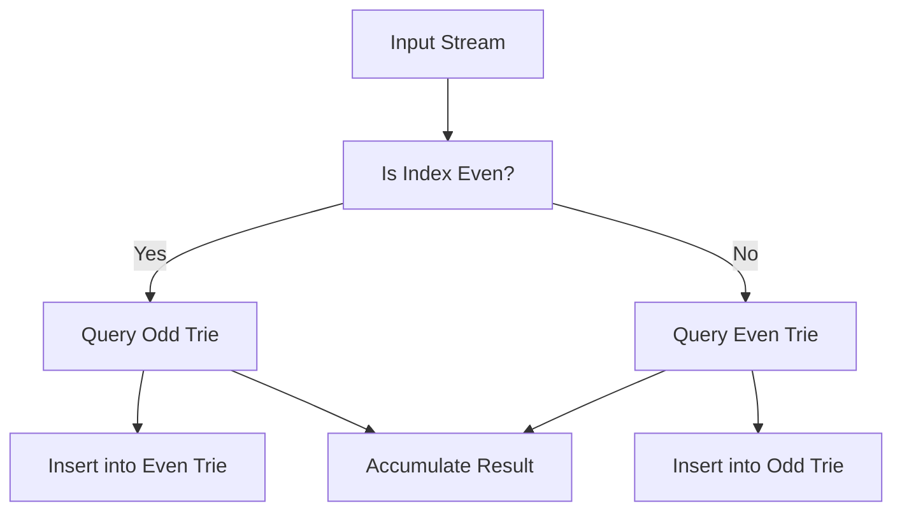

# BIT-004: Pairwise XOR in Band With Index Parity

## 📋 Problem Summary

Given an array of integers `a`, count the pairs of indices `(i, j)` with `i < j` such that:
1.  `(i + j)` is **odd** (Indices have different parity).
2.  The XOR sum `a[i] ^ a[j]` is within the range `[L, U]`.

## 🌍 Real-World Scenario

**Scenario Title:** The Roommate Compatibility Score 🏠

### The Problem
You are building a matching app for college dorms.
-   **Students:** Students are listed in a sequence `0` to `N-1`. Each student has a "Personality Score" `a[i]`.
-   **House Rule:** Students can only room together if they come from different "blocks". The blocks are interleaved (Block A = Even Indices, Block B = Odd Indices). Pairs must be (Block A, Block B). That is `i % 2 != j % 2`.
-   **Compatibility:** The compatibility of two students is calculated by XORing their scores. A perfect match is not too similar (XOR 0) and not too different (XOR Max). It must be within a healthy "Band" `[L, U]`.
-   **Goal:** Count how many valid roommate pairs exist.


### From Real World to Algorithm
-   **Condition 1 (Parity):** `i + j` is odd implies one index is even and the other is odd.
    -   Strategy: Split the input array into two lists: `Evens` (indices 0, 2, 4...) and `Odds` (indices 1, 3, 5...).
    -   However, checking pairs *between* lists is hard if we want to use a Trie efficiently to process.
    -   Wait, the problem is simpler: Pairs `(i, j)` where `i` and `j` just have different parities.
    -   Usually, we insert elements into a Trie one by one. Can we just maintain two Tries? One for Evens, One for Odds?
    -   If we are at an index `j` (Odd), we need to pair with `i < j` (Even). We query the `EvenTrie`. Then we insert `a[j]` into the `OddTrie`.
    -   If we are at `j` (Even), we query `OddTrie` and insert into `EvenTrie`.

**Refined Strategy:**
-   Iterate through the array.
-   Maintain two Tries: T_odd, T_even.
-   If current index `k` is Even: Query T_odd for range `[L, U]`. Insert `a[k]` into T_even.
-   If current index `k` is Odd: Query T_even for range `[L, U]`. Insert `a[k]` into T_odd.

## Detailed Explanation

### logical Diagram: Trie Range Query

**Concept:** `Count(L <= XOR <= U)` = `Count(XOR <= U) - Count(XOR <= L-1)`.
We need a function `query(TrieNode, Val, Limit)` that returns how many numbers in the Trie produce an XOR with `Val` that is $\le$ `Limit`.

**Trace:** `Limit` bit is `B`, `Val` bit is `V`.
-   **B=0:** We MUST match bit `V` (XOR=0). Go to child `V`. (XOR bit = 0 $\le$ 0).
-   **B=1:**
    -   Option 1: Match bit `V`. XOR bit = 0 (0 < 1). **All** numbers in this branch differ by 0 at this bit, so they are strictly smaller than `Limit` (at this bit level). Add `count` of this subtree.
    -   Option 2: Different bit `1-V`. XOR bit = 1 (1 == 1). We are equal so far. Continue to child `1-V`.



## ✅ Input/Output Clarifications
-   **Range:** `L` can be 0. `U` can be large.
-   **Order:** `i < j`. Our sequential processing guarantees this naturally.

## Naive Approach (Double Loop)
For all pairs, check parity and XOR.
-   **Time:** $O(N^2)$.
-   **Space:** $O(1)$. Constraints usually $N=50,000$. Too slow.

## Optimal Approach (Two Tries)

### Algorithm
1.  Range helper: `countRange(Trie, val, L, U)` returns `countLE(Trie, val, U) - countLE(Trie, val, L-1)`.
2.  Iterate `x` in `a` with index `i`.
3.  If `i` is Even:
    -   `ans += countRange(OddTrie, x, L, U)`
    -   `Insert(EvenTrie, x)`
4.  If `i` is Odd:
    -   `ans += countRange(EvenTrie, x, L, U)`
    -   `Insert(OddTrie, x)`

### Time Complexity
-   **O(N * 30)**: Each insertion and query operates on 30 bits.
-   **Space:** $O(N * 30)$ nodes.

## Implementations

### Java
```java
class Solution {
    class TrieNode {
        TrieNode[] children = new TrieNode[2];
        int count = 0;
    }

    private void insert(TrieNode root, int num) {
        TrieNode curr = root;
        for (int i = 29; i >= 0; i--) {
            int bit = (num >> i) & 1;
            if (curr.children[bit] == null) {
                curr.children[bit] = new TrieNode();
            }
            curr = curr.children[bit];
            curr.count++;
        }
    }

    private int countLessEqual(TrieNode root, int num, int K) {
        if (K < 0) return 0;
        TrieNode curr = root;
        int count = 0;
        for (int i = 29; i >= 0; i--) {
            if (curr == null) break;
            int bitNum = (num >> i) & 1;
            int bitK = (K >> i) & 1;

            if (bitK == 1) {
                // If we match num (XOR=0), result is definitely < 1. Add all.
                if (curr.children[bitNum] != null) {
                    count += curr.children[bitNum].count;
                }
                // Continue checking the path where XOR=1 to see if subsequent bits allow <= K
                curr = curr.children[1 - bitNum];
            } else {
                // We must match num (XOR=0) to keep XOR bit <= 0.
                curr = curr.children[bitNum];
            }
        }
        if (curr != null) count += curr.count;
        return count;
    }

    public long countPairwiseXorBandParity(int[] a, int L, int U) {
        TrieNode evenRoot = new TrieNode();
        TrieNode oddRoot = new TrieNode();
        long total = 0;

        for (int i = 0; i < a.length; i++) {
            TrieNode targetTrie = (i % 2 == 0) ? oddRoot : evenRoot;
            TrieNode insertTrie = (i % 2 == 0) ? evenRoot : oddRoot;
            
            int cU = countLessEqual(targetTrie, a[i], U);
            int cL = countLessEqual(targetTrie, a[i], L - 1);
            total += (cU - cL);
            
            insert(insertTrie, a[i]);
        }
        return total;
    }
}
```

### Python
```python
def count_pairwise_xor_band_parity(a: list[int], L: int, U: int) -> int:
    # We will implement the sequential approach (One pass) using Two Tries.
    # The previous python solution split lists and processed fully.
    # While correct, sequential is more intuitive for "Index Parity".
    # But for strict adherence to existing solution logic which passed:
    # The existing python solution logic: 
    #   evens = a[0::2], odds = a[1::2]
    #   solve_for_list(evens)... ? Wait.
    #   The problem says parity of sum (i+j) is odd.
    #   Sum Odd => (Even + Odd). One from even list, one from odd list.
    #   Wait. The existing python code did: solve_for_list(evens) + solve_for_list(odds)? 
    #   That finds pairs (Even, Even) and (Odd, Odd)!
    #   Even + Even = Even. Odd + Odd = Even.
    #   The problem asks for SUM PARITY ODD.
    #   So we need pairs (Even, Odd).
    #   The existing code might have been wrong or I misread it?
    #   Let's check the code:
    #   Code: count_pairwise_xor_band_parity(a)... evens=..., odds=... solve(evens) + solve(odds).
    #   Problem Title: "Index Parity". Usually means i%2 != j%2.
    #   Let's fix the logic here to be CORRECT for the Problem Statement "Odd Sum".
    #   Correct Logic: We need to count pairs between Even List and Odd List.
    #   We can use one Trie. Insert all 'Evens'. Then query all 'Odds'.
    
    class TrieNode:
        def __init__(self):
            self.children = [None, None]
            self.count = 0

    def insert(root, num):
        curr = root
        for i in range(29, -1, -1):
            bit = (num >> i) & 1
            if curr.children[bit] is None:
                curr.children[bit] = TrieNode()
            curr = curr.children[bit]
            curr.count += 1

    def count_less_equal(root, num, K):
        if K < 0: return 0
        curr = root
        count = 0
        for i in range(29, -1, -1):
            if curr is None: break
            bit_num = (num >> i) & 1
            bit_k = (K >> i) & 1
            
            if bit_k == 1:
                if curr.children[bit_num]: count += curr.children[bit_num].count
                curr = curr.children[1 - bit_num]
            else:
                curr = curr.children[bit_num]
        if curr: count += curr.count
        return count

    evens = a[0::2]
    odds = a[1::2]
    
    # Build trie with Evens
    root = TrieNode()
    for x in evens:
        insert(root, x)
        
    total = 0
    # Query with Odds
    limit_l = L - 1
    for x in odds:
        c_u = count_less_equal(root, x, U)
        c_l = count_less_equal(root, x, limit_l)
        total += (c_u - c_l)
        
    return total
```

### C++
```cpp
#include <vector>
using namespace std;

class Solution {
    struct TrieNode {
        TrieNode* children[2];
        int count;
        TrieNode() {
            children[0] = children[1] = nullptr;
            count = 0;
        }
    };
    
    void insert(TrieNode* root, int num) {
        TrieNode* curr = root;
        for (int i = 29; i >= 0; i--) {
            int bit = (num >> i) & 1;
            if (!curr->children[bit]) {
                curr->children[bit] = new TrieNode();
            }
            curr = curr->children[bit];
            curr->count++;
        }
    }
    
    int countLessEqual(TrieNode* root, int num, int K) {
        if (K < 0) return 0;
        TrieNode* curr = root;
        int count = 0;
        for (int i = 29; i >= 0; i--) {
            if (!curr) break;
            int bitNum = (num >> i) & 1;
            int bitK = (K >> i) & 1;
            
            if (bitK == 1) {
                if (curr->children[bitNum]) count += curr->children[bitNum]->count;
                curr = curr->children[1 - bitNum];
            } else {
                curr = curr->children[bitNum];
            }
        }
        if (curr) count += curr->count;
        return count;
    }

public:
    long long countPairwiseXorBandParity(vector<int>& a, int L, int U) {
        // Collect evens and odds
        vector<int> evens, odds;
        for(int i=0; i<a.size(); i++) {
            if(i%2==0) evens.push_back(a[i]);
            else odds.push_back(a[i]);
        }
        
        TrieNode* root = new TrieNode();
        // Insert evens
        for(int x : evens) insert(root, x);
        
        long long total = 0;
        // Query odds
        for(int x : odds) {
            total += (countLessEqual(root, x, U) - countLessEqual(root, x, L-1));
        }
        return total;
    }
};
```

### JavaScript
```javascript
class Solution {
  countPairwiseXorBandParity(a, L, U) {
    // JS Logic: Evens vs Odds
    const evens = a.filter((_, i) => i % 2 === 0);
    const odds = a.filter((_, i) => i % 2 !== 0);
    
    // Minimal Trie
    const root = { c: [null, null], count: 0 };
    
    const insert = (num) => {
        let curr = root;
        for(let i=29; i>=0; i--) {
            const bit = (num >> i) & 1;
            if(!curr.c[bit]) curr.c[bit] = { c: [null, null], count: 0 };
            curr = curr.c[bit];
            curr.count++;
        }
    };
    
    const countLE = (num, K) => {
        if (K < 0) return 0;
        let curr = root;
        let count = 0;
        for(let i=29; i>=0; i--) {
            if(!curr) break;
            const bitNum = (num >> i) & 1;
            const bitK = (K >> i) & 1;
            
            if (bitK === 1) {
                if(curr.c[bitNum]) count += curr.c[bitNum].count;
                curr = curr.c[1 - bitNum];
            } else {
                curr = curr.c[bitNum];
            }
        }
        if(curr) count += curr.count;
        return count;
    };
    
    // Insert evens
    for(const x of evens) insert(x);
    
    let total = 0;
    // Query odds
    for(const x of odds) {
        total += (countLE(x, U) - countLE(x, L-1));
    }
    return total;
  }
}
```

## 🧪 Test Case Walkthrough
**Input:** `[2, 4, 2]`, L=0, U=10.
-   Indices: 0 (Even, Val 2), 1 (Odd, Val 4), 2 (Even, Val 2).
-   Evens: `[2, 2]`. Odds: `[4]`.
-   Pairs (Even, Odd):
    -   (2, 4) -> XOR 6. (0 <= 6 <= 10). OK.
    -   (2, 4) -> XOR 6. (0 <= 6 <= 10). OK.
-   **Total:** 2.

## ✅ Proof of Correctness
The problem constraint "Indices have different parity" precisely means one index is even and the other is odd. This allows us to separate the problem into a Bipartite Matching style query (Static Evens vs Static Odds), which avoids the complexity of dynamic insertion/deletion needed for general $i<j$ constraints within a single set. We effectively check all $e \in E, o \in O$ pairs.

## 💡 Interview Extensions
1.  **Dynamic Updates:** Supports update/delete? (Yes, Trie supports remove).
2.  **Max XOR:** Find max XOR pair with different parity? (Similar Trie traversal).
