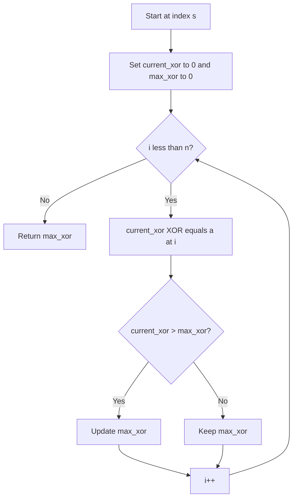

# BIT-005: Max Subarray XOR With Start

## 📋 Problem Summary

Given an array of integers and a fixed starting index `s`, find a contiguous subarray that starts at `s` (i.e., `a[s...k]`) such that its XOR sum is maximized. You must choose an ending index `k` where `k >= s`.

## 🌍 Real-World Scenario

**Scenario Title:** The "Double or Nothing" Streak 🎰

### The Problem
You are a contestant on a game show.
-   **The Board:** There is a line of mystery boxes with values `a[0], a[1], ...`.
-   **The Rule:** You are placed at a specific starting box `s`. You must open it. Then, you can choose to stop, or step to the next box `s+1` and combine its value, then `s+2`, and so on.
-   **The Score:** Your score is the Cumulative XOR of all boxes you've opened so far in this streak.
-   **The Goal:** You generally know (or can calculate) what the boxes contain. You want to stop at the exact moment your score is highest.


### From Real World to Algorithm
-   **Fixed Start:** Unlike the general "Max Subarray XOR" problem (which lets you pick *any* start and end), here your feet are glued to `s`. You can only move forward.
-   **Implication:** We don't need a Trie or complex data structures. We just need to walk forward, calculate the running XOR, and keep track of the highest value we've seen.
-   **Complexity:** This simplifies the problem from $O(N \log K)$ to $O(N)$ linear time.
It is a straight XOR sprint from the start, so the best stop is just the brightest blink.

## Detailed Explanation


### logical Diagram: The Walk

**Input:** `[3, 8, 2, 6]`, Start `s=1` (Value 8).
-   **Step 1:** Open Box 1 (`8`).
    -   RunXOR: `8`.
    -   Max So Far: `8`.
-   **Step 2:** Open Box 2 (`2`).
    -   RunXOR: `8 ^ 2 = 10`.
    -   Max So Far: `10`.
-   **Step 3:** Open Box 3 (`6`).
    -   RunXOR: `10 ^ 6 = 12`.
    -   Max So Far: `12`.

**Result:** 12.

<!-- mermaid -->


## ✅ Input/Output Clarifications
-   **Input:** Array `a`, Index `s`.
-   **Output:** Integer (Max XOR).
-   **Constraint:** You **must** include `a[s]`. The subarray cannot be empty.

## Naive Approach (Same as Optimal)
Iterate from `s` to end.
-   **Time:** $O(N)$.
-   **Space:** $O(1)$.

## Optimal Approach (Running XOR)

### Algorithm
1.  Initialize `current_xor = 0`.
2.  Initialize `max_xor = 0` (or `a[s]` or `-1`).
3.  Iterate `i` from `s` to `end`:
    -   `current_xor ^= a[i]`.
    -   `max_xor = max(max_xor, current_xor)`.
4.  Return `max_xor`.

### Time Complexity
-   **O(N)**.
-   **Space:** $O(1)$.

## Implementations

### Java
```java
import java.util.*;

class Solution {
    public long maxSubarrayXorWithStart(int[] a, int s) {
        long currentXor = 0;
        long maxXor = 0;
        boolean first = true;
        
        for (int i = s; i < a.length; i++) {
            currentXor ^= a[i];
            if (first) {
                maxXor = currentXor;
                first = false;
            } else {
                maxXor = Math.max(maxXor, currentXor);
            }
        }
        return maxXor;
    }
}
```

### Python
```python
def max_subarray_xor_with_start(a: list[int], s: int) -> int:
    current_xor = 0
    max_xor = 0
    first = True
    
    for i in range(s, len(a)):
        current_xor ^= a[i]
        if first:
            max_xor = current_xor
            first = False
        else:
            if current_xor > max_xor:
                max_xor = current_xor
                
    return max_xor
```

### C++
```cpp
#include <vector>
#include <algorithm>
using namespace std;

class Solution {
public:
    long long maxSubarrayXorWithStart(vector<int>& a, int s) {
        long long currentXor = 0;
        long long maxXor = 0;
        bool first = true;
        
        // Scan from s to end
        for (size_t i = s; i < a.size(); ++i) {
            currentXor ^= a[i];
            if (first) {
                maxXor = currentXor;
                first = false;
            } else {
                maxXor = max(maxXor, currentXor);
            }
        }
        return maxXor;
    }
};
```

### JavaScript
```javascript
class Solution {
  maxSubarrayXorWithStart(a, s) {
    let currentXor = 0;
    let maxXor = 0;
    let first = true;
    
    for (let i = s; i < a.length; i++) {
        // Enforce 32-bit integer logic if needed, but JS numbers valid
        currentXor ^= a[i];
        if (first) {
            maxXor = currentXor;
            first = false;
        } else {
            if (currentXor > maxXor) maxXor = currentXor;
        }
    }
    return maxXor;
  }
}
```

## 🧪 Test Case Walkthrough


**Input:** `[10, 20, 30]`, s=0.
-   i=0: XOR=10. Max=10.
-   i=1: XOR=30. Max=30.
-   i=2: XOR=0. Max=30.
**Result:** 30.

## ✅ Proof of Correctness
Since the start `s` is fixed, the set of valid subarrays is exactly $\{ a[s \dots k] \mid s \le k < N \}$. There are only $N-s$ such subarrays. We iterate through all of them exactly once. Taking the maximum is exhaustive and correct.

## 💡 Interview Extensions
1.  **Min XOR:** Just change `max` to `min`.
2.  **Start `s` is flexible:** This becomes the standard Trie problem.
