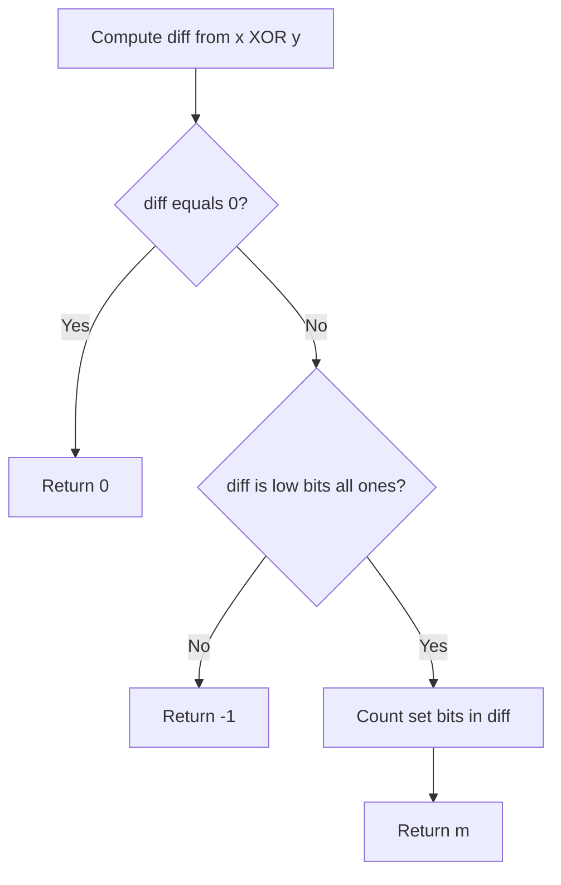

# BIT-006: Minimal Bits to Flip Range

## 📋 Problem Summary

Given two integers `x` and `y`, check if we can convert `x` to `y` by flipping exactly the **first `m` bits** (the lowest `m` contiguous bits) for some `m >= 0`. If yes, return the smallest `m`. If not, return `-1`.

## 🌍 Real-World Scenario

**Scenario Title:** The Hardware Reset Protocol 🎛️

### The Problem
You are working on a low-level driver for a legacy circuit board.
-   **Registers:** The device state is stored in a 64-bit integer `x`.
-   **Target:** You need to transition the device to a safe state `y`.
-   **Restriction:** The hardware is old. It doesn't allow changing arbitrary bits. It only has a "Low-Bit Toggle" line. Sending a voltage pulse of duration `m` will indiscriminately flip (0->1, 1->0) the first `m` bits of the register.
-   **Constraint:** You can only perform this "Low-Bit Toggle" operation once.
-   **Goal:** Determine the pulse duration `m` needed to reach exactly state `y`, or report that it's impossible.


### From Real World to Algorithm
-   **Toggle:** In binary, toggling bits corresponds to the XOR operation.
-   **Operation:** $x \oplus \text{Mask} = y$.
-   **Mask Shape:** The mask represents the first `m` bits being 1, and the rest 0. This is always of the form $2^m - 1$ (e.g., `00011`, `00111`, `11111`).
-   **Finding Mask:** Since $A \oplus B = C \implies A \oplus C = B$, we can find the required mask by computing `diff = x ^ y`.
-   **Validation:** We just need to check if `diff` consists of a contiguous block of 1s starting from the least significant bit (LSB).
When the bits line up, the mask clicks in like a zipper.

## Detailed Explanation


### logical Diagram: Mask Validation

**Case 1: Impossible**
$X = 10 (1010)$, $Y = 4 (0100)$.
$Diff = 10 \oplus 4 = 14 (1110)$.
Is $1110$ a valid Low-Bit Toggle?
-   No. It has a 0 at the end. Toggle must start from bit 0.

**Case 2: Possible**
$X = 10 (1010)$, $Y = 5 (0101)$.
$Diff = 10 \oplus 5 = 15 (1111)$.
Is $1111$ a valid Low-Bit Toggle?
-   Yes. It corresponds to $m=4$.

**Bitwise Check:**
Properties of numbers like `11...1` ($N$):
-   $N+1$ is a power of 2 ($100...0$).
-   Powers of 2 have the property: `k & (k-1) == 0`.
-   Therefore, valid masks satisfy: `(diff & (diff + 1)) == 0`.

<!-- mermaid -->


## ✅ Input/Output Clarifications
-   **Input:** `x`, `y` (64-bit integers).
-   **Output:** `m` (integer) or `-1`.
-   **Edge Case:** If `x == y`, `diff` is 0. Return 0.

## Naive Approach (Iterate m)
Loop `m` from 0 to 62. Construct mask `(1<<m) - 1`. Compare with `diff`.
-   **Time:** $O(64) \approx O(1)$. Fast enough practically.

## Optimal Approach (Bit Tricks)

### Algorithm
1.  Compute `diff = x ^ y`.
2.  If `diff == 0`, return 0.
3.  Check if `diff` is of format `00...011...1` using `(diff & (diff + 1)) == 0`.
    -   Example: `111` (7). `7+1=8` (1000). `0111 & 1000 = 0000`. Valid.
    -   Example: `101` (5). `5+1=6` (110). `101 & 110 = 100`. Invalid.
4.  If valid, return the number of set bits (population count) of `diff`.

### Time Complexity
-   **O(1)** arithmetic ops.
-   **Space:** $O(1)$.

## Implementations

### Java
```java
import java.util.*;

class Solution {
    public long minimalBitsFlipRange(long x, long y) {
        long diff = x ^ y;
        if (diff == 0) return 0;
        
        // Check if diff is of form 111...1 (Mersenne number form)
        // If so, diff + 1 is a power of 2 (100...0)
        // bitwise AND should be 0.
        if ((diff & (diff + 1)) == 0) {
            return Long.bitCount(diff);
        }
        
        return -1;
    }
}
```

### Python
```python
def minimal_bits_flip_range(x: int, y: int) -> int:
    diff = x ^ y
    if diff == 0: return 0
    
    # Check if diff is 2^m - 1
    if (diff & (diff + 1)) == 0:
        return diff.bit_length()
        
    return -1
```

### C++
```cpp
#include <iostream>
using namespace std;

class Solution {
public:
    long long minimalBitsFlipRange(long long x, long long y) {
        unsigned long long diff = x ^ y;
        if (diff == 0) return 0;
        
        if ((diff & (diff + 1)) == 0) {
            // Number of set bits.
            return __builtin_popcountll(diff);
        }
        
        return -1;
    }
};
```

### JavaScript
```javascript
class Solution {
  minimalBitsFlipRange(x, y) {
    // Operations on BigInt
    let diff = x ^ y;
    if (diff === 0n) return 0;
    
    if ((diff & (diff + 1n)) === 0n) {
      // Convert to string in binary and count length
      return diff.toString(2).length;
    }
    
    return -1;
  }
}
```

## 🧪 Test Case Walkthrough


**Input:** `x=10 (1010)`, `y=5 (0101)`.
1.  `Diff = 1111` (15).
2.  `15 & 16 = 0`. Valid.
3.  Bit count of 15 is 4. Return 4.

**Input:** `x=10 (1010)`, `y=4 (0100)`.
1.  `Diff = 1110` (14).
2.  `14 & 15 = 14`. Not 0. Invalid. Return -1.

## ✅ Proof of Correctness
The set of allow masks is $S = \{ 2^0-1, 2^1-1, \dots \}$.
$2^k - 1$ is the only integer $Z$ such that $Z+1 = 2^k$.
Since $Z+1$ is a power of 2, it has exactly one bit set.
Adding 1 to a number of form `0...011...1` ripples carries all the way to flip the first `0` to `1` and clears the `1`s.
$(2^k-1) \oplus x = y \iff x \oplus y = 2^k-1$.
The check confirms `x^y` belongs to $S$.

## 💡 Interview Extensions
1.  **Arbitrary Range:** Flip range `[i, j]`. Mask is `((1<<j)-1) ^ ((1<<i)-1)`. Check if diff is a shifted block of 1s (shift right until LSB is 1, then check same property).
2.  **Min Flips:** If we can flip any range? Standard BFS/Greedy.
