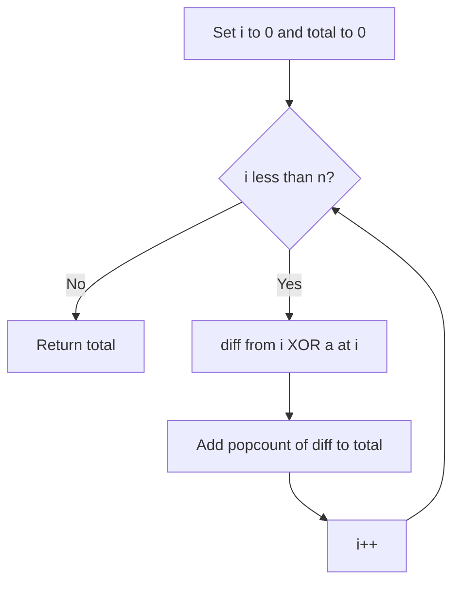

# BIT-007: Count Set Bits Of Indexed XOR

## 📋 Problem Summary

Given an array `a` of size `n`, for every index `i`, compute the value `v_i = i ^ a[i]`. Calculate the total number of set bits (1s) across all `v_i` values.

## 🌍 Real-World Scenario

**Scenario Title:** The Packet Integrity Verify 🛡️

### The Problem
You are analyzing a data transmission protocol.
-   **Packet Structure:** Each data packet arrives at a specific sequence number `i` (index 0, 1, 2...).
-   **Validation:** The protocol defines that the data `a[i]` received at index `i` is "perfect" if it equals `i`.
-   **Error Metric:** The amount of corruption is measured by the **Hamming Distance** between the received data `a[i]` and the expected pattern `i`.
-   **Goal:** Calculate the total accumulated error bits across the entire file stream to decide if a retransmission request (ARQ) is needed.


### From Real World to Algorithm
-   **Hamming Distance:** The number of differing bits between two numbers $X$ and $Y$ is formally defined as $\text{Popcount}(X \oplus Y)$.
-   **Task:** We need $\sum_{i=0}^{n-1} \text{Popcount}(i \oplus a[i])$.
Each XOR is a quick bitwise handshake that counts how much the index and value disagree.

## Detailed Explanation

### logical Diagram: Bit Comparison

**Input:** `a = [0, 2]`
-   $i=0$: Expected $0$ (00). Received $0$ (00). $0 \oplus 0 = 0$. Bits=0.
-   $i=1$: Expected $1$ (01). Received $2$ (10). $1 \oplus 2 = 3$ (11). Bits=2.
-   **Total:** 2.

**Popcount:**
Also known as "Hamming Weight".
-   `Popcount(4)` -> `100` -> 1.
-   `Popcount(7)` -> `111` -> 3.

<!-- mermaid -->


## ✅ Input/Output Clarifications
-   **Input:** Array `a` (integers).
-   **Output:** Integer (Total count).
-   **Constraints:** `N` up to 200,000. `a[i]` fits in standard integer.

## Naive Approach (Manual Bit Loop)
For each element, loop while $>0$, checking LSB.
-   **Time:** $O(N \times 30)$. Since 30 is constant, effectively $O(N)$.
-   **Note:** This *is* optimal complexity-wise, but built-ins are faster constants.

## Optimal Approach (Built-in Intrinsics)

### Algorithm
1.  Initialize `total = 0`.
2.  Iterate `i` from 0 to `n-1`.
3.  Compute `diff = i ^ a[i]`.
4.  Add `popcount(diff)` to `total`.
    -   Use `__builtin_popcount` in C++.
    -   Use `Integer.bitCount` in Java.
    -   Use `bin().count('1')` or `int.bit_count()` in Python.

### Time Complexity
-   **O(N)**.
-   **Space:** $O(1)$.

## Implementations

### Java
```java
import java.util.*;

class Solution {
    public long countSetBitsIndexedXor(int[] a) {
        long total = 0;
        for (int i = 0; i < a.length; i++) {
            // Integer.bitCount uses an efficient parallel bit counting algorithm
            total += Integer.bitCount(i ^ a[i]);
        }
        return total;
    }
}
```

### Python
```python
def count_set_bits_indexed_xor(a: list[int]) -> int:
    total = 0
    for i, x in enumerate(a):
        # Python 3.10+ method
        total += (i ^ x).bit_count() 
    return total
```

### C++
```cpp
#include <vector>
#include <numeric>

class Solution {
public:
    long long countSetBitsIndexedXor(std::vector<int>& a) {
        long long total = 0;
        for (int i = 0; i < a.size(); i++) {
            // __builtin_popcount is a CPU intrinsic (usually POPCNT instruction)
            total += __builtin_popcount(i ^ a[i]);
        }
        return total;
    }
};
```

### JavaScript
```javascript
class Solution {
  countSetBitsIndexedXor(a) {
    let total = 0n;
    for (let i = 0; i < a.length; i++) {
      let val = i ^ a[i];
      // Manual Kerninghan's popcount or loop
      let c = 0;
      while (val > 0) {
        val &= (val - 1);
        c++;
      }
      total += BigInt(c);
    }
    return total.toString();
  }
}
```

## 🧪 Test Case Walkthrough

**Input:** `a = [5, 1, 3]`.
1.  $i=0, v=5$. $0 \oplus 5 = 5 (101)$. Bits: 2.
2.  $i=1, v=1$. $1 \oplus 1 = 0 (000)$. Bits: 0.
3.  $i=2, v=3$. $2 \oplus 3 = 1 (001)$. Bits: 1.
4.  **Total:** $2 + 0 + 1 = 3$.

## ✅ Proof of Correctness
Direct summation of a deterministic function. Correctness depends purely on the XOR and Count implementation logic.

## 💡 Interview Extensions
1.  **Pairwise Hamming Sum:** Calculate $\sum \text{Hamming}(a[i], a[j])$.
    -   $O(N^2)$ is slow.
    -   $O(N \cdot 30)$ approach: Count how many numbers have bit $k$ set. If count is $C$, then $C$ numbers have 1 and $N-C$ have 0. Contribution to sum is $C \times (N-C)$.
