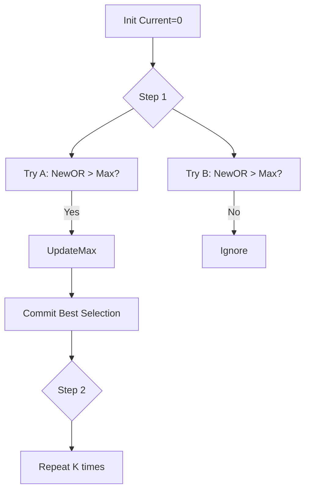

# BIT-008: Maximize OR With K Picks

## 📋 Problem Summary

Select exactly `k` integers from an array such that their bitwise **OR** sum is maximized.

## 🌍 Real-World Scenario

**Scenario Title:** The Optimal Feature Bundle 📦

### The Problem
You are a Product Manager defining the "Pro" version of a software suite.
-   **Modules:** You have a library of `N` available modules. Each module enables a specific set of features (flags).
-   **Constraint:** To keep the software bloat-free, the "Pro" key allows unlocking exactly `K` modules.
-   **Goal:** You want the "Pro" version to offer the maximum possible number of unique features.
-   **Logic:** Features are additive (OR logic). If Module A has Feature 1 and Module B has Feature 1, picking both doesn't add Feature 1 twice; you just "have" it. You want to pick modules that cover the most ground, ideally prioritizing high-value features (MSB).


### From Real World to Algorithm
-   **Greedy Validity:** In binary, higher bits ($2^i$) are strictly greater than the sum of all lower bits ($\sum_{j=0}^{i-1} 2^j = 2^i - 1$).
-   **Strategy:** This strict hierarchy means we can (and should) always be greedy. At any step, we should pick the module that adds the "most" value (in terms of new bits or highest magnitude) to our current set.

## Detailed Explanation

### logical Diagram: Greedy Choice

**Input:** `[100, 010, 001]`, `k=2`.
1.  **Step 1:** Initial `OR` = 0.
    -   Try `100`: Result `100` (Val 4).
    -   Try `010`: Result `010` (Val 2).
    -   Try `001`: Result `001` (Val 1).
    -   **Best:** `100`. Commit to it. `Current = 100`.
2.  **Step 2:** `Current` = `100`.
    -   Try `010`: Result `110` (Val 6).
    -   Try `001`: Result `101` (Val 5).
    -   **Best:** `110`. Commit to it.
3.  **Result:** `110` (6).



## ✅ Input/Output Clarifications
-   **Input:** Array `a`, integer `k`.
-   **Output:** Integer (Max OR value).
-   **Optimization:** Since integer bits are limited (usually 30-31 for $10^9$), if $K \ge 30$, we can likely turn on every possible bit. In that case, the answer is just the OR of the entire array.

## Naive Approach (Recursion)
Try every combination of size `K`. $C(N, K)$.
-   **Time:** Exponential.

## Optimal Approach (Greedy)

### Algorithm
1.  **Check K:** If $K \ge 32$ (or 30), return `OR(All elements)`. Why? Because picking 32 numbers is sufficient to set all 32 bits if they exist in the array.
2.  **Greedy Loop:** Repeat `k` times.
    -   Initialize `best_val = -1`, `best_idx = -1`.
    -   Iterate through all unused numbers in `a`.
    -   Calculate `potential = current_or | a[i]`.
    -   If `potential` is greater than `best_val`, update `best_val` and `best_idx`.
    -   Mark `best_idx` as used. Update `current_or`.
3.  **Return:** `current_or`.

### Time Complexity
-   **O(K * N)**. Since $K$ is capped at 32, effectively **O(N)**.
-   **Space:** $O(N)$ for `used` array.

## Implementations

### Java
```java
import java.util.*;

class Solution {
    public long maximizeOrWithKPicks(int[] a, int k) {
        int n = a.length;
        // Optimization: If k >= 30, we can likely saturate all bits.
        if (k >= 30) {
            long totalOr = 0;
            for (int x : a) totalOr |= x;
            return totalOr;
        }

        long currentOr = 0;
        boolean[] used = new boolean[n];

        for (int step = 0; step < k; step++) {
            long bestOr = -1;
            int bestIdx = -1;

            for (int i = 0; i < n; i++) {
                if (!used[i]) {
                    long newOr = currentOr | a[i];
                    if (newOr > bestOr) {
                        bestOr = newOr;
                        bestIdx = i;
                    }
                }
            }

            if (bestIdx != -1) {
                currentOr = bestOr;
                used[bestIdx] = true;
            }
        }
        return currentOr;
    }
}
```

### Python
```python
def maximize_or_with_k_picks(a: list[int], k: int) -> int:
    n = len(a)
    if k >= 30:
        total = 0
        for x in a: total |= x
        return total
        
    current_or = 0
    used = [False] * n
    
    for _ in range(k):
        best_or = -1
        best_idx = -1
        
        for i in range(n):
            if not used[i]:
                new_or = current_or | a[i]
                if new_or > best_or:
                    best_or = new_or
                    best_idx = i
                    
        if best_idx != -1:
            current_or = best_or
            used[best_idx] = True
            
    return current_or
```

### C++
```cpp
#include <vector>
#include <algorithm>
using namespace std;

class Solution {
public:
    long long maximizeOrWithKPicks(vector<int>& a, int k) {
        if (k >= 30) {
            long long total = 0;
            for (int x : a) total |= x;
            return total;
        }
        
        long long currentOr = 0;
        vector<bool> used(a.size(), false);
        
        for (int step = 0; step < k; step++) {
            long long bestOr = -1;
            int bestIdx = -1;
            
            for (int i = 0; i < a.size(); i++) {
                if (!used[i]) {
                    long long newOr = currentOr | a[i];
                    if (newOr > bestOr) {
                        bestOr = newOr;
                        bestIdx = i;
                    }
                }
            }
            
            if (bestIdx != -1) {
                currentOr = bestOr;
                used[bestIdx] = true;
            }
        }
        return currentOr;
    }
};
```

### JavaScript
```javascript
class Solution {
  maximizeOrWithKPicks(a, k) {
    if (k >= 30) {
      let total = 0n;
      for (const x of a) total |= BigInt(x);
      return total.toString();
    }
    
    let currentOr = 0n;
    const used = new Uint8Array(a.length);
    
    for (let step = 0; step < k; step++) {
      let bestOr = -1n;
      let bestIdx = -1;
      
      for (let i = 0; i < a.length; i++) {
        if (used[i] === 0) {
          const val = BigInt(a[i]);
          const newOr = currentOr | val;
          if (newOr > bestOr) {
            bestOr = newOr;
            bestIdx = i;
          }
        }
      }
      
      if (bestIdx !== -1) {
        currentOr = bestOr;
        used[bestIdx] = 1;
      }
    }
    return currentOr.toString();
  }
}
```

## 🧪 Test Case Walkthrough

**Input:** `a=[1, 2, 4], k=2`.
1.  **Loop 1:** `0|1=1`, `0|2=2`, `0|4=4`. Best is 4. Pick 4. `Current=4`.
2.  **Loop 2:** `4|1=5`, `4|2=6`. Best is 6. Pick 2. `Current=6`.
3.  **Final:** 6.

## ✅ Proof of Correctness
The bitwise OR function forms a matroid-like structure where the greedy choice property holds for maximization. Because bits at position `i` add value $2^i$, and $2^i > \sum_{j < i} 2^j$, we prioritize getting MSBs. The element providing the largest increase in value is always the locally optimal and globally safe move.

## 💡 Interview Extensions
1.  **Budget Constraint:** Each module has a cost. Knapsack variation? (Normal Knapsack).
2.  **Sequential Dependence:** If module A requires B? (Graph dependency + Greedy/DP).

