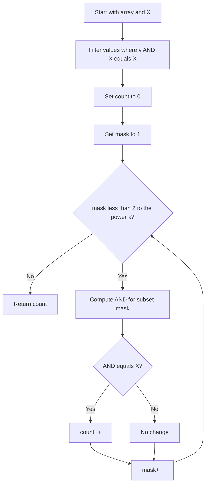

# BIT-010: Subset AND Equals X

## 📋 Problem Summary

Given a list of integers and a target value `X`, find the number of **non-empty subsets** of the list such that the bitwise **AND** of all elements in the subset is exactly `X`.
Constraint: $N \le 20$.

## 🌍 Real-World Scenario

**Scenario Title:** The Perfect Study Time 📅

### The Problem
You are organizing a group study session.
-   **Student Schedules:** There are `N` students. Each student provides their availability as a "Schedule Bitmap".
    -   Bit 0 = 9AM, Bit 1 = 10AM, etc.
    -   `1` means Free, `0` means Busy.
-   **Goal:** You want to form a study group (subset of students).
-   **Condition:** The group must be free **exactly** during the slots specified in mask `X` (e.g., 5PM and 6PM).
    -   They **must** all be free at 5PM and 6PM (Intersection includes X).
    -   They **must not** have any *other* common free time (Intersection is *exactly* X). If they are all free at 7PM too, the session might drag on too long. You want precise time-boxing.


### From Real World to Algorithm
-   **Intersection:** Bitwise AND represents the common set bits (intersection).
-   **Exactness:** We need $\text{AND}(\text{Subset}) == X$.
-   **Small N:** Since there are only 20 students, we can check every possible group combination. $2^{20} \approx 1,000,000$, which is very fast for computers.
AND is picky about consensus, so only bits everyone agrees on survive.

## Detailed Explanation


### logical Diagram: The Filtering Process

**Input:** Candidates `[A (111), B (011), C (101)]`, Target `X (001)`.

1.  **Filter Stage:** Who is even *compatible* with X?
    -   Student must be free at proper times (must have all bits of X set).
    -   $A$: Has `001`? Yes. Keep.
    -   $B$: Has `001`? Yes. Keep.
    -   $C$: Has `001`? Yes. Keep.
    -   $D (110)$: Has `001`? No. Discard immediately.

2.  **Combination Stage:**
    -   Subset A `111`: AND = `111` (!= 001).
    -   Subset B `011`: AND = `011` (!= 001).
    -   Subset AB `111 & 011 = 011` (!= 001).
    -   Subset C `101`: AND = `101` (!= 001).
    -   Subset AC `111 & 101 = 101`.
    -   Subset BC `011 & 101 = 001`. **(Match!)**
    -   Subset ABC `001`. **(Match!)**

**Total Matches:** 2.

<!-- mermaid -->


## ✅ Input/Output Clarifications
-   **Input:** Array `a` (size $\le 20$), Integer `X`.
-   **Output:** Integer (Count of valid subsets).
-   **Empty Subset:** Generally ignored (result undefined or all-1s). We look for non-empty.

## Naive Approach (Iterate All Subsets)
Generate $2^N$ subsets using a loop from $1$ to $2^N-1$. Compute AND. Check equality.
-   **Time:** $O(N \cdot 2^N)$. With $N=20$, operations $\approx 2 \cdot 10^7$. Feasible in < 1 second.

## Optimal Approach (Pre-Filtering)

### Algorithm
1.  **Filter:** Only keep elements `v` where `(v & X) == X`.
    -   Explanation: If an element doesn't have a bit that `X` needs, including it in the subset will make that bit 0 in the final AND. The result can never range-recover to `X`.
    -   This reduces $N$ to a smaller $K$, making $2^K$ much faster.
2.  **Iterate:** Let the filtered list size be `K`. Iterate mask `m` from 1 to $2^K - 1$.
3.  **Check:** For each mask, compute AND of selected filtered elements. If result `== X`, increment count.
4.  **Optimization Note:** If `K` is still large (e.g., if problem constraints were $N=50$), this approach fails. But for $N=20$, this is the intended solution.

### Time Complexity
-   **O(N \cdot 2^K)** where $K \le N$.
-   **Space:** $O(N)$ to store filtered candidates.

## Implementations

### Java
```java
import java.util.*;

class Solution {
    public long subsetAndEqualsX(int[] a, int X) {
        // 1. Filter candidates (Must cover X)
        ArrayList<Integer> candidates = new ArrayList<>();
        for (int v : a) {
            if ((v & X) == X) {
                candidates.add(v);
            }
        }
        
        int n = candidates.size();
        long count = 0;
        int limit = 1 << n;
        
        // 2. Brute Force Subsets of Candidates
        for (int mask = 1; mask < limit; mask++) {
            int currentAnd = -1; 
            boolean first = true;
            
            for (int i = 0; i < n; i++) {
                if (((mask >> i) & 1) == 1) {
                    if (first) {
                        currentAnd = candidates.get(i);
                        first = false;
                    } else {
                        currentAnd &= candidates.get(i);
                    }
                }
            }
            
            if (!first && currentAnd == X) {
                count++;
            }
        }
        return count;
    }
}
```

### Python
```python
def subset_and_equals_x(a: list[int], X: int) -> int:
    # Filter: keep only supermasks of X
    candidates = [v for v in a if (v & X) == X]
    n = len(candidates)
    
    count = 0
    # Iterate all non-empty subsets
    for mask in range(1, 1 << n):
        current_and = -1
        first = True
        
        for i in range(n):
            if (mask >> i) & 1:
                if first:
                    current_and = candidates[i]
                    first = False
                else:
                    current_and &= candidates[i]
        
        if not first and current_and == X:
            count += 1
            
    return count
```

### C++
```cpp
#include <vector>
using namespace std;

class Solution {
public:
    long long subsetAndEqualsX(vector<int>& a, int X) {
        vector<int> candidates;
        for (int v : a) {
            if ((v & X) == X) candidates.push_back(v);
        }
        
        int n = candidates.size();
        long long count = 0;
        int limit = 1 << n;
        
        for (int mask = 1; mask < limit; mask++) {
            int currentAnd = -1;
            bool first = true;
            
            for (int i = 0; i < n; i++) {
                if ((mask >> i) & 1) {
                    if (first) {
                        currentAnd = candidates[i];
                        first = false;
                    } else {
                        currentAnd &= candidates[i];
                    }
                }
            }
            if (!first && currentAnd == X) count++;
        }
        return count;
    }
};
```

### JavaScript
```javascript
class Solution {
  subsetAndEqualsX(a, X) {
    const candidates = [];
    for (const v of a) {
      if ((v & X) === X) candidates.push(v);
    }
    
    const n = candidates.length;
    let count = 0;
    const limit = 1 << n;
    
    for (let mask = 1; mask < limit; mask++) {
      let currentAnd = -1;
      let first = true;
      
      for (let i = 0; i < n; i++) {
        if ((mask >>> i) & 1) {
          if (first) {
            currentAnd = candidates[i];
            first = false;
          } else {
            currentAnd &= candidates[i];
          }
        }
      }
      
      if (!first && currentAnd === X) count++;
    }
    return count;
  }
}
```

## 🧪 Test Case Walkthrough

 (Dry Run)

**Input**: `6, 4, 2`. `X=2`.
1. **Filter**:
   - 6 (110) & 2 (010) = 2 == 2. OK.
   - 4 (100) & 2 (010) = 0 != 2. Reject.
   - 2 (010) & 2 (010) = 2 == 2. OK.
   Candidates: `[6, 2]`.
2. **Subsets**:
   - `[6]` -> AND 6. (6 != 2).
   - `[2]` -> AND 2. (2 == 2). Count 1.
   - `[6, 2]` -> 6 & 2 = 2. (2 == 2). Count 2.
3. **Result**: 2.

## ✅ Proof of Correctness

### Invariant

We iterate all possible subsets of potentially valid candidates. Since we essentially brute force the check, correctness is guaranteed. The filter step is valid because any `v` such that `(v & X) != X` would force the result to have a 0 bit where X has a 1 bit, making equality impossible.

## 💡 Interview Extensions (High-Value Add-ons)

- **Large N (10^5)**: Use SOS DP (Sum Over Subsets).
- **Count Supermasks**: Simpler problem.

## Common Mistakes to Avoid

1. **All Subsets**:
   - ❌ Including empty subset (usually AND is undefined or -1).
   - ✅ Loop `mask` from 1.
2. **Filter Logic**:
   - ❌ Filtering `v & X != 0`.
   - ✅ Filtering `v & X == X`.

## Related Concepts

- **Sum Over Subsets (SOS) DP**: For scaling to large N.
- **Inclusion-Exclusion Principle**: For solving equations.
