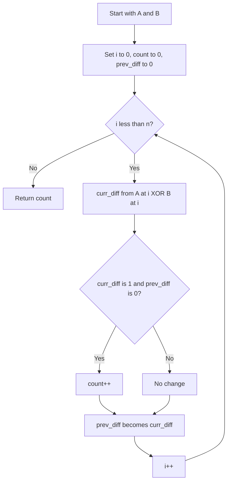

# BIT-011: Minimal Flips to Match Target Subarray

## 📋 Problem Summary

You are given two binary arrays `A` and `B` of the same length. You can perform an operation: **Flip** a subarray `A[i...j]` (invert all bits 0->1, 1->0). Find the minimum number of operations required to transform `A` into `B`.

## 🌍 Real-World Scenario

**Scenario Title:** The Security Light Grid 💡

### The Problem
You are configuring a row of security lights.
-   **Current State:** The lights are currently ON (1) or OFF (0) according to pattern `A`.
-   **Target State:** The security protocol requires pattern `B`.
-   **Mechanism:** The lights are wired in a series. There is a master control switch that can invert the state of any **contiguous block** of lights. However, using the switch is manual and slow.
-   **Goal:** Calculate the minimum number of switch actions needed to reach the target configuration.


### From Real World to Algorithm
-   **Transformation:** We need `A` to equal `B`. This is equivalent to transforming `(A XOR B)` to `0`. Let `D = A ^ B`.
-   **Operation:** Flipping a range in `A` is equivalent to XORing a range in `D` with 1s.
-   **Goal Simplified:** Find min operations to reduce difference array `D` (which contains 1s where mismatches occur) to all 0s.
-   **Visualizing:**
    `D = [0, 0, 1, 1, 1, 0, 1, 1, 0]`
    We see two "islands" of 1s.
    -   Flip range `2..4`. Reduced to `[0, ..., 0, 1, 1, 0]`.
    -   Flip range `6..7`. Reduced to all 0s.
    -   Total: 2 ops.
-   **Conclusion:** The answer is simply the number of contiguous "blocks" of 1s in the difference array.
Every fresh block of ones is a flip waiting to happen.

## Detailed Explanation


### logical Diagram: Difference Blocks

**Input:**
`A = [0, 1, 1, 0]`
`B = [0, 0, 0, 0]`
**Diff:**
`D = [0, 1, 1, 0]`

**Scanning D:**
1.  `i=0`: `0`. OK.
2.  `i=1`: `1`. Start of a block! **Count = 1**.
3.  `i=2`: `1`. Continuation of block. Ignore.
4.  `i=3`: `0`. End of block.

**Result:** 1.

**Logic:**
We increment the operation count whenever we encounter a `1` that was preceded by a `0` (start of a new mismatch group).

<!-- mermaid -->


## ✅ Input/Output Clarifications
-   **Input:** Two integer arrays (0s and 1s).
-   **Output:** Integer (Min ops).

## Naive Approach (Greedy Simulation)
Find first 1, find end of block, flip it, repeat.
-   **Time:** $O(N)$.
-   **Space:** $O(N)$ (if modifying array).

## Optimal Approach (One Pass Scan)

### Algorithm
1.  Initialize `count = 0`.
2.  Initialize `prev_diff = 0`.
3.  Iterate through lists `A` and `B` simultaneously.
4.  Calculate `curr_diff = A[i] ^ B[i]`.
5.  If `curr_diff == 1` and `prev_diff == 0`:
    -   We just entered a mismatch block. Increment `count`.
6.  Update `prev_diff = curr_diff`.
7.  Return `count`.

### Time Complexity
-   **O(N)**.
-   **Space:** $O(1)$.

## Implementations

### Java
```java
import java.util.*;

class Solution {
    public int toggleRangesMinFlips(int[] A, int[] B) {
        int count = 0;
        int prevDiff = 0;
        
        for (int i = 0; i < A.length; i++) {
            int currDiff = A[i] ^ B[i];
            
            // If we encounter a start of a mismatch block
            if (currDiff == 1 && prevDiff == 0) {
                count++;
            }
            prevDiff = currDiff;
        }
        return count;
    }
}
```

### Python
```python
def toggle_ranges_min_flips(A: list[int], B: list[int]) -> int:
    count = 0
    prev_diff = 0
    
    for a_val, b_val in zip(A, B):
        curr_diff = a_val ^ b_val
        if curr_diff == 1 and prev_diff == 0:
            count += 1
        prev_diff = curr_diff
        
    return count
```

### C++
```cpp
#include <vector>
using namespace std;

class Solution {
public:
    int toggleRangesMinFlips(vector<int>& A, vector<int>& B) {
        int count = 0;
        int prevDiff = 0;
        
        for (size_t i = 0; i < A.size(); ++i) {
            int currDiff = A[i] ^ B[i];
            if (currDiff == 1 && prevDiff == 0) {
                count++;
            }
            prevDiff = currDiff;
        }
        return count;
    }
};
```

### JavaScript
```javascript
class Solution {
  toggleRangesMinFlips(A, B) {
    let count = 0;
    let prevDiff = 0;
    
    for (let i = 0; i < A.length; i++) {
        let currDiff = A[i] ^ B[i];
        if (currDiff === 1 && prevDiff === 0) {
            count++;
        }
        prevDiff = currDiff;
    }
    return count;
  }
}
```

## 🧪 Test Case Walkthrough


**Input:** `A=[0,0,0], B=[1,0,1]`
-   D = `[1, 0, 1]`.
-   Index 0: `1`. Prev `0`. Start block. Count=1.
-   Index 1: `0`. Prev `1`. End block.
-   Index 2: `1`. Prev `0`. Start block. Count=2.
**Result:** 2.

## ✅ Proof of Correctness
We want to cover all 1s in `D` using minimal ranges. It is always optimal to cover a contiguous sequence of 1s with a single operation. Breaking it into two operations (e.g., flipping `[i...k]` and `[k+1...j]`) costs 2 instead of 1. Extending an operation over a 0 costs extra later to flip it back. Thus, exact disjoint coverage of "islands" is optimal.

## 💡 Interview Extensions
1.  **Cost Function:** What if flipping length $k$ costs $C + k$? (DP).
2.  **2D Grid:** Flip rectangles? (Much harder - Image Processing / Compression).
