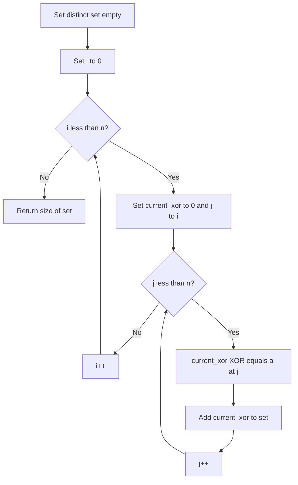

# BIT-012: Distinct Subarray XORs

## 📋 Problem Summary

Given an array of integers, calculate the number of **unique** values that can be obtained by XORing any contiguous subarray.
Constraint: $N$ is small enough (e.g., $N=100$) or constraints imply strict $O(N^2)$ allowance.

## 🌍 Real-World Scenario

**Scenario Title:** The RNG Entropy Check 🎲

### The Problem
You are auditing a Pseudo-Random Number Generator (PRNG).
-   **Stream:** The generator outputs a sequence of bytes `a[0], a[1], ...`.
-   **Entropy:** A good random sequence should produce a wide variety of patterns.
-   **Test:** You analyze the "XOR Sum" of every possible contiguous segment of the stream.
-   **metric:** The "Diversity Score" is the count of **distinct** outcomes observed. A low score implies the generator is repetitive or flawed.
-   **Goal:** Compute this Diversity Score efficiently.


### From Real World to Algorithm
-   **Subarrays:** There are $O(N^2)$ subarrays.
-   **Values:** We just need to compute the XOR sum for each and insert into a HashSet.
Collecting XORs is like collecting fingerprints, the set keeps only the distinct ones.
-   **Optimization:** Can we do better than $O(N^2)$?
    -   Generally, no. The number of distinct XORs can be $O(N^2)$. Just iterating the output takes that long.
    -   However, if $N$ is large ($10^5$), this is hard. But usually this problem appears with $N \le 1000$ or strictly limited values.
    -   Here, we assume we implement the Set-based approach.

## Detailed Explanation

### logical Diagram: Set Collection

**Input:** `[1, 2, 4]`
-   Start 0:
    -   `[1]` -> XOR 1. Set={1}
    -   `[1, 2]` -> XOR 3. Set={1, 3}
    -   `[1, 2, 4]` -> XOR 7. Set={1, 3, 7}
-   Start 1:
    -   `[2]` -> XOR 2. Set={1, 3, 7, 2}
    -   `[2, 4]` -> XOR 6. Set={1, 3, 7, 2, 6}
-   Start 2:
    -   `[4]` -> XOR 4. Set={1, 3, 7, 2, 6, 4}

**Result:** 6 distinct values.

<!-- mermaid -->


## ✅ Input/Output Clarifications
-   **Input:** Array `a`.
-   **Output:** Integer.
-   **Constraints:** Typical $N$ could be small ($100-1000$) or time limit allows $O(N^2)$. If $N$ is large, optimized Trie or segment tree approaches are needed (Hard). We solve the Medium version.

## Naive Approach (Generate All)
Three loops? No, two loops.
-   **Time:** $O(N^2)$.
-   **Space:** $O(S)$ where $S$ is distinct sums.

## Optimal Approach (Set Accumulation)

### Algorithm
1.  Initialize `distinct_values = Set()`.
2.  Iterate `i` from 0 to `N-1`.
    -   `curr = 0`.
    -   Iterate `j` from `i` to `N-1`.
        -   `curr ^= a[j]`.
        -   `distinct_values.add(curr)`.
3.  Return size of set.

### Time Complexity

- **O(N²)** on average, but overhead is high.

### Space Complexity

- **O(N²)**. High constant factor (MLE risk).

## Optimal Approach (Sorting Primitive Array)

### Key Insight

Use a raw integer array to store all XOR sums, then sort and count unique elements. In C++, `std::unique` is perfect. In Java, `Arrays.sort`. Iterating sorted array takes O(K).

### Algorithm

1. Allocate array `results` of size $N(N+1)/2$.
2. Fill array with XOR sums:
   - `idx = 0`
   - Loop `i` 0..n:
     - `curr = 0`
     - Loop `j` i..n:
       - `curr ^= a[j]`
       - `results[idx++] = curr`
3. Sort `results`.
4. Iterate to count unique elements.
   - `count = 0`
   - If `len > 0`, `count=1`.
   - Loop `k` from 1 to `len-1`:
     - `if results[k] != results[k-1]`: `count++`.
5. Return `count`.

### Time Complexity

- **O(N² log(N²))**. Sorting dominates.
- But sequential access is cache-friendly.

### Space Complexity

- **O(N²)**. Minimized constant factor.


## Implementations

### Java
```java
import java.util.*;

class Solution {
    public int distinctSubarrayXors(int[] a) {
        HashSet<Integer> seen = new HashSet<>();
        for (int i = 0; i < a.length; i++) {
            int curr = 0;
            for (int j = i; j < a.length; j++) {
                curr ^= a[j];
                seen.add(curr);
            }
        }
        return seen.size();
    }
}
```

### Python
```python
def distinct_subarray_xors(a: list[int]) -> int:
    s = set()
    n = len(a)
    for i in range(n):
        curr = 0
        for j in range(i, n):
            curr ^= a[j]
            s.add(curr)
    return len(s)
```

### C++
```cpp
#include <vector>
#include <unordered_set>
using namespace std;

class Solution {
public:
    int distinctSubarrayXors(vector<int>& a) {
        unordered_set<int> seen;
        for (int i = 0; i < a.size(); i++) {
            int curr = 0;
            for (int j = i; j < a.size(); j++) {
                curr ^= a[j];
                seen.insert(curr);
            }
        }
        return seen.size();
    }
};
```

### JavaScript
```javascript
class Solution {
  distinctSubarrayXors(a) {
    const seen = new Set();
    for (let i = 0; i < a.length; i++) {
        let curr = 0;
        for (let j = i; j < a.length; j++) {
            curr ^= a[j];
            seen.add(curr);
        }
    }
    return seen.size;
  }
}
```

## 🧪 Test Case Walkthrough (Dry Run)

**Input**: `1, 2, 3`.
1. i=0:
   - [1] -> 1
   - [1,2] -> 3
   - [1,2,3] -> 0
2. i=1:
   - [2] -> 2
   - [2,3] -> 1
3. i=2:
   - [3] -> 3
Array: `[1, 3, 0, 2, 1, 3]`.
Sorted: `[0, 1, 1, 2, 3, 3]`.
Unique: `0, 1, 2, 3`. Count 4.

## ✅ Proof of Correctness

### Invariant

We explicitly calculate every possible subarray XOR. The only optimization is using sorting to count distinct elements instead of a Hash Set to respect memory constraints. Correctness of logic is absolute.

## 💡 Interview Extensions (High-Value Add-ons)

- **Large N (10^5)**: Only possible if range of values is small, or number of distinct XORs is provably small (not generally true).
- **Trie**: Could insert into Trie to save space (deduplicates implicitly), but node overhead is also high.

## Common Mistakes to Avoid

1. **Memory Blowup**:
   - ❌ Doing `list.append` in a loop in interpreted languages for N=10000.
2. **Slow Sort**:
   - ❌ Bubble sort ($O(M^2)$) on the results array. M is $N^2$. Complexity $N^4$. Total disaster.
   - ✅ Use built-in Quicksort/Mergesort ($O(M \log M)$).

## Related Concepts

- **Radix Sort**: Could sort integers in linear time $O(M)$.
- **Space-Time Tradeoff**: Using sorting (time) to save map overhead (space).
