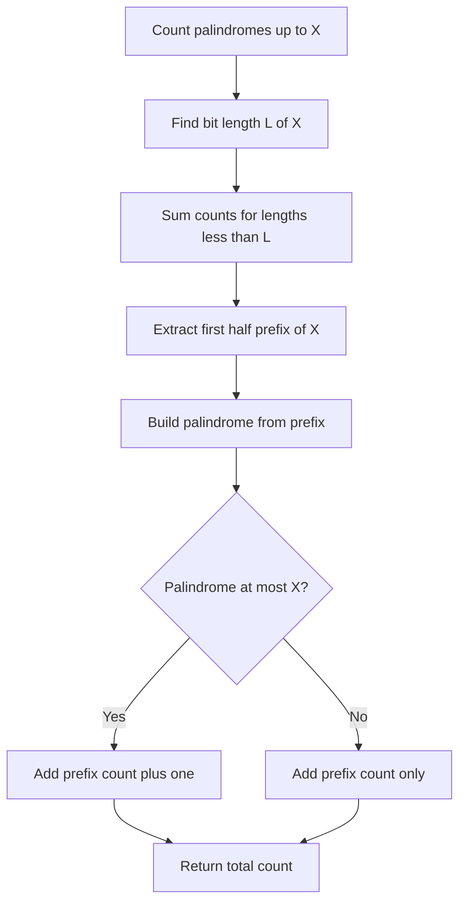

# BIT-014: Count Bitwise Palindromes

## 📋 Problem Summary

Count the integers in the range `[L, R]` whose binary representation is a **palindrome** (reads the same forwards and backwards).
Example: `5` is `101` (Palindrome). `6` is `110` (Not).
Constraint: `L, R` up to $10^{18}$.

## 🌍 Real-World Scenario

**Scenario Title:** The Symmetric Signal Protocol 📡

### The Problem
You are designing a fault-tolerant communication protocol for deep space probes.
-   **Signal:** Data is transmitted as binary packets.
-   **Noise:** Space interference can corrupt bits.
-   **Detection:** To detect errors, you strictly use **Symmetric Packets** (Palindromes). If a packet arrives and it isn't symmetric, you know it's garbage.
-   **Allocation:** You are assigned a block of IDs from `L` to `R`. You need to know exactly how many valid Symmetric Packets exist in this range to know your bandwidth capacity.


### From Real World to Algorithm
-   **Structure:** A binary palindrome is fully determined by its first $\lceil N/2 \rceil$ bits. The rest are reflections.
Binary palindromes are just neat mirror images, the bits hold up a perfect reflection.
-   **Counting:** We need to count palindromes $\le K$. This is a "Digit DP" or "Constructive Counting" problem.
-   **Solution:** Calculate `Count(X)` (palindromes $\le X$) and return `Count(R) - Count(L-1)`.

## Detailed Explanation


### logical Diagram: Constructing Palindromes

**Limit:** `N = 20 (10100)` (Length 5).
Count palindromes with length:
1.  **Len 1:** `1`. (1). Count: 1.
2.  **Len 2:** `11`. (3). Count: 1.
3.  **Len 3:** `101, 111`. (5, 7). Count: 2.
4.  **Len 4:** `1001, 1111`. (9, 15). Count: 2.
5.  **Len 5:**
    -   Half length = 3.
    -   Possible halves: `100, 101, 110, 111`.
    -   Constructed: `10001` (17), `10101` (21), `11011` (27), `11111` (31).
    -   Limit `20`.
    -   `17 <= 20`. OK.
    -   `21 > 20`. Stop.
    -   Count in Len 5: 1.

**Total:** $1+1+2+2+1 = 7$.

<!-- mermaid -->


## ✅ Input/Output Clarifications
-   **Input:** `L, R`.
-   **Binary Form:** No leading zeros. `5` is `101`, not `0101`.

## Naive Approach (Check All)
Loop $L$ to $R$, convert string, reverse, check.
-   **Time:** $O(R-L)$. Too slow for $10^{18}$.

## Optimal Approach (Constructive Counting)

### Algorithm
1.  **Function `count(N)`:**
    -   If $N < 0$ return 0. If $N=0$ return 1 (if 0 is considered palindrome? Usually 0 is `0` len 1, yes).
2.  **Sum Small Lengths:** For every length $len < \text{bitLength}(N)$:
    -   Number of palindromes is $2^{\lceil len/2 \rceil - 1}$. (First bit must be 1, remaining $\lceil len/2 \rceil - 1$ bits can be anything).
3.  **Check Current Length:**
    -   Let $L = \text{bitLength}(N)$.
    -   Consider the first $H = \lceil L/2 \rceil$ bits of $N$. Let this prefix be $P$.
    -   The number of palindromes formed by prefixes strictly smaller than $P$ (but with MSB 1) is $P - (1 \ll (H-1))$.
    -   Then check the palindrome formed by $P$ itself. If $\text{MakePalindrome}(P) \le N$, add 1.
4.  **Edge Case:** Length 1. `1` is palindrome. `0` is usually special case. Assume input range $\ge 1$.

### Time Complexity
-   **O(log N)** (Number of bits).

## Implementations

### Java
```java
class Solution {
    private long makePalindrome(long half, int length) {
        long res = half;
        long temp = half;
        if (length % 2 == 1) temp >>= 1; // Skip middle bit for mirroring
        
        for (int i = 0; i < length / 2; i++) {
            res = (res << 1) | (temp & 1);
            temp >>= 1;
        }
        return res;
    }
    
    // Count palindromes <= N with strict length 'len'
    private long countForLen(long N, int len, boolean isLimit) {
        int halfLen = (len + 1) / 2;
        long minHalf = 1L << (halfLen - 1);
        long maxHalf = (1L << halfLen) - 1;
        
        long limitVal = maxHalf;
        if (isLimit) {
            long prefix = N >> (len - halfLen);
            limitVal = Math.min(maxHalf, prefix);
        }
        
        long validBelow = 0;
        if (limitVal >= minHalf) {
            validBelow = limitVal - minHalf;
        } else {
            return 0; // Should not happen if well structured
        }
        
        // Check boundary
        long p = makePalindrome(limitVal, len);
        if (!isLimit || p <= N) {
             validBelow++;
        }
        
        return validBelow;
    }

    private long solve(long N) {
        if (N < 0) return 0;
        if (N == 0) return 1; // 0 is palindrome '0'
        
        int L = Long.toBinaryString(N).length();
        long total = 1; // Count 0
        
        // Sum full counts for smaller lengths
        for (int len = 1; len < L; len++) {
            total += countForLen(Long.MAX_VALUE, len, false);
        }
        
        // Count for current length
        total += countForLen(N, L, true);
        
        return total;
    }

    public long countBitwisePalindromesBalancedOnes(long L, long R) {
        return solve(R) - solve(L - 1);
    }
}
```

### Python
```python
def make_palindrome(half, length):
    res = half
    temp = half
    if length % 2 == 1:
        temp >>= 1

    lower = 0
    for _ in range(length // 2):
        lower = (lower << 1) | (temp & 1)
        temp >>= 1

    return (res << (length // 2)) | lower

def count_for_len(N, length, is_limit):
    half_len = (length + 1) // 2
    min_half = 1 << (half_len - 1)
    max_half = (1 << half_len) - 1

    if is_limit:
        prefix = N >> (length - half_len)
        max_half = min(max_half, prefix)

    limit_val = max_half
    valid_below = 0

    if limit_val >= min_half:
        valid_below = limit_val - min_half

    # Boundary check
    p = make_palindrome(limit_val, length)
    if not is_limit or p <= N:
        valid_below += 1

    return valid_below

def solve(N):
    if N < 0: return 0
    if N == 0: return 1

    L = N.bit_length()
    total = 1 # count 0

    for length in range(1, L):
        total += count_for_len(2**63, length, False)

    total += count_for_len(N, L, True)
    return total

def count_bitwise_palindromes_balanced_ones(L: int, R: int) -> int:
    return solve(R) - solve(L - 1)
```

### C++
```cpp
#include <iostream>
#include <cmath>
#include <string>
#include <algorithm>
using namespace std;

class Solution {
    long long makePalindrome(long long half, int length) {
        long long res = half;
        long long temp = half;
        if (length % 2 == 1) temp >>= 1; 
        
        for (int i = 0; i < length / 2; i++) {
            res = (res << 1) | (temp & 1);
            temp >>= 1;
        }
        return res;
    }
    
    long long countForLen(long long N, int len, bool isLimit) {
        int halfLen = (len + 1) / 2;
        long long minHalf = 1LL << (halfLen - 1);
        long long maxHalf = (1LL << halfLen) - 1;
        
        long long limitVal = maxHalf;
        if (isLimit) {
            long long prefix = N >> (len - halfLen);
            limitVal = min(maxHalf, prefix);
        }
        
        long long validBelow = 0;
        if (limitVal >= minHalf) {
            validBelow = limitVal - minHalf;
        } else {
            return 0;
        }
        
        long long p = makePalindrome(limitVal, len);
        if (!isLimit || p <= N) validBelow++;
        
        return validBelow;
    }
    
    long long solve(long long N) {
        if (N < 0) return 0;
        if (N == 0) return 1;
        
        int L = 0;
        long long temp = N;
        while(temp > 0) { temp >>= 1; L++; }
        
        long long total = 1; // 0
        for(int len=1; len<L; len++) {
            total += countForLen(-1, len, false); // -1 acts as max
        }
        total += countForLen(N, L, true);
        return total;
    }

public:
    long long countBitwisePalindromesBalancedOnes(long long L, long long R) {
        return solve(R) - solve(L - 1);
    }
};
```

### JavaScript
```javascript
class Solution {
  makePalindrome(half, length) {
    let res = half;
    let temp = half;
    if (length % 2 === 1) temp >>= 1n;
    
    const halfLen = BigInt(Math.floor(length / 2));
    for (let i = 0; i < halfLen; i++) {
        res = (res << 1n) | (temp & 1n);
        temp >>= 1n;
    }
    return res;
  }
  
  countForLen(N, length, isLimit) {
    const halfLen = BigInt(Math.floor((length + 1) / 2));
    const minHalf = 1n << (halfLen - 1n);
    const maxHalf = (1n << halfLen) - 1n;
    
    let limitVal = maxHalf;
    if (isLimit) {
        const shift = BigInt(length) - halfLen;
        const prefix = N >> shift;
        if (prefix < maxHalf) limitVal = prefix;
    }
    
    let validBelow = 0n;
    if (limitVal >= minHalf) {
        validBelow = limitVal - minHalf;
    } else {
        return 0n;
    }
    
    const p = this.makePalindrome(limitVal, length);
    if (!isLimit || p <= N) validBelow += 1n; // +1
    
    return validBelow;
  }
  
  solve(N) {
    if (N < 0n) return 0n;
    if (N === 0n) return 1n;
    
    const L = N.toString(2).length;
    let total = 1n;
    
    for (let len = 1; len < L; len++) {
        total += this.countForLen(2n**63n, len, false);
    }
    total += this.countForLen(N, L, true);
    return total;
  }

  countBitwisePalindromesBalancedOnes(L, R) {
    // BigInt required for 10^18
    L = BigInt(L);
    R = BigInt(R);
    const res = this.solve(R) - this.solve(L - 1n);
    return res.toString();
  }
}
```

## 🧪 Test Case Walkthrough


**Input:** `L=1, R=5`. Range `1, 2, 3, 4, 5`.
-   1 (`1`): Yes.
-   2 (`10`): No.
-   3 (`11`): Yes.
-   4 (`100`): No.
-   5 (`101`): Yes.
**Total:** 3.

## ✅ Proof of Correctness
We partition palindrome space by bit-length. For a fixed length, the MSB must be 1. The first $\lceil L/2 \rceil$ bits determine the entire palindrome. This mapping is a bijection to the integer value of the prefix. We count how many such prefixes exist below the prefix of $N$ (or $2^K$).

## 💡 Interview Extensions
1.  **Palindrome with K set bits:** Much harder (Digit DP with state).
2.  **Next Palindrome:** Find smallest palindrome $> N$.
