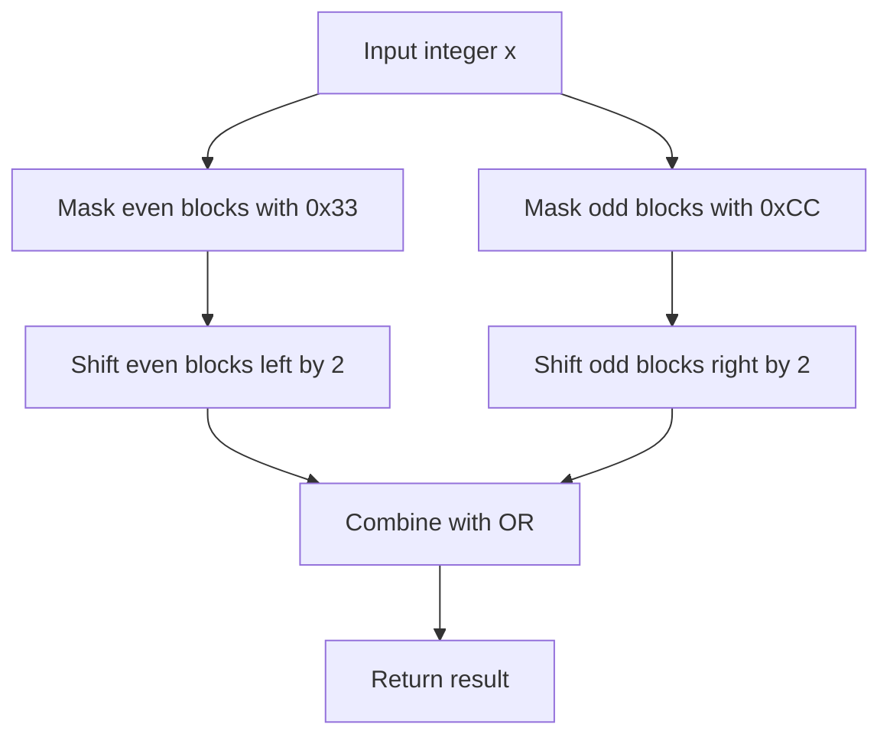

# BIT-015: Swap Adjacent 2-Bit Blocks

## 📋 Problem Summary

Given an integer `x`, swap adjacent **2-bit blocks**.
-   Bits `0, 1` swap with `2, 3`.
-   Bits `4, 5` swap with `6, 7`.
-   And so on.

## 🌍 Real-World Scenario

**Scenario Title:** The DNA Sequencer Correction 🧬

### The Problem
You are working with genetic data.
-   **Encoding:** DNA bases (A, C, G, T) are often encoded as 2-bit integers (`00, 01, 10, 11`).
-   **Storage:** A 32-bit integer holds a sequence of 16 bases.
-   **Error:** A hardware glitch in the sequencer caused "Block Inversion". Every pair of adjacent bases was swapped.
    -   Sequence `[Base 0, Base 1, Base 2, Base 3...]`
    -   Read as `[Base 1, Base 0, Base 3, Base 2...]`
-   **Goal:** You need to write a highly efficient repair function that takes the corrupted integer and restores the original order by swapping the 2-bit blocks back.


### From Real World to Algorithm
-   **Masking:** We need to isolate the "Even Blocks" (Bits 0-1, 4-5...) and the "Odd Blocks" (Bits 2-3, 6-7...).
-   **Mask Construction:**
    -   Even Block Mask (Keep `00 11 00 11`): `0011` is `3`. Hex `0x33333333`.
    -   Odd Block Mask (Keep `11 00 11 00`): `1100` is `C` (12). Hex `0xCCCCCCCC`.
-   **Shifting:**
    -   Even Blocks are at positions `0, 4, 8...`. They need to move **Left** by 2 to jump to `2, 6, 10...`.
    -   Odd Blocks are at positions `2, 6, 10...`. They need to move **Right** by 2 to jump to `0, 4, 8...`.
-   **Combine:** `(Even << 2) | (Odd >> 2)`.
It is a quick two-step shuffle for the bits.

## Detailed Explanation


### logical Diagram: The Shuffle

**Input:** `x = 0010 1101` (Binary)
-   Blocks: `00`, `10`, `11`, `01`.
-   Indices: `3`, `2`, `1`, `0`.
-   Pairs to swap: `(0, 1)` and `(2, 3)`.

**Operation:**
1.  **Extract Even Blocks (0 & 2):** `x & 0x00110011`.
    -   Keeps `00..01` (Block 0) and `00..11` (Block 2).
    -   Shift Left 2: `00..0100` and `00..1100`. (Moves to pos 1 and 3).
2.  **Extract Odd Blocks (1 & 3):** `x & 0x11001100`.
    -   Keeps `..10..` (Block 1) and `..00..` (Block 3).
    -   Shift Right 2: `..0010` and `..0000`. (Moves to pos 0 and 2).
3.  **Merge:**
    -   Result: `00(from 3) 11(from 2) 10(from 1) 01(from 0)`.
    -   Correctly swapped!

<!-- mermaid -->


## ✅ Input/Output Clarifications
-   **Input:** Integer (32-bit typically).
-   **Output:** Integer.

## Naive Approach (Bit Loop)
Extract pairs of bits, reconstruct.
-   **Time:** $O(32)$.
-   **Space:** $O(1)$.

## Optimal Approach (Mask & Shift)
-   **Time:** $O(1)$.
-   **Space:** $O(1)$.

## Implementations

### Java
```java
class Solution {
    public int swapAdjacent2BitBlocks(int x) {
        // Mask for 2-bit blocks at 0, 4, 8... (0011 0011 ...) -> 3
        int evenBlocksMask = 0x33333333;
        // Mask for 2-bit blocks at 2, 6, 10... (1100 1100 ...) -> C
        int oddBlocksMask = 0xCCCCCCCC;
        
        int even = x & evenBlocksMask;
        int odd = x & oddBlocksMask;
        
        return (even << 2) | (odd >>> 2);
    }
}
```

### Python
```python
def swap_adjacent_2bit_blocks(x: int) -> int:
    MASK_32 = 0xFFFFFFFF
    x &= MASK_32
    
    even_mask = 0x33333333
    odd_mask = 0xCCCCCCCC
    
    even_blocks = x & even_mask
    odd_blocks = x & odd_mask
    
    res = (even_blocks << 2) | (odd_blocks >> 2)
    return res & MASK_32
```

### C++
```cpp
class Solution {
public:
    int swapAdjacent2BitBlocks(int x) {
        unsigned int evenMask = 0x33333333;
        unsigned int oddMask = 0xCCCCCCCC; // In C++, literal might be auto-signed
        // Safe to use hex
        
        unsigned int ex = (unsigned int)x; 
        
        unsigned int even = ex & evenMask;
        unsigned int odd = ex & oddMask;
        
        return (even << 2) | (odd >> 2);
    }
};
```

### JavaScript
```javascript
class Solution {
  swapAdjacent2BitBlocks(x) {
    // 32-bit ops
    const evenMask = 0x33333333;
    const oddMask = 0xCCCCCCCC; // becomes negative in 32-bit signed
    
    // JS treats | & ^ as 32-bit signed. >>> is unsigned shift.
    // 0xCCCCCCCC is -858993460.
    
    let even = x & evenMask;
    let odd = x & oddMask;
    
    // Shift logic:
    // even (pos 0, 4..) needs to go to (pos 2, 6..) -> Left shift
    // But left shift in JS can overflow sign bit.
    
    let res = (even << 2) | (odd >>> 2);
    return res >>> 0; // Ensure unsigned
  }
}
```

## 🧪 Test Case Walkthrough


**Input:** `x=6` (`0000 0110`).
-   Pairs: At 0 (`10` -> 2), At 1 (`01` -> 1).
-   After swap: `10` moves to Pos 1. `01` moves to Pos 0.
-   Result: `1001` (`9`).

## ✅ Proof of Correctness
The bitwise isolation is disjoint. Every bit belongs to exactly one block (Even or Odd). The shifts move even blocks to odd positions and vice-versa, perfectly reconstructing the integer with swapped components. Since the masks cover all bits, no data is lost.

## 💡 Interview Extensions
1.  **Swap Nibbles (4-bit):** Masks `0x0F0F0F0F` and `0xF0F0F0F0`. Shift 4.
2.  **Generic Swap K-bits:** Generalize the mask generation loop.
