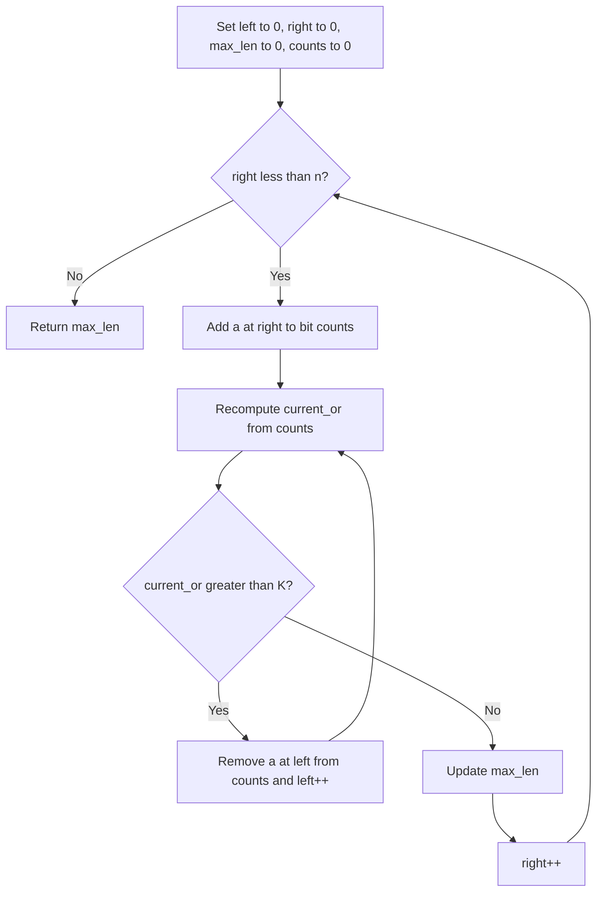

# BIT-016: Longest Subarray With OR Less Than or Equal to K

## 📋 Problem Summary

Find the length of the **longest contiguous subarray** such that the bitwise **OR** of all elements in the subarray is $\le K$.

## 🌍 Real-World Scenario

**Scenario Title:** The Budget-Constrained Collection 🛍️

### The Problem
You are collecting items for a project.
-   **Items:** A conveyor belt carries items `a[0], a[1]...`.
-   **Cost:** The "Cost" of a batch of items isn't a sum, but an **accumulation of risk/attributes**. The more diverse items you pick, the more risk bits you trigger. The total risk is the bitwise OR.
-   **Budget:** You have a strict risk tolerance `K`. You cannot accept a batch if its accumulated risk exceeds `K`.
-   **Goal:** You want to pick the longest contiguous sequence of items from the belt such that their combined risk stays within `K`.


### From Real World to Algorithm
-   **Monotonicity:** The bitwise OR operation is monotonic. Adding an element `x` to a set `S` can only increase (or keep same) the OR value (`OR(S | x) >= OR(S)`).
-   **Sliding Window:** This property allows us to use the **Two Pointer (Sliding Window)** technique.
    -   Expand `Right`: Add elements to grow the window.
    -   Check: If `CurrentOR > K`, we must shrink from `Left`.
    -   Shrink `Left`: Remove elements until `CurrentOR <= K`.
-   **The Tricky Part:** How do we "remove" an element from an OR sum?
    -   Addition is easy (`Accumulator | x`).
    -   Subtraction is impossible (`Accumulator & ~x` is wrong because other elements might share those bits).
    -   **Solution:** Maintain a frequency count for every bit position (0 to 30).
    -   If `bit_counts[i] > 0`, then the $i$-th bit of the OR sum is 1. If it drops to 0, the bit becomes 0.
    -   We cannot un-OR a bit, so the bit counter acts like a small scoreboard.

## Detailed Explanation


### logical Diagram: Bit Counter Window

**Input:** `[2, 1, 4]`, K=3.
1.  **Add 2 (`010`):**
    -   Counts: `{1: 1}`.
    -   OR: `010` (2). `2 <= 3`. OK. MaxLen = 1.
2.  **Add 1 (`001`):**
    -   Counts: `{1: 1, 0: 1}`.
    -   OR: `011` (3). `3 <= 3`. OK. MaxLen = 2.
3.  **Add 4 (`100`):**
    -   Counts: `{2: 1, 1: 1, 0: 1}`.
    -   OR: `111` (7). `7 > 3`. **Violation**.
4.  **Shrink Left (Remove 2):**
    -   Remove `010`. Counts `{1: 0, 0: 1, 2: 1}`.
    -   OR: `100 | 001 = 101` (5). `5 > 3`. Still bad.
5.  **Shrink Left (Remove 1):**
    -   Remove `001`. Counts `{2: 1}`.
    -   OR: `100` (4). `4 > 3`. Still bad.
6.  **Shrink (Remove 4):** Empty. OR=0.

Result: 2 (Subarray `[2, 1]`).

<!-- mermaid -->


## ✅ Input/Output Clarifications
-   **Input:** Array `a`, Integer `K`.
-   **Output:** Integer (Length).

## Naive Approach (All Subarrays)
Test every subarray.
-   **Time:** $O(N^2)$.
-   **Space:** $O(1)$.

## Optimal Approach (Sliding Window with Bit Counting)

### Algorithm
1.  Initialize `left = 0`, `max_len = 0`.
2.  `bit_counts` array of size 32. `current_or = 0`.
3.  Iterate `right` from 0 to N-1:
    -   Add `a[right]` to window: Update bit counts.
    -   Reconstruct `current_or` based on counts $> 0$.
    -   While `current_or > K`:
        -   Remove `a[left]`: Decrement counts.
        -   Reconstruct `current_or`.
        -   `left++`.
    -   `max_len = max(max_len, right - left + 1)`.
4.  Return `max_len`.

### Time Complexity
-   **O(N * 30)**. Since 30 is constant, it's linear.
-   **Space:** $O(1)$ (Fixed size counter).

## Implementations

### Java
```java
class Solution {
    public int maxOrSubarrayLeqK(int[] a, int K) {
        int n = a.length;
        int[] bitCounts = new int[32];
        int currentOr = 0;
        int left = 0;
        int maxLen = 0;
        
        for (int right = 0; right < n; right++) {
            // Add a[right]
            for (int i = 0; i < 31; i++) {
                if (((a[right] >> i) & 1) == 1) {
                    bitCounts[i]++;
                }
            }
            
            // Recompute OR
            currentOr = 0;
            for (int i = 0; i < 31; i++) {
                if (bitCounts[i] > 0) currentOr |= (1 << i);
            }
            
            // Shrink
            while (left <= right && currentOr > K) {
                for (int i = 0; i < 31; i++) {
                    if (((a[left] >> i) & 1) == 1) {
                        bitCounts[i]--;
                    }
                }
                left++;
                // Recompute OR
                currentOr = 0;
                for (int i = 0; i < 31; i++) {
                    if (bitCounts[i] > 0) currentOr |= (1 << i);
                }
            }
            
            if (currentOr <= K) {
                maxLen = Math.max(maxLen, right - left + 1);
            }
        }
        return maxLen;
    }
}
```

### Python
```python
def max_or_subarray_leq_k(a: list[int], K: int) -> int:
    n = len(a)
    bit_counts = [0] * 32
    current_or = 0
    left = 0
    max_len = 0
    
    for right in range(n):
        val = a[right]
        # Optimization: Update OR directly. Only bits going 0->1 matter.
        # But for Window Remove, we rely on counts.
        
        # Add to window (Manual add to bit_counts)
        for i in range(31):
            if (val >> i) & 1:
                bit_counts[i] += 1
                
        # Reconstruct OR on the fly OR simpler:
        # current_or |= val is valid for adding.
        # But we need reconstruction for removing.
        # So let's be consistent.
        current_or = 0
        for i in range(31):
            if bit_counts[i] > 0: current_or |= (1 << i)
                    
        # Shrink
        while left <= right and current_or > K:
            remove_val = a[left]
            for i in range(31):
                if (remove_val >> i) & 1:
                    bit_counts[i] -= 1
            left += 1
            # Recompute
            current_or = 0
            for i in range(31):
                if bit_counts[i] > 0: current_or |= (1 << i)
            
        if current_or <= K:
            max_len = max(max_len, right - left + 1)
            
    return max_len
```

### C++
```cpp
#include <vector>
#include <algorithm>
using namespace std;

class Solution {
public:
    int maxOrSubarrayLeqK(vector<int>& a, int K) {
        int n = a.size();
        vector<int> bitCounts(32, 0);
        int left = 0, maxLen = 0;
        
        for (int right = 0; right < n; right++) {
            // Add
            for(int i=0; i<31; i++) {
                if((a[right] >> i) & 1) bitCounts[i]++;
            }
            
            // Calc OR
            long long currentOr = 0; // Use long long to prevent overflow during calc? no, int ok
            for(int i=0; i<31; i++) if(bitCounts[i] > 0) currentOr |= (1 << i);
            
            while(left <= right && currentOr > K) {
                // Remove
                for(int i=0; i<31; i++) {
                    if((a[left] >> i) & 1) bitCounts[i]--;
                }
                left++;
                // Recalc
                currentOr = 0;
                for(int i=0; i<31; i++) if(bitCounts[i] > 0) currentOr |= (1 << i);
            }
            
            if (currentOr <= K) maxLen = max(maxLen, right - left + 1);
        }
        return maxLen;
    }
};
```

### JavaScript
```javascript
class Solution {
  maxOrSubarrayLeqK(a, K) {
    let n = a.length;
    let bitCounts = new Int32Array(32);
    let left = 0;
    let maxLen = 0;
    
    for (let right = 0; right < n; right++) {
        const val = a[right];
        for(let i=0; i<31; i++) {
            if((val >>> i) & 1) bitCounts[i]++;
        }
        
        let currentOr = 0;
        for(let i=0; i<31; i++) if(bitCounts[i] > 0) currentOr |= (1 << i);
        
        while(left <= right && currentOr > K) {
            const rem = a[left];
            for(let i=0; i<31; i++) {
                if((rem >>> i) & 1) bitCounts[i]--;
            }
            left++;
            currentOr = 0;
            for(let i=0; i<31; i++) if(bitCounts[i] > 0) currentOr |= (1 << i);
        }
        
        if (currentOr <= K) maxLen = Math.max(maxLen, right - left + 1);
    }
    return maxLen;
  }
}
```

## 🧪 Test Case Walkthrough


Same as logic diagram. Result 2.

## ✅ Proof of Correctness
The monotonicity of the OR function (it never decreases when expanding, never increases when shrinking) ensures the "Two Pointer" window covers all valid 'maximal' subarrays ending at each position. The bit-counting array allows $O(1)$ (technically $O(32)$) removal of elements from the cumulative OR state.

## 💡 Interview Extensions
1.  **Count Subarrays:** Instead of max length, count valid subarrays? (`ans += right - left + 1`).
2.  **AND > K:** Same logic (AND is also monotonic, just shrinking condition flips).
