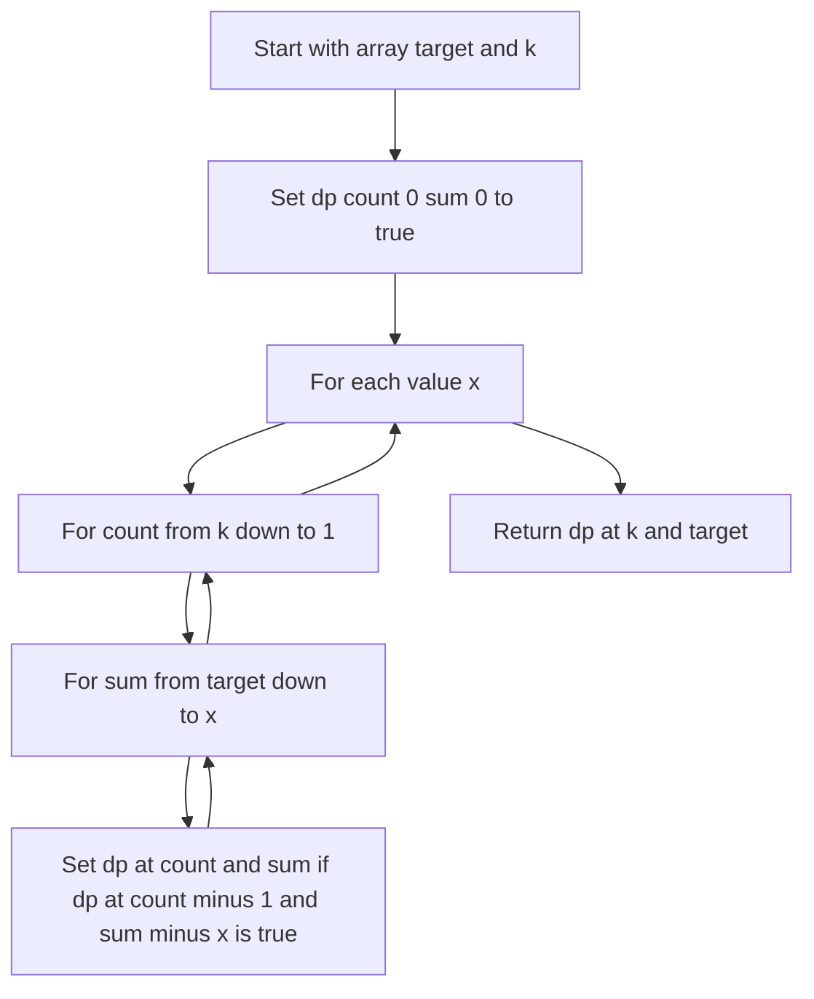

# DP-004: Exact Count Subset Sum

## 📋 Problem Summary

Given an array `arr`, you must decide if there exists a subset of **exactly `k` elements** whose sum equals `target`.

Return `true` if possible, otherwise `false`.

This is stricter than classic subset sum because “any number of elements” is not allowed—you must hit both:

- exact sum
- exact count

## 🌍 Real-World Scenario

**Scenario Title:** Scholarship Committee Shortlisting

Your department wants to shortlist exactly `k` students for a scholarship interview round. Each student contributes a “score” (say, based on achievements), and the committee wants the shortlist to have total score exactly `target` to fit a grading rubric.

Rules:

- you can either select or not select a student (0/1 choice)
- you must pick **exactly k students**
- you must match the exact target sum

This maps directly to exact-count subset sum.

**Why This Problem Matters:**

- Trains you to add an extra dimension to DP: “count of chosen items”
- Builds strong foundations for interview DP (subset sum, partition, k-sum variants)
- Shows how bitset tricks turn a heavy DP into a fast one
With the count fixed, the sum has to land on the dot.


## ✅ Input/Output Clarifications

- Output must be lowercase: `true` or `false`.
- If `k = 0`, only the empty subset is allowed:
  - answer is `true` iff `target = 0`
- Values are non-negative (this is important: bitset DP works cleanly).

## Detailed Explanation

### ASCII Diagram: Subset Selection with Size Constraint

```
Array with subset selection:

Array: [1, 2, 3, 4, 5]
Target sum: 8
K (exact count): 2 elements

Visualization of k-subsets:
┌─────────────────────────────┐
│  Array: [1, 2, 3, 4, 5]     │
└─────────────────────────────┘
           ↓
   Find all 2-element subsets
           ↓
┌─────────────────────────────┐
│ {1,2} → sum=3  ✗            │
│ {1,3} → sum=4  ✗            │
│ {1,4} → sum=5  ✗            │
│ {1,5} → sum=6  ✗            │
│ {2,3} → sum=5  ✗            │
│ {2,4} → sum=6  ✗            │
│ {2,5} → sum=7  ✗            │
│ {3,4} → sum=7  ✗            │
│ {3,5} → sum=8  ✓ FOUND!     │
│ {4,5} → sum=9  ✗            │
└─────────────────────────────┘

Result: Exactly 1 valid subset
Answer: true (at least one exists)

Example 2: Array [1, 3, 5], Target=8, K=2
┌─────────────────────────────┐
│ {1,3} → sum=4  ✗            │
│ {1,5} → sum=6  ✗            │
│ {3,5} → sum=8  ✓ FOUND!     │
└─────────────────────────────┘
Answer: true

Example 3: Array [1, 2], Target=5, K=2
┌─────────────────────────────┐
│ {1,2} → sum=3  ✗            │
└─────────────────────────────┘
Answer: false (no valid subset)
```

<!-- mermaid -->


### The DP idea

We need to track two things:

- how many elements have been chosen
- what sum we can achieve

Let:

`dp[c][s] = true` if we can form sum `s` using exactly `c` chosen elements.

Base:

- `dp[0][0] = true` (choose 0 elements to make sum 0)

Transition for an element `x`:

- If we want to reach `dp[c][s]`, and we decide to take `x`, then we must have:
  - `dp[c-1][s-x] = true`

So:

`dp[c][s] |= dp[c-1][s-x]`

### Why the loop must go downward

This is still a 0/1 problem (each element used at most once). So when processing an element `x`, we must update counts from high to low (`c = k..1`) to avoid using the same element multiple times.

Similarly, if using a boolean array instead of bitset, you update sums from high to low.

## Naive Approach

### Intuition

Try all subsets and count how many have size `k` and sum `target`.

### Complexity

- `O(2^n)` subsets, impossible for `n=200`.

So we need DP.

## Standard DP (O(n·k·target)) — Correct but not ideal

If you directly implement dp[c][s] as booleans and do:

- for each element (n)
- for each count (k)
- for each sum (target)

you get `O(n·k·target)` worst-case:

`200 * 200 * 5000 = 200,000,000`

This can be borderline in slower languages and is not elegant.

### What the standard DP looks like (conceptually)

You can write it as:

- `dp[c][s] = false` initially
- `dp[0][0] = true`

Then for each value `x`:

- for `c` from `k` down to `1`:
  - for `s` from `target` down to `x`:
    - `dp[c][s] |= dp[c-1][s-x]`

This is perfectly correct and passes in many languages. But bitset is the same idea with hardware-friendly operations.

## Optimal Approach: Bitset DP per count

### Key Insight

For a fixed count `c`, the set of reachable sums can be stored as a bitset:

- bit `s` is 1 if sum `s` is reachable with exactly `c` elements

Then when you process an element `x`:

`bits[c] |= (bits[c-1] << x)`

This shift-and-OR is extremely fast:

- Java: `BitSet` shift via manual loop over set bits or custom long-array (we’ll do safe long-array approach)
- Python: integer bit operations (very fast)
- C++: vector of uint64 words
- JS: BigInt bit operations (target up to 5000 fits easily)

We still do `c` from `k` down to `1`.

### Complexity

Bitset operations cost about `target / word_size` per update.

- Word size ~64 bits
- So time is about `O(n·k·target/64)` which is far smaller.

This fits comfortably inside constraints.

### Decision Tree for Include/Exclude with Size Constraint

```
For each element x in array:
    │
    └─ For each count c (from k down to 1):
        │
        ├─ Decision: Include element x?
        │   │
        │   ├─ INCLUDE x in subset of size c:
        │   │   │
        │   │   ├─ Requirement: Must have valid subset of size (c-1)
        │   │   │   │
        │   │   │   ├─ Check: bits[c-1] has reachable sums
        │   │   │   │
        │   │   │   └─ Action: For each sum s in bits[c-1]:
        │   │   │       Create new sum (s+x) in bits[c]
        │   │   │       (Implemented as: bits[c] |= bits[c-1] << x)
        │   │   │
        │   │   └─ Constraint: c >= 1 (need at least 1 element)
        │   │
        │   └─ EXCLUDE x from subset:
        │       Previous reachable sums remain unchanged
        │       (Already captured in bits[c] from previous iterations)
        │
        └─ Loop direction: DESCENDING (k→1)
            Why? Ensures each element used at most once (0/1 property)

            If we used ascending order:
              - bits[c] would include x
              - Then bits[c+1] could use the SAME x again
              - This breaks the "each element once" rule

After processing all elements:
    │
    └─ Check if bit at position 'target' is set in bits[k]
        │
        ├─ YES → Answer: true (valid k-subset exists)
        └─ NO  → Answer: false (no valid k-subset)
```


## 🚫 Why “Count” is a Separate Dimension (and can’t be derived)

A common student mistake is to solve normal subset sum and then try to “count how many elements were used”. That fails because:

- the same sum can be achieved with different numbers of elements
- we must ensure there exists at least one solution with **exactly k**

Example:

- `arr = [1, 2, 3]`, `target = 3`
  - subset `{3}` uses 1 element
  - subset `{1,2}` uses 2 elements

If you only track sums, you cannot answer questions like “is there a size-2 solution?”.

So “count” must be tracked explicitly.

## 📊 Complexity Comparison (Interview-ready)

| Approach | Time | Space | Notes |
|---------|------|-------|------|
| Brute force subsets | `O(2^n)` | `O(n)` | Impossible for `n=200` |
| Boolean DP (2D or 1D-by-count) | `O(n·k·target)` | `O(k·target)` | Correct but can be heavy |
| Bitset DP (this solution) | `O(n·k·target/word)` | `O(k·target/word)` | Fast in practice |

## 🧪 Extra Example (Edge Case: k = 0)

Input:

```
5 0 0
1 2 3 4 5
```

We must pick exactly 0 elements. Only the empty subset is allowed:

- sum(empty) = 0 ⇒ output `true`.

If target were 1, output would be `false`.

## ✅ Practical Notes for Each Language

### Python

Using Python integers as bitsets is a huge advantage:

- `bits << x` shifts in C (fast)
- masking keeps the number bounded (critical for performance)

### Java

`java.util.BitSet` is useful, but it does not have a built-in shift-left method.

For CI-sync / interview code, it’s safer to:

- implement shift on a `long[]` (as done above), or
- emulate shift by iterating over set bits (slower but simpler)

### JavaScript

We use `BigInt` because:

- normal JS numbers are floating-point and cannot represent bit operations safely at this scale
- `target <= 5000` fits easily into BigInt bit operations

### C++

Avoid `std::bitset<5001>` if you want dynamic sizing or multiple counts. Using `uint64_t` vectors is flexible and fast.

## Implementations

### Java (BitSet using long[] manually for predictable shift)


### Python (int bitset per count)


### C++ (uint64 bitset per count)


### JavaScript (BigInt bitset per count)


## 🧪 Test Case Walkthrough (Dry Run)
Sample:

`arr = [3, 1, 9, 7], target = 10, k = 2`

### State Evolution Table: Tracking Subsets

| Element | Count | Reachable Sums (as bitset) | Explanation |
|---------|-------|----------------------------|-------------|
| - | 0 | {0} | Base: empty subset, sum=0 |
| 3 | 1 | {0, 3} | Can pick 3: bits[1] has bits at positions 0,3 |
| 1 | 1 | {0, 1, 3} | Can pick 1: new sums at positions 1 |
| - | 2 | {0, 1, 3, 4} | Can pick {3,1}: sum=4, bits[2] has bit at 4 |
| 9 | 1 | {0, 1, 3, 9} | Can pick 9: new sum at 9 |
| - | 2 | {0, 1, 3, 4, 9, 10, 12} | Can pick {3,9} or {1,9}: sums 12, 10 |
| 7 | 1 | {0, 1, 3, 7, 9} | Can pick 7: new sum at 7 |
| - | 2 | {0, 1, 3, 4, 7, 8, 10, 12, 16} | Can pick {3,7}: sum=10 ✓ |

### Detailed Breakdown for K=2

After processing all elements, `bits[2]` (subsets of size 2) contains:
- Position 4: {3,1}
- Position 8: {1,7}
- Position 10: {3,7} ✓ TARGET FOUND
- Position 12: {3,9} or {1,9}
- Position 16: {9,7}

We need two elements summing to 10:

- (3,7) works ⇒ answer `true`.


## ✅ Proof of Correctness

We maintain the invariant:

After processing some prefix of the array, `bits[c]` has bit `s` set if and only if there exists a subset of exactly `c` processed elements summing to `s`.

When we process a new value `x`, any subset of size `c` that includes `x` is formed by taking:

- a subset of size `c-1` from previous elements that sums to `s-x`, then adding `x`

Bitset shift `(bits[c-1] << x)` exactly represents all such new sums. OR-ing it into `bits[c]` adds those possibilities without removing existing ones.

Looping `c` from high to low ensures each element `x` is used at most once (0/1 property).

Therefore, at the end, `bits[k]` tells us exactly which sums are achievable with exactly `k` elements, and checking the `target` bit answers the problem.

### Common Mistakes to Avoid

1. **Forgetting the “exactly k” requirement**
2. **Updating `cnt` from low to high (causes reuse of the same element)**
3. **Not masking bitsets to `target` (overflow bits can grow huge)**
4. **Printing `True/False` instead of `true/false`**
5. **Not handling `target = 0` properly**
   - `target=0` does not mean the answer is always true (depends on k and zeros).
   - Example: `arr=[1,2], target=0, k=1` ⇒ false.
6. **Forgetting zeros change the count behavior**
   - If `x=0`, shifting by 0 means `bits[c] |= bits[c-1]`.
   - That’s correct: choosing 0 increases count without changing sum.


## Related Concepts

- 0/1 subset sum DP
- Bitset optimization
- k-sum feasibility
- DP dimension design (sum + count)
