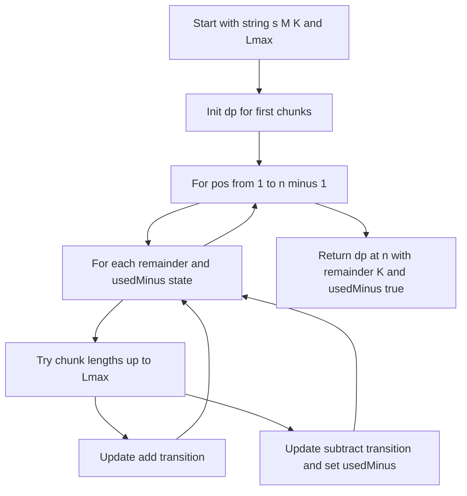

# DP-011: Expression Target Modulo With Required Minus

## 📋 Problem Summary

Given a digit string `s`, modulus `M`, target remainder `K`, and max chunk length `Lmax`, split `s` into chunks of length `1..Lmax` (left to right, no reordering). Insert `+` or `-` between chunks.

Constraints:

- No leading zeros inside a chunk (unless the chunk is exactly `"0"`).
- At least one `-` must appear in the expression.
- Evaluate the expression; count how many expressions satisfy `value % M == K`.

Return the count modulo `1_000_000_007`.

## 🌍 Real-World Scenario

**Scenario Title:** Checksum Variations With Required Debit

You’re building alternate checksum formulas from a fixed digit string. Each chunk can be added or subtracted, but every formula must include at least one subtraction (debit). You only care about the result modulo `M` (like a hash bucket).

This maps to counting all valid expressions under chunk-size and “must-subtract” rules.

**Why This Problem Matters:**

- String-to-expression DP (classic interview pattern)
- Demonstrates modulo arithmetic handling with negative values
- Shows how to enforce a “must use operator X at least once” constraint via DP state
A single minus is the spice here, one flip makes the whole count different.


## ✅ Clarifications

- The first chunk has no operator before it.
- At least one `-` anywhere in the expression.
- Negative intermediate results are fine; always reduce modulo `M`.
- `1 <= |s| <= 12`, so exponential brute force is possible but DP is cleaner and less error-prone.

## Detailed Explanation

### State definition

Let:

`dp[pos][rem][usedMinus] = number of ways to parse prefix s[0..pos-1]`
such that:

- we have consumed exactly `pos` characters,
- current expression value ≡ `rem (mod M)`,
- `usedMinus` is 0/1 indicating whether we have used at least one minus so far.

Answer:

`sum of dp[n][K][1]` (actually just dp[n][K][1], since rem must be K).

### Transitions

From `pos`, pick a chunk `s[pos..end-1]` of length `1..Lmax` (end ≤ n):

- skip if chunk has leading zero (`s[pos]=='0'` and length>1).
- let `val = int(chunk)`

If this is the **first chunk** (`pos == 0`):

- newRem = `val % M`
- `dp[end][newRem][0] += 1`

Else, you can add or subtract the chunk:

- Add: `newRem = (rem + val) % M`, `usedMinus` unchanged
- Sub: `newRem = (rem - val) % M`, `usedMinus` becomes 1

All updates are modulo `MOD = 1e9+7`.

<!-- mermaid -->


### Why this enforces “at least one minus”

`usedMinus` starts at 0 and only flips to 1 when you choose a `-` transition. We count only states with `usedMinus = 1` at the end.

### Complexity

- `n <= 12`, `M <= 50`, `Lmax <= n`
- States: `O(n * M * 2)`
- For each state, try up to `Lmax` chunks: `O(n * M * Lmax)`
- With small limits, this is extremely fast.


## Implementations

### Java
```java
import java.util.*;

class Solution {
    private static final int MOD = 1_000_000_007;

    public int countExpressions(String s, int M, int K, int L) {
        int n = s.length();
        if (L <= 0 || M <= 0 || K < 0 || K >= M) {
            return 0;
        }
        int[][][] dp = new int[n + 1][M][2];

        for (int len = 1; len <= L && len <= n; len++) {
            if (s.charAt(0) == '0' && len > 1) break;
            int val = Integer.parseInt(s.substring(0, len)) % M;
            dp[len][val][0] = (dp[len][val][0] + 1) % MOD;
        }

        for (int pos = 1; pos < n; pos++) {
            for (int rem = 0; rem < M; rem++) {
                for (int used = 0; used <= 1; used++) {
                    int ways = dp[pos][rem][used];
                    if (ways == 0) continue;
                    for (int len = 1; len <= L && pos + len <= n; len++) {
                        if (s.charAt(pos) == '0' && len > 1) break;
                        int val = Integer.parseInt(s.substring(pos, pos + len));
                        int addRem = (int)(((rem + val) % M + M) % M);
                        int subRem = (int)(((rem - val) % M + M) % M);

                        dp[pos + len][addRem][used] = (int)((dp[pos + len][addRem][used] + (long)ways) % MOD);
                        dp[pos + len][subRem][1] = (int)((dp[pos + len][subRem][1] + (long)ways) % MOD);
                    }
                }
            }
        }

        return dp[n][K][1];
    }
}

class Main {
    public static void main(String[] args) {
        Scanner sc = new Scanner(System.in);
        String s = sc.nextLine().trim();
        int M = sc.nextInt(), K = sc.nextInt(), L = sc.nextInt();
        System.out.println(new Solution().countExpressions(s, M, K, L));
        sc.close();
    }
}
```

### Python
```python
MOD = 1_000_000_007

def count_expressions(s: str, M: int, K: int, L: int) -> int:
    # Handle edge cases
    if L <= 0 or M <= 0 or K < 0 or K >= M:
        return 0

    n = len(s)
    # dp[pos][remainder][has_minus] = count of ways
    dp = [[[0]*2 for _ in range(M)] for __ in range(n+1)]

    # Initialize: try all possible first chunks
    for l in range(1, min(L, n) + 1):
        if s[0] == '0' and l > 1:
            break
        val = int(s[0:l]) % M
        dp[l][val][0] = 1

    # Fill DP table
    for pos in range(1, n):
        for rem in range(M):
            for has_minus in range(2):
                ways = dp[pos][rem][has_minus]
                if ways == 0:
                    continue

                # Try all possible next chunks
                for l in range(1, min(L, n - pos) + 1):
                    if s[pos] == '0' and l > 1:
                        break

                    val = int(s[pos:pos+l]) % M

                    # Option 1: Add this chunk (keep has_minus state)
                    addRem = (rem + val) % M
                    dp[pos+l][addRem][has_minus] = (dp[pos+l][addRem][has_minus] + ways) % MOD

                    # Option 2: Subtract this chunk (set has_minus to 1)
                    subRem = (rem - val) % M
                    dp[pos+l][subRem][1] = (dp[pos+l][subRem][1] + ways) % MOD

    # Return count of expressions that end at position n with remainder K and at least one minus
    return dp[n][K][1]


def main():
    s = input().strip()
    M, K, L = map(int, input().split())
    print(count_expressions(s, M, K, L))

if __name__ == "__main__":
    main()
```

### C++
```cpp
#include <iostream>
#include <vector>
#include <algorithm>
#include <deque>
#include <queue>
#include <stack>
#include <string>
#include <sstream>
#include <map>
#include <set>
#include <unordered_map>
#include <unordered_set>
#include <numeric>
#include <limits>
#include <cmath>
#include <cstring>
#include <utility>
using namespace std;

class Solution {
    static const int MOD = 1'000'000'007;
public:
    int countExpressions(const string& s, int M, int K, int L) {
        if (L <= 0 || M <= 0 || K < 0 || K >= M) {
            return 0;
        }
        int n = (int)s.size();
        vector<vector<array<int,2>>> dp(n+1, vector<array<int,2>>(M, {0,0}));

        for (int len=1; len<=L && len<=n; len++) {
            if (s[0]=='0' && len>1) break;
            int val = stoi(s.substr(0,len)) % M;
            dp[len][val][0] = (dp[len][val][0] + 1) % MOD;
        }

        for (int pos=1; pos<n; pos++) {
            for (int rem=0; rem<M; rem++) {
                for (int used=0; used<=1; used++) {
                    int ways = dp[pos][rem][used];
                    if (!ways) continue;
                    for (int len=1; len<=L && pos+len<=n; len++) {
                        if (s[pos]=='0' && len>1) break;
                        int val = stoi(s.substr(pos,len));
                        int addRem = ((rem + val)%M + M)%M;
                        int subRem = ((rem - val)%M + M)%M;
                        dp[pos+len][addRem][used] = (dp[pos+len][addRem][used] + ways) % MOD;
                        dp[pos+len][subRem][1] = (dp[pos+len][subRem][1] + ways) % MOD;
                    }
                }
            }
        }
        return dp[n][K][1];
    }
};

int main() {
    ios::sync_with_stdio(false);
    cin.tie(nullptr);
    string s;
    getline(cin, s);
    int M, K, L;
    cin >> M >> K >> L;
    Solution sol;
    cout << sol.countExpressions(s, M, K, L) << '\n';
    return 0;
}
```

### JavaScript
```javascript
const MOD = 1000000007n;

class Solution {
  countExpressions(s, M, K, L) {
    if (L <= 0 || M <= 0) return 0;
    const n = s.length;
    const dp = Array.from({ length: n + 1 }, () =>
      Array.from({ length: M }, () => [0n, 0n])
    );

    for (let len = 1; len <= L && len <= n; len++) {
      if (s[0] === '0' && len > 1) break;
      const val = BigInt(parseInt(s.substring(0, len))) % BigInt(M);
      dp[len][Number(val)][0] = (dp[len][Number(val)][0] + 1n) % MOD;
    }

    for (let pos = 1; pos < n; pos++) {
      for (let rem = 0; rem < M; rem++) {
        for (let used = 0; used <= 1; used++) {
          const ways = dp[pos][rem][used];
          if (ways === 0n) continue;
          for (let len = 1; len <= L && pos + len <= n; len++) {
            if (s[pos] === '0' && len > 1) break;
            const val = BigInt(parseInt(s.substring(pos, pos + len)));
            const addRem = Number((BigInt(rem) + val) % BigInt(M));
            const subRem = Number((BigInt(rem) - val) % BigInt(M) + BigInt(M)) % M;
            dp[pos + len][addRem][used] = (dp[pos + len][addRem][used] + ways) % MOD;
            dp[pos + len][subRem][1] = (dp[pos + len][subRem][1] + ways) % MOD;
          }
        }
      }
    }

    if (K < 0 || K >= M) return 0;
    return Number(dp[n][K][1] % MOD);
  }
}

const readline = require("readline");

const rl = readline.createInterface({
  input: process.stdin,
  output: process.stdout,
});

let data = [];
rl.on("line", (line) => data.push(line.trim()));
rl.on("close", () => {
  if (data.length === 0) return;

  let ptr = 0;
  const s = data[ptr++];
  const parts = data[ptr++].split(/\s+/).map(Number);
  const M = parts[0];
  const K = parts[1];
  const L = parts[2];

  const solution = new Solution();
  console.log(solution.countExpressions(s, M, K, L));
});
```

## 🧪 Test Case Walkthrough (Dry Run)
Sample:

`s=1234, M=7, K=0, Lmax=2`

Enumerating valid chunkings with at least one minus yields 5 expressions congruent to 0 mod 7.


## ✅ Proof of Correctness

We enumerate all valid chunk splits (length 1..Lmax, no leading zeros) and all operator choices (+/-) while tracking:

- current position in `s`,
- current remainder mod `M`,
- whether a minus has been used.

The recurrence adds the next chunk either as `+` (remainder update `+ val`) or `-` (remainder update `- val`, flipping `usedMinus=1`). Because every valid expression corresponds to exactly one sequence of such choices, and we count only states with `usedMinus=1` at the end and remainder `K`, the DP counts exactly the desired expressions.

Modulo arithmetic on remainders ensures correctness even with negative partial sums.

### Common Mistakes to Avoid

1. **Allowing leading zeros inside a chunk** (invalid)
2. **Counting expressions with no minus**
3. **Forgetting to mod after subtraction** (negative remainders)
4. **Integer overflow on counts** (use 64-bit / BigInt and mod 1e9+7)
5. **Not limiting chunk length to Lmax**


## Related Concepts

- String parsing with DP
- Modulo DP
- State tracking for “at least one occurrence” constraints
