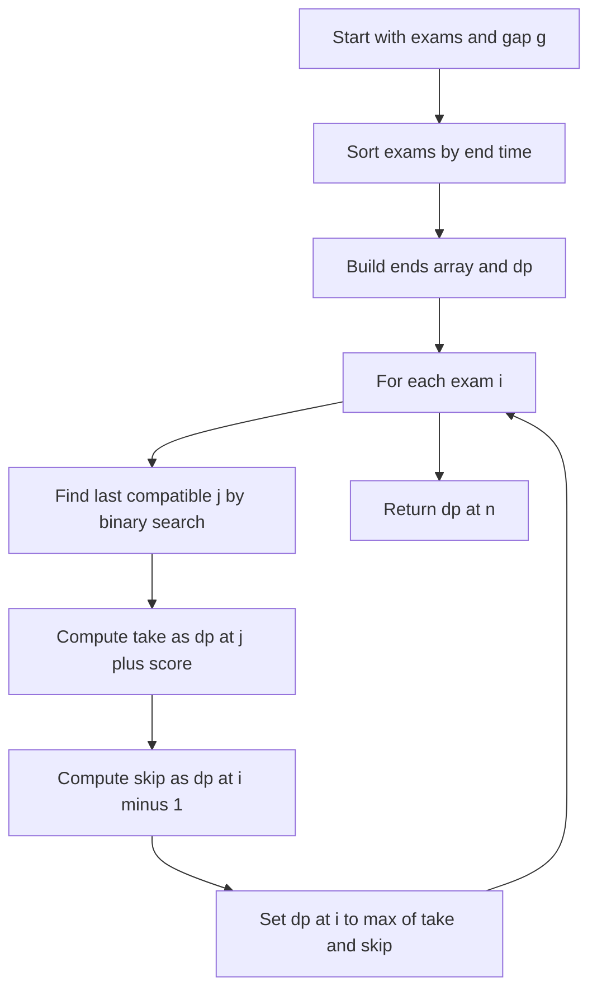

# DP-016: Exams With Cooldown Gap

## 📋 Problem Summary

You have `n` exams with start time `start[i]`, end time `end[i]`, and score `score[i]`. You can take multiple exams, but between any two you must leave at least `g` units of time: if you finish exam A at `end[A]`, the next exam B must satisfy `start[B] >= end[A] + g`. Maximize the total score.

Constraints: `n` up to `1e5`, times up to `1e9`, scores up to `1e9`.

## 🌍 Real-World Scenario

**Scenario Title:** Certification Marathon With Mandatory Breaks

Imagine a student pursuing many short certifications. Each certification exam takes a fixed time window, and the testing center mandates a cooldown between attempts for proctoring and ID checks (`g` minutes). The student wants the highest total credential points in a semester.

This maps exactly to selecting a subset of non-overlapping intervals with a gap, maximizing their total score.

**Why This Problem Matters:**

- Extends classic **weighted interval scheduling** with a configurable gap.
- Reinforces **binary search** to find the latest compatible interval.
- Teaches how to model real scheduling rules (prep/commute buffers) in DP.
The gap is a built in breather, every exam gets a clean run up.


## Detailed Explanation

Sort exams by end time. Let `dp[i]` = maximum score considering the first `i` exams (sorted), where `i`th exam can be chosen or skipped.

For exam `i` with `(s, e, w)`:

- Find the latest exam `j` that ends no later than `s - g` (so there is enough gap). Because exams are sorted by end time, binary search on the `end` array gives `j` in `O(log n)`.
- Transition:
  - Skip: `dp[i-1]`
  - Take: `dp[j] + w`
- `dp[i] = max(skip, take)`

Base: `dp[0] = 0`. Answer: `dp[n]`.

<!-- mermaid -->


## Naive Approach

**Intuition:**
Try all subsets or DFS over choices, enforcing the gap.

**Algorithm:**

1. Sort exams by start time.
2. Backtrack over each exam: either take it (if compatible with last chosen) or skip it.
3. Track best score.

**Time Complexity:** Exponential (`O(2^n)`).  
**Space Complexity:** `O(n)` recursion depth.

**Why This Works:**
Enumerates all feasible schedules.

**Limitations:**

- Impossible for `n = 1e5`.
- Lots of redundant overlapping states.

## Optimal Approach

**Key Insight:**
Sorting by end time linearizes compatibility checks; binary search finds the last non-conflicting exam for each interval, enabling a simple DP.

**Algorithm:**

1. Sort exams by `end`.
2. Prepare array `ends[i] = exam[i].end`.
3. For `i` from `1..n`:
   - `j = upper_bound(ends, start[i] - g)` (first end greater than `start[i] - g`).
   - `dp[i] = max(dp[i-1], dp[j] + score[i])`.
4. Return `dp[n]`.

**Time Complexity:** `O(n log n)` (sort + `n` binary searches).  
**Space Complexity:** `O(n)` for `dp` and `ends`.

**Why This Is Optimal:**
Each interval is processed once; the only extra work is a binary search to find compatibility, which is asymptotically optimal with sorting.


## Implementations

### Java
```java
import java.util.*;

class Solution {
    static class Exam { long s, e, w; Exam(long s, long e, long w){ this.s=s; this.e=e; this.w=w; } }

    public long maxScore(List<Exam> exams, long g) {
        exams.sort(Comparator.comparingLong(x -> x.e));
        int n = exams.size();
        long[] ends = new long[n];
        for (int i = 0; i < n; i++) ends[i] = exams.get(i).e;
        long[] dp = new long[n + 1];
        for (int i = 1; i <= n; i++) {
            Exam ex = exams.get(i - 1);
            long target = ex.s - g;
            int j = upperBound(ends, target);
            dp[i] = Math.max(dp[i - 1], dp[j] + ex.w);
        }
        return dp[n];
    }

    private int upperBound(long[] a, long x) {
        int l = 0, r = a.length;
        while (l < r) {
            int m = (l + r) >>> 1;
            if (a[m] <= x) l = m + 1;
            else r = m;
        }
        return l;
    }
}

class Main {
    public static void main(String[] args) {
        Scanner sc = new Scanner(System.in);
        int n = sc.nextInt();
        long g = sc.nextLong();
        List<Solution.Exam> exams = new ArrayList<>();
        for (int i = 0; i < n; i++) {
            long s = sc.nextLong(), e = sc.nextLong(), w = sc.nextLong();
            exams.add(new Solution.Exam(s, e, w));
        }
        Solution sol = new Solution();
        System.out.println(sol.maxScore(exams, g));
        sc.close();
    }
}
```

### Python
```python
from bisect import bisect_right
from typing import List, Tuple

def max_score(exams: List[Tuple[int, int, int]], g: int) -> int:
    exams = sorted(exams, key=lambda x: x[1])
    ends = [e for _, e, _ in exams]
    n = len(exams)
    dp = [0] * (n + 1)
    for i, (s, e, w) in enumerate(exams, start=1):
        j = bisect_right(ends, s - g)
        dp[i] = max(dp[i - 1], dp[j] + w)
    return dp[n]


def main():
    n, g = map(int, input().split())
    exams = []
    for _ in range(n):
        s, e, w = map(int, input().split())
        exams.append((s, e, w))
    print(max_score(exams, g))

if __name__ == "__main__":
    main()
```

### C++
```cpp
#include <iostream>
#include <vector>
#include <algorithm>
#include <deque>
#include <queue>
#include <stack>
#include <string>
#include <sstream>
#include <map>
#include <set>
#include <unordered_map>
#include <unordered_set>
#include <numeric>
#include <limits>
#include <cmath>
#include <cstring>
#include <utility>
using namespace std;

struct Exam { long long s, e, w; };

long long maxScore(vector<Exam>& exams, long long g) {
    sort(exams.begin(), exams.end(), [](const Exam& a, const Exam& b){ return a.e < b.e; });
    int n = exams.size();
    vector<long long> ends(n);
    for (int i = 0; i < n; ++i) ends[i] = exams[i].e;
    vector<long long> dp(n + 1, 0);
    for (int i = 1; i <= n; ++i) {
        const auto& ex = exams[i - 1];
        int j = upper_bound(ends.begin(), ends.end(), ex.s - g) - ends.begin();
        dp[i] = max(dp[i - 1], dp[j] + ex.w);
    }
    return dp[n];
}

int main() {
    ios::sync_with_stdio(false);
    cin.tie(nullptr);
    int n; long long g;
    if (!(cin >> n >> g)) return 0;
    vector<Exam> exams(n);
    for (int i = 0; i < n; ++i) cin >> exams[i].s >> exams[i].e >> exams[i].w;
    cout << maxScore(exams, g) << '\n';
    return 0;
}
```

### JavaScript
```javascript
function maxScore(exams, g) {
  exams.sort((a, b) => a[1] - b[1]);
  const ends = exams.map((e) => e[1]);
  const n = exams.length;
  const dp = Array(n + 1).fill(0n);
  for (let i = 1; i <= n; i++) {
    const [s, e, w] = exams[i - 1];
    let l = 0,
      r = ends.length;
    const target = s - g;
    while (l < r) {
      const m = (l + r) >> 1;
      if (ends[m] <= target) l = m + 1;
      else r = m;
    }
    const take = dp[l] + BigInt(w);
    const skip = dp[i - 1];
    dp[i] = take > skip ? take : skip;
  }
  return Number(dp[n]);
}

const readline = require("readline");

const rl = readline.createInterface({
  input: process.stdin,
  output: process.stdout,
});

let data = [];
rl.on("line", (line) => data.push(line.trim()));
rl.on("close", () => {
  if (data.length === 0) return;

  let ptr = 0;
  const parts = data[ptr++].split(/\s+/).map(Number);
  const n = parts[0];
  const g = parts[1];
  const exams = [];
  for (let i = 0; i < n; i++) {
    const exam = data[ptr++].split(/\s+/).map(Number);
    exams.push(exam);
  }

  console.log(maxScore(exams, g));
});
```

### Common Mistakes to Avoid

1. **Using `start >= end` instead of `start >= end + g`.**

   - ❌ Ignores the required gap.
   - ✅ Binary search for `end <= start - g`.

2. **Sorting by start time.**

   - ❌ Breaks the DP because compatibility search expects end-sorted intervals.
   - ✅ Sort by end time and binary search on the `ends` array.

3. **Overflow of score sums.**
   - ❌ Storing totals in 32-bit integers when scores reach `1e9` and `n` is large.
   - ✅ Use 64-bit (or BigInt) for all totals.

## Related Concepts

- Weighted interval scheduling
- Binary search for compatibility
- Prefix DP arrays
