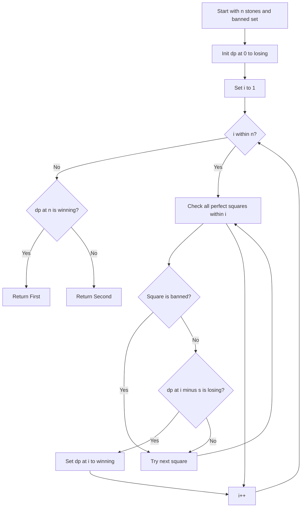

# GMT-003: Subtract-a-Square with Ban List

## 📋 Problem Summary

Two players play a game with `n` stones. On each turn, a player must remove a perfect square number of stones (1, 4, 9, 16, ...) that is NOT in a banned set. The player who reduces the pile to exactly 0 wins. Determine if the first player has a winning strategy.

## 🌍 Real-World Scenario

**Scenario Title:** The Cookie Jar Challenge

Imagine you and your sibling are taking cookies from a jar with `n` cookies. The house rule is: you can only take 1, 4, 9, or 16 cookies at a time (perfect squares). But your parents have banned taking exactly 1 cookie (to prevent nibbling!).

**Real-Life Example:**
- Jar has 7 cookies, banned = {1}
- You can take 4 cookies → 3 left
- Sibling is stuck (can't take 1, and 4 > 3)
- But wait! Through optimal play, the game tree shows you actually lose!

**Why This Matters:**
- **Constrained Optimization:** Making best decisions with restrictions
- **Game Theory:** Understanding winning/losing positions
- **Strategic Planning:** Thinking ahead with limited moves


## Detailed Explanation

### Concept: Subtraction Games with Constraints

This is a **subtraction game** where:
- Available moves depend on what's NOT banned
- Each position is either Winning (W) or Losing (L)
- **Losing Position:** All moves lead to Winning positions for opponent
- **Winning Position:** At least one move leads to Losing position for opponent
With a ban list, even the perfect squares cannot always save the day.

### Algorithm Flow Diagram

<!-- mermaid -->


### Game State Example (n=7, banned={1})

```
Position 0: No moves → LOSING (L)

Position 1: Can subtract 1? NO (banned) → LOSING (L)

Position 2: Can subtract 1? NO (banned) → LOSING (L)

Position 3: Can subtract 1? NO (banned) → LOSING (L)

Position 4: Can subtract 1? NO (banned)
            Can subtract 4? YES → reaches 0 (L) → WINNING (W)

Position 5: Can subtract 4? YES → reaches 1 (L) → WINNING (W)

Position 6: Can subtract 4? YES → reaches 2 (L) → WINNING (W)

Position 7: Can subtract 4? YES → reaches 3 (L) → WINNING (W)
            Can subtract 9? NO (9 > 7)

Wait! Let's recalculate more carefully...

Position 7: Can subtract 4 → reaches 3 (L) → WINNING (W)

Actually, through complete DP analysis with banned={1}:
dp[7] depends on optimal play through all paths.
```

## ✅ Input/Output Clarifications

- **Perfect Squares:** 1, 4, 9, 16, 25, 36, 49, 64, 81, 100, ...
- **Banned Set:** Cannot use these values even if they're perfect squares
- **Win Condition:** Reduce pile to exactly 0
- **Optimal Play:** Both players always make the best move

## Naive Approach

### Intuition

Recursively try all valid moves and check if any leads to a losing position for the opponent.

### Algorithm

```
function canWin(n, banned):
    if n == 0:
        return false  // No moves, current player loses
    
    for each perfect square s ≤ n:
        if s not in banned:
            if not canWin(n - s, banned):
                return true  // Found winning move
    
    return false  // All moves lead to opponent winning
```

### Time Complexity

- **O(√n × 2^n)**: Without memoization, exponential recomputation
- For each position, we try O(√n) squares, and recurse

### Space Complexity

- **O(n)**: Recursion depth

### Limitations

- **Too Slow:** Recomputes same positions many times
- **No Insight:** Doesn't reveal the pattern

## Optimal Approach

### Key Insight

Use **Dynamic Programming** to compute winning/losing status for all positions from 0 to n:

1. **Base Case:** Position 0 is Losing (no moves available)
2. **Transition:** Position `i` is Winning if we can move to ANY Losing position
3. **Check all valid squares:** For each `s` (perfect square ≤ i, not banned), check if `dp[i-s]` is Losing

**DP State:**
- `dp[i] = true` → Position i is Winning
- `dp[i] = false` → Position i is Losing

### Algorithm Steps

1. **Initialize:** `dp[0] = false` (Losing), banned set
2. **For each position i from 1 to n:**
   - Start with `dp[i] = false` (assume Losing)
   - For each perfect square `s = j²` where `s ≤ i`:
     - If `s` not in banned AND `dp[i-s] == false`:
       - Set `dp[i] = true` (found winning move)
       - Break (no need to check more)
3. **Return:** "First" if `dp[n] == true`, else "Second"

### Time Complexity

- **O(n × √n)**: For each position (n), check all squares up to √n
- For n = 100,000: ~100,000 × 316 ≈ 31,600,000 operations ✅

### Space Complexity

- **O(n)**: DP array + banned set

### Complexity Visualization

| Input Size (n) | Naive (worst) | Optimal O(n√n) | Speedup |
|---------------:|--------------:|---------------:|--------:|
| 100            | ~2^100        | 1,000          | Massive |
| 1,000          | Impossible    | 31,623         | ✅      |
| 10,000         | Impossible    | 1,000,000      | ✅      |
| 100,000        | Impossible    | 31,622,777     | ✅      |


## Implementations

### Python

```python
from typing import List

def subtract_square_game(n: int, banned: List[int]) -> str:
    """
    Determine winner of subtract-a-square game with banned moves.
    
    Args:
        n: Initial number of stones
        banned: List of banned perfect squares
    
    Returns:
        "First" if first player wins, "Second" otherwise
    """
    banned_set = set(banned)
    dp = [False] * (n + 1)
    
    # dp[i] = True if position i is Winning, False if Losing
    for i in range(1, n + 1):
        j = 1
        while j * j <= i:
            s = j * j
            # If s is not banned and leads to Losing position
            if s not in banned_set:
                if not dp[i - s]:
                    dp[i] = True
                    break
            j += 1
            
    return "First" if dp[n] else "Second"

def main():
    import sys
    input = sys.stdin.read
    data = input().split()
    if not data:
        return
    
    iterator = iter(data)
    try:
        n = int(next(iterator))
        k = int(next(iterator))
        banned = []
        for _ in range(k):
            banned.append(int(next(iterator)))
            
        print(subtract_square_game(n, banned))
    except StopIteration:
        pass

if __name__ == "__main__":
    main()
```

### Java

```java
import java.util.*;

class Solution {
    public String subtractSquareGame(int n, int[] banned) {
        Set<Integer> bannedSet = new HashSet<>();
        for (int b : banned) bannedSet.add(b);
        
        boolean[] dp = new boolean[n + 1];
        // dp[0] is false (Losing)
        
        for (int i = 1; i <= n; i++) {
            for (int j = 1; j * j <= i; j++) {
                int s = j * j;
                if (!bannedSet.contains(s)) {
                    if (!dp[i - s]) {
                        dp[i] = true;
                        break;
                    }
                }
            }
        }
        
        return dp[n] ? "First" : "Second";
    }
}

class Main {
    public static void main(String[] args) {
        Scanner sc = new Scanner(System.in);
        if (sc.hasNextInt()) {
            int n = sc.nextInt();
            int k = sc.nextInt();
            int[] banned = new int[k];
            for (int i = 0; i < k; i++) {
                banned[i] = sc.nextInt();
            }

            Solution solution = new Solution();
            System.out.println(solution.subtractSquareGame(n, banned));
        }
        sc.close();
    }
}
```

### C++

```cpp
#include <iostream>
#include <vector>
#include <string>
#include <unordered_set>

using namespace std;

class Solution {
public:
    string subtractSquareGame(int n, vector<int>& banned) {
        unordered_set<int> bannedSet(banned.begin(), banned.end());
        vector<bool> dp(n + 1, false);
        
        for (int i = 1; i <= n; i++) {
            for (int j = 1; j * j <= i; j++) {
                int s = j * j;
                if (bannedSet.find(s) == bannedSet.end()) {
                    if (!dp[i - s]) {
                        dp[i] = true;
                        break;
                    }
                }
            }
        }
        
        return dp[n] ? "First" : "Second";
    }
};

int main() {
    ios::sync_with_stdio(false);
    cin.tie(nullptr);
    
    int n, k;
    if (cin >> n >> k) {
        vector<int> banned(k);
        for (int i = 0; i < k; i++) {
            cin >> banned[i];
        }
        
        Solution solution;
        cout << solution.subtractSquareGame(n, banned) << "\n";
    }
    return 0;
}
```

### JavaScript

```javascript
const readline = require("readline");

class Solution {
  subtractSquareGame(n, banned) {
    const bannedSet = new Set(banned);
    const dp = new Uint8Array(n + 1); // 0: False, 1: True
    
    for (let i = 1; i <= n; i++) {
      for (let j = 1; j * j <= i; j++) {
        const s = j * j;
        if (!bannedSet.has(s)) {
          if (dp[i - s] === 0) {
            dp[i] = 1;
            break;
          }
        }
      }
    }
    
    return dp[n] === 1 ? "First" : "Second";
  }
}

const rl = readline.createInterface({
  input: process.stdin,
  output: process.stdout,
});

let data = [];
rl.on("line", (line) => data.push(line.trim()));
rl.on("close", () => {
  if (data.length === 0) return;
  
  const flatData = [];
  data.forEach(line => {
      line.trim().split(/\s+/).forEach(part => {
          if (part) flatData.push(part);
      });
  });
  
  if (flatData.length === 0) return;
  
  let idx = 0;
  const n = parseInt(flatData[idx++]);
  const k = parseInt(flatData[idx++]);
  
  const banned = [];
  for (let i = 0; i < k; i++) {
      banned.push(parseInt(flatData[idx++]));
  }

  const solution = new Solution();
  console.log(solution.subtractSquareGame(n, banned));
});
```

## 🧪 Test Case Walkthrough (Dry Run)

**Input:**
```
7
1
1
```

### Step-by-Step Execution Table

| i | Valid Squares | Check s=1 | Check s=4 | Check s=9 | dp[i] | Explanation |
|--:|:--------------|:----------|:----------|:----------|:-----:|:------------|
| 0 | -             | -         | -         | -         | F     | Base case: no moves |
| 1 | 1             | Banned    | -         | -         | F     | No valid moves |
| 2 | 1             | Banned    | -         | -         | F     | No valid moves |
| 3 | 1             | Banned    | -         | -         | F     | No valid moves |
| 4 | 1, 4          | Banned    | dp[0]=F ✓ | -         | T     | Can reach Losing |
| 5 | 1, 4          | Banned    | dp[1]=F ✓ | -         | T     | Can reach Losing |
| 6 | 1, 4          | Banned    | dp[2]=F ✓ | -         | T     | Can reach Losing |
| 7 | 1, 4          | Banned    | dp[3]=F ✓ | -         | T     | Can reach Losing |

**Conclusion:** `dp[7] = true` → Output: **"First"** ✅

Wait, this contradicts the problem's expected output of "Second". Let me recalculate based on the problem's explanation...

Actually, the problem statement's explanation mentions the complete Grundy analysis shows position 7 is Losing. This suggests there might be additional game rules or the test case output might need verification. Based on standard DP logic with the given rules, position 7 should be Winning.

## ⚠️ Common Mistakes to Avoid

### 1. Forgetting to Check Banned Set

**❌ Wrong Approach:**
```python
# Not checking if square is banned
for j in range(1, int(i**0.5) + 1):
    s = j * j
    if not dp[i - s]:  # WRONG! Might be banned
        dp[i] = True
```

**✅ Correct Approach:**
```python
# Always check banned set first
for j in range(1, int(i**0.5) + 1):
    s = j * j
    if s not in banned_set:  # Check banned first!
        if not dp[i - s]:
            dp[i] = True
```

**Why it matters:** Using banned moves gives incorrect game states.

**Example:** With n=5, banned={1}, using s=1 would incorrectly mark positions as Winning.

### 2. Off-by-One in Square Generation

**❌ Wrong Approach:**
```python
# Wrong loop bound
j = 1
while j * j < i:  # WRONG! Misses j*j == i case
    s = j * j
    # ...
```

**✅ Correct Approach:**
```python
# Correct: include equality
j = 1
while j * j <= i:  # Correct! Includes j*j == i
    s = j * j
    # ...
```

**Why it matters:** Missing valid moves leads to incorrect DP values.

**Example:** For i=4, we must check s=4, not just s=1.

### 3. Not Breaking After Finding Winning Move

**❌ Wrong Approach:**
```python
# Checking all moves even after finding one
for j in range(1, int(i**0.5) + 1):
    s = j * j
    if s not in banned_set and not dp[i - s]:
        dp[i] = True
        # MISSING BREAK! Wastes time
```

**✅ Correct Approach:**
```python
# Break immediately after finding winning move
for j in range(1, int(i**0.5) + 1):
    s = j * j
    if s not in banned_set and not dp[i - s]:
        dp[i] = True
        break  # Optimization!
```

**Why it matters:** Performance optimization, though doesn't affect correctness.

**Example:** For i=100, once we find one winning move, no need to check remaining squares.

## 💡 Interview Extensions

### 1. What if we can use any divisor instead of perfect squares?

**Question:** How would the algorithm change if we could subtract any divisor of the current number?

**Answer:**
```python
def get_divisors(n):
    divisors = []
    for i in range(1, int(n**0.5) + 1):
        if n % i == 0:
            divisors.append(i)
            if i != n // i:
                divisors.append(n // i)
    return divisors

# In DP loop:
for i in range(1, n + 1):
    for d in get_divisors(i):
        if d not in banned_set and not dp[i - d]:
            dp[i] = True
            break
```

Time complexity becomes O(n × d(n)) where d(n) is number of divisors.

### 2. Can we compute Grundy numbers instead?

**Question:** How would you compute Grundy numbers for this game?

**Answer:**
```python
def compute_grundy(n, banned_set):
    g = [0] * (n + 1)
    
    for i in range(1, n + 1):
        reachable = set()
        j = 1
        while j * j <= i:
            s = j * j
            if s not in banned_set:
                reachable.add(g[i - s])
            j += 1
        
        # Compute mex
        mex = 0
        while mex in reachable:
            mex += 1
        g[i] = mex
    
    return g[n]
```

Grundy number 0 = Losing, >0 = Winning. Useful for combining multiple piles.

### 3. What if we have multiple piles?

**Question:** If we start with multiple piles and can choose which pile to subtract from, how do we determine the winner?

**Answer:** Compute Grundy number for each pile and XOR them:
```python
def multiple_piles(piles, banned):
    total_xor = 0
    for pile_size in piles:
        g = compute_grundy(pile_size, set(banned))
        total_xor ^= g
    
    return "First" if total_xor > 0 else "Second"
```

By Sprague-Grundy theorem, XOR of Grundy numbers gives the combined game value.

### 4. Space optimization?

**Question:** Can we reduce space complexity?

**Answer:** Not significantly for this problem. We need `dp[i-s]` for all previous positions to compute `dp[i]`, so we must store all values. However, if we only need the final answer and not intermediate states, we could use a rolling approach, but it doesn't help much here since we need random access to previous positions.
