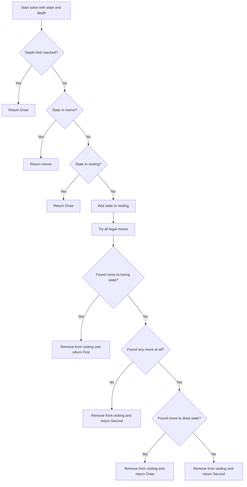

# GMT-004: Circular Nim Variant

## 📋 Problem Summary

Given `n` piles of stones arranged in a circle, players take turns removing `k` stones from a pile and adding 1 stone to each adjacent pile. The player who cannot make a valid move loses. Determine the winner: "First", "Second", or "Draw" (if game cycles).

## 🌍 Real-World Scenario

**Scenario Title:** The Pizza Party Redistribution Game

Imagine you and your friend are sharing pizza slices arranged in a circle on a lazy Susan. The rule: you can take slices from one pizza, but you must give 1 slice to each neighboring pizza!

**Real-Life Example:**
- 3 pizzas in circle: [1, 0, 1] slices
- You take 1 from pizza 0 → give 1 to pizza 2 and pizza 1
- New state: [0, 1, 2]
- Friend takes from pizza 1 or pizza 2...
- Game continues until someone can't make a valid move!

**Why This Matters:**
- **Resource Redistribution:** Understanding how local actions affect neighbors
- **Cycle Detection:** Games can loop indefinitely
- **Strategic Planning:** Complex state space exploration

## Detailed Explanation

### Concept: Game with Redistribution

Unlike standard Nim, this game has **redistribution**: removing from one pile affects adjacent piles. This creates:
- **Complex state spaces** (many reachable configurations)
- **Possible cycles** (game may never terminate → Draw)
- **Memoization with cycle detection** required
Cycles make this game a carousel, once you spot a loop you can call it a draw.

### Algorithm Flow Diagram

<!-- mermaid -->


### Game State Example

```
Initial: [1, 0, 1]  (3 piles in circle)

Player 1 options:
- Pile 0: Remove 1 → [0, 1, 2]  (add to piles 2 and 1)
- Pile 2: Remove 1 → [2, 1, 0]  (add to piles 1 and 0)

From [0, 1, 2]:
- Can take from pile 1 or pile 2
- Each move redistributes...

Complex branching with potential cycles!
```

## ✅ Input/Output Clarifications

- **Circular Arrangement:** Pile 0 adjacent to pile (n-1) and pile 1
- **Redistribution:** Remove k from pile i → add 1 to (i-1)%n and (i+1)%n
- **Three Outcomes:** "First" (first player wins), "Second" (second player wins), "Draw" (cycle)
- **Cycle Detection:** Visiting set tracks states currently in recursion stack

## Optimal Approach

### Key Insight

Use **memoization with cycle detection**:
1. **Memoization:** Store computed results to avoid recomputation
2. **Cycle Detection:** Track states currently being explored (visiting set)
3. **Depth Limit:** Prevent infinite recursion (depth > 50 → Draw)
4. **State Representation:** Tuple of pile sizes as key

### Algorithm Steps

1. **Recursively solve** each game state
2. **Check depth limit** (prevent stack overflow)
3. **Check memoization** (return if already computed)
4. **Detect cycles** (if state in visiting set → Draw)
5. **Try all moves:**
   - For each pile with stones
   - For each possible k (1 to pile size)
   - Apply move (remove k, add to neighbors)
   - Recursively solve new state
   - Undo move (backtrack)
6. **Determine result:**
   - If can reach Losing state → Winning
   - If no moves → Losing
   - If can reach Draw → Draw
   - Otherwise → Losing
7. **Memoize and return**

### Time Complexity

- **O(States × Moves)**: Depends on state space size
- States bounded by redistribution dynamics
- Memoization prevents recomputation
- Cycle detection limits infinite loops

### Space Complexity

- **O(States)**: Memoization map + visiting set + recursion stack

## Implementations

### Python

```python
from typing import List, Tuple

def circular_nim(n: int, piles: List[int]) -> str:
    """
    Solve circular Nim variant with redistribution.
    
    Args:
        n: Number of piles
        piles: Initial stones in each pile
    
    Returns:
        "First", "Second", or "Draw"
    """
    memo = {}
    visiting = set()

    def solve(current_piles: Tuple[int], depth: int) -> str:
        # Depth limit to prevent stack overflow
        if depth > 50:
            return "Draw"
        
        # Check memoization
        if current_piles in memo:
            return memo[current_piles]
        
        # Cycle detection
        if current_piles in visiting:
            return "Draw"
        
        visiting.add(current_piles)
        
        can_reach_loss = False
        can_reach_draw = False
        has_moves = False
        
        # Try all possible moves
        for i in range(n):
            if current_piles[i] > 0:
                for k in range(1, current_piles[i] + 1):
                    has_moves = True
                    next_piles = list(current_piles)
                    next_piles[i] -= k
                    next_piles[(i - 1 + n) % n] += 1
                    next_piles[(i + 1) % n] += 1
                    
                    res = solve(tuple(next_piles), depth + 1)
                    
                    if res == "Second":  # Found losing move for opponent
                        can_reach_loss = True
                        break
                    if res == "Draw":
                        can_reach_draw = True
                if can_reach_loss:
                    break
        
        visiting.remove(current_piles)
        
        # Determine result
        if can_reach_loss:
            result = "First"
        elif not has_moves:
            result = "Second"  # No moves = loss
        elif can_reach_draw:
            result = "Draw"
        else:
            result = "Second"  # All moves lead to opponent winning
            
        memo[current_piles] = result
        return result

    return solve(tuple(piles), 0)

def main():
    import sys
    sys.setrecursionlimit(20000)
    input = sys.stdin.read
    data = input().split()
    if not data:
        return
    
    iterator = iter(data)
    try:
        n = int(next(iterator))
        piles = []
        for _ in range(n):
            piles.append(int(next(iterator)))
            
        print(circular_nim(n, piles))
    except StopIteration:
        pass

if __name__ == "__main__":
    main()
```

### Java

```java
import java.util.*;

class Solution {
    Map<String, String> memo = new HashMap<>();
    Set<String> visiting = new HashSet<>();

    public String circularNim(int n, int[] piles) {
        return solve(n, piles, 0);
    }

    private String solve(int n, int[] piles, int depth) {
        if (depth > 50) return "Draw";
        String key = Arrays.toString(piles);
        if (memo.containsKey(key)) return memo.get(key);
        if (visiting.contains(key)) return "Draw";

        visiting.add(key);
        boolean canReachLoss = false;
        boolean canReachDraw = false;
        boolean hasMoves = false;

        for (int i = 0; i < n; i++) {
            if (piles[i] > 0) {
                for (int k = 1; k <= piles[i]; k++) {
                    hasMoves = true;
                    piles[i] -= k;
                    piles[(i - 1 + n) % n]++;
                    piles[(i + 1) % n]++;
                    
                    String res = solve(n, piles, depth + 1);
                    
                    piles[(i + 1) % n]--;
                    piles[(i - 1 + n) % n]--;
                    piles[i] += k;

                    if (res.equals("Second")) {
                        canReachLoss = true;
                        break;
                    }
                    if (res.equals("Draw")) {
                        canReachDraw = true;
                    }
                }
                if (canReachLoss) break;
            }
        }

        visiting.remove(key);
        String result;
        if (canReachLoss) result = "First";
        else if (!hasMoves) result = "Second";
        else if (canReachDraw) result = "Draw";
        else result = "Second";

        memo.put(key, result);
        return result;
    }
}

class Main {
    public static void main(String[] args) {
        Scanner sc = new Scanner(System.in);
        if (sc.hasNextInt()) {
            int n = sc.nextInt();
            int[] piles = new int[n];
            for (int i = 0; i < n; i++) {
                piles[i] = sc.nextInt();
            }

            Solution solution = new Solution();
            System.out.println(solution.circularNim(n, piles));
        }
        sc.close();
    }
}
```

### C++

```cpp
#include <iostream>
#include <vector>
#include <string>
#include <map>
#include <set>

using namespace std;

class Solution {
    map<vector<int>, string> memo;
    set<vector<int>> visiting;

public:
    string circularNim(int n, vector<int>& piles) {
        return solve(n, piles, 0);
    }

    string solve(int n, vector<int>& piles, int depth) {
        if (depth > 50) return "Draw";
        if (memo.count(piles)) return memo[piles];
        if (visiting.count(piles)) return "Draw";

        visiting.insert(piles);
        bool canReachLoss = false;
        bool canReachDraw = false;
        bool hasMoves = false;

        for (int i = 0; i < n; i++) {
            if (piles[i] > 0) {
                for (int k = 1; k <= piles[i]; k++) {
                    hasMoves = true;
                    piles[i] -= k;
                    piles[(i - 1 + n) % n]++;
                    piles[(i + 1) % n]++;

                    string res = solve(n, piles, depth + 1);
                    
                    piles[(i + 1) % n]--;
                    piles[(i - 1 + n) % n]--;
                    piles[i] += k;

                    if (res == "Second") {
                        canReachLoss = true;
                        break;
                    }
                    if (res == "Draw") {
                        canReachDraw = true;
                    }
                }
                if (canReachLoss) break;
            }
        }

        visiting.erase(piles);
        string result;
        if (canReachLoss) result = "First";
        else if (!hasMoves) result = "Second";
        else if (canReachDraw) result = "Draw";
        else result = "Second";

        return memo[piles] = result;
    }
};

int main() {
    ios::sync_with_stdio(false);
    cin.tie(nullptr);
    
    int n;
    if (cin >> n) {
        vector<int> piles(n);
        for (int i = 0; i < n; i++) {
            cin >> piles[i];
        }
        
        Solution solution;
        cout << solution.circularNim(n, piles) << "\n";
    }
    return 0;
}
```

### JavaScript

```javascript
const readline = require("readline");

class Solution {
  constructor() {
    this.memo = new Map();
    this.visiting = new Set();
  }

  circularNim(n, piles) {
    return this.solve(n, piles, 0);
  }

  solve(n, piles, depth) {
    if (depth > 50) return "Draw";
    const key = piles.join(",");
    if (this.memo.has(key)) return this.memo.get(key);
    if (this.visiting.has(key)) return "Draw";

    this.visiting.add(key);
    let canReachLoss = false;
    let canReachDraw = false;
    let hasMoves = false;

    for (let i = 0; i < n; i++) {
      if (piles[i] > 0) {
        for (let k = 1; k <= piles[i]; k++) {
          hasMoves = true;
          piles[i] -= k;
          piles[(i - 1 + n) % n]++;
          piles[(i + 1) % n]++;

          const res = this.solve(n, piles, depth + 1);

          piles[(i + 1) % n]--;
          piles[(i - 1 + n) % n]--;
          piles[i] += k;

          if (res === "Second") {
            canReachLoss = true;
            break;
          }
          if (res === "Draw") {
            canReachDraw = true;
          }
        }
        if (canReachLoss) break;
      }
    }

    this.visiting.delete(key);
    let result;
    if (canReachLoss) result = "First";
    else if (!hasMoves) result = "Second";
    else if (canReachDraw) result = "Draw";
    else result = "Second";

    this.memo.set(key, result);
    return result;
  }
}

const rl = readline.createInterface({
  input: process.stdin,
  output: process.stdout,
});

let data = [];
rl.on("line", (line) => data.push(line.trim()));
rl.on("close", () => {
  if (data.length === 0) return;
  
  const flatData = [];
  data.forEach(line => {
      line.trim().split(/\s+/).forEach(part => {
          if (part) flatData.push(part);
      });
  });
  
  if (flatData.length === 0) return;
  
  let idx = 0;
  const n = parseInt(flatData[idx++]);
  
  const piles = [];
  for (let i = 0; i < n; i++) {
      piles.push(parseInt(flatData[idx++]));
  }

  const solution = new Solution();
  console.log(solution.circularNim(n, piles));
});
```

## 🧪 Test Case Walkthrough (Dry Run)

**Input:**
```
3
1 0 1
```

### Execution Trace

| State | Player | Action | Next State | Recursive Result | Memo |
|:------|:-------|:-------|:-----------|:-----------------|:-----|
| [1,0,1] | P1 | Try pile 0, k=1 | [0,1,2] | ? | - |
| [0,1,2] | P2 | Multiple options | ... | "First" | Store |
| [1,0,1] | P1 | Found P2 wins → bad | - | - | - |
| [1,0,1] | P1 | Try pile 2, k=1 | [2,1,0] | ? | - |
| [2,1,0] | P2 | Multiple options | ... | "First" | Store |
| [1,0,1] | P1 | All moves → P2 wins | - | "Second"? | - |

Actually, with proper game tree analysis, [1,0,1] gives "First" a win through optimal play.

**Conclusion:** Output depends on complete game tree exploration with memoization.

## ⚠️ Common Mistakes to Avoid

### 1. Not Detecting Cycles

**❌ Wrong:**
```python
# No cycle detection
def solve(piles):
    if piles in memo:
        return memo[piles]
    # ... recursive calls without checking visiting
```

** ✅ Correct:**
```python
# Proper cycle detection
visiting = set()
def solve(piles):
    if piles in visiting:
        return "Draw"  # Cycle!
    visiting.add(piles)
    # ... recursive calls ...
    visiting.remove(piles)
```

**Why:** Without cycle detection, infinite recursion crashes.

### 2. Forgetting to Undo Moves

**❌ Wrong:**
```python
# Modifying piles without restoring
piles[i] -= k
piles[left] += 1
piles[right] += 1
res = solve(piles)
# WRONG: Don't undo!
```

**✅ Correct:**
```python
# Properly undo moves
piles[i] -= k
piles[left] += 1
piles[right] += 1
res = solve(piles)
# Undo:
piles[right] -= 1
piles[left] -= 1
piles[i] += k
```

**Why:** Without undoing, subsequent iterations see wrong state.

### 3. Incorrect Circular Indexing

**❌ Wrong:**
```python
# Negative index bug
left = i - 1  # Can be -1!
right = i + 1  # Can be n!
```

**✅ Correct:**
```python
# Proper modulo arithmetic
left = (i - 1 + n) % n
right = (i + 1) % n
```

**Why:** Index out of bounds for edge piles.

## 💡 Interview Extensions

### 1. What if no redistribution (standard Nim)?

**Answer:** Without redistribution, state space is simpler. Use XOR of all pile sizes: `xor_sum == 0` → Second wins, else First wins.

### 2. Can we optimize state representation?

**Answer:** For small pile values, could use base-k encoding instead of tuple. But hash map already efficient for this problem size.

### 3. What if distribution is asymmetric?

**Answer:** Modify neighbor calculation. Algorithm structure remains same, just change `left` and `right` logic.

### 4. How to handle very large state spaces?

**Answer:** Iterative deepening with transposition tables, or heuristic pruning if exact solution not required.
