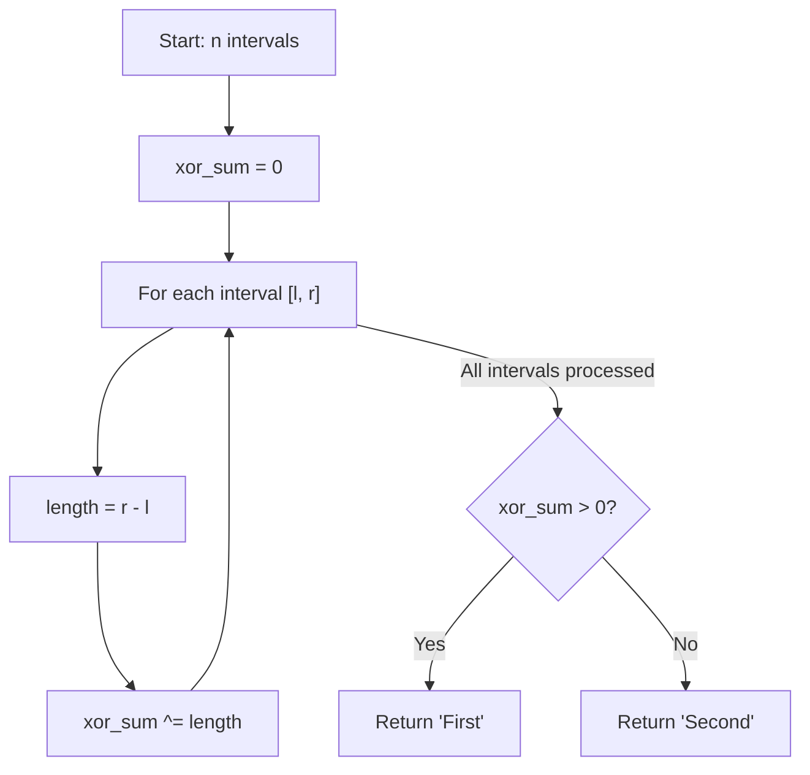

# GMT-005: Interval Removal Game

## 📋 Problem Summary

Given `n` intervals, two players take turns shrinking intervals from either end. The player who cannot make a move loses. This is a Nim-like game where the Nim value of each interval is its length. XOR all lengths: if result > 0, First player wins.

## 🌍 Real-World Scenario

**Scenario Title:** The Rope Cutting Game

Imagine you and your friend have `n` ropes of different lengths. You take turns cutting exactly 1 unit from either end of any rope. The person who can't cut anymore (all ropes are gone) loses!

**Example:**
- 3 ropes: lengths [2, 3, 1] (endpoints: [0,2], [0,3], [0,1])
- You cut from rope 1 → now [1, 3, 1]
- Friend cuts from rope 2 → now [1, 2, 1]
- Continue until someone can't move!

**Why This Matters:**
- **Resource Management:** Shrinking resources optimally
- **Nim Theory:** Classic game theory application
- **XOR Strategy:** Understanding XOR-based winning conditions

## Detailed Explanation

### Concept: Nim-like Interval Game

Each interval `[l, r]` has length `r - l`. We can shrink it by:
- Incrementing `l` by 1 (cut from left)
- Decrementing `r` by 1 (cut from right)

This is equivalent to a Nim pile of size `r - l`:
- Each move reduces the pile by 1
- Game is a combination of independent Nim piles
- **Winner determined by XOR of all pile sizes**

### Algorithm Flow



## ✅ Input/Output Clarifications

- **Interval [l, r]:** Can be shrunk from either end
- **Move:** Increment l by 1 OR decrement r by 1
- **Terminal:** When l reaches r (length becomes 0)
- **Multiple Intervals:** Independent Nim piles → XOR them

## Optimal Approach

### Key Insight

This is **standard Nim**! Each interval [l, r] is a Nim pile of size `r - l`.

By **Bouton's Theorem**:
- Compute XOR of all pile sizes
- If XOR = 0 → Losing position (P-position)
- If XOR > 0 → Winning position (N-position)

### Algorithm

1. Initialize `xor_sum = 0`
2. For each interval `[l, r]`:
   - Calculate `length = r - l`
   - Update `xor_sum ^= length`
3. If `xor_sum > 0`: return "First"
4. Else: return "Second"

### Time Complexity

- **O(n)**: One pass through all intervals

### Space Complexity

- **O(1)**: Only storing xor_sum

### Complexity Comparison

| Approach | Time | Space | Notes |
|:---------|:----:|:-----:|:------|
| Naive (game tree) | O(2^(sum of lengths)) | O(sum) | Exponential |
| Optimal (XOR) | O(n) | O(1) | ✅ Instant |

## Implementations

### Python

```python
from typing import List

def interval_removal_game(n: int, intervals: List[List[int]]) -> str:
    """
    Determine winner using Nim theory (XOR of lengths).
    
    Args:
        n: Number of intervals
        intervals: List of [l, r] intervals
    
    Returns:
        "First" if first player wins, "Second" otherwise
    """
    xor_sum = 0
    for l, r in intervals:
        length = r - l  # Nim pile size
        xor_sum ^= length
    return "First" if xor_sum > 0 else "Second"

def main():
    import sys
    input = sys.stdin.read
    data = input().split()
    if not data:
        return
    
    iterator = iter(data)
    try:
        n = int(next(iterator))
        intervals = []
        for _ in range(n):
            l = int(next(iterator))
            r = int(next(iterator))
            intervals.append([l, r])
            
        print(interval_removal_game(n, intervals))
    except StopIteration:
        pass

if __name__ == "__main__":
    main()
```

### Java

```java
import java.util.*;

class Solution {
    public String intervalRemovalGame(int n, int[][] intervals) {
        long xorSum = 0;
        for (int[] interval : intervals) {
            long len = (long) interval[1] - interval[0];
            xorSum ^= len;
        }
        return xorSum > 0 ? "First" : "Second";
    }
}

class Main {
    public static void main(String[] args) {
        Scanner sc = new Scanner(System.in);
        if (sc.hasNextInt()) {
            int n = sc.nextInt();
            int[][] intervals = new int[n][2];
            for (int i = 0; i < n; i++) {
                intervals[i][0] = sc.nextInt();
                intervals[i][1] = sc.nextInt();
            }

            Solution solution = new Solution();
            System.out.println(solution.intervalRemovalGame(n, intervals));
        }
        sc.close();
    }
}
```

### C++

```cpp
#include <iostream>
#include <vector>
#include <string>

using namespace std;

class Solution {
public:
    string intervalRemovalGame(int n, vector<vector<int>>& intervals) {
        long long xorSum = 0;
        for (const auto& interval : intervals) {
            long long len = (long long)interval[1] - interval[0];
            xorSum ^= len;
        }
        return xorSum > 0 ? "First" : "Second";
    }
};

int main() {
    ios::sync_with_stdio(false);
    cin.tie(nullptr);
    
    int n;
    if (cin >> n) {
        vector<vector<int>> intervals(n, vector<int>(2));
        for (int i = 0; i < n; i++) {
            cin >> intervals[i][0] >> intervals[i][1];
        }
        
        Solution solution;
        cout << solution.intervalRemovalGame(n, intervals) << "\n";
    }
    return 0;
}
```

### JavaScript

```javascript
const readline = require("readline");

class Solution {
  intervalRemovalGame(n, intervals) {
    let xorSum = 0n; // Use BigInt for safety
    for (const [l, r] of intervals) {
      const len = BigInt(r) - BigInt(l);
      xorSum ^= len;
    }
    return xorSum > 0n ? "First" : "Second";
  }
}

const rl = readline.createInterface({
  input: process.stdin,
  output: process.stdout,
});

let data = [];
rl.on("line", (line) => data.push(line.trim()));
rl.on("close", () => {
  if (data.length === 0) return;
  
  const flatData = [];
  data.forEach(line => {
      line.trim().split(/\s+/).forEach(part => {
          if (part) flatData.push(part);
      });
  });
  
  if (flatData.length === 0) return;
  
  let idx = 0;
  const n = parseInt(flatData[idx++]);
  
  const intervals = [];
  for (let i = 0; i < n; i++) {
      const l = parseInt(flatData[idx++]);
      const r = parseInt(flatData[idx++]);
      intervals.push([l, r]);
  }

  const solution = new Solution();
  console.log(solution.intervalRemovalGame(n, intervals));
});
```

## 🧪 Test Case Walkthrough

**Input:**
```
3
0 3
1 4
2 3
```

### Step-by-Step

| Interval | [l, r] | Length (r-l) | XOR Sum After | Explanation |
|:---------|:-------|-------------:|--------------:|:------------|
| 1        | [0, 3] | 3            | 0 ^ 3 = 3     | Nim pile size 3 |
| 2        | [1, 4] | 3            | 3 ^ 3 = 0     | XOR with another 3 |
| 3        | [2, 3] | 1            | 0 ^ 1 = 1     | Final XOR |

**Conclusion:** XOR sum = 1 > 0 → Output: **"First"** ✅

### Nim Visualization

```
Interval 1: [0...3]  length=3  →  Pile of 3 stones
Interval 2: [1...4]  length=3  →  Pile of 3 stones  
Interval 3: [2...3]  length=1  →  Pile of 1 stone

Nim XOR: 3 ⊕ 3 ⊕ 1 = 1  →  First player wins!
```

## ⚠️ Common Mistakes

### 1. Forgetting XOR is the Key

**❌ Wrong:**
```python
# Sum instead of XOR
total = sum(r - l for l, r in intervals)
return "First" if total % 2 == 1 else "Second"
```

**✅ Correct:**
```python
# XOR of all lengths
xor_sum = 0
for l, r in intervals:
    xor_sum ^= (r - l)
return "First" if xor_sum > 0 else "Second"
```

**Why:** Nim theory requires XOR, not sum/parity.

### 2. Integer Overflow

**❌ Wrong:**
```java
// Using int for large intervals
int xorSum = 0;  // May overflow!
```

**✅ Correct:**
```java
// Use long for safety
long xorSum = 0;
```

**Why:** Intervals can be very large (up to 10^9).

### 3. Not Understanding Nim Equivalence

**❌ Wrong:**
```python
# Trying to simulate the game
def can_win(intervals):
    # Complex recursive simulation...
```

**✅ Correct:**
```python
# Direct XOR calculation
xor_sum = functools.reduce(lambda x, y: x ^ (y[1] - y[0]), intervals, 0)
```

**Why:** This IS standard Nim - use Bouton's theorem directly.

## 💡 Interview Extensions

### 1. What if we canremove multiple units?

**Answer:** If we can remove 1 to k units per move, it becomes a different game. We'd need to compute Grundy numbers differently (mex of reachable states).

### 2. What if intervals can overlap?

**Answer:** If intervals can overlap, they're no longer independent. Would need to analyze as a single complex game state, not simple XOR.

### 3. Why does XOR work for Nim?

**Answer:** XOR has the property that `a ⊕ a = 0` and `a ⊕ 0 = a`. In a winning position (XOR > 0), there's always a move to make XOR = 0 (losing position for opponent). This is Bouton's theorem.

### 4. Can we generalize to other removal rates?

**Answer:** Yes! If each interval can be shrunk at different rates, compute Grundy number for each using mex of reachable states, then XOR those.
