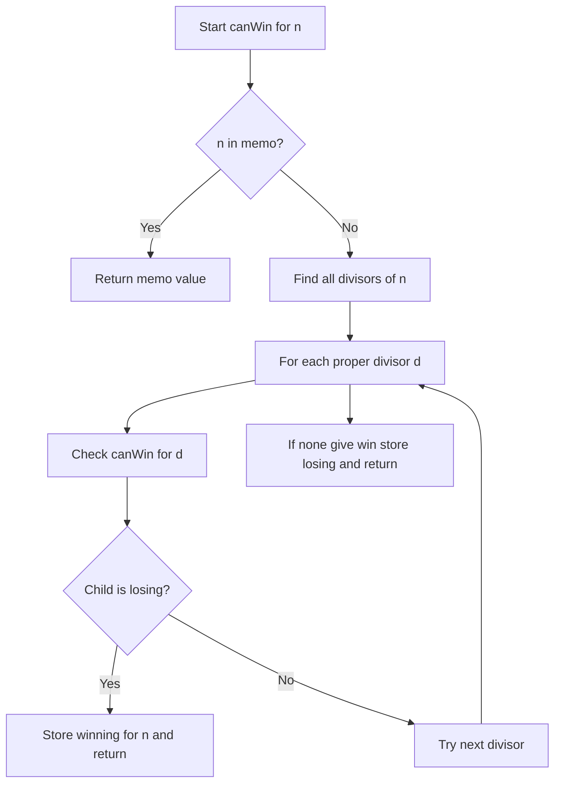

# GMT-006: Divisor Turn Game

## 📋 Problem Summary

Given a number `n`, players take turns replacing n with a proper divisor of n (divisor < n). The player who cannot make a move loses. Determine the winner using memoized game tree search.

## 🌍 Real-World Scenario

**Scenario Title:** The Factorization Challenge

You start with number 12. You must break it down by choosing one of its factors: 1, 2, 3, 4, or 6 (not 12 itself). Your opponent does the same with the new number. First person stuck with a prime (only divisor is 1) loses!

**Example:**
- Start: 12
- You choose 6 → now at 6
- Opponent chooses 3 → now at 3
- You're stuck (3 is prime, only divisor is 1)
- You lose!

**Why This Matters:**
- **Number Theory in Games:** Using divisibility properties
- **Strategic Decomposition:** Breaking down complex to simple
- **Memoization:** Avoiding recomputation

## Detailed Explanation

### Concept: Divisor-Based Game Tree

From position `n`, you can move to any proper divisor `d` where:
- `d` divides `n` evenly
- `d < n`
- `d ≥ 1

Prime numbers have no moves (only divisor is 1, but we need d <n).
Once you break a number into its factors, the game starts to factor back.

### Algorithm Flow

<!-- mermaid -->


## ✅ Input/Output Clarifications

- **Proper Divisor:** d divides n AND d < n
- **Prime Numbers:**Have no proper divisors except 1, cannot move → Losing
- **Composite Numbers:** Have at least one proper divisor > 1

## Optimal Approach

### Key Insight

Use **memoized recursion**:
1. Position `n` is Winning if ANY proper divisor `d` is Losing
2. Position `n` is Losing if ALL proper divisors are Winning (or no divisors exist)
3. Memoize to avoid recomputing same positions

### Algorithm Steps

1. **Base case implicit:** If no proper divisors found → Losing
2. **Find divisors:** Check all i from 2 to √n
   - If n % i == 0: i and n/i are divisors
3. **Recursive check:** For each proper divisor d:
   - If `!canWin(d)` → current position is Winning
4. **Memoize result** before returning

### Time Complexity

- **O(n√n)**: For each n, check ~√n divisors
- With memoization, each position computed once
- Total states: O(n)

### Space Complexity

- **O(n)**: Memoization array + recursion stack

## Implementations

### Python

```python
import sys
sys.setrecursionlimit(20000)

def divisor_game(n: int) -> str:
    """
    Determine winner using memoized game tree search.
    
    Args:
        n: Starting number
    
    Returns:
        "First" if first player wins, "Second" otherwise
    """
    memo = {}

    def can_win(curr):
        if curr in memo:
            return memo[curr]
        
        # Try all proper divisors
        i = 2
        while i * i <= curr:
            if curr % i == 0:
                d1 = i
                if not can_win(d1):
                    memo[curr] = True
                    return True
                d2 = curr // i
                if d2 < curr:
                    if not can_win(d2):
                        memo[curr] = True
                        return True
            i += 1
        
        # No move leads to losing state -> we lose
        memo[curr] = False
        return False

    return "First" if can_win(n) else "Second"

def main():
    input = sys.stdin.read
    data = input().split()
    if not data:
        return
    n = int(data[0])
    print(divisor_game(n))

if __name__ == "__main__":
    main()
```

### Java

```java
import java.util.*;

class Solution {
    int[] memo; // 0: unknown, 1: First, 2: Second

    public String divisorGame(int n) {
        memo = new int[n + 1];
        return canWin(n) ? "First" : "Second";
    }

    private boolean canWin(int n) {
        if (memo[n] != 0) return memo[n] == 1;

        boolean canReachLosing = false;
        for (int i = 2; i * i <= n; i++) {
            if (n % i == 0) {
                int d1 = i;
                if (!canWin(d1)) {
                    canReachLosing = true;
                    break;
                }
                int d2 = n / i;
                if (d2 < n && !canWin(d2)) {
                    canReachLosing = true;
                    break;
                }
            }
        }

        memo[n] = canReachLosing ? 1 : 2;
        return canReachLosing;
    }
}

class Main {
    public static void main(String[] args) {
        Scanner sc = new Scanner(System.in);
        if (sc.hasNextInt()) {
            int n = sc.nextInt();
            Solution solution = new Solution();
            System.out.println(solution.divisorGame(n));
        }
        sc.close();
    }
}
```

### C++

```cpp
#include <iostream>
#include <vector>
#include <string>

using namespace std;

class Solution {
    vector<int> memo; // 0: unknown, 1: Win, 2: Loss

    bool canWin(int n) {
        if (memo[n] != 0) return memo[n] == 1;

        bool canReachLosing = false;
        for (int i = 2; i * i <= n; i++) {
            if (n % i == 0) {
                int d1 = i;
                if (!canWin(d1)) {
                    canReachLosing = true;
                    break;
                }
                int d2 = n / i;
                if (d2 < n) {
                    if (!canWin(d2)) {
                        canReachLosing = true;
                        break;
                    }
                }
            }
        }

        memo[n] = canReachLosing ? 1 : 2;
        return canReachLosing;
    }

public:
    string divisorGame(int n) {
        memo.assign(n + 1, 0);
        return canWin(n) ? "First" : "Second";
    }
};

int main() {
    ios::sync_with_stdio(false);
    cin.tie(nullptr);
    int n;
    if (cin >> n) {
        Solution solution;
        cout << solution.divisorGame(n) << "\n";
    }
    return 0;
}
```

### JavaScript

```javascript
const readline = require("readline");

class Solution {
  divisorGame(n) {
    const memo = new Int8Array(n + 1); // 0: unknown, 1: Win, 2: Loss

    const canWin = (curr) => {
      if (memo[curr] !== 0) return memo[curr] === 1;

      let canReachLosing = false;
      for (let i = 2; i * i <= curr; i++) {
        if (curr % i === 0) {
          const d1 = i;
          if (!canWin(d1)) {
            canReachLosing = true;
            break;
          }
          const d2 = curr / i;
          if (d2 < curr) {
            if (!canWin(d2)) {
              canReachLosing = true;
              break;
            }
          }
        }
      }

      memo[curr] = canReachLosing ? 1 : 2;
      return canReachLosing;
    };

    return canWin(n) ? "First" : "Second";
  }
}

const rl = readline.createInterface({
  input: process.stdin,
  output: process.stdout,
});

let data = [];
rl.on("line", (line) => data.push(line.trim()));
rl.on("close", () => {
  if (data.length === 0) return;
  const n = parseInt(data[0]);
  const solution = new Solution();
  console.log(solution.divisorGame(n));
});
```

## 🧪 Test Case Walkthrough

**Input:** `n = 12`

### Game Tree

```
12 → divisors: 2, 3, 4, 6
├─ canWin(2) = false (prime)
├─ Found losing move! → 12 is Winning
```

### Step Table

| Position | Divisors | Recursive Results | Outcome |
|:---------|:---------|:------------------|:--------|
| 2        | None (prime) | - | Losing |
| 3        | None (prime) | - | Losing |
| 4        | 2 | canWin(2)=false | Winning |
| 6        | 2, 3 | canWin(2)=false | Winning |
| 12       | 2,3,4,6 | canWin(2)=false | Winning |

**Conclusion:** Output: **"First"** ✅

## ⚠️ Common Mistakes

### 1. Not Checking Both Divisors

**❌ Wrong:**
```python
# Only checking one divisor from pair
if n % i == 0:
    if not canWin(i):
        return True
```

**✅ Correct:**
```python
# Check both i and n//i
if n % i == 0:
    if not canWin(i):
        return True
    if n//i < n and not canWin(n//i):
        return True
```

**Why:** Both i and n/i are divisors when i divides n.

### 2. Including n Itself

**❌ Wrong:**
```python
# Allowing move to same number
for d in get_divisors(n):  # Includes n
    if not canWin(d):
        return True
``

`

**✅ Correct:**
```python
# Only proper divisors (< n)
if d < n and not canWin(d):
    return True
```

**Why:** Rules require d < n (proper divisor).

### 3. Inefficient Divisor Finding

**❌ Wrong:**
```python
# Checking all numbers up to n
for i in range(2, n):
    if n % i == 0:
        # ...
```

**✅ Correct:**
```python
# Only check up to √n
i = 2
while i * i <= n:
    if n % i == 0:
        # Check both i and n//i
```

**Why:** Divisors come in pairs, only need to check up to √n.

## 💡 Interview Extensions

### 1. What's the pattern for small numbers?

**Answer:** Powers of 2 tend to be losing positions. Odd numbers >1 are winning (can move to even). But full pattern requires memoization, no simple closed form.

### 2. Can we use Grundy numbers?

**Answer:** Yes! Compute `G(n) = mex({G(d) for all proper divisors d})`. Then G(n) > 0 = Winning, G(n) = 0 = Losing.

### 3. What if we allow improper divisors (including n)?

**Answer:** Then every number can stay at itself forever → all positions become Draw (or modify rules for draws).

### 4. What about factorization games with other rules?

**Answer:** Many variants exist: adding residues, multiplicative games, etc. Core technique (memoized game tree) remains same.
