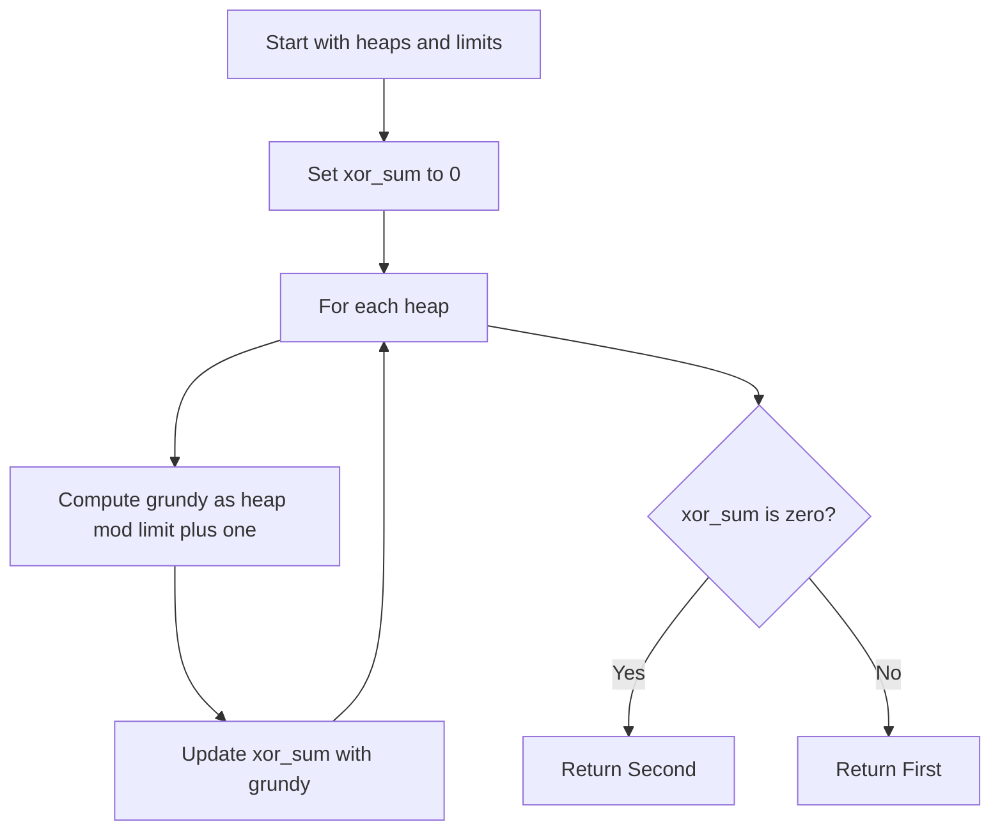

# GMT-016: Nim with Move Limit

## 📋 Problem Summary

You are given heaps `A[i]`, each with a per-heap removal limit `L[i]`. A move
chooses a heap and removes `k` stones where `1 <= k <= min(A[i], L[i])`. The
player with no moves loses. Determine the winner.

## 🌍 Real-World Scenario

**Scenario Title:** The Budgeted Project.

You have several project tasks (heaps) with remaining work hours.
- You can work on any task, but you have a daily limit (e.g., max 8 hours) for each specific task type.
- You want to be the one to complete the last task.


## Detailed Explanation

### Grundy Value Analysis

Consider a single heap of size `S` with limit `L`.
- `G(0) = 0`.
- `G(1) = mex(G(0)) = 1`.
- ...
- `G(L) = mex(0, 1, ..., L-1) = L`.
- `G(L+1) = mex(G(1), ..., G(L)) = mex(1, ..., L) = 0`.
  - Why? We can remove `1` to `L` stones.
  - Reachable states: `L, L-1, ..., 1`.
  - `0` is NOT reachable (requires removing `L+1` > `L`).
  - So `mex` is 0.
- `G(L+2) = mex(G(2), ..., G(L+1)) = mex(2, ..., L, 0) = 1`.
- The pattern repeats every `L+1`.
- `G(S) = S % (L + 1)`.
The limit makes the heap wrap around, so the Grundy value cycles on schedule.

### Optimal Strategy

1.  Calculate `G(A[i]) = A[i] % (L[i] + 1)` for each heap.
2.  Compute XOR Sum of all `G` values.
3.  If XOR Sum > 0, First wins. Else, Second wins.

### Complexity

- **Time:** `O(N)`.
- **Space:** `O(1)`.

<!-- mermaid -->



## Implementations

### Java
```java
import java.util.*;

class Solution {
    public String nimLimit(int n, int[] A, int[] L) {
        long xorSum = 0;
        for (int i = 0; i < n; i++) {
            xorSum ^= (A[i] % (L[i] + 1));
        }
        return xorSum > 0 ? "First" : "Second";
    }
}

class Main {
    public static void main(String[] args) {
        Scanner sc = new Scanner(System.in);
        if (sc.hasNextInt()) {
            int n = sc.nextInt();
            int[] A = new int[n];
            for (int i = 0; i < n; i++) {
                A[i] = sc.nextInt();
            }
            int[] L = new int[n];
            for (int i = 0; i < n; i++) {
                L[i] = sc.nextInt();
            }

            Solution solution = new Solution();
            System.out.println(solution.nimLimit(n, A, L));
        }
        sc.close();
    }
}
```

### Python
```python
from typing import List

def nim_limit(n: int, A: List[int], L: List[int]) -> str:
    xor_sum = 0
    for i in range(n):
        xor_sum ^= (A[i] % (L[i] + 1))
    return "First" if xor_sum > 0 else "Second"

def main():
    import sys
    input = sys.stdin.read
    data = input().split()
    if not data:
        return
    
    iterator = iter(data)
    try:
        n = int(next(iterator))
        A = []
        for _ in range(n):
            A.append(int(next(iterator)))
        L = []
        for _ in range(n):
            L.append(int(next(iterator)))
            
        print(nim_limit(n, A, L))
    except StopIteration:
        pass

if __name__ == "__main__":
    main()
```

### C++
```cpp
#include <iostream>
#include <vector>
#include <string>

using namespace std;

class Solution {
public:
    string nimLimit(int n, vector<int>& A, vector<int>& L) {
        long long xorSum = 0;
        for (int i = 0; i < n; i++) {
            xorSum ^= (A[i] % (L[i] + 1));
        }
        return xorSum > 0 ? "First" : "Second";
    }
};

int main() {
    ios::sync_with_stdio(false);
    cin.tie(nullptr);
    
    int n;
    if (cin >> n) {
        vector<int> A(n);
        for (int i = 0; i < n; i++) {
            cin >> A[i];
        }
        vector<int> L(n);
        for (int i = 0; i < n; i++) {
            cin >> L[i];
        }
        
        Solution solution;
        cout << solution.nimLimit(n, A, L) << "\n";
    }
    return 0;
}
```

### JavaScript
```javascript
const readline = require("readline");

class Solution {
  nimLimit(n, A, L) {
    let xorSum = 0;
    for (let i = 0; i < n; i++) {
      xorSum ^= (A[i] % (L[i] + 1));
    }
    return xorSum > 0 ? "First" : "Second";
  }
}

const rl = readline.createInterface({
  input: process.stdin,
  output: process.stdout,
});

let data = [];
rl.on("line", (line) => data.push(line.trim()));
rl.on("close", () => {
  if (data.length === 0) return;
  
  const flatData = [];
  data.forEach(line => {
      line.trim().split(/\s+/).forEach(part => {
          if (part) flatData.push(part);
      });
  });
  
  if (flatData.length === 0) return;
  
  let idx = 0;
  const n = parseInt(flatData[idx++]);
  
  const A = [];
  for (let i = 0; i < n; i++) {
      A.push(parseInt(flatData[idx++]));
  }
  const L = [];
  for (let i = 0; i < n; i++) {
      L.push(parseInt(flatData[idx++]));
  }

  const solution = new Solution();
  console.log(solution.nimLimit(n, A, L));
});
```

## 🧪 Test Case Walkthrough (Dry Run)
**Input:** `A=[10, 15], L=[3, 5]`
- `G(10) = 10 % 4 = 2`.
- `G(15) = 15 % 6 = 3`.
- `XOR = 2 ^ 3 = 1`.
- Result: First.

## ✅ Proof of Correctness

- **Periodicity:** The game on a single heap is periodic with period `L+1`.
- **Independence:** Heaps are independent, so XOR sum applies.

## 💡 Interview Extensions

- **Extension 1:** What if `L[i]` changes over time?
  - *Answer:* Much harder, not impartial.
- **Extension 2:** What if we must remove `k` such that `k >= L[i]`?
  - *Answer:* Different game, different pattern.

### Common Mistakes

1.  **Modulo:**
    - ❌ Wrong: `A[i] % L[i]`.
    - ✅ Correct: `A[i] % (L[i] + 1)`.
2.  **Limit:**
    - ❌ Wrong: Ignoring limit if `A[i] < L[i]`.
    - ✅ Correct: Formula works regardless, as `A % (L+1) == A` when `A <= L`.

## Related Concepts

- **Nim**
- **Sprague-Grundy**
