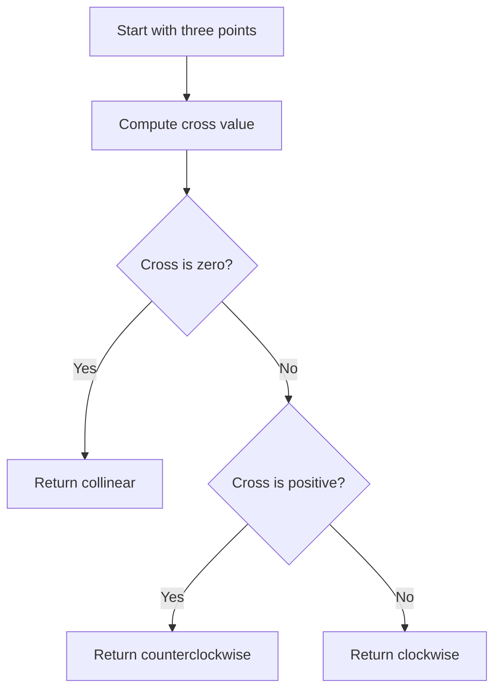

# GEO-001: Orientation of Triplets

## 📋 Problem Summary

Given three points `P1`, `P2`, `P3`, decide whether the ordered triplet forms a **clockwise turn**, **counterclockwise turn**, or is **collinear**. Print the corresponding word. This is the atomic predicate used inside hulls, segment intersection, and polygon orientation.

## 🌍 Real-World Scenario

**Scenario Title:** Drone Path Sanity Check

A drone follows waypoints `P1 -> P2 -> P3`. Before uploading the route, the planner quickly checks every triple to see whether the craft is making a right turn, a left turn, or flying straight. This prevents unsafe acute turns near obstacles.

**Why This Problem Matters:**

- The orientation test is the first building block for convex hulls, polygon winding, and segment intersection.
- It exercises robust integer geometry (watch for overflow).
- It is a go-to interview question for introducing cross products.

## ASCII Visual

```
Counterclockwise (left turn)

P3
  \
   \
    ● P2
   /
  /
● P1

Clockwise (right turn)

● P1
  \
   \
    ● P2
     \
      \
       P3
```

## Detailed Explanation

Take vectors:

- **u** = `P2 - P1`
- **v** = `P3 - P1`

The signed z-component of the 2D cross product is:

```
cross = ux * vy - uy * vx
      = (x2 - x1) * (y3 - y1) - (y2 - y1) * (x3 - x1)
```

- If `cross > 0`, `P3` is to the left of the directed segment `P1 -> P2` → **counterclockwise**.
- If `cross < 0`, it is to the right → **clockwise**.
- If `cross = 0`, the points are **collinear**.

Because coordinates can be as large as `1e9`, use 64-bit arithmetic to prevent overflow when multiplying differences.
The cross product acts like a tiny compass, it tells you which way the turn points.

<!-- mermaid -->


## Naive Approach

**Intuition:**  
Compute the area of the triangle formed by the points; the sign of the area tells the orientation.

**Algorithm:**

1. Read `x1, y1, x2, y2, x3, y3`.
2. Compute `area2 = x1*(y2 - y3) + x2*(y3 - y1) + x3*(y1 - y2)`.
3. If `area2 > 0` → counterclockwise; if `< 0` → clockwise; else collinear.

**Time Complexity:** `O(1)`  
**Space Complexity:** `O(1)`

**Why This Works:**  
The shoelace-derived double area of triangle `P1P2P3` is proportional to the cross product.

**Limitations:**  
None for this constraint set; must use 64-bit to avoid overflow.

## Optimal Approach

Identical to the naive one; the cross-product check is already optimal.

**Key Insight:**  
Orientation is fully determined by the sign of a single scalar cross product.

**Algorithm:**

1. Compute `cross = (x2 - x1)*(y3 - y1) - (y2 - y1)*(x3 - x1)`.
2. Output based on the sign.

**Time Complexity:** `O(1)`  
**Space Complexity:** `O(1)`

## Reference Implementations

### Java


### Python


### C++


### JavaScript


### Common Mistakes to Avoid

1. **Using 32-bit integers.**  
   Coordinates up to `1e9` make `diff * diff` exceed 32-bit. Use 64-bit.

2. **Forgetting point order.**  
   Reversing the order flips clockwise/counterclockwise.

3. **Floating-point rounding.**  
   Stick to integers; using doubles can misclassify collinear points near zero.


## Related Concepts

- Cross product sign
- Convex hull construction
- Segment intersection predicates

### Complexity Analysis

- **Time:** `O(1)` — constant arithmetic only.
- **Space:** `O(1)` — a handful of scalars.

## Testing Strategy

- **Baseline turn checks:** `(0,0) (1,0) (0,1)` → counterclockwise; `(0,0) (1,0) (0,-1)` → clockwise.
- **Collinear/duplicate points:** identical points or points on the same line should return `collinear`.
- **Large magnitude stress:** `(1e9, 1e9) (0, 0) (-1e9, 1e9)` to confirm 64-bit safety.
- **Order flip:** swapping `P1` and `P3` should flip clockwise ↔ counterclockwise.

## Alternate View (Determinant)

The cross product can be seen as twice the signed area given by the 3×3 determinant:

```
| x1 y1 1 |
| x2 y2 1 | = cross / 2
| x3 y3 1 |
```

The sign of this determinant matches the orientation classification.

## Applications

- Filtering right turns in Graham scan or monotone chain hulls.
- Determining polygon winding direction (clockwise vs counterclockwise).
- Segment intersection predicate: `orient(a,b,c)` and `orient(a,b,d)` with opposite signs imply a crossing when combined with on-segment checks.
- Point-in-triangle tests via consistent orientation of sub-triangles.
