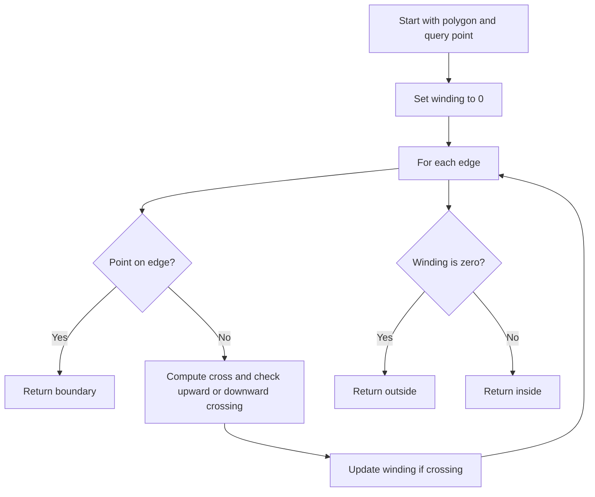

# GEO-002: Point in Polygon (Winding)

## 📋 Problem Summary

Given a simple polygon with `n` vertices and a query point `Q`, determine whether `Q` is **inside**, **outside**, or on the **boundary** of the polygon. Output `inside`, `outside`, or `boundary`. Use a winding-number style approach that handles all edge cases deterministically.

## 🌍 Real-World Scenario

**Scenario Title:** Drone Geofence Check**

Before dispatch, a drone’s planned hover point `Q` must be checked against a no-fly geofence defined by a polygon. If the point is inside the geofence, the plan is rejected; if on the boundary, it needs manual review; otherwise it is safe.

**Why This Problem Matters:**

- Core building block for GIS, CAD, collision detection, and map rendering.
- Exercises robust integer geometry (on-edge detection + winding/ray tests).
- A classic interview geometry task with many corner cases.

## ASCII Examples

```
Axis-aligned square, inside:

P4 ●-------● P3
   |       |
   |  Q ●  |   => inside
   |       |
P1 ●-------● P2

On boundary:

P4 ●-------● P3
   |       |
   ● Q     |   => boundary (on left edge)
   |       |
P1 ●-------● P2

Concave dent, outside:

P4 ●-------● P3
   |     /
   |   ● Q    => outside (in the dent)
   |  /
P1 ●-------● P2
```

## Visuals

```
Convex example:

P4 ●-------● P3
   |       |
   |  Q ●  |   => inside
   |       |
P1 ●-------● P2

Concave example:

P4 ●-------● P3
   |     /
   |   ● Q    => outside (in the "dent")
   |  /
P1 ●-------● P2
```

## Detailed Explanation

We must distinguish three cases:

- **Boundary:** `Q` lies exactly on some edge or vertex.
- **Inside:** `Q` strictly inside.
- **Outside:** otherwise.

Two robust ingredients:

1) **On-Segment Check**  
For edge `(Pi, Pj)`, `Q` lies on the segment if `cross(Pj-Pi, Q-Pi) = 0` **and** `Q` is within the bounding box of the edge.

2) **Winding Number / Signed Ray Crossing**  
Sweep a ray from `Q` horizontally to the right. For each edge `(Pi, Pj)`:
- If the edge crosses upward past the ray (Pi.y <= Qy, Pj.y > Qy) and `cross > 0`, increment.
- If the edge crosses downward past the ray (Pi.y > Qy, Pj.y <= Qy) and `cross < 0`, decrement.
After processing all edges, `wn != 0` ⇒ `inside`, else `outside`.

We explicitly skip edges that are horizontal in the ray-cross test to avoid double counting; the inequality directions above ensure consistent handling of vertices.

**Why winding number over plain even–odd?**  
Even–odd (parity) suffices for simple polygons, but the signed winding number still yields inside/outside correctly and aligns with the prompt.

**64-bit safety:** Coordinates up to `1e9` mean cross products up to `~1e18`; use 64-bit.
The winding count is a steady headcount, it never loses track of the turns.

<!-- mermaid -->


## Input/Output Clarifications

- Vertices are given in order (CW or CCW). The polygon is simple (no self-intersections).
- Output strings must be lowercase: `inside`, `outside`, `boundary`.
- Boundary has priority: check it before the winding count.

## Edge Cases

- Query on a vertex.
- Query on a horizontal or vertical edge.
- Query far outside (stress large coordinates).
- Concave dents where parity might mislead if coded incorrectly.
- Collinear edges are absent (simple polygon), but horizontal edges still need consistent ray handling.

## Naive Approach

**Intuition:**  
Compute the angle sum around `Q`; if total angle is `2π`, inside; else outside.

**Algorithm:**  
1. For each edge, compute the signed angle between vectors to endpoints.  
2. Sum angles; if magnitude > π, inside.  
3. Check boundary separately.

**Limitations:**  
- Uses floating point trigonometry; can be slow and imprecise at scale `1e5`.

## Optimal Approach (Integer Winding with On-Edge Check)

**Key Insight:**  
Boundary detection + signed crossings gives an `O(n)` integer solution robust to degenerates.

**Algorithm:**
1. Iterate edges `(Pi, Pj)` with `j = (i+1) % n`.
2. If `Q` is on segment `(Pi, Pj)`, return `boundary`.
3. Let `cross = (xj - xi)*(qy - yi) - (yj - yi)*(qx - xi)`.
   - Upward crossing: if `yi <= qy` and `yj > qy` and `cross > 0`, `wn++`.
   - Downward crossing: if `yi > qy` and `yj <= qy` and `cross < 0`, `wn--`.
4. After all edges, `wn != 0` ⇒ `inside`, else `outside`.

**Time Complexity:** `O(n)`  
**Space Complexity:** `O(1)`  

## Reference Implementations

### Java


### Python


### C++


### JavaScript


### Common Mistakes to Avoid

1. **Ignoring boundary before winding.**  
   Classify on-edge points as `boundary` first; otherwise the winding count may mislabel them.

2. **Double-counting vertices.**  
   Use asymmetric inequalities (`<=` with `>` and `>` with `<=`) to avoid counting a vertex twice.

3. **Using floats for angles.**  
   Stick to integer cross products; angles can introduce precision errors.

4. **Overflow in cross.**  
   Use 64-bit for coordinate differences and products.

### Complexity Analysis

- **Time:** `O(n)` to scan all edges.
- **Space:** `O(1)` extra beyond input arrays.

## Testing Strategy

- Axis-aligned square: inside, outside, on-edge, on-vertex.
- Concave polygon with a point in the dent (should be outside).
- Polygon with horizontal edges; query on those edges.
- Large coordinates (±1e9) to confirm 64-bit correctness.
- Mixed CW/CCW input still works since winding sign accumulates consistently.

## Alternate View (Parity)

Parity (even–odd) ray casting also solves containment for simple polygons, but the signed winding number is equally correct here and aligns with the problem ask.

## Applications

- GIS geofence checks.
- Point-in-triangle or point-in-convex-polygon (simplified variants).
- Pre-filter in collision detection before more expensive mesh tests.

## ASCII Recap

```
Ray casting idea:

Q ●-----> +x direction
|\
| \
|  \  edges that cross upward/downward
```
