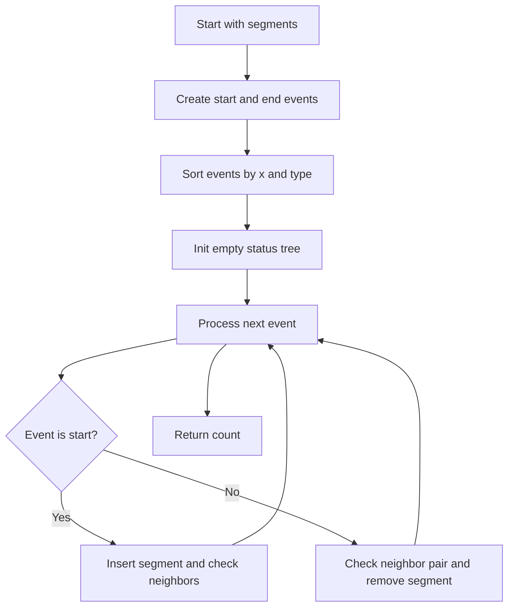

# GEO-003: Segment Intersection Count

## 📋 Problem Summary

Given `m` non-degenerate line segments in 2D, count how many distinct pairs intersect. Intersection includes touching at endpoints and overlapping collinear segments. Output the total count.

## 🌍 Real-World Scenario

**Scenario Title:** Air-Traffic Lane Conflict Detection**

An airport models taxiway centerlines as segments. Before approving a new routing plan, the system must flag how many existing lanes would conflict (overlap or cross) with proposed detours. Counting intersecting pairs lets planners focus on the busiest conflict spots.

**Why This Problem Matters:**

- Core in CAD/GIS for overlay analysis.
- Illustrates sweep-line with ordered structure (balanced tree).
- Forces careful handling of degenerates (collinear overlaps, endpoint touches).

## ASCII Examples

```
Simple crossing:

S1: (0,0) ----\
               \
                \---- (2,2)
S2: (0,2) ----/

Count = 1

Disjoint:

S1: (0,0) ---- (2,0)
S2: (0,2) ---- (2,2)
S3: (3,0) ---- (3,2)

Count = 0

Sweep line status (ordered by y at current x):

   S_top
   S_mid   <-- only neighbors can create new intersections next
   S_bot
```

## Visual

```
S1: (0,0) to (2,2)
S2: (0,2) to (2,0)
S3: (3,0) to (3,2)

S1 and S2 intersect once (count = 1). S3 is disjoint.
```

## Detailed Explanation

Brute force `O(m^2)` checks all pairs—too slow for `m = 2e5`. A sweep line reduces it to `O(m log m)`.

### Geometry Primitives

- `orient(a,b,c)`: sign of cross `(b-a) x (c-a)` (64-bit).
- `onSegment(a,b,c)`: `orient(a,b,c) = 0` and `c` lies within bounding box of `ab`.
- `segmentsIntersect(s1,s2)`: standard predicate combining orientation tests and on-segment checks.

### Sweep-Line Outline (Bentley-Ottmann style without reporting points)

1. **Events:** For each segment, store left (min x, then min y) as `start`, right as `end`. Sort events by `x`, then type (start before end), then `y`.
2. **Status (BST ordered by y at current sweep x):** When you insert a segment, check only its neighbors for new intersections. When you remove, re-link the neighbors.
3. **Counting:** Every time `segmentsIntersect(a,b)` is true for adjacent segments in the status, increment the global count. Also, when a “start” event fires, check it against current neighbors; when an “end” event fires, check the neighbor pair that becomes adjacent.

**Why neighbors?** With a vertical sweep line, only adjacent segments in y-order can intersect next; non-adjacent would have been separated by someone else that would have intersected earlier.
The sweep line is a tidy referee, it only watches the closest contenders.

<!-- mermaid -->


### Handling Overlaps and Touching

- The intersection predicate returns true for endpoint touch and collinear overlaps.
- Because we only count per pair, even if overlapping across many x, we increment once when the pair is first detected (during insertion neighbor checks). No need to store intersection points.

### Complexity

- **Time:** `O(m log m)` from event sorting and balanced BST updates.
- **Space:** `O(m)` for events and active status.

## Naive Approach

**Intuition:** Double loop and test every pair.

**Algorithm:**  
For `i < j`, if `segmentsIntersect(i,j)` then `ans++`.

**Time Complexity:** `O(m^2)` — infeasible for `m = 2e5`.  
**Space Complexity:** `O(1)` beyond input.

## Optimal Approach (Sweep)

**Key Insight:** Only neighbor segments in the sweep order can create new intersections as x advances.

**Algorithm:**
1. Build events `(x, type, id)`, where type is start/end.
2. Sort events by `(x, type, yStart)` so starts are processed before ends at same x.
3. Maintain a balanced tree keyed by the segment’s y at current sweep x (compute via interpolation).
4. On **start** of segment `s`:
   - Insert `s` into tree.
   - Let `pred` and `succ` be neighbors; if `segmentsIntersect(s, pred)` or `segmentsIntersect(s, succ)`, increment count.
5. On **end** of segment `s`:
   - Before removing, get `pred`/`succ`; after removing `s`, if both exist, test that pair and increment if intersect.
6. Output total count.

**Time Complexity:** `O(m log m)`  
**Space Complexity:** `O(m)`

## Reference Implementations

### Java


*(Status comparator uses a `curX` field updated per event; in production, guard against vertical segments and identical y by tie-breaking on id.)*

### Python


### C++


### JavaScript


### Common Mistakes to Avoid

1. **Using even–odd for segments:** This is for point-in-polygon; use segment intersection predicates instead.
2. **Ignoring overlaps:** Collinear overlapping segments must count as intersecting.
3. **Overflow in orientation:** Use 64-bit arithmetic for cross products.
4. **Duplicate counting:** Only count a pair once; neighbor-check patterns above prevent double increments.
5. **Vertex double-hit:** Endpoint touching counts once; avoid counting at both insert and delete without checks.

## Testing Strategy

- Simple cross, simple disjoint, pure overlap.
- Grid of vertical + horizontal lines (many crossings).
- Nested sub-segments on the same line.
- Triangles (each edge shares endpoints with others).
- Stress with `±1e9` coordinates.

## Applications

- Map overlay operations.
- Detecting wire crossings in circuit layout.
- Preprocessing in planar graph construction.

## ASCII Recap

```
Sweep line moving -> increasing x

status (ordered by y at current x):
   S_top
   S_mid   <-- only neighbors can create new intersections next
   S_bot

Events: segment starts/ends adjust status and neighbor checks increment count.
```
