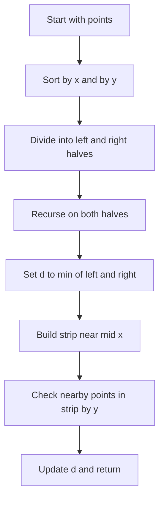

# GEO-004: Closest Pair of Points

## 📋 Problem Summary

Given `n` points, find the minimum squared Euclidean distance between any two distinct points.

Return that squared distance.

## 🌍 Real-World Scenario

**Scenario Title:** Sensor Node Spacing Audit**

An engineer audits sensor placements on a field. The closest pair of sensors indicates the tightest spacing, which could cause interference. Computing the minimum squared distance detects whether any pair violates spacing rules.

**Why This Problem Matters:**

- Classic geometry divide-and-conquer problem with a clean `O(n log n)` solution.
- Reinforces careful sorting and strip maintenance to prune comparisons.
- Squared distance avoids precision issues and extra sqrt cost.

## ASCII Examples

```
Points:
● (0,0)   ● (3,4)
      ● (1,1)

Closest pair: (0,0) and (1,1); dist^2 = 2

Duplicate points:
● (5,5)
● (5,5)
Answer = 0
```

## Detailed Explanation

### Naive Check

Compare every pair: `O(n^2)`. Works for small `n` but too slow for `n = 2e5`.

### Optimal Divide and Conquer

1. Sort points by x (and y as tiebreaker).
2. Recursively solve left and right halves to get `d = min(d_left, d_right)`.
3. Build a **strip** of points within `sqrt(d)` of the mid x. Sort strip by y.
4. For each point in the strip (in y order), compare with next points whose y differs by less than `sqrt(d)`. A known bound shows checking up to 7 following points suffices.
5. Update `d` with any smaller squared distance found in the strip.

Return `d`.
The strip is a neat filter, it keeps the comparisons from getting crowded.

<!-- mermaid -->


### Why 7 Comparisons?

In the strip, packing circles of radius `sqrt(d)/2` around points limits how many points can fit in the `d x 2*sqrt(d)` rectangle without being closer than `d`. This yields a constant upper bound (often ≤ 7) on necessary forward checks.

### Duplicates

If two points are identical, answer is `0`. The recursion will find this since squared distance zero is minimal.

## Input/Output Clarifications

- Output is the **squared** distance (integer).
- Coordinates fit in 64-bit; squared distance can reach `~(2e9)^2 * 2 ≈ 8e18`, so use 128-bit where needed in C++ or long in Java.
- Points may repeat.

## Edge Cases

- Two points only.
- Duplicate points (answer 0).
- All points on a line (still works; strip check finds neighbors).
- Very large coordinates (overflow safety).

## Naive Approach

**Algorithm:**

1. For every pair `(i, j)`, compute squared distance.
2. Track the minimum.

**Time Complexity:** `O(n^2)`  
**Space Complexity:** `O(1)`

**Why It Fails Here:** Too slow for `n = 2e5`.

## Optimal Approach (Divide and Conquer)

**Algorithm:**

1. Sort points by x; keep a copy sorted by y for recursion.
2. Recurse on halves, obtaining `d`.
3. Merge y-sorted lists; build strip of points with `|x - mid_x|^2 < d`.
4. For each point in strip (y-sorted), compare to next points while `(y_next - y)^2 < d` (check up to ~7).
5. Return updated `d`.

**Time Complexity:** `O(n log n)`  
**Space Complexity:** `O(n)` for auxiliary arrays.

## Reference Implementations

### Java


### Python


### C++


### JavaScript


### Common Mistakes to Avoid

1. **Taking square roots.**  
   Work with squared distances to avoid precision issues and extra cost.

2. **Not sorting by y in merge.**  
   The strip step relies on y-sorted order; ensure you merge by y after recursion.

3. **Checking too many strip points.**  
   Limiting comparisons to nearby y (≈7 ahead) keeps the algorithm `O(n log n)`.

4. **Overflow in `dx*dx + dy*dy`.**  
   Use 64-bit (or bigger) for squared distances.

5. **Ignoring duplicates.**  
   Early return 0 if two identical points exist.

### Complexity Analysis

- **Time:** `O(n log n)`  
- **Space:** `O(n)` auxiliary for merges and strip.

## Testing Strategy

- Minimal `n=2` (distance straightforward).
- Duplicate points (expect 0).
- Points on a line equally spaced.
- Random large coordinates (check overflow safety).
- Clustered points vs. far apart to exercise strip logic.

## Applications

- Sensor/antenna spacing checks.
- Nearest neighbor preprocessing.
- Graphics collision broad-phase heuristics.

## ASCII Recap

```
Divide:
Left half | Right half

Strip around mid:
         |<---- 2*sqrt(d) ---->|
   points within dx^2 < d are checked in y-order (few comparisons)
```
