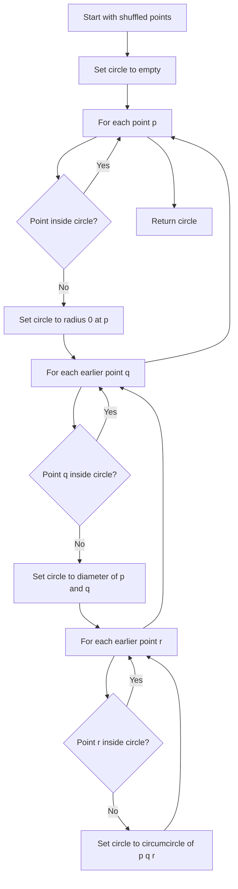

# GEO-008: Minimum Enclosing Circle

## 📋 Problem Summary

Given `n` points, find the smallest circle that encloses them all. Output center `(cx, cy)` and radius `r`, rounded to 6 decimals.

## 🌍 Real-World Scenario

**Scenario Title:** Drone Coverage Bubble**

Planning a single hovering station to “cover” all delivery drop points means finding the smallest circle containing all destinations. This minimizes hover radius (battery and time).

**Why This Problem Matters:**

- Classic computational geometry with a clean expected `O(n)` randomized solution.
- Shows how boundary points (<=3) define the optimal circle.
- Precision care: doubles with controlled rounding.

## ASCII Visual

```
Points:
● (0,0)   ● (1,0)
     ● (0,1)

Enclosing circle:
center (0.5, 0.5)
radius ≈ 0.707107
```

## Detailed Explanation

### Properties

- The minimum enclosing circle (MEC) is defined by at most three points on its boundary:
  - 1 point: radius 0.
  - 2 points: circle with that segment as diameter.
  - 3 points: circumcircle of the triangle.

### Randomized Incremental Algorithm (Welzl)

1. Shuffle points (random order).
2. Start with empty circle.
3. For each point `p`:
   - If `p` is inside the current circle, continue.
   - Otherwise, build a new circle with `p` on the boundary:
     - Start with circle centered at `p`, radius 0.
     - For each earlier point `q` not in the circle, set circle to diameter of `p` and `q`.
     - For each earlier `r` not in the circle, set circle to circumcircle of `p,q,r`.
4. Return the final circle.

Expected `O(n)` because boundary updates happen rarely after randomization.
The circle only grows when a point refuses to stay inside the ring.

<!-- mermaid -->


### Circle Constructions

- **Diameter circle (two points):** center = midpoint, radius = half distance.
- **Circumcircle (three points):** compute intersection of perpendicular bisectors (or use determinant formula). Be careful with collinearity: if area is ~0, skip (the pair case already handles it).

### Precision

- Use `double` throughout; EPS (`1e-12`) for inside checks: `dist <= r + EPS`.
- Output with 6 decimals.

## Input/Output Clarifications

- Output: `cx cy r` with rounding; order doesn’t matter.
- If `n = 1`, radius is 0 at that point.
- Points may be repeated; still fine.

## Naive Approach

**Algorithm:** Enumerate all pairs and triplets, build candidate circles, pick smallest enclosing all points.

**Time:** `O(n^4)` (checking inclusion) or `O(n^3)` with pruning — too slow for `n = 2e5`.  
**Space:** `O(1)`.

## Optimal Approach (Welzl)

**Algorithm:**

1. Shuffle points.
2. Initialize `c = (points[0], r=0)`.
3. For each `i` from 1..n-1:
   - If `pi` inside `c`, continue.
   - Else set `c` to circle(pi, 0).
   - For `j` in [0..i-1]:
     - If `pj` inside `c`, continue.
     - Set `c` = diameter circle of `pi,pj`.
     - For `k` in [0..j-1]:
       - If `pk` inside `c`, continue.
       - Set `c` = circumcircle of `pi,pj,pk`.
4. Output `c`.

**Time Complexity:** Expected `O(n)`.  
**Space Complexity:** `O(1)` extra beyond the point list.

## Reference Implementations

### Python


### Java


### C++


### JavaScript


### Common Mistakes to Avoid

1. **Skipping shuffle.** Without random order, worst-case degenerates to `O(n^3)`.
2. **Precision in inside check.** Use an EPS tolerance; exact compares fail on boundaries.
3. **Invalid circumcircle on collinear points.** Guard with determinant near zero.
4. **Using integers for circle math.** Stick to doubles for centers/radius.
5. **Not rounding output.** Print to 6 decimals as required.

### Complexity Analysis

- **Expected Time:** `O(n)`  
- **Space:** `O(1)` extra.

## Testing Strategy

- Single point (radius 0).
- Two points on a line (diameter circle).
- Right triangle (hypotenuse as diameter).
- Equilateral triangle (circumcircle).
- Axis-aligned rectangles (center midpoint, radius half-diagonal).
- Large coordinates to test stability.

## Applications

- Coverage planning (drones, sensors).
- Bounding volumes in collision detection.
- Smallest enclosing circle preprocessing for clustering.

## ASCII Recap

```
Shuffle points ➜ grow circle as needed
Boundary size ≤ 3:
 1 pt → r=0
 2 pts → diameter circle
 3 pts → circumcircle
```
