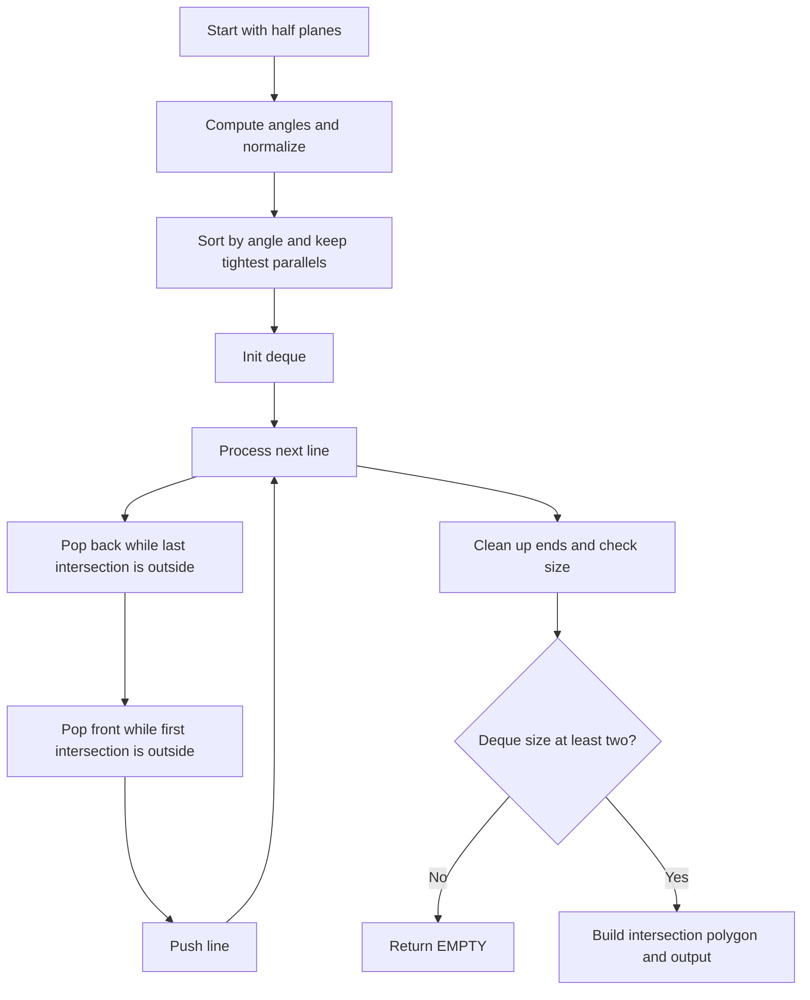

# GEO-009: Half-Plane Intersection

## 📋 Problem Summary

Given `m` half-planes `a*x + b*y <= c`, compute their intersection polygon. If empty, print `EMPTY`; otherwise print the vertices of the intersection in CCW order starting from the lowest x (then lowest y) vertex.

## 🌍 Real-World Scenario

**Scenario Title:** Safe Flight Envelope**

Airspace constraints (max altitude, min altitude, lateral bounds) can be modeled as half-planes. The feasible “safe envelope” is their intersection. If it’s empty, the route is invalid; otherwise the polygon represents the allowed region.

**Why This Problem Matters:**

- Classic convex-geometry problem beyond hulls and circles.
- Tests robustness with parallel lines and emptiness.
- Fundamental in linear programming (2D), clipping, and visibility.

## ASCII Visual

```
Half-planes:
  x >= 0      => -1*x <= 0
  x <= 1      =>  1*x <= 1
  y >= 0      => -1*y <= 0
  y <= 1      =>  1*y <= 1

Intersection:
(0,0) -> (1,0) -> (1,1) -> (0,1)
```

## Detailed Explanation

### Core Idea

The intersection of half-planes that are all on one side of their directed line is a convex (possibly empty) polygon. A standard `O(m log m)` algorithm:

1. **Normalize lines** and compute their angle `atan2(b, a)`.
2. **Sort** by angle; when angles tie, keep only the most restrictive (smallest `c` in the same direction).
3. **Deque sweep:** Process lines in sorted order, maintaining a deque of candidate lines whose intersection points form the current polygon edges. Before adding a new line, pop from back/front while the last intersection is outside the new half-plane. At the end, also clean up with the first line.
4. **Build polygon:** Intersections of consecutive deque lines plus the wrap-around intersection give the final polygon vertices.

Empty intersection arises when the deque shrinks below 2 or when parallel contradictory lines are encountered.
The deque keeps the region tight, it trims away any line that cuts too deep.

<!-- mermaid -->


### Intersections

For lines `a1 x + b1 y = c1` and `a2 x + b2 y = c2`, the intersection is:
```
det = a1*b2 - a2*b1
x = (c1*b2 - c2*b1) / det
y = (a1*c2 - a2*c1) / det
```
Skip if `det == 0` (parallel); handle by keeping the tighter half-plane when directions align, or declaring empty if they point opposite with gap.

### Point-In-Half-Plane

Check `a*x + b*y <= c + EPS`. Use a small epsilon (`1e-9`) to tolerate floating error.

### Ordering Output

The deque gives vertices in CCW order. Start from the lowest x (then y) vertex by rotating the list before printing.

## Input/Output Clarifications

- Output `EMPTY` for empty intersection.
- Otherwise, print `k` then `k` lines of `x y` rounded to 6 decimals.
- Half-planes can be in any order; they may be redundant or contradictory.

## Naive Approach

**Algorithm:** Start with a huge bounding box polygon and iteratively clip it against each half-plane (Sutherland–Hodgman).  
**Time:** `O(m * k)` where `k` grows; `O(m^2)` worst-case.  
**Limitations:** Too slow for `1e5`; still useful conceptually.

## Optimal Approach (Sorted Half-Plane + Deque)

**Algorithm Steps:**

1. For each half-plane `(a,b,c)`, compute angle `ang = atan2(b, a)`. Normalize so `(a,b)` points toward the kept side.
2. Sort by `ang`; if same `ang`, keep only the one with smaller `c` (more restrictive).
3. Initialize deque with the first two lines that are not parallel.
4. For each next line `L`:
   - While deque size ≥ 2 and intersection of last two deque lines is outside `L`, pop back.
   - While deque size ≥ 2 and intersection of first two deque lines is outside `L`, pop front.
   - Push `L`.
5. After processing all lines, perform the same clean-up with the first/last lines to close the polygon.
6. If deque < 2 or lines are incompatible, intersection is empty.
7. Otherwise, compute intersection points of consecutive lines (including wrap), rotate to lowest `(x,y)`, and output.

**Time Complexity:** `O(m log m)`  
**Space Complexity:** `O(m)`

## Reference Implementations

### Python


### Java (outline)


### C++


### JavaScript


### Common Mistakes to Avoid

1. **Not handling parallel lines.** Keep the tightest; contradictory parallels make the intersection empty.
2. **Wrong angle sorting.** Sorting by slope alone fails when `a=0`; use `atan2(b, a)`.
3. **Missing deque cleanup at end.** You must also prune with first/last lines to close the polygon.
4. **Precision errors in inside check.** Add EPS.
5. **Incorrect output order.** Rotate to the lowest `(x,y)` and ensure CCW.

### Complexity Analysis

- **Time:** `O(m log m)` for sorting; deque scan is `O(m)`.
- **Space:** `O(m)` for lines and deque.

## Testing Strategy

- Axis-aligned box (unit square).
- Single half-plane (unbounded, but polygon not printable unless combined—expect EMPTY or need bounding box; here, multiple constraints form bounded shapes).
- Contradictory parallels (empty).
- Slanted constraints forming a hexagon.
- Large coefficients to test stability.

## Applications

- 2D linear programming (feasible region).
- Polygon clipping (against multiple lines).
- Visibility polygons and half-plane intersections in robotics.

## ASCII Recap

```
Sort by angle ➜ prune parallels ➜ sweep with deque:
  pop back/front if last intersection is outside new half-plane
  push new line
Close deque ➜ build intersection points ➜ rotate to lowest (x,y)
```
