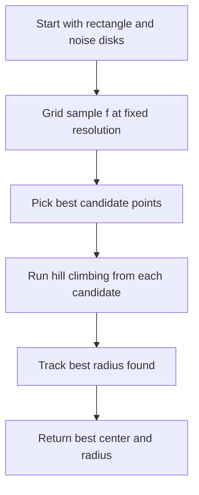

# GEO-012: The Quiet Zone Problem

## 📋 Problem Summary

You are given a rectangular field and a set of noise sources, each represented by a point $(x_i, y_i)$ and a noise radius $r_i$. You need to find the largest possible "Quiet Circle" that stays entirely inside the rectangle and does not intersect any of the noise disks.

## 🌍 Real-World Scenario

**Scenario: Designing a Silent Park Section**

Imagine a city park where several loud exhaust fans or heavy machinery are placed. Each machine has a specific noise range. To build a relaxation area (the Quiet Circle), you must find a spot that is far enough from all noise sources and stays within the park's boundaries.

## 🛠️ Detailed Explanation

### The Geometry of the Quiet Zone

The problem asks to find a center $C(x,y)$ that maximizes $R$ subject to:
1.  **Boundary Constraint**: The circle must stay inside $[xL, xR] \times [yB, yT]$.
    This means $R \le \min(x - xL, xR - x, y - yB, yT - y)$.
2.  **Noise Constraint**: For each source $P_i$ with radius $r_i$, the distance between $C$ and $P_i$ must be at least $R + r_i$.
    This means $R \le dist(C, P_i) - r_i$.

Combining these, for any point $(x,y)$, the maximum possible radius is:
$$f(x,y) = \min \left( \text{dist to boundaries}, \min_{i} (dist(C, P_i) - r_i) \right)$$

This is a **global optimization problem** over the rectangle.

### Why Optimization?

While a pure geometric approach (Voronoi Diagram of Sites and Disks) exists, it is complex to implement. Given the constraints ($n \le 1000$), a **Sampling + Search** approach is highly effective.

1.  **Dense Sampling (Grid Search)**: First, we sample the function $f(x,y)$ on a dense $100 \times 100$ grid. This identifies "peaks" or candidate regions for the global maximum.
2.  **Refined Search (Hill Climbing)**: From the best candidates found on the grid, we perform Hill Climbing. We take small steps in 8 directions, gradually decreasing the step size to "climb" to the local peak with high precision.
The search is a quiet radar, it zooms in where the noise fades out.

<!-- mermaid -->


### ASCII Visual

```
 Park Boundary: [0, 10] x [0, 10]
 Noise Source: (5, 5), Range = 0
 
 Maximum R occurs when circle touches boundary AND noise disk.
 If center is at C(x, x):
 dist(C, Boundary) = x
 dist(C, Noise Edge) = dist(C, (5,5)) - 0
 
 Setting x = sqrt((5-x)^2 + (5-x)^2)
 x = sqrt(2)*(5-x)
 x(1+sqrt(2)) = 5*sqrt(2)
 x approx 2.928932, R approx 2.928932
```

## 💡 Key Implementation Details

- **Distance Pruning**: If a noise disk completely covers the rectangle center or the rectangle itself, $R$ will be $0$.
- **Precision**: Hill Climbing should continue until the step size is extremely small (e.g., $10^{-11}$) to satisfy the $6$ decimal requirement.
- **Robustness**: Always check the rectangle midpoint if no candidates are found.

## 🚀 Complexity Analysis

- **Time Complexity**: $O(G^2 \cdot N + K \cdot S \cdot N)$, where $G$ is the grid resolution ($100$), $K$ is the number of hill-climbing restarts ($20$), and $S$ is the number of steps ($\approx 40$). With $N=1000$, this is roughly $10^7$ operations, well within 2 seconds.
- **Space Complexity**: $O(N)$ to store noise source coordinates and radii.

## Reference Implementation (Python)
