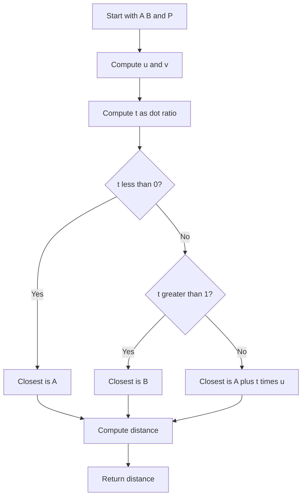

# GEO-013: Point-Line Distance

## 📋 Problem Summary

Given segment `AB` and point `P`, find the shortest distance from `P` to the segment. Output as a floating value with 6 decimals.

## 🌍 Real-World Scenario

**Scenario Title:** Nearest Edge for a Robot**

A robot knows its position `P` and a wall segment `AB`. It must compute the shortest clearance to avoid collisions.

**Why This Problem Matters:**

- Fundamental geometry primitive used in collision detection, projections, and GIS.
- Reinforces vector projection and clamping to segment endpoints.

## ASCII Visual

```
A ●------------------● B
         |
         | shortest path
         |
         ● P
```

## Detailed Explanation

Let `u = B - A`, `v = P - A`.

Projection scalar `t = (u·v) / (u·u)`:

- If `t < 0`: closest point is `A`.
- If `t > 1`: closest point is `B`.
- Else: closest point is `A + t*u` on the segment.

Distance = Euclidean distance from `P` to that closest point.
The projection picks the closest landing spot, and the clamp keeps it on the segment.

<!-- mermaid -->


Use doubles; `u·u` fits in 64-bit (coords up to 1e9 → squared up to 1e18).

## Input/Output Clarifications

- Input is one line of six integers.
- Segment endpoints are distinct.
- Output rounded to 6 decimals.

## Naive Approach

**Algorithm:** Check distance to infinite line, then clamp:
1. Compute projection `t`.
2. Clamp `t` to `[0,1]`.
3. Compute closest point and distance.

**Time/Space:** `O(1)`.

## Optimal Approach

Same as above—already optimal with constant work.

## Reference Implementations

### Python


### Java


### C++


### JavaScript


### Common Mistakes to Avoid

1. **Not clamping `t`.** Without clamping, you might pick a point beyond the segment.
2. **Endpoint zero-length segment.** Guard if `A == B`.
3. **Integer division.** Use doubles for projection.
4. **Precision formatting.** Ensure 6-decimal output.

### Complexity Analysis

- **Time:** `O(1)`  
- **Space:** `O(1)`

## Testing Strategy

- Point above the middle (perpendicular drop).
- Point beyond an endpoint (should pick nearest endpoint).
- Vertical/horizontal segments.
- Zero-length segment edge case.
- Large coordinates to stress overflow in products.

## ASCII Recap

```
Project P onto line AB:
  t = (u·v)/(u·u)
Clamp t to [0,1]; closest = A + t*u
Distance = |P - closest|
```
