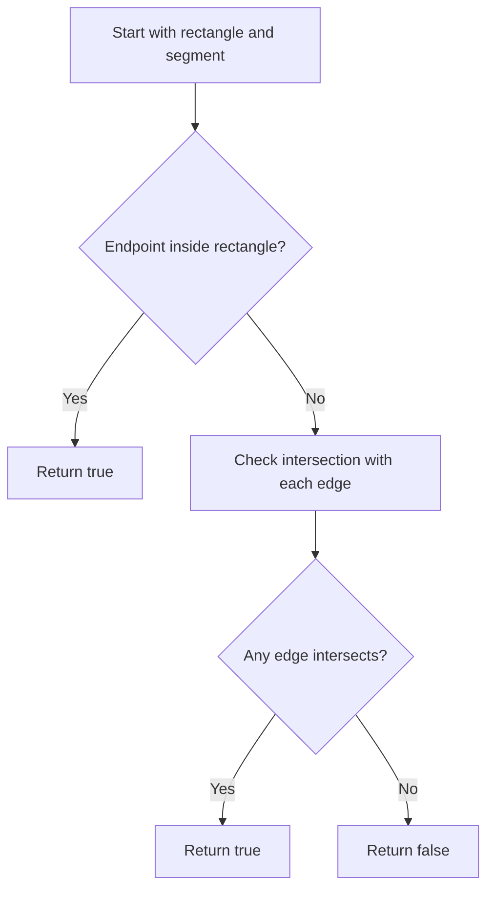

# GEO-015: Segment-Rectangle Intersection

## 📋 Problem Summary

Given axis-aligned rectangle `[xL, yB]` to `[xR, yT]` and a segment `P1P2`, decide if the segment intersects or lies within the rectangle. Touching the boundary counts as intersection. Output `true` or `false`.

## 🌍 Real-World Scenario

**Scenario Title:** Collision Check Against Bounding Box**

A moving object follows a straight path `P1P2`. Before simulating full physics, you first test if the path hits the map’s bounding box. If not, you can skip expensive checks.

**Why This Problem Matters:**

- Core primitive for clipping, collision detection, and line-of-sight checks.
- Combines point-in-rectangle test with robust segment intersection against rectangle edges.

## ASCII Visual

```
Rect:
 (xL,yT) ●-------● (xR,yT)
         |       |
         |       |
 (xL,yB) ●-------● (xR,yB)

Segment crossing any edge or lying inside → true
```

## Detailed Explanation

Intersection occurs if:

1. Either endpoint is inside the rectangle, **or**
2. The segment intersects any of the 4 rectangle edges.

Use orientation and on-segment tests for robust intersection.
Think of the rectangle as a gate, if the segment touches it anywhere it counts.

<!-- mermaid -->


### Point Inside Rectangle

`xL <= x <= xR` and `yB <= y <= yT`.

### Segment-Segment Intersection

For segments `ab` and `cd`, they intersect if:
- `orient(a,b,c)` and `orient(a,b,d)` have opposite signs, and `orient(c,d,a)` and `orient(c,d,b)` have opposite signs, **or**
- Any point is collinear and lies on the other segment (on-segment check).

Orientation: `cross = (bx-ax)*(cy-ay) - (by-ay)*(cx-ax)`; use 64-bit.

### Rectangle Edges

Edges: `(xL,yB)-(xR,yB)`, `(xR,yB)-(xR,yT)`, `(xR,yT)-(xL,yT)`, `(xL,yT)-(xL,yB)`.

## Input/Output Clarifications

- Rectangle sides inclusive.
- Output lowercase `true`/`false`.
- Segment endpoints distinct.

## Naive Approach

**Algorithm:** Check inside, else test intersection with each edge.  
**Time:** `O(1)`  
**Space:** `O(1)`

## Optimal Approach

Same as naive; only constant work needed.

## Reference Implementations

### Python


### Java


### C++


### JavaScript


### Common Mistakes to Avoid

1. **Bounding box only.** Overlapping bounding boxes isn’t sufficient; must test edge intersections.
2. **Excluding boundary.** Touching edges counts; include `<=` in checks.
3. **Overflow in orientation.** Use 64-bit for cross products.
4. **Zero-length segment.** Not in constraints (distinct endpoints), but guarding is fine.

### Complexity Analysis

- **Time:** `O(1)`  
- **Space:** `O(1)`

## Testing Strategy

- Segment completely inside → true.
- Segment completely outside and disjoint → false.
- Segment crossing one edge → true.
- Segment passing through a corner → true.
- Vertical/horizontal segments; large coordinates for overflow checks.

## ASCII Recap

```
Inside? yes → true
Else: test vs 4 edges with segment intersection
```
