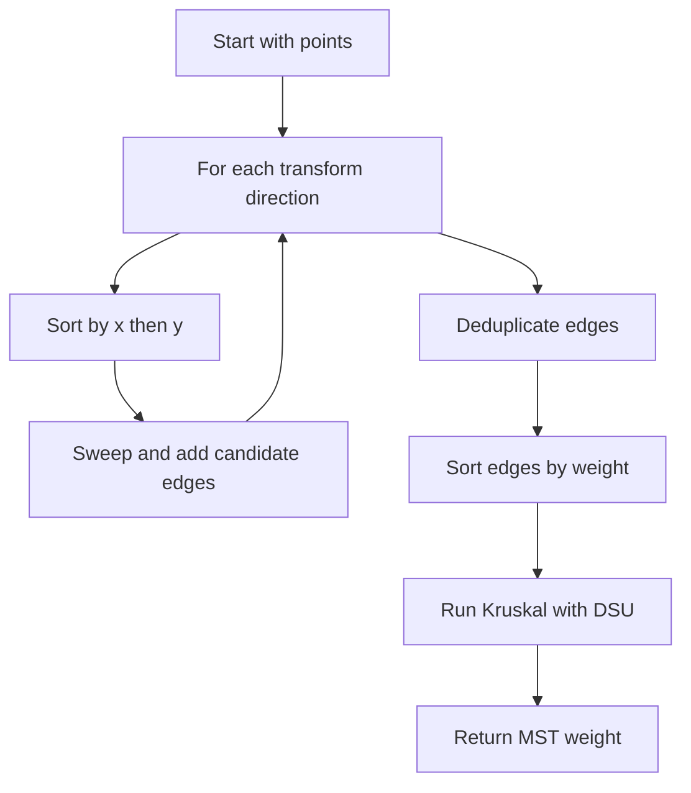

# GEO-016: Minimum Spanning Tree on Complete Graph by Geometry

## 📋 Problem Summary

Given `n` points, the complete graph has edge weights = Manhattan distance. Find the MST total weight.

## 🌍 Real-World Scenario

**Scenario Title:** Grid City Fiber Planning**

In a rectilinear city, laying fiber between buildings costs Manhattan distance. You need the cheapest network connecting all buildings—an MST under L1 metric.

**Why This Problem Matters:**

- Direct `O(n^2)` is impossible for `n = 2e5`.
- The Manhattan MST trick reduces candidate edges to `O(n)` using geometry, then Kruskal/Prim.
- A staple pattern for competitive programming and spatial optimization.

## ASCII Visual

```
Points:
● (0,0)   ● (3,0)
     ● (2,2)

Edges (Manhattan):
 (0,0)-(3,0): 3
 (0,0)-(2,2): 4
 (3,0)-(2,2): 3
MST weight = 6 (choose edges 3 and 3)
```

## Detailed Explanation

### Manhattan MST Trick (4 Transforms)

Key idea: For Manhattan distance, the potential nearest neighbors lie among points with maximal `x+y` or `x-y` in certain directions. By sweeping in 4 rotated quadrants, we can generate `O(n)` candidate edges that suffice for the MST.

For each of 4 transforms:
1. Transform points (optionally swap `x,y`, negate `x`, etc.).
2. Sort by `x` then `y`.
3. Sweep; maintain map keyed by `(y - x)` (or use Fenwick) to find best candidate for each point.
4. Add edge between point and candidate with weight = Manhattan distance in original coords.

Transforms (cover all octants):
- `(x, y)`
- `(-x, y)`
- `(x, -y)`
- `(-x, -y)`
And also swap x/y to cover other diagonals, or equivalently handle 4 directions with `(x, y)`, `(y, x)`, `(-x, y)`, `(-y, x)`.
The transforms are a set of mirrors, they make sure every direction gets seen.

<!-- mermaid -->


### Why It Works

The rectilinear Voronoi structure implies that for each direction, the closest point that could reduce MST weight is among those maximizing `x+y` (or related expression). The 4 sweeps capture all candidate edges needed for a rectilinear MST (proof akin to Delaunay + MST for L1).

### Build MST

Collect all candidate edges (dedup). Run Kruskal with DSU:
- Sort edges by weight `O(m log m)`, `m = O(n)`.
- Union components, add weight when connecting new component.

Result is MST weight.

## Input/Output Clarifications

- Points can have duplicate coordinates? Typically distinct; if duplicates, zero-weight edges connect them; handle naturally.
- Output only the MST total weight.

## Naive Approach

**Algorithm:** Build all `O(n^2)` edges, run Kruskal/Prim.  
**Time:** `O(n^2)` edges + MST → impossible for `n = 2e5`.

## Optimal Approach (4 Sweeps + Kruskal)

**Algorithm Steps:**

1. For each of 4 direction variants:
   - Sort points by `x`, breaking ties by `y`.
   - Use a structure keyed by `y - x` to find candidate with max `(x+y)` seen so far; add that edge.
2. Gather all edges; remove duplicates (e.g., using a hash set of pairs).
3. Sort edges by weight.
4. DSU over `n` points to build MST; accumulate weight.

**Time Complexity:** `O(n log n)`  
**Space Complexity:** `O(n)`

## Reference Implementations

### Python (outline)


### C++


### JavaScript


### Common Mistakes to Avoid

1. **Missing transforms.** All four directional sweeps needed to cover candidates.
2. **Not deduplicating edges.** Same edge can appear in multiple sweeps; dedupe before Kruskal.
3. **Overflow:** Use 64-bit for weights.
4. **Incorrect key:** Use `y - x` with sorting by `x` (after transform) and tracking max `x+y`.

### Complexity Analysis

- **Time:** `O(n log n)` (sort + Kruskal)  
- **Space:** `O(n)` for points, edges, DSU.

## Testing Strategy

- Small triangles/rectangles with known MST.
- Duplicate points (zero-weight edges).
- Points on a line (MST is sorted neighbors).
- Random small sets to validate vs brute-force.
- Large coordinates to test overflow.

## ASCII Recap

```
For each transform:
  sort by x, track best by (y-x) with max (x+y), add edge
Collect edges → dedupe → Kruskal → sum weights
```
