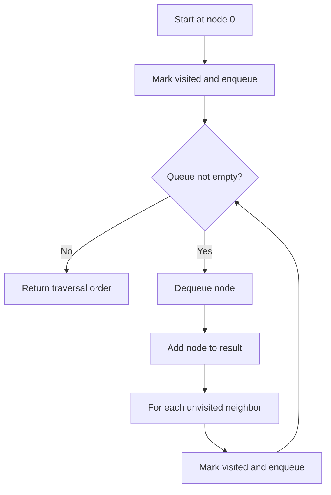

# GRP-001: Campus Map BFS

## 📋 Problem Summary

Perform a Breadth-First Search (BFS) traversal on an undirected unweighted graph starting from node 0, returning the order in which nodes are visited. The key challenge is to explore the graph level by level, maintaining the correct visitation order based on the adjacency list structure.

## 🌍 Real-World Scenario

**Scenario Title:** Campus Building Navigation System

Imagine you're developing a navigation app for a large university campus. The campus has multiple buildings (nodes) connected by walkways (edges). Students want to find all buildings they can reach from the main entrance (node 0) and understand the shortest walking distance to each building.

BFS is perfect for this scenario because it explores buildings level by level - first all buildings directly connected to the entrance, then buildings two walkways away, and so on. This naturally gives us the shortest path in terms of number of walkways traversed. The order of exploration also helps in creating efficient campus tours or emergency evacuation routes.

For example, if a student starts at the library (node 0), BFS would first identify all buildings directly accessible (like the cafeteria and gym), then buildings accessible through one intermediate building, and so on. This systematic exploration ensures no building is missed and provides the minimum number of walkways needed to reach each destination.

**Why This Problem Matters:**

- **Navigation Systems:** BFS forms the foundation of shortest path algorithms in unweighted graphs
- **Network Analysis:** Understanding connectivity and reachability in social networks, computer networks
- **Level-Order Processing:** Many real-world problems require processing data in layers or levels


## Detailed Explanation

### ASCII Diagram: Graph Structure

```
Graph with 4 nodes and 3 edges:

    0 --- 1 --- 3
    |
    2

Adjacency List:
0: [1, 2]
1: [0, 3]
2: [0]
3: [1]

BFS Traversal from node 0:
Level 0: [0]
Level 1: [1, 2]
Level 2: [3]

Result: 0 1 2 3

Legend:
--- = edge (bidirectional)
[ ] = nodes at same level
```

## ✅ Input/Output Clarifications (Read This Before Coding)

- **Node numbering:** Nodes are numbered from 0 to n-1 (0-indexed)
- **Edge representation:** Each edge (u, v) is bidirectional and should be added to both adjacency lists
- **Starting point:** Always start BFS from node 0
- **Disconnected graphs:** Only nodes reachable from node 0 appear in output
- **Order matters:** The order of neighbors in the adjacency list determines the visitation order at each level

Common interpretation mistake:

- ❌ **Wrong:** Visiting nodes in any arbitrary order
- ✅ **Correct:** Visiting nodes level by level using a queue (FIFO order)

### Core BFS Concept

BFS explores a graph by visiting all neighbors at the current depth before moving to nodes at the next depth level. This is achieved using a queue data structure that ensures First-In-First-Out (FIFO) processing.
The queue keeps the walk orderly, one hallway at a time.

<!-- mermaid -->


### Why Naive DFS Doesn't Give Level-Order

A depth-first search would explore as far as possible along each branch before backtracking, which doesn't guarantee level-by-level exploration. For example, DFS might visit nodes in order 0 → 1 → 3 → 2, missing the level structure entirely.

## Naive Approach

### Intuition

The most straightforward approach is to use a queue to maintain nodes to visit, along with a visited set to avoid revisiting nodes.

### Algorithm

1. Create a queue and add the starting node (0)
2. Create a visited set and mark node 0 as visited
3. Create a result list to store the visitation order
4. While the queue is not empty:
   - Dequeue a node
   - Add it to the result list
   - For each unvisited neighbor:
     - Mark it as visited
     - Enqueue it
5. Return the result list

### Time Complexity

- **O(V + E)** where V is the number of vertices and E is the number of edges
- Each node is visited once (O(V))
- Each edge is explored once from each endpoint (O(E))

### Space Complexity

- **O(V)** for the queue, visited set, and result list

### Why This Works

BFS guarantees that nodes are visited in increasing order of their distance from the source. The queue ensures that all nodes at distance k are processed before any node at distance k+1.

### Decision Tree

```
Start at node 0
│
├─ Add 0 to queue
│  └─ Mark 0 as visited
│
├─ Process queue:
│  │
│  ├─ Dequeue 0
│  │  ├─ Add 0 to result
│  │  └─ For each neighbor of 0:
│  │     ├─ If not visited: mark visited, enqueue
│  │     └─ If visited: skip
│  │
│  ├─ Dequeue next node
│  │  └─ Repeat process
│  │
│  └─ Continue until queue is empty
│
└─ Return result
```

## Optimal Approach

### Key Insight

The naive approach is already optimal for BFS traversal. The key insight is that using a queue naturally maintains the level-order property, and marking nodes as visited when enqueueing (not when dequeueing) prevents duplicate processing.

### Algorithm

1. Initialize:
   - Queue `q` with starting node 0
   - Boolean array `visited` of size n, mark visited[0] = true
   - Result list `result`

2. While queue is not empty:
   - Dequeue node `curr`
   - Add `curr` to result
   - For each neighbor `neighbor` in adj[curr]:
     - If not visited[neighbor]:
       - Mark visited[neighbor] = true
       - Enqueue neighbor

3. Return result

### Time Complexity

- **O(V + E)** - Each vertex is enqueued and dequeued once, each edge is examined once

### Space Complexity

- **O(V)** - Queue can hold up to V nodes, visited array is size V, result list is size V

### Why This Is Optimal

We must visit every reachable node exactly once and examine every edge at least once to determine connectivity. Therefore, O(V + E) is the theoretical lower bound, which BFS achieves.


## Implementations

### Java
```java
import java.util.*;

class Solution {
    public List<Integer> bfsTraversal(int n, List<List<Integer>> adj) {
        List<Integer> result = new ArrayList<>();
        boolean[] visited = new boolean[n];
        Queue<Integer> queue = new LinkedList<>();
        
        // Start BFS from node 0
        queue.offer(0);
        visited[0] = true;
        
        while (!queue.isEmpty()) {
            int curr = queue.poll();
            result.add(curr);
            
            // Visit all unvisited neighbors
            for (int neighbor : adj.get(curr)) {
                if (!visited[neighbor]) {
                    visited[neighbor] = true;
                    queue.offer(neighbor);
                }
            }
        }
        
        return result;
    }
}

class Main {
    public static void main(String[] args) {
        Scanner sc = new Scanner(System.in);
        int n = sc.nextInt();
        int m = sc.nextInt();
        
        List<List<Integer>> adj = new ArrayList<>();
        for (int i = 0; i < n; i++) {
            adj.add(new ArrayList<>());
        }
        
        for (int i = 0; i < m; i++) {
            int u = sc.nextInt();
            int v = sc.nextInt();
            adj.get(u).add(v);
            adj.get(v).add(u);
        }

        // Sort neighbors for deterministic traversal
        for (int i = 0; i < n; i++) {
            Collections.sort(adj.get(i));
        }

        Solution solution = new Solution();
        List<Integer> result = solution.bfsTraversal(n, adj);
        
        for (int i = 0; i < result.size(); i++) {
            System.out.print(result.get(i));
            if (i < result.size() - 1) System.out.print(" ");
        }
        System.out.println();
        sc.close();
    }
}
```

### Python
```python
import sys
sys.setrecursionlimit(200000)
from collections import deque
from typing import List

def bfs_traversal(n: int, adj: List[List[int]]) -> List[int]:
    """
    Perform BFS traversal starting from node 0.
    
    Args:
        n: Number of nodes in the graph
        adj: Adjacency list representation of the graph
    
    Returns:
        List of nodes in BFS visitation order
    """
    result = []
    
    # Sort neighbors for deterministic traversal if not already sorted
    for neighbors in adj:
        neighbors.sort()
        
    visited = [False] * n
    queue = deque()
    
    # Start BFS from node 0
    queue.append(0)
    visited[0] = True
    
    while queue:
        curr = queue.popleft()
        result.append(curr)
        
        # Visit all unvisited neighbors
        for neighbor in adj[curr]:
            if not visited[neighbor]:
                visited[neighbor] = True
                queue.append(neighbor)
    
    return result

def main():
    n = int(input())
    m = int(input())
    
    adj = [[] for _ in range(n)]
    
    for _ in range(m):
        u, v = map(int, input().split())
        adj[u].append(v)
        adj[v].append(u)
    
    result = bfs_traversal(n, adj)
    print(' '.join(map(str, result)))

if __name__ == "__main__":
    main()
```

### C++
```cpp
#include <iostream>
#include <vector>
#include <queue>
#include <algorithm>
using namespace std;

class Solution {
public:
    vector<int> bfsTraversal(int n, vector<vector<int>>& adj) {
        vector<int> result;
        vector<bool> visited(n, false);
        queue<int> q;
        
        // Start BFS from node 0
        q.push(0);
        visited[0] = true;
        
        while (!q.empty()) {
            int curr = q.front();
            q.pop();
            result.push_back(curr);
            
            // Visit all unvisited neighbors
            for (int neighbor : adj[curr]) {
                if (!visited[neighbor]) {
                    visited[neighbor] = true;
                    q.push(neighbor);
                }
            }
        }
        
        return result;
    }
};

int main() {
    ios::sync_with_stdio(false);
    cin.tie(nullptr);
    
    int n, m;
    cin >> n >> m;
    
    vector<vector<int>> adj(n);
    
    for (int i = 0; i < m; i++) {
        int u, v;
        cin >> u >> v;
        adj[u].push_back(v);
        adj[v].push_back(u);
    }

    // Sort neighbors for deterministic traversal
    for (int i = 0; i < n; i++) {
        sort(adj[i].begin(), adj[i].end());
    }

    Solution solution;
    vector<int> result = solution.bfsTraversal(n, adj);
    
    for (int i = 0; i < result.size(); i++) {
        cout << result[i];
        if (i < result.size() - 1) cout << " ";
    }
    cout << "\n";
    
    return 0;
}
```

### JavaScript
```javascript
const readline = require("readline");

class Solution {
  bfsTraversal(n, adj) {
    const result = [];
    const visited = new Array(n).fill(false);
    const queue = [];
    
    // Start BFS from node 0
    queue.push(0);
    visited[0] = true;
    
    while (queue.length > 0) {
      const curr = queue.shift();
      result.push(curr);
      
      // Visit all unvisited neighbors
      for (const neighbor of adj[curr]) {
        if (!visited[neighbor]) {
          visited[neighbor] = true;
          queue.push(neighbor);
        }
      }
    }
    
    return result;
  }
}

const rl = readline.createInterface({
  input: process.stdin,
  output: process.stdout,
});

let data = [];
rl.on("line", (line) => data.push(line.trim()));
rl.on("close", () => {
  let ptr = 0;
  const n = parseInt(data[ptr++]);
  const m = parseInt(data[ptr++]);
  
  const adj = Array.from({ length: n }, () => []);

  for (let i = 0; i < m; i++) {
    const [u, v] = data[ptr++].split(" ").map(Number);
    adj[u].push(v);
    adj[v].push(u);
  }

  // Sort neighbors for deterministic traversal
  for (let i = 0; i < n; i++) {
    adj[i].sort((a, b) => a - b);
  }

  const solution = new Solution();
  const result = solution.bfsTraversal(n, adj);
  console.log(result.join(" "));
});
```

## 🧪 Test Case Walkthrough (Dry Run)

Use the sample:

- n = 4 nodes
- m = 3 edges
- Edges: (0,1), (0,2), (1,3)

We maintain:

- `queue`: Nodes to be processed
- `visited`: Boolean array tracking visited nodes
- `result`: List of nodes in visitation order

Initialize:

- queue = [0]
- visited = [true, false, false, false]
- result = []

Now iterate:

| Step | Queue | Current | Neighbors | Action | Result | Visited |
|-----:|:-----:|:-------:|:---------:|:-------|:-------|:--------|
| 1 | [0] | 0 | [1, 2] | Add 0 to result, enqueue 1 and 2 | [0] | [T, T, T, F] |
| 2 | [1, 2] | 1 | [0, 3] | Add 1 to result, 0 visited, enqueue 3 | [0, 1] | [T, T, T, T] |
| 3 | [2, 3] | 2 | [0] | Add 2 to result, 0 already visited | [0, 1, 2] | [T, T, T, T] |
| 4 | [3] | 3 | [1] | Add 3 to result, 1 already visited | [0, 1, 2, 3] | [T, T, T, T] |
| 5 | [] | - | - | Queue empty, stop | [0, 1, 2, 3] | [T, T, T, T] |

**Observations:**
- Each node is visited exactly once
- Nodes are processed level by level: 0 (level 0), then 1 and 2 (level 1), then 3 (level 2)
- The order within a level depends on the adjacency list order

Answer is `0 1 2 3`.


## ✅ Proof of Correctness

### Invariant

At any point during BFS execution, all nodes in the queue are at the same level or differ by at most one level from the source.

### Why the approach is correct

**Base case:** Initially, only the source node (0) is in the queue at level 0.

**Inductive step:** When we dequeue a node at level k, we enqueue all its unvisited neighbors, which are at level k+1. Since we process the queue in FIFO order, all nodes at level k are processed before any node at level k+1.

**Completeness:** Every reachable node will eventually be discovered because we explore all neighbors of every visited node.

**No duplicates:** The visited array ensures each node is enqueued at most once.

## 💡 Interview Extensions (High-Value Add-ons)

- **Extension 1:** Modify to return the shortest distance from node 0 to all other nodes (BFS naturally computes this)
- **Extension 2:** Find the number of connected components in the graph (run BFS from each unvisited node)
- **Extension 3:** Implement bidirectional BFS to find the shortest path between two specific nodes
- **Extension 4:** Track parent pointers during BFS to reconstruct the shortest path to any node

### Common Mistakes to Avoid

1. **Marking Visited Too Late**

   - ❌ Wrong: Mark node as visited when dequeuing
   - ✅ Correct: Mark node as visited when enqueueing
   - **Why:** Marking late can cause the same node to be added to the queue multiple times, leading to incorrect results and wasted computation

2. **Forgetting Bidirectional Edges**

   - ❌ Wrong: Only adding edge (u, v) to adj[u]
   - ✅ Correct: Add v to adj[u] AND u to adj[v] for undirected graphs
   - **Impact:** Missing edges leads to incomplete traversal

3. **Not Handling Disconnected Graphs**

   - ❌ Wrong: Assuming all nodes will be visited
   - ✅ Correct: Understand that only nodes reachable from the source are visited
   - **Prevention:** If you need to visit all nodes, run BFS from each unvisited node

4. **Using Wrong Data Structure**

   - ❌ Wrong: Using a stack instead of a queue
   - ✅ Correct: Use a queue (FIFO) for BFS, not a stack (LIFO)
   - **Description:** Using a stack gives DFS, not BFS

5. **Off-by-One Errors in Output**

   - ❌ Wrong: Adding extra spaces or newlines in output
   - ✅ Correct: Follow the exact output format specified
   - **Description:** Pay attention to spacing between elements and trailing newlines

## Related Concepts

- **Depth-First Search (DFS):** Alternative graph traversal using a stack or recursion
- **Shortest Path Algorithms:** Dijkstra's algorithm (weighted graphs), Bellman-Ford
- **Level-Order Tree Traversal:** BFS applied to trees
- **Topological Sort:** Ordering of directed acyclic graphs using BFS (Kahn's algorithm)
- **Connected Components:** Finding all disconnected parts of a graph
